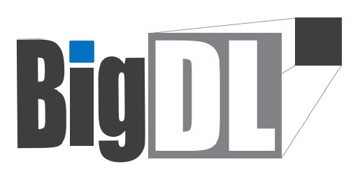
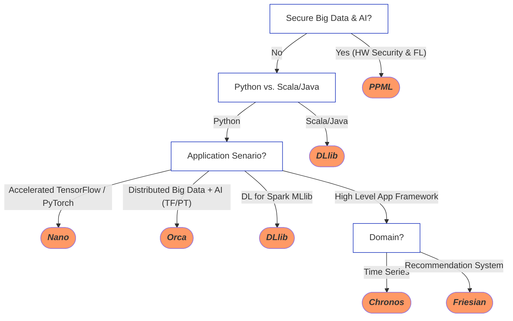

<div align="center">

<p align="center"> <br></p>

_**Fast, Distributed, Secure AI for Big Data**_

</div>

---

BigDL seamlessly scales your data analytics & AI applications from laptop to cloud, with the following libraries:

- [Orca](#orca): Distributed Big Data & AI (TF & PyTorch) Pipeline on Spark and Ray

- Nano: Transparent Acceleration of Tensorflow & PyTorch Programs

- [DLlib](#dllib): “Equivalent of Spark MLlib” for Deep Learning

- [Chronos](#chronos): Scalable Time Series Analysis using AutoML

- Friesian: End-to-End Recommendation Systems

- [PPML](#ppml) (experimental): Secure Big Data and AI (with SGX Hardware Security)

For more information, you may [read the docs](https://bigdl.readthedocs.io/).

---

## Choosing the right BigDL library

---
## Installing

 - To install BigDL, we recommend using [conda](https://docs.conda.io/projects/conda/en/latest/user-guide/install/)  environment:

    ```bash
    conda create -n my_env 
    conda activate my_env
    pip install bigdl
    ```
    To install latest nightly build, use `pip install --pre --upgrade bigdl`; see [Python](https://bigdl.readthedocs.io/en/latest/doc/UserGuide/python.html) and [Scala](https://bigdl.readthedocs.io/en/latest/doc/UserGuide/scala.html) user guide for more details.

 - To install each individual library, such as Chronos, use `pip install bigdl-chronos`; see the [document website](https://bigdl.readthedocs.io/) for more details.
---

## Getting Started
### Orca

- The _Orca_ library seamlessly scales out your single node **TensorFlow**, **PyTorch** or **OpenVINO** programs across large clusters (so as to process distributed Big Data).

  <details><summary>Show Orca example</summary>
  <br/>

  You can build end-to-end, distributed data processing & AI programs using _Orca_ in 4 simple steps:

  ```python
  # 1. Initilize Orca Context (to run your program on K8s, YARN or local laptop)
  from bigdl.orca import init_orca_context, OrcaContext
  sc = init_orca_context(cluster_mode="k8s", cores=4, memory="10g", num_nodes=2) 

  # 2. Perform distribtued data processing (supporting Spark DataFrames,
  # TensorFlow Dataset, PyTorch DataLoader, Ray Dataset, Pandas, Pillow, etc.)
  spark = OrcaContext.get_spark_session()
  df = spark.read.parquet(file_path)
  df = df.withColumn('label', df.label-1)
  ...

  # 3. Build deep learning models using standard framework APIs
  # (supporting TensorFlow, PyTorch, Keras, OpenVino, etc.)
  from tensorflow import keras
  ...
  model = keras.models.Model(inputs=[user, item], outputs=predictions)  
  model.compile(...)

  # 4. Use Orca Estimator for distributed training/inference
  from bigdl.orca.learn.tf.estimator import Estimator
  est = Estimator.from_keras(keras_model=model)  
  est.fit(data=df,
          feature_cols=['user', 'item'],
          label_cols=['label'],
          ...)
  ```

  See [TensorFlow](https://bigdl.readthedocs.io/en/latest/doc/Orca/QuickStart/orca-tf-quickstart.html) and [PyTorch](https://bigdl.readthedocs.io/en/latest/doc/Orca/QuickStart/orca-pytorch-quickstart.html) quickstart, as well as the [document website](https://bigdl.readthedocs.io/), for more details.

  </details>  

- In addition, you can also run standard **Ray** programs on Spark cluster using _**RayOnSpark**_ in Orca.

  <details><summary>Show RayOnSpark example</summary>
  <br/>
  
  You can directly run Ray program on Spark cluster, and write Ray code inline with Spark code (so as to process the in-memory Spark RDDs or DataFrames) using _RayOnSpark_ in Orca.
 
  ```python
  # 1. Initilize Orca Context (to run your program on K8s, YARN or local laptop)
  from bigdl.orca import init_orca_context, OrcaContext
  sc = init_orca_context(cluster_mode="yarn", cores=4, memory="10g", num_nodes=2, init_ray_on_spark=True) 

  # 2. Convert Spark DataFrames to Ray Datasets
  spark = OrcaContext.get_spark_session()
  df = spark.read.parquet(file_path)
  from bigdl.orca.data import spark_df_to_ray_dataset
  dataset = spark_df_to_ray_dataset(df)
  
  # 3. Use Ray to operate on Ray Datasets
  import ray

  @ray.remote
  def consume(data) -> int:
     num_batches = 0
     for batch in data.iter_batches(batch_size=10):
         num_batches += 1
     return num_batches

  print(ray.get(consume.remote(dataset)))
  ```

  See the RayOnSpark [user guide](https://bigdl.readthedocs.io/en/latest/doc/Ray/Overview/ray.html) and [quickstart](https://bigdl.readthedocs.io/en/latest/doc/Ray/QuickStart/ray-quickstart.html) for more details.
  </details>  


### DLlib

With _DLlib_, you can write distributed deep learning applications as standard (**Scala** or **Python**) Spark programs, using the same *Spark DataFrame* and *ML Pipeline* APIs.

<details><summary>Show DLlib example</summary>
<br/>

You can build distributed deep learning applications for Spark using *DLlib* in 3 simple steps:

```scala
// 1. Call `initNNContext` at the beginning of the code: 
import com.intel.analytics.bigdl.dllib.NNContext
val sc = NNContext.initNNContext()

// 2. Define the Deep Learning model using Keras-style API in DLlib:
val input = Input[Float](inputShape = Shape(10))  
val dense = Dense[Float](12).inputs(input)  
val output = Activation[Float]("softmax").inputs(dense)  
val model = Model(input, output)

// 3. Use `NNEstimator` to train/predict/evaluate the model using Spark Dataframe and ML pipeline APIs
val trainingDF = spark.read.parquet("train_data")
val validationDF = spark.read.parquet("val_data")
val scaler = new MinMaxScaler().setInputCol("in").setOutputCol("value")
val estimator = NNEstimator(model, CrossEntropyCriterion())  
        .setBatchSize(size).setOptimMethod(new Adam()).setMaxEpoch(epoch)
val pipeline = new Pipeline().setStages(Array(scaler, estimator))

val pipelineModel = pipeline.fit(trainingDF)  
val predictions = pipelineModel.transform(validationDF)
```

  See the [NNframes](https://bigdl.readthedocs.io/en/latest/doc/DLlib/Overview/nnframes.html) and [Keras API](https://bigdl.readthedocs.io/en/latest/doc/DLlib/Overview/keras-api.html) user guides for more details.

</details>

### Chronos

The *Chronos* library makes it easy to build end-to-end time series analysis by applying AutoML to extremely large-scale time series prediction.

<details><summary>Show Chronos example</summary>
<br/>

You can train a time series model using _Chronos_ in 3 simple steps:

```python
# 1. Initialize Orca Context
from bigdl.orca import init_orca_context
init_orca_context(cluster_mode="yarn", cores=4, memory="10g", num_nodes=2, init_ray_on_spark=True)

# 2. Create `TSDataset` for your time series data
from bigdl.chronos.data import TSDataset
tsdata_train, tsdata_valid, tsdata_test\
        = TSDataset.from_pandas(df, 
                                dt_col="dt_col", 
                                target_col="target_col", 
                                ...)

# 3. Train time series model using `AutoTSEstimator`
from bigdl.chronos.autots import AutoTSEstimator
autotsest = AutoTSEstimator(model='lstm')
ts_pipeline = autotsest.fit(data=tsdata_train,
                            validation_data=tsdata_valid)
ts_pipeline.predict(tsdata_test)
```

See the Chronos [user guide](https://bigdl.readthedocs.io/en/latest/doc/Chronos/Overview/chronos.html) and [example](https://bigdl.readthedocs.io/en/latest/doc/Chronos/QuickStart/chronos-autotsest-quickstart.html) for more details.

</details>  

### PPML

*BigDL PPML* provides a **hardware (Intel SGX) protected** *Trusted Cluster Environment* for running distributed Big Data & AI applications (in a secure fashion on private or public cloud). See the PPML [tutorial](https://github.com/intel-analytics/BigDL/blob/main/ppml/README.md) and [user guide](https://bigdl.readthedocs.io/en/latest/doc/PPML/Overview/ppml.html) for more details. 

## Getting Support

- [Mail List](mailto:bigdl-user-group+subscribe@googlegroups.com)
- [User Group](https://groups.google.com/forum/#!forum/bigdl-user-group)
- [Github Issues](https://github.com/intel-analytics/BigDL/issues)
---
## Citation

If you've found BigDL useful for your project, you may cite the [paper](https://arxiv.org/abs/2204.01715) as follows:

```
@inproceedings{dai2022bigdl,
  title={BigDL 2.0: Seamless Scaling of AI Pipelines from Laptops to Distributed Cluster},
  author={Dai, Jason (Jinquan) and Ding, Ding and Shi, Dongjie and Huang, Shengsheng and Wang, Jiao and Qiu, Xin and Huang, Kai and Song, Guoqiong and Wang, Yang and Gong, Qiyuan and Song, Jiaming and Yu, Shan and Zheng, Le and Chen, Yina and Deng, Junwei and Song, Ge},
  booktitle={Proceedings of the IEEE/CVF Conference on Computer Vision and Pattern Recognition},
  pages={21439--21446},
  year={2022}
}
```
