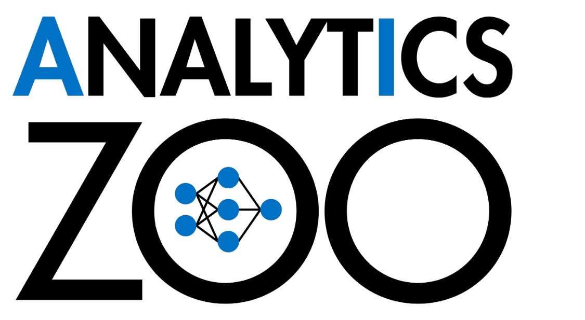

<div align="center">

<p align="center"> <br></p>

**Distributed TensorFlow, PyTorch, Keras and BigDL on Apache Spark & Ray**

</div>

---

Analytics Zoo is an open source _**Big Data AI**_ platform, and includes the following features for scaling end-to-end AI to distributed Big Data: 

 * [Orca](#getting-started-with-orca): seamlessly scale out TensorFlow and PyTorch for Big Data (using Spark & Ray)
 
 * [RayOnSpark](#getting-started-with-rayonspark): run Ray programs directly on Big Data clusters
 
 * [BigDL Extensions](#getting-started-with-bigdl-extensions): high-level Spark ML pipeline and Keras-like APIs for BigDL
 
 * [Chronos](#getting-started-with-chronos): scalable time series analysis using AutoML
 
 * [PPML](#ppml-privacy-preserving-machine-learning): privacy preserving big data analysis and machine learning (*experimental*)

For more information, you may [read the docs](https://analytics-zoo.readthedocs.io/).

---

## Installing
You can use Analytics Zoo on [Google Colab](https://analytics-zoo.readthedocs.io/en/latest/doc/UserGuide/colab.html) without any installation. Analytics Zoo also includes a set of [notebooks](https://analytics-zoo.readthedocs.io/en/latest/doc/UserGuide/notebooks.html) that you can directly open and run in Colab.

To install Analytics Zoo, we recommend using [conda](https://docs.conda.io/projects/conda/en/latest/user-guide/install/)  environments.

```bash
conda create -n my_env 
conda activate my_env
pip install analytics-zoo 
```

To install latest nightly build, use ```pip install --pre --upgrade analytics-zoo```; see [Python](https://analytics-zoo.readthedocs.io/en/latest/doc/UserGuide/python.html)  and [Scala](https://analytics-zoo.readthedocs.io/en/latest/doc/UserGuide/scala.html) user guide for more details.

## Getting Started with Orca

Most AI projects start with a Python notebook running on a single laptop; however, one usually needs to go through a mountain of pains to scale it to handle larger data set in a distributed fashion. The  _**Orca**_ library seamlessly scales out your single node TensorFlow or PyTorch notebook across large clusters (so as to process distributed Big Data).

First, initialize [Orca Context](https://analytics-zoo.readthedocs.io/en/latest/doc/Orca/Overview/orca-context.html):

```python
from zoo.orca import init_orca_context

# cluster_mode can be "local", "k8s" or "yarn"
sc = init_orca_context(cluster_mode="yarn", cores=4, memory="10g", num_nodes=2) 
```

Next, perform [data-parallel processing in Orca](https://analytics-zoo.readthedocs.io/en/latest/doc/Orca/Overview/data-parallel-processing.html) (supporting standard Spark Dataframes, TensorFlow Dataset, PyTorch DataLoader, Pandas, etc.):

```python
from pyspark.sql.functions import array

df = spark.read.parquet(file_path)
df = df.withColumn('user', array('user')) \  
       .withColumn('item', array('item'))
```

Finally, use [sklearn-style Estimator APIs in Orca](https://analytics-zoo.readthedocs.io/en/latest/doc/Orca/Overview/distributed-training-inference.html) to perform distributed _TensorFlow_, _PyTorch_ or _Keras_ training and inference:

```python
from tensorflow import keras
from zoo.orca.learn.tf.estimator import Estimator

user = keras.layers.Input(shape=[1])  
item = keras.layers.Input(shape=[1])  
feat = keras.layers.concatenate([user, item], axis=1)  
predictions = keras.layers.Dense(2, activation='softmax')(feat)  
model = keras.models.Model(inputs=[user, item], outputs=predictions)  
model.compile(optimizer='rmsprop',  
              loss='sparse_categorical_crossentropy',  
              metrics=['accuracy'])

est = Estimator.from_keras(keras_model=model)  
est.fit(data=df,  
        batch_size=64,  
        epochs=4,  
        feature_cols=['user', 'item'],  
        label_cols=['label'])
```

See [TensorFlow](https://analytics-zoo.readthedocs.io/en/latest/doc/Orca/QuickStart/orca-tf-quickstart.html) and [PyTorch](https://analytics-zoo.readthedocs.io/en/latest/doc/Orca/QuickStart/orca-pytorch-quickstart.html) quickstart, as well as the [document website](https://analytics-zoo.readthedocs.io/), for more details.

## Getting Started with RayOnSpark

Ray is an open source distributed framework for emerging AI applications. _**RayOnSpark**_ allows users to directly run Ray programs on existing Big Data clusters, and directly write Ray code inline with their Spark code (so as to process the in-memory Spark RDDs or DataFrames).

```python
from zoo.orca import init_orca_context

# cluster_mode can be "local", "k8s" or "yarn"
sc = init_orca_context(cluster_mode="yarn", cores=4, memory="10g", num_nodes=2, init_ray_on_spark=True) 

import ray

@ray.remote
class Counter(object):
      def __init__(self):
          self.n = 0

      def increment(self):
          self.n += 1
          return self.n

counters = [Counter.remote() for i in range(5)]
print(ray.get([c.increment.remote() for c in counters]))
```

See the RayOnSpark [user guide](https://analytics-zoo.readthedocs.io/en/latest/doc/Ray/Overview/ray.html) and [quickstart](https://analytics-zoo.readthedocs.io/en/latest/doc/Ray/QuickStart/ray-quickstart.html) for more details.

## Getting Started with BigDL Extensions

Analytics Zoo makes it easier to develop large-scale deep learning applications on Apache Spark, by providing high-level ***Spark ML pipeline*** and ***Keras***-like APIs on top of [BigDL](https://github.com/intel-analytics/BigDL) (a distributed deep learning framework for Spark).

First, call `initNNContext` at the beginning of the code: 

```scala
import com.intel.analytics.zoo.common.NNContext
val sc = NNContext.initNNContext()
```

Then, define the BigDL model using Keras-style API:

```scala
val input = Input[Float](inputShape = Shape(10))  
val dense = Dense[Float](12).inputs(input)  
val output = Activation[Float]("softmax").inputs(dense)  
val model = Model(input, output)
```

After that, use `NNEstimator` to train/predict/evaluate the model using Spark Dataframes and ML pipelines:

```scala
val trainingDF = spark.read.parquet("train_data")
val validationDF = spark.read.parquet("val_data")
val scaler = new MinMaxScaler().setInputCol("in").setOutputCol("value")
val estimator = NNEstimator(model, CrossEntropyCriterion())  
        .setBatchSize(size).setOptimMethod(new Adam()).setMaxEpoch(epoch)
val pipeline = new Pipeline().setStages(Array(scaler, estimator))

val pipelineModel = pipeline.fit(trainingDF)  
val predictions = pipelineModel.transform(validationDF)
```
See the [Scala](https://analytics-zoo.readthedocs.io/en/latest/doc/UserGuide/scala.html), [NNframes](https://analytics-zoo.readthedocs.io/en/latest/doc/UseCase/nnframes.html) and [Keras API](https://analytics-zoo.readthedocs.io/en/latest/doc/UseCase/keras-api.html) user guides for more details.

## Getting Started with Chronos

Time series prediction takes observations from previous time steps as input and predicts the values at future time steps. The _**Chronos**_ library makes it easy to build end-to-end time series analysis by applying AutoML to extremely large-scale time series prediction.

To train a time series model with AutoML, first initialize [Orca Context](https://analytics-zoo.readthedocs.io/en/latest/doc/Orca/Overview/orca-context.html):

```python
from zoo.orca import init_orca_context

#cluster_mode can be "local", "k8s" or "yarn"
sc = init_orca_context(cluster_mode="yarn", cores=4, memory="10g", num_nodes=2, init_ray_on_spark=True)
```

Next, create an _AutoTSTrainer_.

```python
from zoo.chronos.autots.forecast import AutoTSTrainer

trainer = AutoTSTrainer(dt_col="datetime", target_col="value")
```

Finally, call ```fit``` on _AutoTSTrainer_, which applies AutoML to find the best model and hyper-parameters; it returns a _TSPipeline_ which can be used for prediction or evaluation.

```python
#train a pipeline with AutoML support
ts_pipeline = trainer.fit(train_df, validation_df)

#predict
ts_pipeline.predict(test_df)
```

See the Chronos [user guide](https://analytics-zoo.readthedocs.io/en/latest/doc/Chronos/Overview/chronos.html) and [example](https://analytics-zoo.readthedocs.io/en/latest/doc/Chronos/QuickStart/chronos-autots-quickstart.html) for more details.

## PPML (Privacy Preserving Machine Learning)

***Analytics Zoo PPML*** provides a *Trusted Cluster Environment* for protecting the end-to-end Big Data AI pipeline. It combines various low level hardware and software security technologies (e.g., Intel SGX, LibOS such as Graphene and Occlum, Federated Learning, etc.), and allows users to run unmodified Big Data analysis and ML/DL programs (such as Apache Spark, Apache Flink, Tensorflow, PyTorch, etc.) in a secure fashion on (private or public) cloud.

See the [PPML user guide](https://analytics-zoo.readthedocs.io/en/latest/doc/PPML/Overview/ppml.html) for more details. 

## More information

- [Document Website](https://analytics-zoo.readthedocs.io/)
- [Mail List](mailto:bigdl-user-group+subscribe@googlegroups.com)
- [User Group](https://groups.google.com/forum/#!forum/bigdl-user-group)
- [Powered-By](https://analytics-zoo.readthedocs.io/en/latest/doc/Application/powered-by.html)
- [Presentations](https://analytics-zoo.readthedocs.io/en/latest/doc/Application/presentations.html)

_Older Documents_
- [BigDL Paper](https://arxiv.org/abs/1804.05839)
- [Documentation (old)](https://analytics-zoo.github.io/)
