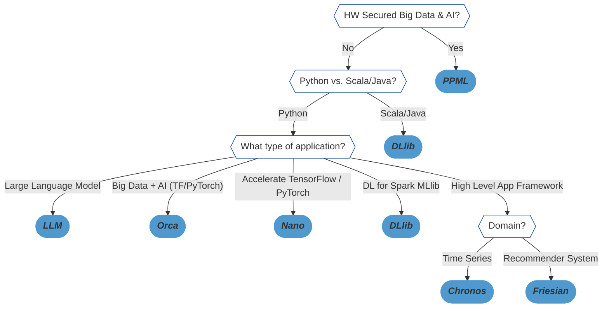

<div align="center">

<p align="center"> <br></p>

</div>

---
## BigDL-LLM

**[`bigdl-llm`](python/llm)** is a library for running **LLM** (large language model) on Intel **XPU** (from *Laptop* to *GPU* to *Cloud*) using **INT4/FP4/INT8/FP8** with very low latency[^1] (for any **PyTorch** model).

> *It is built on the excellent work of [llama.cpp](https://github.com/ggerganov/llama.cpp), [bitsandbytes](https://github.com/TimDettmers/bitsandbytes), [qlora](https://github.com/artidoro/qlora), [gptq](https://github.com/IST-DASLab/gptq), [AutoGPTQ](https://github.com/PanQiWei/AutoGPTQ), [awq](https://github.com/mit-han-lab/llm-awq), [AutoAWQ](https://github.com/casper-hansen/AutoAWQ), [vLLM](https://github.com/vllm-project/vllm), [llama-cpp-python](https://github.com/abetlen/llama-cpp-python), [gptq_for_llama](https://github.com/qwopqwop200/GPTQ-for-LLaMa), [chatglm.cpp](https://github.com/li-plus/chatglm.cpp), [redpajama.cpp](https://github.com/togethercomputer/redpajama.cpp), [gptneox.cpp](https://github.com/byroneverson/gptneox.cpp), [bloomz.cpp](https://github.com/NouamaneTazi/bloomz.cpp/), etc.*

### Latest update 🔥 
- [2024/02] `bigdl-llm` now supports *[Self-Speculative Decoding](https://bigdl.readthedocs.io/en/main/doc/LLM/Inference/Self_Speculative_Decoding.html)*, which in practice brings **~30% speedup** for FP16 and BF16 inference latency on Intel [GPU](python/llm/example/GPU/Speculative-Decoding) and [CPU](python/llm/example/CPU/Speculative-Decoding) respectively.
- [2024/02] `bigdl-llm` now supports a comprehensive list of LLM finetuning on Intel GPU (including [LoRA](python/llm/example/GPU/LLM-Finetuning/LoRA), [QLoRA](python/llm/example/GPU/LLM-Finetuning/QLoRA), [DPO](python/llm/example/GPU/LLM-Finetuning/DPO), [QA-LoRA](python/llm/example/GPU/LLM-Finetuning/QA-LoRA) and [ReLoRA](python/llm/example/GPU/LLM-Finetuning/ReLora)).
- [2024/01] Using `bigdl-llm` [QLoRA](python/llm/example/GPU/LLM-Finetuning/QLoRA), we managed to finetune LLaMA2-7B in **21 minutes** and LLaMA2-70B in **3.14 hours** on 8 Intel Max 1550 GPU for [Standford-Alpaca](python/llm/example/GPU/LLM-Finetuning/QLoRA/alpaca-qlora) (see the blog [here](https://www.intel.com/content/www/us/en/developer/articles/technical/finetuning-llms-on-intel-gpus-using-bigdl-llm.html)).
- [2024/01] 🔔🔔🔔 ***The default `bigdl-llm` GPU Linux installation has switched from PyTorch 2.0 to PyTorch 2.1, which requires new oneAPI and GPU driver versions. (See the [GPU installation guide](https://bigdl.readthedocs.io/en/latest/doc/LLM/Overview/install_gpu.html) for more details.)***
- [2023/12] `bigdl-llm` now supports [ReLoRA](python/llm/example/GPU/LLM-Finetuning/ReLora) (see *["ReLoRA: High-Rank Training Through Low-Rank Updates"](https://arxiv.org/abs/2307.05695)*).
- [2023/12] `bigdl-llm` now supports [Mixtral-8x7B](python/llm/example/GPU/HF-Transformers-AutoModels/Model/mixtral) on both Intel [GPU](python/llm/example/GPU/HF-Transformers-AutoModels/Model/mixtral) and [CPU](python/llm/example/CPU/HF-Transformers-AutoModels/Model/mixtral).
- [2023/12] `bigdl-llm` now supports [QA-LoRA](python/llm/example/GPU/LLM-Finetuning/QA-LoRA) (see *["QA-LoRA: Quantization-Aware Low-Rank Adaptation of Large Language Models"](https://arxiv.org/abs/2309.14717)*).
- [2023/12] `bigdl-llm` now supports [FP8 and FP4 inference](python/llm/example/GPU/HF-Transformers-AutoModels/More-Data-Types) on Intel ***GPU***.
- [2023/11] Initial support for directly loading [GGUF](python/llm/example/GPU/HF-Transformers-AutoModels/Advanced-Quantizations/GGUF), [AWQ](python/llm/example/GPU/HF-Transformers-AutoModels/Advanced-Quantizations/AWQ) and [GPTQ](python/llm/example/GPU/HF-Transformers-AutoModels/Advanced-Quantizations/GPTQ) models into `bigdl-llm` is available.
- [2023/11] `bigdl-llm` now supports [vLLM continuous batching](python/llm/example/GPU/vLLM-Serving) on both Intel [GPU](python/llm/example/GPU/vLLM-Serving) and [CPU](python/llm/example/CPU/vLLM-Serving).
- [2023/10] `bigdl-llm` now supports [QLoRA finetuning](python/llm/example/GPU/LLM-Finetuning/QLoRA) on both Intel [GPU](python/llm/example/GPU/LLM-Finetuning/QLoRA) and [CPU](python/llm/example/CPU/QLoRA-FineTuning).
- [2023/10] `bigdl-llm` now supports [FastChat serving](python/llm/src/bigdl/llm/serving) on on both Intel CPU and GPU.
- [2023/09] `bigdl-llm` now supports [Intel GPU](python/llm/example/GPU) (including iGPU, Arc, Flex and MAX).
- [2023/09] `bigdl-llm` [tutorial](https://github.com/intel-analytics/bigdl-llm-tutorial) is released.
- [2023/09] Over 30 models have been optimized/verified on `bigdl-llm`, including *LLaMA/LLaMA2, ChatGLM2/ChatGLM3, Mistral, Falcon, MPT, LLaVA, WizardCoder, Dolly, Whisper, Baichuan/Baichuan2, InternLM, Skywork, QWen/Qwen-VL, Aquila, MOSS,* and more; see the complete list [here](#verified-models).
     
### `bigdl-llm` Demos
See the ***optimized performance*** of `chatglm2-6b` and `llama-2-13b-chat` models on 12th Gen Intel Core CPU and Intel Arc GPU below.

<table width="100%">
  <tr>
    <td align="center" colspan="2">12th Gen Intel Core CPU</td>
    <td align="center" colspan="2">Intel Arc GPU</td>
  </tr>
  <tr>
    <td>
      <a href="https://llm-assets.readthedocs.io/en/latest/_images/chatglm2-6b.gif"></a>
    </td>
    <td>
      <a href="https://llm-assets.readthedocs.io/en/latest/_images/llama-2-13b-chat.gif"></a>
    </td>
    <td>
      <a href="https://llm-assets.readthedocs.io/en/latest/_images/chatglm2-arc.gif"></a>
    </td>
    <td>
      <a href="https://llm-assets.readthedocs.io/en/latest/_images/llama2-13b-arc.gif"></a>
    </td>
  </tr>
  <tr>
    <td align="center" width="25%"><code>chatglm2-6b</code></td>
    <td align="center" width="25%"><code>llama-2-13b-chat</code></td>
    <td align="center" width="25%"><code>chatglm2-6b</code></td>
    <td align="center" width="25%"><code>llama-2-13b-chat</code></td>
  </tr>
</table>

### `bigdl-llm` quickstart

- [CPU INT4](#cpu-int4)
- [GPU INT4](#gpu-int4)
- [More Low-Bit Support](#more-low-bit-support)
- [Verified Models](#verified-models)

#### CPU INT4
##### Install
You may install **`bigdl-llm`** on Intel CPU as follows:
```bash
pip install --pre --upgrade bigdl-llm[all]
```
> Note: `bigdl-llm` has been tested on Python 3.9

##### Run Model
You may apply INT4 optimizations to any Hugging Face *Transformers* models as follows.

```python
#load Hugging Face Transformers model with INT4 optimizations
from bigdl.llm.transformers import AutoModelForCausalLM
model = AutoModelForCausalLM.from_pretrained('/path/to/model/', load_in_4bit=True)

#run the optimized model on CPU
from transformers import AutoTokenizer
tokenizer = AutoTokenizer.from_pretrained(model_path)
input_ids = tokenizer.encode(input_str, ...)
output_ids = model.generate(input_ids, ...)
output = tokenizer.batch_decode(output_ids)
```
*See the complete examples [here](python/llm/example/CPU/HF-Transformers-AutoModels/Model).*

#### GPU INT4
##### Install
You may install **`bigdl-llm`** on Intel GPU as follows:
> Note: See the [GPU installation guide](https://bigdl.readthedocs.io/en/latest/doc/LLM/Overview/install_gpu.html) for more details.
```bash
# below command will install intel_extension_for_pytorch==2.1.10+xpu as default
pip install --pre --upgrade bigdl-llm[xpu] -f https://developer.intel.com/ipex-whl-stable-xpu
```
> Note: `bigdl-llm` has been tested on Python 3.9

##### Run Model
You may apply INT4 optimizations to any Hugging Face *Transformers* models as follows.

```python
#load Hugging Face Transformers model with INT4 optimizations
from bigdl.llm.transformers import AutoModelForCausalLM
model = AutoModelForCausalLM.from_pretrained('/path/to/model/', load_in_4bit=True)

#run the optimized model on Intel GPU
model = model.to('xpu')

from transformers import AutoTokenizer
tokenizer = AutoTokenizer.from_pretrained(model_path)
input_ids = tokenizer.encode(input_str, ...).to('xpu')
output_ids = model.generate(input_ids, ...)
output = tokenizer.batch_decode(output_ids.cpu())
```
*See the complete examples [here](python/llm/example/GPU).*

#### More Low-Bit Support
##### Save and load

After the model is optimized using `bigdl-llm`, you may save and load the model as follows:
```python
model.save_low_bit(model_path)
new_model = AutoModelForCausalLM.load_low_bit(model_path)
```
*See the complete example [here](python/llm/example/CPU/HF-Transformers-AutoModels/Save-Load).*

##### Additonal data types
 
In addition to INT4, You may apply other low bit optimizations (such as *INT8*, *INT5*, *NF4*, etc.) as follows: 
```python
model = AutoModelForCausalLM.from_pretrained('/path/to/model/', load_in_low_bit="sym_int8")
```
*See the complete example [here](python/llm/example/CPU/HF-Transformers-AutoModels/More-Data-Types).*

#### Verified Models
Over 20 models have been optimized/verified on `bigdl-llm`, including *LLaMA/LLaMA2, ChatGLM/ChatGLM2, Mistral, Falcon, MPT, Baichuan/Baichuan2, InternLM, QWen* and more; see the example list below.
  
| Model      | CPU Example                                                    | GPU Example                                                     |
|------------|----------------------------------------------------------------|-----------------------------------------------------------------|
| LLaMA *(such as Vicuna, Guanaco, Koala, Baize, WizardLM, etc.)* | [link1](python/llm/example/CPU/Native-Models), [link2](python/llm/example/CPU/HF-Transformers-AutoModels/Model/vicuna) |[link](python/llm/example/GPU/HF-Transformers-AutoModels/Model/vicuna)|
| LLaMA 2    | [link1](python/llm/example/CPU/Native-Models), [link2](python/llm/example/CPU/HF-Transformers-AutoModels/Model/llama2) | [link1](python/llm/example/GPU/HF-Transformers-AutoModels/Model/llama2), [link2-low GPU memory example](python/llm/example/GPU/PyTorch-Models/Model/llama2#example-2---low-memory-version-predict-tokens-using-generate-api) |
| ChatGLM    | [link](python/llm/example/CPU/HF-Transformers-AutoModels/Model/chatglm)   |    | 
| ChatGLM2   | [link](python/llm/example/CPU/HF-Transformers-AutoModels/Model/chatglm2)  | [link](python/llm/example/GPU/HF-Transformers-AutoModels/Model/chatglm2)   |
| ChatGLM3   | [link](python/llm/example/CPU/HF-Transformers-AutoModels/Model/chatglm3)  | [link](python/llm/example/GPU/HF-Transformers-AutoModels/Model/chatglm3)   |
| Mistral    | [link](python/llm/example/CPU/HF-Transformers-AutoModels/Model/mistral)   | [link](python/llm/example/GPU/HF-Transformers-AutoModels/Model/mistral)    |
| Mixtral    | [link](python/llm/example/CPU/HF-Transformers-AutoModels/Model/mixtral)   | [link](python/llm/example/GPU/HF-Transformers-AutoModels/Model/mixtral)    |
| Falcon     | [link](python/llm/example/CPU/HF-Transformers-AutoModels/Model/falcon)    | [link](python/llm/example/GPU/HF-Transformers-AutoModels/Model/falcon)     |
| MPT        | [link](python/llm/example/CPU/HF-Transformers-AutoModels/Model/mpt)       | [link](python/llm/example/CPU/HF-Transformers-AutoModels/Model/mpt)        |
| Dolly-v1   | [link](python/llm/example/CPU/HF-Transformers-AutoModels/Model/dolly_v1)  | [link](python/llm/example/CPU/HF-Transformers-AutoModels/Model/dolly_v1)   | 
| Dolly-v2   | [link](python/llm/example/CPU/HF-Transformers-AutoModels/Model/dolly_v2)  | [link](python/llm/example/CPU/HF-Transformers-AutoModels/Model/dolly_v2)   | 
| Replit Code| [link](python/llm/example/CPU/HF-Transformers-AutoModels/Model/replit)    | [link](python/llm/example/CPU/HF-Transformers-AutoModels/Model/replit)     |
| RedPajama  | [link1](python/llm/example/CPU/Native-Models), [link2](python/llm/example/CPU/HF-Transformers-AutoModels/Model/redpajama) |    | 
| Phoenix    | [link1](python/llm/example/CPU/Native-Models), [link2](python/llm/example/CPU/HF-Transformers-AutoModels/Model/phoenix)   |    | 
| StarCoder  | [link1](python/llm/example/CPU/Native-Models), [link2](python/llm/example/CPU/HF-Transformers-AutoModels/Model/starcoder) | [link](python/llm/example/GPU/HF-Transformers-AutoModels/Model/starcoder) | 
| Baichuan   | [link](python/llm/example/CPU/HF-Transformers-AutoModels/Model/baichuan)  | [link](python/llm/example/CPU/HF-Transformers-AutoModels/Model/baichuan)   |
| Baichuan2  | [link](python/llm/example/CPU/HF-Transformers-AutoModels/Model/baichuan2) | [link](python/llm/example/GPU/HF-Transformers-AutoModels/Model/baichuan2)  |
| InternLM   | [link](python/llm/example/CPU/HF-Transformers-AutoModels/Model/internlm)  | [link](python/llm/example/GPU/HF-Transformers-AutoModels/Model/internlm)   |
| Qwen       | [link](python/llm/example/CPU/HF-Transformers-AutoModels/Model/qwen)      | [link](python/llm/example/GPU/HF-Transformers-AutoModels/Model/qwen)       |
| Qwen-VL    | [link](python/llm/example/CPU/HF-Transformers-AutoModels/Model/qwen-vl)   | [link](python/llm/example/GPU/HF-Transformers-AutoModels/Model/qwen-vl)    |
| Aquila     | [link](python/llm/example/CPU/HF-Transformers-AutoModels/Model/aquila)    | [link](python/llm/example/GPU/HF-Transformers-AutoModels/Model/aquila)     |
| Aquila2     | [link](python/llm/example/CPU/HF-Transformers-AutoModels/Model/aquila2)    | [link](python/llm/example/GPU/HF-Transformers-AutoModels/Model/aquila2)     |
| MOSS       | [link](python/llm/example/CPU/HF-Transformers-AutoModels/Model/moss)      |    | 
| Whisper    | [link](python/llm/example/CPU/HF-Transformers-AutoModels/Model/whisper)   | [link](python/llm/example/GPU/HF-Transformers-AutoModels/Model/whisper)    |
| Phi-1_5    | [link](python/llm/example/CPU/HF-Transformers-AutoModels/Model/phi-1_5)   | [link](python/llm/example/GPU/HF-Transformers-AutoModels/Model/phi-1_5)    |
| Flan-t5    | [link](python/llm/example/CPU/HF-Transformers-AutoModels/Model/flan-t5)   | [link](python/llm/example/GPU/HF-Transformers-AutoModels/Model/flan-t5)    |
| LLaVA      | [link](python/llm/example/CPU/PyTorch-Models/Model/llava)                 | [link](python/llm/example/GPU/PyTorch-Models/Model/llava)                  |
| CodeLlama  | [link](python/llm/example/CPU/HF-Transformers-AutoModels/Model/codellama) | [link](python/llm/example/GPU/HF-Transformers-AutoModels/Model/codellama)  |
| Skywork      | [link](python/llm/example/CPU/HF-Transformers-AutoModels/Model/skywork)                 |    |
| InternLM-XComposer  | [link](python/llm/example/CPU/HF-Transformers-AutoModels/Model/internlm-xcomposer)   |    |
| WizardCoder-Python | [link](python/llm/example/CPU/HF-Transformers-AutoModels/Model/wizardcoder-python) | |
| CodeShell | [link](python/llm/example/CPU/HF-Transformers-AutoModels/Model/codeshell) | |
| Fuyu      | [link](python/llm/example/CPU/HF-Transformers-AutoModels/Model/fuyu) | |
| Distil-Whisper | [link](python/llm/example/CPU/HF-Transformers-AutoModels/Model/distil-whisper) | [link](python/llm/example/GPU/HF-Transformers-AutoModels/Model/distil-whisper) |
| Yi | [link](python/llm/example/CPU/HF-Transformers-AutoModels/Model/yi) | [link](python/llm/example/GPU/HF-Transformers-AutoModels/Model/yi) |
| BlueLM | [link](python/llm/example/CPU/HF-Transformers-AutoModels/Model/bluelm) | [link](python/llm/example/GPU/HF-Transformers-AutoModels/Model/bluelm) |
| SOLAR | [link](python/llm/example/CPU/HF-Transformers-AutoModels/Model/solar) | [link](python/llm/example/GPU/HF-Transformers-AutoModels/Model/solar) |
| Phixtral | [link](python/llm/example/CPU/HF-Transformers-AutoModels/Model/phixtral) | [link](python/llm/example/GPU/HF-Transformers-AutoModels/Model/phixtral) |
| InternLM2 | [link](python/llm/example/CPU/HF-Transformers-AutoModels/Model/internlm2) | [link](python/llm/example/GPU/HF-Transformers-AutoModels/Model/internlm2) |
| RWKV4 |  | [link](python/llm/example/GPU/HF-Transformers-AutoModels/Model/rwkv4) |
| RWKV5 |  | [link](python/llm/example/GPU/HF-Transformers-AutoModels/Model/rwkv5) |
| Bark | [link](python/llm/example/CPU/PyTorch-Models/Model/bark) | [link](python/llm/example/GPU/PyTorch-Models/Model/bark) |
| SpeechT5 |  | [link](python/llm/example/GPU/PyTorch-Models/Model/speech-t5) |

***For more details, please refer to the `bigdl-llm` [Document](https://test-bigdl-llm.readthedocs.io/en/main/doc/LLM/index.html), [Readme](python/llm), [Tutorial](https://github.com/intel-analytics/bigdl-llm-tutorial) and [API Doc](https://bigdl.readthedocs.io/en/latest/doc/PythonAPI/LLM/index.html).***

---
## Overview of the complete BigDL project

BigDL seamlessly scales your data analytics & AI applications from laptop to cloud, with the following libraries:

- [LLM](python/llm): Low-bit (INT3/INT4/INT5/INT8) large language model library for Intel CPU/GPU

- [Orca](#orca): Distributed Big Data & AI (TF & PyTorch) Pipeline on Spark and Ray

- [Nano](#nano): Transparent Acceleration of Tensorflow & PyTorch Programs on Intel CPU/GPU

- [DLlib](#dllib): “Equivalent of Spark MLlib” for Deep Learning

- [Chronos](#chronos): Scalable Time Series Analysis using AutoML

- [Friesian](#friesian): End-to-End Recommendation Systems

- [PPML](#ppml): Secure Big Data and AI (with SGX/TDX Hardware Security)

For more information, you may [read the docs](https://bigdl.readthedocs.io/).

---

## Choosing the right BigDL library

---
## Installing

 - To install BigDL, we recommend using [conda](https://docs.conda.io/projects/conda/en/latest/user-guide/install/)  environment:

    ```bash
    conda create -n my_env 
    conda activate my_env
    pip install bigdl
    ```
    To install latest nightly build, use `pip install --pre --upgrade bigdl`; see [Python](https://bigdl.readthedocs.io/en/latest/doc/UserGuide/python.html) and [Scala](https://bigdl.readthedocs.io/en/latest/doc/UserGuide/scala.html) user guide for more details.

 - To install each individual library, such as Chronos, use `pip install bigdl-chronos`; see the [document website](https://bigdl.readthedocs.io/) for more details.
---

## Getting Started
### Orca

- The _Orca_ library seamlessly scales out your single node **TensorFlow**, **PyTorch** or **OpenVINO** programs across large clusters (so as to process distributed Big Data).

  <details><summary>Show Orca example</summary>
  <br/>

  You can build end-to-end, distributed data processing & AI programs using _Orca_ in 4 simple steps:

  ```python
  # 1. Initilize Orca Context (to run your program on K8s, YARN or local laptop)
  from bigdl.orca import init_orca_context, OrcaContext
  sc = init_orca_context(cluster_mode="k8s", cores=4, memory="10g", num_nodes=2) 

  # 2. Perform distribtued data processing (supporting Spark DataFrames,
  # TensorFlow Dataset, PyTorch DataLoader, Ray Dataset, Pandas, Pillow, etc.)
  spark = OrcaContext.get_spark_session()
  df = spark.read.parquet(file_path)
  df = df.withColumn('label', df.label-1)
  ...

  # 3. Build deep learning models using standard framework APIs
  # (supporting TensorFlow, PyTorch, Keras, OpenVino, etc.)
  from tensorflow import keras
  ...
  model = keras.models.Model(inputs=[user, item], outputs=predictions)  
  model.compile(...)

  # 4. Use Orca Estimator for distributed training/inference
  from bigdl.orca.learn.tf.estimator import Estimator
  est = Estimator.from_keras(keras_model=model)  
  est.fit(data=df,
          feature_cols=['user', 'item'],
          label_cols=['label'],
          ...)
  ```

  </details> 

  *See Orca [user guide](https://bigdl.readthedocs.io/en/latest/doc/Orca/Overview/orca.html), as well as [TensorFlow](https://bigdl.readthedocs.io/en/latest/doc/Orca/Howto/tf2keras-quickstart.html) and [PyTorch](https://bigdl.readthedocs.io/en/latest/doc/Orca/Howto/pytorch-quickstart.html) quickstarts, for more details.*

- In addition, you can also run standard **Ray** programs on Spark cluster using _**RayOnSpark**_ in Orca.

  <details><summary>Show RayOnSpark example</summary>
  <br/>
  
  You can not only run Ray program on Spark cluster, but also write Ray code inline with Spark code (so as to process the in-memory Spark RDDs or DataFrames) using _RayOnSpark_ in Orca.
 
  ```python
  # 1. Initilize Orca Context (to run your program on K8s, YARN or local laptop)
  from bigdl.orca import init_orca_context, OrcaContext
  sc = init_orca_context(cluster_mode="yarn", cores=4, memory="10g", num_nodes=2, init_ray_on_spark=True) 

  # 2. Distribtued data processing using Spark
  spark = OrcaContext.get_spark_session()
  df = spark.read.parquet(file_path).withColumn(...)
  
  # 3. Convert Spark DataFrame to Ray Dataset
  from bigdl.orca.data import spark_df_to_ray_dataset
  dataset = spark_df_to_ray_dataset(df)
  
  # 4. Use Ray to operate on Ray Datasets
  import ray

  @ray.remote
  def consume(data) -> int:
     num_batches = 0
     for batch in data.iter_batches(batch_size=10):
         num_batches += 1
     return num_batches

  print(ray.get(consume.remote(dataset)))
  ```

  </details>  
  
  *See RayOnSpark [user guide](https://bigdl.readthedocs.io/en/latest/doc/Orca/Overview/ray.html) and [quickstart](https://bigdl.readthedocs.io/en/latest/doc/Orca/Howto/ray-quickstart.html) for more details.*
### Nano
You can transparently accelerate your TensorFlow or PyTorch programs on your laptop or server using *Nano*. With minimum code changes, *Nano* automatically applies modern CPU optimizations (e.g., SIMD,  multiprocessing, low precision, etc.) to standard TensorFlow and PyTorch code, with up-to 10x speedup.

<details><summary>Show Nano inference example</summary>
<br/>

You can automatically optimize a trained PyTorch model for inference or deployment using _Nano_:

```python
model = ResNet18().load_state_dict(...)
train_dataloader = ...
val_dataloader = ...
def accuracy (pred, target):
  ... 

from bigdl.nano.pytorch import InferenceOptimizer
optimizer = InferenceOptimizer()
optimizer.optimize(model,
                   training_data=train_dataloader,
                   validation_data=val_dataloader,
                   metric=accuracy)
new_model, config = optimizer.get_best_model()

optimizer.summary()
```
The output of `optimizer.summary()` will be something like:
```
 -------------------------------- ---------------------- -------------- ----------------------
|             method             |        status        | latency(ms)  |     metric value     |
 -------------------------------- ---------------------- -------------- ----------------------
|            original            |      successful      |    45.145    |        0.975         |
|              bf16              |      successful      |    27.549    |        0.975         |
|          static_int8           |      successful      |    11.339    |        0.975         |
|         jit_fp32_ipex          |      successful      |    40.618    |        0.975*        |
|  jit_fp32_ipex_channels_last   |      successful      |    19.247    |        0.975*        |
|         jit_bf16_ipex          |      successful      |    10.149    |        0.975         |
|  jit_bf16_ipex_channels_last   |      successful      |    9.782     |        0.975         |
|         openvino_fp32          |      successful      |    22.721    |        0.975*        |
|         openvino_int8          |      successful      |    5.846     |        0.962         |
|        onnxruntime_fp32        |      successful      |    20.838    |        0.975*        |
|    onnxruntime_int8_qlinear    |      successful      |    7.123     |        0.981         |
 -------------------------------- ---------------------- -------------- ----------------------
* means we assume the metric value of the traced model does not change, so we don't recompute metric value to save time.
Optimization cost 60.8s in total.
```

</details>

<details><summary>Show Nano Training example</summary>
<br/>
You may easily accelerate PyTorch training (e.g., IPEX, BF16, Multi-Instance Training, etc.) using Nano:

```python
model = ResNet18()
optimizer = torch.optim.SGD(...)
train_loader = ...
val_loader = ...

from bigdl.nano.pytorch import TorchNano

# Define your training loop inside `TorchNano.train`
class Trainer(TorchNano):
	def train(self):
	# call `setup` to prepare for model, optimizer(s) and dataloader(s) for accelerated training
	model, optimizer, (train_loader, val_loader) = self.setup(model, optimizer,
  train_loader, val_loader)
  
    for epoch in range(num_epochs):  
      model.train()  
      for data, target in train_loader:  
        optimizer.zero_grad()  
        output = model(data)  
        # replace the loss.backward() with self.backward(loss)  
        loss = loss_fuc(output, target)  
        self.backward(loss)  
        optimizer.step()   

# Accelerated training (IPEX, BF16 and Multi-Instance Training)
Trainer(use_ipex=True, precision='bf16', num_processes=2).train()
```

</details>  

*See Nano [user guide](https://bigdl.readthedocs.io/en/latest/doc/Nano/Overview/nano.html) and [tutotial](https://github.com/intel-analytics/BigDL/tree/main/python/nano/tutorial) for more details.*
    
### DLlib

With _DLlib_, you can write distributed deep learning applications as standard (**Scala** or **Python**) Spark programs, using the same **Spark DataFrames** and **ML Pipeline** APIs.

<details><summary>Show DLlib Scala example</summary>
<br/>

You can build distributed deep learning applications for Spark using *DLlib* Scala APIs in 3 simple steps:

```scala
// 1. Call `initNNContext` at the beginning of the code: 
import com.intel.analytics.bigdl.dllib.NNContext
val sc = NNContext.initNNContext()

// 2. Define the deep learning model using Keras-style API in DLlib:
import com.intel.analytics.bigdl.dllib.keras.layers._
import com.intel.analytics.bigdl.dllib.keras.Model
val input = Input[Float](inputShape = Shape(10))  
val dense = Dense[Float](12).inputs(input)  
val output = Activation[Float]("softmax").inputs(dense)  
val model = Model(input, output)

// 3. Use `NNEstimator` to train/predict/evaluate the model using Spark DataFrame and ML pipeline APIs
import org.apache.spark.sql.SparkSession
import org.apache.spark.ml.feature.MinMaxScaler
import org.apache.spark.ml.Pipeline
import com.intel.analytics.bigdl.dllib.nnframes.NNEstimator
import com.intel.analytics.bigdl.dllib.nn.CrossEntropyCriterion
import com.intel.analytics.bigdl.dllib.optim.Adam
val spark = SparkSession.builder().getOrCreate()
val trainDF = spark.read.parquet("train_data")
val validationDF = spark.read.parquet("val_data")
val scaler = new MinMaxScaler().setInputCol("in").setOutputCol("value")
val estimator = NNEstimator(model, CrossEntropyCriterion())  
        .setBatchSize(128).setOptimMethod(new Adam()).setMaxEpoch(5)
val pipeline = new Pipeline().setStages(Array(scaler, estimator))

val pipelineModel = pipeline.fit(trainDF)  
val predictions = pipelineModel.transform(validationDF)
```

</details>

<details><summary>Show DLlib Python example</summary>
<br/>

You can build distributed deep learning applications for Spark using *DLlib* Python APIs in 3 simple steps:

```python
# 1. Call `init_nncontext` at the beginning of the code:
from bigdl.dllib.nncontext import init_nncontext
sc = init_nncontext()

# 2. Define the deep learning model using Keras-style API in DLlib:
from bigdl.dllib.keras.layers import Input, Dense, Activation
from bigdl.dllib.keras.models import Model
input = Input(shape=(10,))
dense = Dense(12)(input)
output = Activation("softmax")(dense)
model = Model(input, output)

# 3. Use `NNEstimator` to train/predict/evaluate the model using Spark DataFrame and ML pipeline APIs
from pyspark.sql import SparkSession
from pyspark.ml.feature import MinMaxScaler
from pyspark.ml import Pipeline
from bigdl.dllib.nnframes import NNEstimator
from bigdl.dllib.nn.criterion import CrossEntropyCriterion
from bigdl.dllib.optim.optimizer import Adam
spark = SparkSession.builder.getOrCreate()
train_df = spark.read.parquet("train_data")
validation_df = spark.read.parquet("val_data")
scaler = MinMaxScaler().setInputCol("in").setOutputCol("value")
estimator = NNEstimator(model, CrossEntropyCriterion())\
    .setBatchSize(128)\
    .setOptimMethod(Adam())\
    .setMaxEpoch(5)
pipeline = Pipeline(stages=[scaler, estimator])

pipelineModel = pipeline.fit(train_df)
predictions = pipelineModel.transform(validation_df)
```

</details>

*See DLlib [NNFrames](https://bigdl.readthedocs.io/en/latest/doc/DLlib/Overview/nnframes.html) and [Keras API](https://bigdl.readthedocs.io/en/latest/doc/DLlib/Overview/keras-api.html) user guides for more details.*

### Chronos

The *Chronos* library makes it easy to build fast, accurate and scalable **time series analysis** applications (with AutoML).

<details><summary>Show Chronos example</summary>
<br/>

You can train a time series forecaster using _Chronos_ in 3 simple steps:

```python
from bigdl.chronos.forecaster import TCNForecaster 
from bigdl.chronos.data.repo_dataset import get_public_dataset

# 1. Process time series data using `TSDataset`
tsdata_train, tsdata_val, tsdata_test = get_public_dataset(name='nyc_taxi')
for tsdata in [tsdata_train, tsdata_val, tsdata_test]:
    data.roll(lookback=100, horizon=1)

# 2. Create a `TCNForecaster` (automatically configured based on train_data)
forecaster = TCNForecaster.from_tsdataset(train_data)

# 3. Train the forecaster for prediction
forecaster.fit(train_data)

pred = forecaster.predict(test_data)
```

To apply AutoML, use `AutoTSEstimator` instead of normal forecasters.
```python
# Create and fit an `AutoTSEstimator`
from bigdl.chronos.autots import AutoTSEstimator
autotsest = AutoTSEstimator(model="tcn", future_seq_len=10)

tsppl = autotsest.fit(data=tsdata_train, validation_data=tsdata_val)
pred = tsppl.predict(tsdata_test)
```

</details>  

*See Chronos [user guide](https://bigdl.readthedocs.io/en/latest/doc/Chronos/index.html) and [quick start](https://bigdl.readthedocs.io/en/latest/doc/Chronos/QuickStart/chronos-autotsest-quickstart.html) for more details.*

### Friesian
The *Friesian* library makes it easy to build end-to-end, large-scale **recommedation system** (including *offline* feature transformation and traning, *near-line* feature and model update, and *online* serving pipeline). 

*See Freisian [readme](https://github.com/intel-analytics/BigDL/blob/main/python/friesian/README.md) for more details.* 

### PPML

*BigDL PPML* provides a **hardware (Intel SGX) protected** *Trusted Cluster Environment* for running distributed Big Data & AI applications (in a secure fashion on private or public cloud). 

*See PPML [user guide](https://bigdl.readthedocs.io/en/latest/doc/PPML/Overview/ppml.html) and [tutorial](https://github.com/intel-analytics/BigDL/blob/main/ppml/README.md) for more details.* 

## Getting Support

- [Mail List](mailto:bigdl-user-group+subscribe@googlegroups.com)
- [User Group](https://groups.google.com/forum/#!forum/bigdl-user-group)
- [Github Issues](https://github.com/intel-analytics/BigDL/issues)
---

## Citation

If you've found BigDL useful for your project, you may cite our papers as follows:

- *[BigDL 2.0](https://arxiv.org/abs/2204.01715): Seamless Scaling of AI Pipelines from Laptops to Distributed Cluster*
  ```
  @INPROCEEDINGS{9880257,
      title={BigDL 2.0: Seamless Scaling of AI Pipelines from Laptops to Distributed Cluster}, 
      author={Dai, Jason Jinquan and Ding, Ding and Shi, Dongjie and Huang, Shengsheng and Wang, Jiao and Qiu, Xin and Huang, Kai and Song, Guoqiong and Wang, Yang and Gong, Qiyuan and Song, Jiaming and Yu, Shan and Zheng, Le and Chen, Yina and Deng, Junwei and Song, Ge},
      booktitle={2022 IEEE/CVF Conference on Computer Vision and Pattern Recognition (CVPR)}, 
      year={2022},
      pages={21407-21414},
      doi={10.1109/CVPR52688.2022.02076}
  }
  ```

[^1]: Performance varies by use, configuration and other factors. `bigdl-llm` may not optimize to the same degree for non-Intel products. Learn more at www.Intel.com/PerformanceIndex.

- *[BigDL](https://arxiv.org/abs/1804.05839): A Distributed Deep Learning Framework for Big Data*
  ```
  @INPROCEEDINGS{10.1145/3357223.3362707,
      title = {BigDL: A Distributed Deep Learning Framework for Big Data},
      author = {Dai, Jason Jinquan and Wang, Yiheng and Qiu, Xin and Ding, Ding and Zhang, Yao and Wang, Yanzhang and Jia, Xianyan and Zhang, Cherry Li and Wan, Yan and Li, Zhichao and Wang, Jiao and Huang, Shengsheng and Wu, Zhongyuan and Wang, Yang and Yang, Yuhao and She, Bowen and Shi, Dongjie and Lu, Qi and Huang, Kai and Song, Guoqiong},
      booktitle = {Proceedings of the ACM Symposium on Cloud Computing (SoCC)},
      year = {2019},
      pages = {50–60},
      doi = {10.1145/3357223.3362707}
  }
  ```
  
