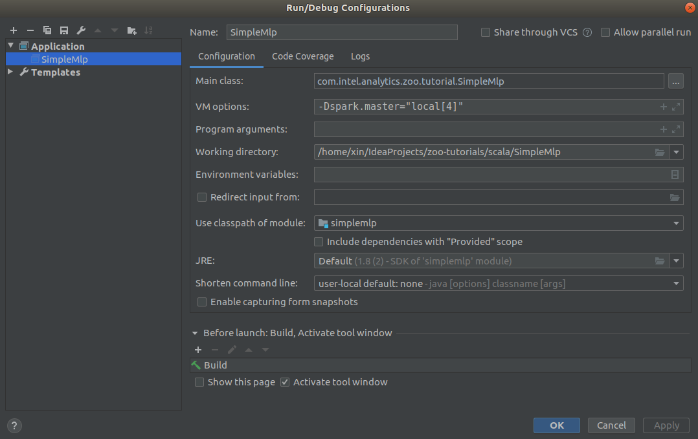

# SimpleMlp

This is an scala example about how to use [BigDL](https://github.com/intel-analytics/BigDL) to build your own deep learning application. You can use both maven or sbt to create your project and add bigdl-dllib to your dependency, see pom.xml and build.sbt for details.

## Build
### 1. Build with maven
```bash
mvn clean package
```

### 2. Build with sbt
```
sbt assembly
```

## Run
### 1. Run with Spark-submit
```bash
spark-submit \
  --master local[4] \
  --class com.intel.analytics.zoo.tutorial.SimpleMlp \
  target/simplemlp-0.1.0-SNAPSHOT-jar-with-dependencies.jar
```

### 2. Run in IDEA
After import as a maven project to IDEA, you can run the SimpleMlp class with a `VM options` `-Dspark.master="local[4]"` like below.

