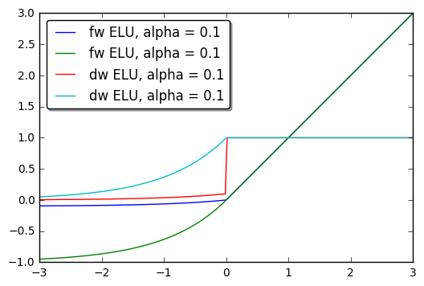

## SoftSign ##

**Scala:**
```scala
val softSign = SoftSign()
```
**Python:**
```python
softSign = SoftSign()
```

SoftSign applies SoftSign function to the input tensor

SoftSign function: `f_i(x) = x_i / (1+|x_i|)`


**Scala example:**
```scala
import com.intel.analytics.bigdl.tensor.TensorNumericMath.TensorNumeric.NumericFloat
import com.intel.analytics.bigdl.nn._
import com.intel.analytics.bigdl.tensor._
val softSign = SoftSign()
val input = Tensor(3, 3).rand()

> print(input)
0.6733504	0.7566517	0.43793806	
0.09683273	0.05829774	0.4567967	
0.20021072	0.11158377	0.31668025

> print(softSign.forward(input))
0.40239656	0.4307352	0.30455974	
0.08828395	0.05508633	0.31356242	
0.16681297	0.10038269	0.24051417	
[com.intel.analytics.bigdl.tensor.DenseTensor of size 3x3]


```

**Python example:**
```python
from bigdl.nn.layer import *
softSign=SoftSign()
> softSign.forward(np.array([[1, 2, 4],[-1, -2, -4]]))
[array([[ 0.5       ,  0.66666669,  0.80000001],
       [-0.5       , -0.66666669, -0.80000001]], dtype=float32)]

```
---
## ReLU6 ##

**Scala:**
```scala
val module = ReLU6(inplace = false)
```
**Python:**
```python
module = ReLU6(inplace=False)
```

Same as ReLU except that the rectifying function f(x) saturates at x = 6 
ReLU6 is defined as:
`f(x) = min(max(0, x), 6)`

**Scala example:**
```scala
import com.intel.analytics.bigdl.tensor.TensorNumericMath.TensorNumeric.NumericFloat
import com.intel.analytics.bigdl.nn._
import com.intel.analytics.bigdl.tensor._

val module = ReLU6()

println(module.forward(Tensor.range(-2, 8, 1)))
```
Gives the output,
```
com.intel.analytics.bigdl.tensor.Tensor[Float] =
0.0
0.0
0.0
1.0
2.0
3.0
4.0
5.0
6.0
6.0
6.0
[com.intel.analytics.bigdl.tensor.DenseTensor of size 11]
```
---
**Python example:**
```python
from bigdl.nn.layer import *
import numpy as np

module = ReLU6()

print(module.forward(np.arange(-2, 9, 1)))
```
Gives the output,
```
[array([ 0.,  0.,  0.,  1.,  2.,  3.,  4.,  5.,  6.,  6.,  6.], dtype=float32)]
```
---
## TanhShrink ##

**Scala:**
```scala
val tanhShrink = TanhShrink()
```
**Python:**
```python
tanhShrink = TanhShrink()
```
TanhShrink applies element-wise Tanh and Shrink function to the input

TanhShrink function : `f(x) = x - scala.math.tanh(x)`

**Scala example:**
```scala
import com.intel.analytics.bigdl.tensor.TensorNumericMath.TensorNumeric.NumericFloat
import com.intel.analytics.bigdl.nn._
import com.intel.analytics.bigdl.tensor._
val tanhShrink = TanhShrink()
val input = Tensor(3, 3).rand()

> print(input)
0.7056571	0.25239098	0.75746965	
0.89736927	0.31193605	0.23842576	
0.69492024	0.7512544	0.8386124	
[com.intel.analytics.bigdl.tensor.DenseTensor$mcF$sp of size 3x3]

> print(tanhShrink.forward(input))
0.09771085	0.0052260756	0.11788553	
0.18235475	0.009738684	0.004417494	
0.09378672	0.1153577	0.153539	
[com.intel.analytics.bigdl.tensor.DenseTensor of size 3x3]

```

**Python example:**
```python
from bigdl.nn.layer import *
tanhShrink = TanhShrink()

>  tanhShrink.forward(np.array([[1, 2, 3], [4, 5, 6], [7, 8, 9]]))
[array([[ 0.23840582,  1.03597236,  2.00494528],
       [ 3.00067067,  4.0000906 ,  5.0000124 ],
       [ 6.00000191,  7.        ,  8.        ]], dtype=float32)]

```
---

## SoftMax ##

**Scala:**
```scala
val layer = SoftMax()
```
**Python:**
```python
layer = SoftMax()
```

Applies the SoftMax function to an n-dimensional input Tensor, rescaling them so that the
elements of the n-dimensional output Tensor lie in the range (0, 1) and sum to 1.
Softmax is defined as:`f_i(x) = exp(x_i - shift) / sum_j exp(x_j - shift)`
where `shift = max_i(x_i)`.

**Scala example:**
```scala
import com.intel.analytics.bigdl.nn._
import com.intel.analytics.bigdl.utils.T
import com.intel.analytics.bigdl.tensor.Tensor
import com.intel.analytics.bigdl.tensor.TensorNumericMath.TensorNumeric.NumericFloat

val layer = SoftMax()
val input = Tensor(3)
input.apply1(_ => 1.0f * 10)
val gradOutput = Tensor(T(
1.0f,
0.0f,
0.0f
))
val output = layer.forward(input)
val gradient = layer.backward(input, gradOutput)
-> print(output)
0.33333334
0.33333334
0.33333334
[com.intel.analytics.bigdl.tensor.DenseTensor of size 3]
-> print(gradient)
0.22222221
-0.11111112
-0.11111112
[com.intel.analytics.bigdl.tensor.DenseTensor of size 3]
```

**Python example:**
```python
from bigdl.nn.layer import *
from bigdl.nn.criterion import *
import numpy as np
layer = SoftMax()
input = np.ones(3)*10
grad_output = np.array([1.0, 0.0, 0.0])
output = layer.forward(input)
gradient = layer.backward(input, grad_output)
-> print output
[ 0.33333334  0.33333334  0.33333334]
-> print gradient
[ 0.22222221 -0.11111112 -0.11111112]
```
---
## PReLU ##

**Scala:**
```scala
val module = PReLU(nOutputPlane = 0)
```
**Python:**
```python
module = PReLU(nOutputPlane=0)
```

Applies parametric ReLU, which parameter varies the slope of the negative part.

```
PReLU: f(x) = max(0, x) + a * min(0, x)
```
nOutputPlane's default value is 0, that means using PReLU in shared version and has
only one parameters. nOutputPlane is the input map number(Default is 0).

Notice: Please don't use weight decay on this.

**Scala example:**
```scala
import com.intel.analytics.bigdl.tensor.Tensor
import com.intel.analytics.bigdl.nn._
import com.intel.analytics.bigdl.tensor.TensorNumericMath.TensorNumeric.NumericFloat

val module = PReLU(2)
val input = Tensor(2, 2, 3).randn()
val output = module.forward(input)

> input
(1,.,.) =
-0.17810068	-0.69607687	0.25582042
-1.2140307	-1.5410945	1.0209005

(2,.,.) =
0.2826971	0.6370953	0.21471702
-0.16203058	-0.5643519	0.816576

[com.intel.analytics.bigdl.tensor.DenseTensor$mcF$sp of size 2x2x3]

> output
(1,.,.) =
-0.04452517	-0.17401922	0.25582042
-0.3035077	-0.38527364	1.0209005

(2,.,.) =
0.2826971	0.6370953	0.21471702
-0.040507644	-0.14108798	0.816576

[com.intel.analytics.bigdl.tensor.DenseTensor of size 2x2x3]
```

**Python example:**
```python
from bigdl.nn.layer import *
import numpy as np

module = PReLU(2)
input = np.random.randn(2, 2, 3)
output = module.forward(input)

> input
[[[ 2.50596953 -0.06593339 -1.90273409]
  [ 0.2464341   0.45941315 -0.41977094]]

 [[-0.8584367   2.19389229  0.93136755]
  [-0.39209027  0.16507514 -0.35850447]]]
  
> output
[array([[[ 2.50596952, -0.01648335, -0.47568351],
         [ 0.24643411,  0.45941314, -0.10494273]],
 
        [[-0.21460918,  2.19389224,  0.93136758],
         [-0.09802257,  0.16507514, -0.08962612]]], dtype=float32)]
```
---
## ReLU ##

**Scala:**
```scala
val relu = ReLU(ip = false)
```
**Python:**
```python
relu = ReLU(ip)
```

ReLU applies the element-wise rectified linear unit (ReLU) function to the input

`ip` illustrate if the ReLU function is done on the origin input
```
ReLU function : f(x) = max(0, x)
```

**Scala example:**
```scala
import com.intel.analytics.bigdl.tensor.TensorNumericMath.TensorNumeric.NumericFloat
import com.intel.analytics.bigdl.nn._
import com.intel.analytics.bigdl.tensor._
val relu = ReLU(false)

val input = Tensor(3, 3).randn()
> print(input)
1.6491432	-0.1935831	0.33882537
0.23419656	-1.4213086	0.8740734
0.018890858	0.7296756	0.37037155
[com.intel.analytics.bigdl.tensor.DenseTensor$mcF$sp of size 3x3]

> print(relu.forward(input))
1.6491432	0.0	0.33882537
0.23419656	0.0	0.8740734
0.018890858	0.7296756	0.37037155
[com.intel.analytics.bigdl.tensor.DenseTensor of size 3x3]


```

**Python example:**
```python
from bigdl.nn.layer import *
relu = ReLU(False)
> relu.forward(np.array([[-1, -2, -3], [0, 0, 0], [1, 2, 3]]))
[array([[ 0.,  0.,  0.],
       [ 0.,  0.,  0.],
       [ 1.,  2.,  3.]], dtype=float32)]
     
```

---
## SoftMin ##

**Scala:**
```scala
val sm = SoftMin()
```
**Python:**
```python
sm = SoftMin()
```

Applies the SoftMin function to an n-dimensional input Tensor, rescaling them so that the
elements of the n-dimensional output Tensor lie in the range (0,1) and sum to 1.
Softmin is defined as: `f_i(x) = exp(-x_i - shift) / sum_j exp(-x_j - shift)`
where `shift = max_i(-x_i)`.

**Scala example:**

```scala
import com.intel.analytics.bigdl.nn.SoftMin
import com.intel.analytics.bigdl.utils.T
import com.intel.analytics.bigdl.tensor.Tensor
import com.intel.analytics.bigdl.tensor.TensorNumericMath.TensorNumeric.NumericFloat

val sm = SoftMin()
val input = Tensor(3, 3).range(1, 3 * 3)

val output = sm.forward(input)

val gradOutput = Tensor(3, 3).range(1, 3 * 3).apply1(x => (x / 10.0).toFloat)
val gradInput = sm.backward(input, gradOutput)

```
Gives the output,
```
output: com.intel.analytics.bigdl.tensor.Tensor[Float] =
0.66524094      0.24472848      0.09003057
0.66524094      0.24472848      0.09003057
0.66524094      0.24472848      0.09003057
[com.intel.analytics.bigdl.tensor.DenseTensor of size 3x3]
```

Gives the gradInput,

```
gradInput: com.intel.analytics.bigdl.tensor.Tensor[Float] =
0.02825874      -0.014077038    -0.014181711
0.028258756     -0.01407703     -0.01418171
0.028258756     -0.014077038    -0.014181707
[com.intel.analytics.bigdl.tensor.DenseTensor of size 3x3]
```

**Python example:**


```python
from bigdl.nn.layer import *
from bigdl.nn.criterion import *
from bigdl.optim.optimizer import *
from bigdl.util.common import *

sm = SoftMin()

input = np.arange(1, 10, 1).astype("float32")
input = input.reshape(3, 3)

output = sm.forward(input)
print output

gradOutput = np.arange(1, 10, 1).astype("float32")
gradOutput = np.vectorize(lambda t: t / 10)(gradOutput)
gradOutput = gradOutput.reshape(3, 3)

gradInput = sm.backward(input, gradOutput)
print gradInput

```
---
## ELU ##


**Scala:**

```scala
val m = ELU(alpha = 1.0, inplace = false)
```
**Python:**
```python
m = ELU(alpha=1.0, inplace=False)
```


Applies exponential linear unit (`ELU`), which parameter a varies the convergence value of the exponential function below zero:

`ELU` is defined as:

```
f(x) = max(0, x) + min(0, alpha * (exp(x) - 1))
```

The output dimension is always equal to input dimension.

For reference see [Fast and Accurate Deep Network Learning by Exponential Linear Units (ELUs)](http://arxiv.org/abs/1511.07289).


**Scala example:**
```scala
import com.intel.analytics.bigdl.utils._
import com.intel.analytics.bigdl.tensor.Tensor
import com.intel.analytics.bigdl.nn._
import com.intel.analytics.bigdl.tensor.TensorNumericMath.TensorNumeric.NumericFloat

val xs = Tensor(4).randn()
println(xs)
println(ELU(4).forward(xs))
```
```
1.0217569
-0.17189966
1.4164596
0.69361746
[com.intel.analytics.bigdl.tensor.DenseTensor of size 4]

1.0217569
-0.63174534
1.4164596
0.69361746
[com.intel.analytics.bigdl.tensor.DenseTensor of size 4]

```

**Python example:**

```python
import numpy as np
from bigdl.nn.layer import *

xs = np.linspace(-3, 3, num=200)
go = np.ones(200)

def f(a):
    return ELU(a).forward(xs)[0]
def df(a):
    m = ELU(a)
    m.forward(xs)
    return m.backward(xs, go)[0]

plt.plot(xs, f(0.1), '-', label='fw ELU, alpha = 0.1')
plt.plot(xs, f(1.0), '-', label='fw ELU, alpha = 0.1')
plt.plot(xs, df(0.1), '-', label='dw ELU, alpha = 0.1')
plt.plot(xs, df(1.0), '-', label='dw ELU, alpha = 0.1')

plt.legend(loc='best', shadow=True, fancybox=True)
plt.show()

```

---
## SoftShrink
**Scala:**
```scala
val layer = SoftShrink(lambda = 0.5)
```
**Python:**
```python
layer = SoftShrink(the_lambda=0.5)
```

Apply the soft shrinkage function element-wise to the input Tensor

  SoftShrinkage operator:
```
       ⎧ x - lambda, if x >  lambda
f(x) = ⎨ x + lambda, if x < -lambda
       ⎩ 0, otherwise
```

Parameters:
* `lambda` a factor, default is 0.5

**Scala example:**
```scala
import com.intel.analytics.bigdl.nn.SoftShrink
import com.intel.analytics.bigdl.tensor.Tensor
import com.intel.analytics.bigdl.numeric.NumericFloat
import com.intel.analytics.bigdl.utils.T

val activation = SoftShrink()
val input = Tensor(T(
  T(-1f, 2f, 3f),
  T(-2f, 3f, 4f),
  T(-3f, 4f, 5f)
))

val gradOutput = Tensor(T(
  T(3f, 4f, 5f),
  T(2f, 3f, 4f),
  T(1f, 2f, 3f)
))

val output = activation.forward(input)
val grad = activation.backward(input, gradOutput)

println(output)
-0.5	1.5	2.5
-1.5	2.5	3.5
-2.5	3.5	4.5
[com.intel.analytics.bigdl.tensor.DenseTensor of size 3x3]

println(grad)
3.0	4.0	5.0
2.0	3.0	4.0
1.0	2.0	3.0
[com.intel.analytics.bigdl.tensor.DenseTensor of size 3x3]
```
**Python example:**
```python
activation = SoftShrink()
input = np.array([
  [-1.0, 2.0, 3.0],
  [-2.0, 3.0, 4.0],
  [-3.0, 4.0, 5.0]
])

gradOutput = np.array([
  [3.0, 4.0, 5.0],
  [2.0, 3.0, 4.0],
  [1.0, 2.0, 5.0]
])

output = activation.forward(input)
grad = activation.backward(input, gradOutput)

print output
[[-0.5  1.5  2.5]
 [-1.5  2.5  3.5]
 [-2.5  3.5  4.5]]

print grad
[[ 3.  4.  5.]
 [ 2.  3.  4.]
 [ 1.  2.  5.]]
```

---
## Sigmoid ##

**Scala:**
```scala
val module = Sigmoid()
```
**Python:**
```python
module = Sigmoid()
```

Applies the Sigmoid function element-wise to the input Tensor,
thus outputting a Tensor of the same dimension.

Sigmoid is defined as: `f(x) = 1 / (1 + exp(-x))`
  

**Scala example:**
```scala
import com.intel.analytics.bigdl.nn._
import com.intel.analytics.bigdl.tensor.Tensor
import com.intel.analytics.bigdl.tensor.TensorNumericMath.TensorNumeric.NumericFloat

val layer = new Sigmoid()
val input = Tensor(2, 3)
var i = 0
input.apply1(_ => {i += 1; i})
> print(layer.forward(input))
0.7310586	0.880797	0.95257413	
0.98201376	0.9933072	0.9975274	
[com.intel.analytics.bigdl.tensor.DenseTensor of size 2x3]
```

**Python example:**
```python
from bigdl.nn.layer import *

layer = Sigmoid()
input = np.array([[1, 2, 3], [4, 5, 6]])
>layer.forward(input)
array([[ 0.7310586 ,  0.88079703,  0.95257413],
       [ 0.98201376,  0.99330717,  0.99752742]], dtype=float32)
```
---
## Tanh ##
**Scala:**
```scala
val activation = Tanh()
```
**Python:**
```python
activation = Tanh()
```

Applies the Tanh function element-wise to the input Tensor,
thus outputting a Tensor of the same dimension.
Tanh is defined as
```
f(x) = (exp(x)-exp(-x))/(exp(x)+exp(-x)).
```

**Scala example:**
```scala
import com.intel.analytics.bigdl.nn.Tanh
import com.intel.analytics.bigdl.tensor.Tensor
import com.intel.analytics.bigdl.numeric.NumericFloat
import com.intel.analytics.bigdl.utils.T

val activation = new Tanh()
val input = Tensor(T(
  T(1f, 2f, 3f),
  T(2f, 3f, 4f),
  T(3f, 4f, 5f)
))

val gradOutput = Tensor(T(
  T(3f, 4f, 5f),
  T(2f, 3f, 4f),
  T(1f, 2f, 3f)
))

val output = activation.forward(input)
val grad = activation.backward(input, gradOutput)

println(output)
0.7615942	0.9640276	0.9950548
0.9640276	0.9950548	0.9993293
0.9950548	0.9993293	0.9999092
[com.intel.analytics.bigdl.tensor.DenseTensor of size 3x3]

println(grad)
1.259923	0.28260326	0.049329996
0.14130163	0.029597998	0.0053634644
0.009865999	0.0026817322	5.4466724E-4
[com.intel.analytics.bigdl.tensor.DenseTensor of size 3x3]
```

**Python example:**
```python
activation = Tanh()
input = np.array([
  [1.0, 2.0, 3.0],
  [2.0, 3.0, 4.0],
  [3.0, 4.0, 5.0]
])

gradOutput = np.array([
  [3.0, 4.0, 5.0],
  [2.0, 3.0, 4.0],
  [1.0, 2.0, 5.0]
])

output = activation.forward(input)
grad = activation.backward(input, gradOutput)

print output
[[ 0.76159418  0.96402758  0.99505478]
 [ 0.96402758  0.99505478  0.99932933]
 [ 0.99505478  0.99932933  0.99990922]]

print grad
[[  1.25992298e+00   2.82603264e-01   4.93299961e-02]
 [  1.41301632e-01   2.95979977e-02   5.36346436e-03]
 [  9.86599922e-03   2.68173218e-03   9.07778740e-04]]
```
---
## SoftPlus ##

**Scala:**
```scala
val model = SoftPlus(beta = 1.0)
```
**Python:**
```python
model = SoftPlus(beta = 1.0)
```

Apply the SoftPlus function to an n-dimensional input tensor.
SoftPlus function: 
```
f_i(x) = 1/beta * log(1 + exp(beta * x_i))
```
- param beta Controls sharpness of transfer function

**Scala example:**
```scala
import com.intel.analytics.bigdl.tensor.TensorNumericMath.TensorNumeric.NumericFloat
import com.intel.analytics.bigdl.nn._
import com.intel.analytics.bigdl.tensor.Tensor

val model = SoftPlus()
val input = Tensor(2, 3, 4).rand()
val output = model.forward(input)

scala> println(input)
(1,.,.) =
0.9812126	0.7044107	0.0657767	0.9173636	
0.20853543	0.76482195	0.60774535	0.47837523	
0.62954164	0.56440496	0.28893307	0.40742245	

(2,.,.) =
0.18701692	0.7700966	0.98496467	0.8958407	
0.037015386	0.34626052	0.36459026	0.8460807	
0.051016055	0.6742781	0.14469075	0.07565566	

scala> println(output)
(1,.,.) =
1.2995617	1.1061354	0.7265762	1.2535294	
0.80284095	1.1469617	1.0424956	0.9606715	
1.0566612	1.0146512	0.8480129	0.91746557	

(2,.,.) =
0.7910212	1.1505641	1.3022922	1.2381986	
0.71182615	0.88119024	0.8919668	1.203121	
0.7189805	1.0860726	0.7681072	0.7316903	

[com.intel.analytics.bigdl.tensor.DenseTensor of size 2x3x4]
```

**Python example:**
```python
from bigdl.nn.layer import *
import numpy as np

model = SoftPlus()
input = np.random.randn(2, 3, 4)
output = model.forward(input)

>>> print(input)
[[[ 0.82634972 -0.09853824  0.97570235  1.84464617]
  [ 0.38466503  0.08963732  1.29438774  1.25204527]
  [-0.01910449 -0.19560752 -0.81769143 -1.06365733]]

 [[-0.56284365 -0.28473239 -0.58206869 -1.97350909]
  [-0.28303919 -0.59735361  0.73282102  0.0176838 ]
  [ 0.63439133  1.84904987 -1.24073643  2.13275833]]]
>>> print(output)
[[[ 1.18935537  0.6450913   1.2955569   1.99141073]
  [ 0.90386271  0.73896986  1.53660071  1.50351918]
  [ 0.68364054  0.60011864  0.36564925  0.29653603]]

 [[ 0.45081255  0.56088102  0.44387865  0.1301229 ]
  [ 0.56160825  0.43842646  1.12523568  0.70202816]
  [ 1.0598278   1.99521446  0.2539995   2.24475574]]]
```
---
## L1Penalty ##

**Scala:**
```scala
val l1Penalty = L1Penalty(l1weight, sizeAverage = false, provideOutput = true)
```
**Python:**
```python
l1Penalty = L1Penalty( l1weight, size_average=False, provide_output=True)
```
L1Penalty adds an L1 penalty to an input 
For forward, the output is the same as input and a L1 loss of the latent state will be calculated each time
For backward, gradInput = gradOutput + gradLoss


**Scala example:**
```scala
import com.intel.analytics.bigdl.tensor.TensorNumericMath.TensorNumeric.NumericFloat
import com.intel.analytics.bigdl.nn._
import com.intel.analytics.bigdl.tensor._
val l1Penalty = L1Penalty(1, true, true)
val input = Tensor(3, 3).rand()

> print(input)
0.0370419	0.03080979	0.22083037	
0.1547358	0.018475588	0.8102709	
0.86393493	0.7081842	0.13717912	
[com.intel.analytics.bigdl.tensor.DenseTensor$mcF$sp of size 3x3]


> print(l1Penalty.forward(input))
0.0370419	0.03080979	0.22083037	
0.1547358	0.018475588	0.8102709	
0.86393493	0.7081842	0.13717912	
[com.intel.analytics.bigdl.tensor.DenseTensor$mcF$sp of size 3x3]	

```

**Python example:**
```python
from bigdl.nn.layer import *
l1Penalty = L1Penalty(1, True, True)

>>> l1Penalty.forward(np.array([[1, 2, 3], [4, 5, 6], [7, 8, 9]]))
[array([[ 1.,  2.,  3.],
       [ 4.,  5.,  6.],
       [ 7.,  8.,  9.]], dtype=float32)]

```
---
## NegativeEntropyPenalty ##

**Scala:**
```scala
val penalty = NegativeEntropyPenalty(beta = 0.01)
```
**Python:**
```python
penalty = NegativeEntropyPenalty(beta = 0.01)
```
Penalize the input multinomial distribution if it has low entropy.
The input to this layer should be a batch of vector each representing a
multinomial distribution. The input is typically the output of a softmax layer.

For forward, the output is the same as input and a NegativeEntropy loss of the latent state will be calculated each time
For backward, gradInput = gradOutput + gradLoss

This can be used in reinforcement learning to discourage the policy from
collapsing to a single action for a given state, which improves exploration.
See the A3C paper for more detail (https://arxiv.org/pdf/1602.01783.pdf).


**Scala example:**
```scala
import com.intel.analytics.bigdl.tensor.TensorNumericMath.TensorNumeric.NumericFloat
import com.intel.analytics.bigdl.nn._
import com.intel.analytics.bigdl.tensor._
val penalty = NegativeEntropyPenalty(0.01)
val input = Tensor(3, 3).rand()

> print(input)
0.0370419	0.03080979	0.22083037	
0.1547358	0.018475588	0.8102709	
0.86393493	0.7081842	0.13717912	
[com.intel.analytics.bigdl.tensor.DenseTensor$mcF$sp of size 3x3]


> print(penalty.forward(input))
0.0370419	0.03080979	0.22083037	
0.1547358	0.018475588	0.8102709	
0.86393493	0.7081842	0.13717912	
[com.intel.analytics.bigdl.tensor.DenseTensor$mcF$sp of size 3x3]	

```

**Python example:**
```python
from bigdl.nn.layer import *
penalty = NegativeEntropyPenalty(0.01)

>>> l1Penalty.forward(np.array([[1, 2, 3], [4, 5, 6], [7, 8, 9]]))
[array([[ 1.,  2.,  3.],
       [ 4.,  5.,  6.],
       [ 7.,  8.,  9.]], dtype=float32)]

```

---
## HardShrink ##

**Scala:**
```scala
val m = HardShrink(lambda = 0.5)
```
**Python:**
```python
m = HardShrink(the_lambda=0.5)
```

Applies the hard shrinkage function element-wise to the input Tensor. lambda is set to 0.5 by default.

HardShrinkage operator is defined as:

```
       ⎧ x, if x >  lambda
f(x) = ⎨ x, if x < -lambda
       ⎩ 0, otherwise
```


**Scala example:**
```scala
import com.intel.analytics.bigdl.tensor.Tensor
import com.intel.analytics.bigdl.nn._
import com.intel.analytics.bigdl.tensor.TensorNumericMath.TensorNumeric.NumericFloat
import com.intel.analytics.bigdl.utils.RandomGenerator._

def randomn(): Double = RNG.uniform(-10, 10)
val input = Tensor(3, 4)
input.apply1(x => randomn().toFloat)

val layer = new HardShrink(8)
println("input:")
println(input)
println("output:")
println(layer.forward(input))
```

```
input:
8.53746839798987	-2.25314284209162	2.838596091605723	0.7181660132482648	
0.8278933027759194	8.986027473583817	-3.6885232804343104	-2.4018199276179075	
-9.51015486381948	2.6402589259669185	5.438693333417177	-6.577442386187613	
[com.intel.analytics.bigdl.tensor.DenseTensor of size 3x4]
output:
8.53746839798987	0.0	0.0	0.0	
0.0	8.986027473583817	0.0	0.0	
-9.51015486381948	0.0	0.0	0.0	
[com.intel.analytics.bigdl.tensor.DenseTensor of size 3x4]
```

**Python example:**


```python
import numpy as np
from bigdl.nn.layer import *

input = np.linspace(-5, 5, num=10)
layer = HardShrink(the_lambda=3.0)
print("input:")
print(input)
print("output: ")
print(layer.forward(input))
```

```
creating: createHardShrink
input:
[-5.         -3.88888889 -2.77777778 -1.66666667 -0.55555556  0.55555556
  1.66666667  2.77777778  3.88888889  5.        ]
output: 
[-5.         -3.88888884  0.          0.          0.          0.          0.
  0.          3.88888884  5.        ]
 
```

---
## RReLU ##

**Scala:**
```scala
val layer = RReLU(lower, upper, inPlace)
```
**Python:**
```python
layer = RReLU(lower, upper, inPlace)
```

Applies the randomized leaky rectified linear unit (RReLU) element-wise to the input Tensor,
thus outputting a Tensor of the same dimension. Informally the RReLU is also known as 'insanity' layer.

RReLU is defined as: `f(x) = max(0,x) + a * min(0, x) where a ~ U(l, u)`.

In training mode negative inputs are multiplied by a factor drawn from a uniform random
distribution U(l, u). In evaluation mode a RReLU behaves like a LeakyReLU with a constant mean
factor `a = (l + u) / 2`.

By default, `l = 1/8` and `u = 1/3`. If `l == u` a RReLU effectively becomes a LeakyReLU.

Regardless of operating in in-place mode a RReLU will internally allocate an input-sized noise tensor to store random factors for negative inputs.

The backward() operation assumes that forward() has been called before.

For reference see [Empirical Evaluation of Rectified Activations in Convolutional Network](http://arxiv.org/abs/1505.00853).

**Scala example:**
```scala
import com.intel.analytics.bigdl.nn._
import com.intel.analytics.bigdl.utils.T
import com.intel.analytics.bigdl.tensor.Tensor
import com.intel.analytics.bigdl.tensor.TensorNumericMath.TensorNumeric.NumericFloat

val layer = RReLU()
layer.forward(Tensor(T(1.0f, 2.0f, -1.0f, -2.0f)))
layer.backward(Tensor(T(1.0f, 2.0f, -1.0f, -2.0f)),Tensor(T(0.1f, 0.2f, -0.1f, -0.2f)))
```

There's random factor. Gives the output,
```
1.0
2.0
-0.24342789
-0.43175703
[com.intel.analytics.bigdl.tensor.DenseTensor of size 4]

0.1
0.2
-0.024342788
-0.043175705
[com.intel.analytics.bigdl.tensor.DenseTensor of size 4]
```

**Python example:**
```python
from bigdl.nn.layer import RReLU
import numpy as np

layer = RReLU()
layer.forward(np.array([1.0, 2.0, -1.0, -2.0]))
layer.backward(np.array([1.0, 2.0, -1.0, -2.0]),
  np.array([0.1, 0.2, -0.1, -0.2]))
```

There's random factor. Gives the ouput like
```
array([ 1.,  2., -0.15329693, -0.40423378], dtype=float32)

array([ 0.1, 0.2, -0.01532969, -0.04042338], dtype=float32)
```
---
## HardTanh

**Scala:**
```scala
val activation = HardTanh(
    minValue = -1,
    maxValue = 1,
    inplace = false)
```
**Python:**
```python
activation = HardTanh(
    min_value=-1.0,
    max_value=1.0,
    inplace=False)
```

Applies non-linear function HardTanh to each element of input, HardTanh is defined:
```
           ⎧  maxValue, if x > maxValue
    f(x) = ⎨  minValue, if x < minValue
           ⎩  x, otherwise
```

Parameters:
* `minValue` minValue in f(x), default is -1.
* `maxValue` maxValue in f(x), default is 1.
* `inplace`  weather inplace update output from input. default is false.

**Scala example:**
```scala
import com.intel.analytics.bigdl.nn.HardTanh
import com.intel.analytics.bigdl.tensor.Tensor
import com.intel.analytics.bigdl.numeric.NumericFloat
import com.intel.analytics.bigdl.utils.T

val activation = HardTanh()
val input = Tensor(T(
  T(-1f, 2f, 3f),
  T(-2f, 3f, 4f),
  T(-3f, 4f, 5f)
))

val gradOutput = Tensor(T(
  T(3f, 4f, 5f),
  T(2f, 3f, 4f),
  T(1f, 2f, 3f)
))

val output = activation.forward(input)
val grad = activation.backward(input, gradOutput)

println(output)
-1.0	1.0	1.0
-1.0	1.0	1.0
-1.0	1.0	1.0
[com.intel.analytics.bigdl.tensor.DenseTensor of size 3x3]

println(grad)
0.0	0.0	0.0
0.0	0.0	0.0
0.0	0.0	0.0
[com.intel.analytics.bigdl.tensor.DenseTensor of size 3x3]
```

**Python example:**
```python
activation = HardTanh()
input = np.array([
  [-1.0, 2.0, 3.0],
  [-2.0, 3.0, 4.0],
  [-3.0, 4.0, 5.0]
])

gradOutput = np.array([
  [3.0, 4.0, 5.0],
  [2.0, 3.0, 4.0],
  [1.0, 2.0, 5.0]
])

output = activation.forward(input)
grad = activation.backward(input, gradOutput)

print output
[[-1.  1.  1.]
 [-1.  1.  1.]
 [-1.  1.  1.]]

print grad
[[ 0.  0.  0.]
 [ 0.  0.  0.]
 [ 0.  0.  0.]]
```
---
## LeakyReLU ##

**Scala:**
```scala
layer = LeakyReLU(negval=0.01,inplace=false)
```
**Python:**
```python
layer = LeakyReLU(negval=0.01,inplace=False,bigdl_type="float")
```

It is a transfer module that applies LeakyReLU, which parameter
negval sets the slope of the negative part:
 LeakyReLU is defined as:
  `f(x) = max(0, x) + negval * min(0, x)`

 *  `negval` sets the slope of the negative partl, default is 0.01
 *  `inplace` if it is true, doing the operation in-place without
                using extra state memory, default is false

**Scala example:**
```scala
import com.intel.analytics.bigdl.nn.LeakyReLU
import com.intel.analytics.bigdl.tensor.Tensor
import com.intel.analytics.bigdl.numeric.NumericFloat

val layer = LeakyReLU(negval=0.01,inplace=false)
val input = Tensor(3, 2).rand(-1, 1)
println(input)
println(layer.forward(input))
```
The output is,
```
-0.6923256      -0.14086828
0.029539397     0.477964
0.5202874       0.10458552
[com.intel.analytics.bigdl.tensor.DenseTensor$mcF$sp of size 3x2]
-0.006923256    -0.0014086828
0.029539397     0.477964
0.5202874       0.10458552
[com.intel.analytics.bigdl.tensor.DenseTensor of size 3x2]
```

**Python example:**
```python
layer = LeakyReLU(negval=0.01,inplace=False,bigdl_type="float")
input = np.random.rand(3, 2)
array([[ 0.19502378,  0.40498206],
       [ 0.97056004,  0.35643192],
       [ 0.25075111,  0.18904582]])

layer.forward(input)
array([[ 0.19502378,  0.40498206],
       [ 0.97056001,  0.35643193],
       [ 0.25075111,  0.18904583]], dtype=float32)
```
---
## LogSigmoid ##
**Scala:**
```scala
val activation = LogSigmoid()
```
**Python:**
```python
activation = LogSigmoid()
```

This class is a activation layer corresponding to the non-linear function sigmoid function:
```
f(x) = Log(1 / (1 + e ^ (-x)))
```

**Scala example:**
```scala
import com.intel.analytics.bigdl.nn.LogSigmoid
import com.intel.analytics.bigdl.tensor.Tensor
import com.intel.analytics.bigdl.numeric.NumericFloat
import com.intel.analytics.bigdl.utils.T

val activation = LogSigmoid()
val input = Tensor(T(
  T(1f, 2f, 3f),
  T(2f, 3f, 4f),
  T(3f, 4f, 5f)
))

val gradOutput = Tensor(T(
  T(3f, 4f, 5f),
  T(2f, 3f, 4f),
  T(1f, 2f, 3f)
))

val output = activation.forward(input)
val grad = activation.backward(input, gradOutput)

println(output)
-0.3132617	-0.12692802	-0.04858735
-0.12692802	-0.04858735	-0.01814993
-0.04858735	-0.01814993	-0.0067153485
[com.intel.analytics.bigdl.tensor.DenseTensor of size 3x3]

println(grad)
0.8068244	0.47681168	0.23712938
0.23840584	0.14227761	0.07194484
0.047425874	0.03597242	0.020078553
[com.intel.analytics.bigdl.tensor.DenseTensor of size 3x3]
```

**Python example:**
```python
activation = LogSigmoid()
input = np.array([
  [1.0, 2.0, 3.0],
  [2.0, 3.0, 4.0],
  [3.0, 4.0, 5.0]
])

gradOutput = np.array([
  [3.0, 4.0, 5.0],
  [2.0, 3.0, 4.0],
  [1.0, 2.0, 5.0]
])

output = activation.forward(input)
grad = activation.backward(input, gradOutput)

print output
[[-0.31326169 -0.12692802 -0.04858735]
 [-0.12692802 -0.04858735 -0.01814993]
 [-0.04858735 -0.01814993 -0.00671535]]

print grad
[[ 0.80682439  0.47681168  0.23712938]
 [ 0.23840584  0.14227761  0.07194484]
 [ 0.04742587  0.03597242  0.03346425]]
```
---
## LogSoftMax ##

**Scala:**
```scala
val model = LogSoftMax()
```
**Python:**
```python
model = LogSoftMax()
```

The LogSoftMax module applies a LogSoftMax transformation to the input data
which is defined as:
```
f_i(x) = log(1 / a exp(x_i))
where a = sum_j[exp(x_j)]
```
The input given in `forward(input)` must be either
a vector (1D tensor) or matrix (2D tensor).

**Scala example:**
```scala
import com.intel.analytics.bigdl.tensor.TensorNumericMath.TensorNumeric.NumericFloat
import com.intel.analytics.bigdl.nn._
import com.intel.analytics.bigdl.tensor.Tensor

val model = LogSoftMax()
val input = Tensor(2, 5).rand()
val output = model.forward(input)

scala> print(input)
0.4434036	0.64535594	0.7516194	0.11752353	0.5216674	
0.57294756	0.744955	0.62644184	0.0052207764	0.900162	
[com.intel.analytics.bigdl.tensor.DenseTensor$mcF$sp of size 2x5]

scala> print(output)
-1.6841899	-1.4822376	-1.3759742	-2.01007	-1.605926	
-1.6479948	-1.4759872	-1.5945004	-2.2157214	-1.3207803	
[com.intel.analytics.bigdl.tensor.DenseTensor of size 2x5]
```

**Python example:**
```python
model = LogSoftMax()
input = np.random.randn(4, 10)
output = model.forward(input)

>>> print(input)
[[ 0.10805365  0.11392282  1.31891713 -0.62910637 -0.80532589  0.57976863
  -0.44454368  0.26292944  0.8338328   0.32305099]
 [-0.16443839  0.12010763  0.62978233 -1.57224143 -2.16133614 -0.60932395
  -0.22722708  0.23268273  0.00313597  0.34585582]
 [ 0.55913444 -0.7560615   0.12170887  1.40628806  0.97614582  1.20417145
  -1.60619173 -0.54483025  1.12227399 -0.79976189]
 [-0.05540945  0.86954458  0.34586427  2.52004267  0.6998163  -1.61315173
  -0.76276874  0.38332142  0.66351792 -0.30111399]]

>>> print(output)
[[-2.55674744 -2.55087829 -1.34588397 -3.2939074  -3.47012711 -2.08503246
  -3.10934472 -2.40187168 -1.83096838 -2.34175014]
 [-2.38306785 -2.09852171 -1.58884704 -3.79087067 -4.37996578 -2.82795334
  -2.44585633 -1.98594666 -2.21549344 -1.87277353]
 [-2.31549931 -3.63069534 -2.75292492 -1.46834576 -1.89848804 -1.67046237
  -4.48082542 -3.41946411 -1.75235975 -3.67439556]
 [-3.23354769 -2.30859375 -2.83227396 -0.6580956  -2.47832203 -4.79128981
  -3.940907   -2.79481697 -2.5146203  -3.47925234]]
```
---
## Threshold ##

**Scala:**
```scala
val module = Threshold(threshold, value, ip)
```
**Python:**
```python
module = Threshold(threshold, value, ip)
```

Thresholds each element of the input Tensor.
Threshold is defined as:

```
     ⎧ x        if x >= threshold
 y = ⎨ 
     ⎩ value    if x <  threshold
```

- threshold: The value to threshold at
- value: The value to replace with
- ip: can optionally do the operation in-place

**Scala example:**
```scala
import com.intel.analytics.bigdl.tensor.Tensor
import com.intel.analytics.bigdl.nn._
import com.intel.analytics.bigdl.tensor.TensorNumericMath.TensorNumeric.NumericFloat

val module = Threshold(1, 0.8)
val input = Tensor(2, 2, 2).randn()
val output = module.forward(input)

> input
(1,.,.) =
2.0502799	-0.37522468
-1.2704345	-0.22533786

(2,.,.) =
1.1959263	1.6670992
-0.24333914	1.4424673

[com.intel.analytics.bigdl.tensor.DenseTensor of size 2x2x2]

> output
(1,.,.) =
(1,.,.) =
2.0502799	0.8
0.8	0.8

(2,.,.) =
1.1959263	1.6670992
0.8	1.4424673

[com.intel.analytics.bigdl.tensor.DenseTensor of size 2x2x2]

```

**Python example:**
```python
from bigdl.nn.layer import *
import numpy as np

module = Threshold(1.0, 0.8)
input = np.random.randn(2, 2, 2)
output = module.forward(input)

> input
[[[-0.43226865 -1.09160093]
  [-0.20280088  0.68196767]]

 [[ 2.32017942  1.00003307]
  [-0.46618767  0.57057167]]]
  
> output
[array([[[ 0.80000001,  0.80000001],
        [ 0.80000001,  0.80000001]],

       [[ 2.32017946,  1.00003302],
        [ 0.80000001,  0.80000001]]], dtype=float32)]
```
## HardSigmoid ##

**Scala:**
```scala
val module = HardSigmoid()
```
**Python:**
```python
module = HardSigmoid()
```

Activate each element as below

```
           ⎧  0, if x < -2.5
    f(x) = ⎨  1, if x > 2.5
           ⎩  0.2 * x + 0.5, otherwise
```


**Scala example:**
```scala
import com.intel.analytics.bigdl.tensor.Tensor
import com.intel.analytics.bigdl.nn._
import com.intel.analytics.bigdl.tensor.TensorNumericMath.TensorNumeric.NumericFloat

val module = HardSigmoid()
val input = Tensor(2, 2).randn(0, 5)
val output = module.forward(input)

> input
1.9305606	2.5518782
0.55136	7.8706875
[com.intel.analytics.bigdl.tensor.DenseTensor$mcF$sp of size 2x2]

> output
0.8861121	1.0
0.610272	1.0
[com.intel.analytics.bigdl.tensor.DenseTensor of size 2x2]

```

**Python example:**
```python
from bigdl.nn.layer import *
import numpy as np

module = HardSigmoid()
input = np.random.randn(2, 2)
output = module.forward(input)

> input
array([[-1.45094354, -1.78217815],
       [ 0.84914007,  0.7104982 ]])
  
> output
array([[ 0.20981129,  0.14356437],
       [ 0.669828  ,  0.64209962]], dtype=float32)

```

## SReLU ##

S-shaped Rectified Linear Unit based on paper [Deep Learning with S-shaped Rectified Linear Activation Units](http://arxiv.org/abs/1512.07030).

```
     ⎧ t^r + a^r(x - t^r) if x >= t^r
 y = ⎨ x                  if t^r > x > t^l
     ⎩ t^l + a^l(x - t^l) if x <= t^l
```

```scala
import com.intel.analytics.bigdl.nn._
import com.intel.analytics.bigdl.tensor.Tensor

val input = Tensor[Float](2, 3, 4).rand()
val gradOutput = Tensor[Float](2, 3, 4).rand()
val srelu = SReLU[Float]([3, 4])
val output = srelu.forward(input)
val gradInput = srelu.backward(input, gradOutput)

println(input)
println(gradInput)
```

The input is,

```
(1,.,.) =
0.4835907       0.53359604      0.37766683      0.32341897
0.96768993      0.78638965      0.6921552       0.49003857
0.10896994      0.22801183      0.9023593       0.43514457

(2,.,.) =
0.6720485       0.5893981       0.45753896      0.28696498
0.16126601      0.75192916      0.79481035      0.24795102
0.7665252       0.775531        0.74594253      0.23907393
```

The output is,

```
srelu: com.intel.analytics.bigdl.nn.SReLU[Float] = SReLU[71e3de13]
output: com.intel.analytics.bigdl.tensor.Tensor[Float] =
(1,.,.) =                   
0.4835907       0.53359604      0.37766683      0.32341897
0.96768993      0.78638965      0.6921552       0.49003857
0.10896994      0.22801183      0.9023593       0.43514457

(2,.,.) =                                                                    
0.6720485       0.5893981       0.45753896      0.28696498
0.16126601      0.75192916      0.79481035      0.24795102
0.7665252       0.775531        0.74594253      0.23907393
```

The python code is,

```python
from bigdl.nn.layer import *
import numpy as np

module = SReLU([3, 4])
input = np.random.randn(2, 3, 4)
output = module.forward(input)
gradOutput = np.random.randn(2, 3, 4)
gradInput = module.backward(input, gradOutput)
print output
print gradInput
```
