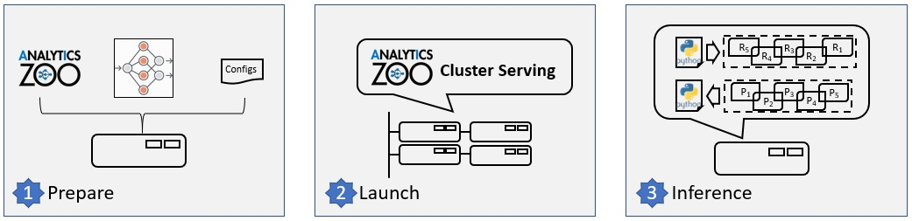
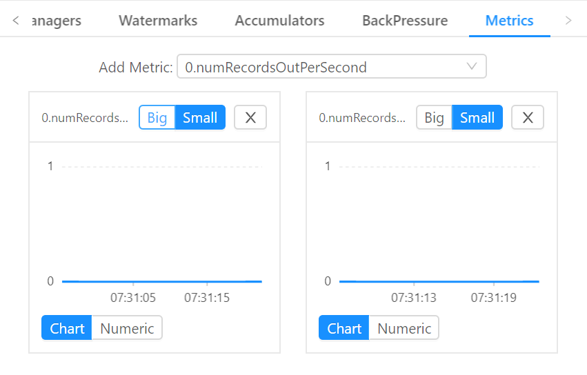
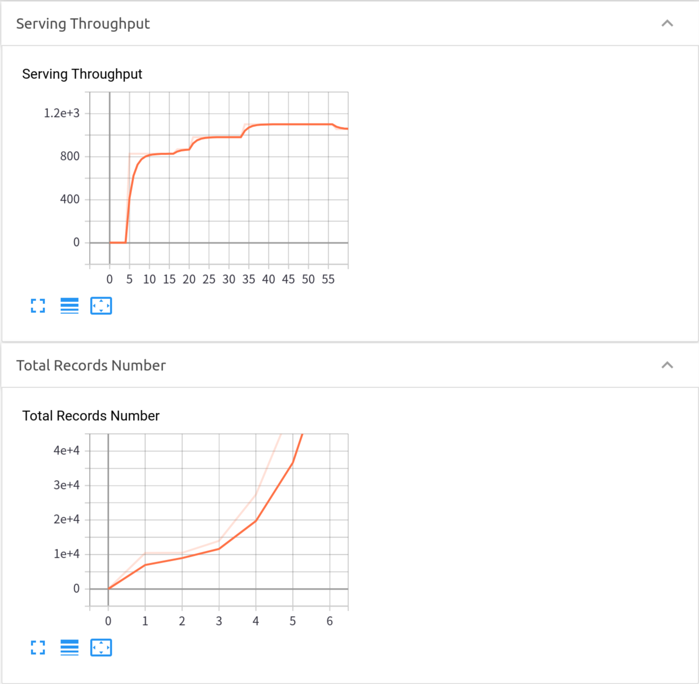

# Programming Guide
Analytics Zoo Cluster Serving is a lightweight distributed, real-time serving solution that supports a wide range of deep learning models (such as TensorFlow, PyTorch, Caffe, BigDL and OpenVINO models). It provides a simple pub/sub API, so that the users can easily send their inference requests to the input queue (using a simple Python API); Cluster Serving will then automatically manage the scale-out and real-time model inference across a large cluster (using distributed streaming frameworks such as Apache Spark Streaming, Apache Flink, etc.) 

The overall architecture of Analytics Zoo Cluster Serving solution is illustrated as below: 


Note: currently only **image classification** models are supported.

This page contains the guide for you to run Analytics Zoo Cluster Serving, including following:

* [Quick Start](#quick-start)

* [Workflow Overview](#workflow-overview) 

* [Deploy Your Own Cluster Serving](#deploy-your-own-cluster-serving)

   1. [Installation](#1-installation)

   2. [Configuration](#2-configuration) 
   
   3. [Launching Service](#3-launching-service)
   
   4. [Model inference](#4-model-inference)

* [Optional Operations](#optional-operations)

     - [Update Model or Configurations](#update-model-or-configurations)

     - [Logs and Visualization](#logs-and-visualization)


## Quick Start

This section provides a quick start example for you to run Analytics Zoo Cluster Serving. To simplify the example, we use docker to run Cluster Serving. If you do not have docker installed, [install docker](https://docs.docker.com/install/) first. The quick start example contains all the necessary components so the first time users can get it up and running within minutes:

* A docker image for Analytics Zoo Cluster Serving (with all dependencies installed)
* A sample configuration file
* A sample trained TensorFlow model, and sample data for inference
* A sample Python client program

Use one command to run Cluster Serving container.
```
docker run -itd --name cluster-serving --net=host intelanalytics/zoo-cluster-serving:0.7.0
```
Log into the container using `docker exec -it cluster-serving bash`. 

We already prepared `analytics-zoo` and `opencv-python` with pip in this container. And prepared model in `model` directory with following structure.

```
cluster-serving | 
               -- | model
                 -- frozen_graph.pb
                 -- graph_meta.json
```

Start Cluster Serving using `cluster-serving-start`. 

Run python program `python quick_start.py` to push data into queue and get inference result. 

Then you can see the inference output in console. 
```
image: fish1.jpeg, classification-result:class: 5's prob: 0.18204997
image: dog1.jpeg, classification-result:class: 267's prob: 0.27166227
image: cat1.jpeg, classification-result:class: 292's prob: 0.32633427
```
Wow! You made it!

Note that the Cluster Serving quick start example will run on your local node only. Check the [Deploy Your Own Cluster Serving](#deploy-your-own-cluster-serving) section for how to configure and run Cluster Serving in a distributed fashion.

For more details, you could also see the log and performance by go to `localhost:6006` in your browser and refer to [Logs and Visualization](#logs-and-visualization), or view the source code of `quick_start.py` [here](https://github.com/intel-analytics/analytics-zoo/blob/master/pyzoo/zoo/serving/quick_start.py), or refer to [API Guide](APIGuide.md).


## Workflow Overview

The figure below illustrates the simple 3-step "Prepare-Launch-Inference" workflow for Cluster Serving.



#### 1. Install and prepare Cluster Serving environment on a local node:

- Copy a previously trained model to the local node; currently TensorFlow, PyTorch, Caffe, BigDL and OpenVINO models are supported.
- Install Analytics Zoo on the local node (e.g., using a single pip install command)
- Configure Cluster Server on the local node, including the file path to the trained model and the address of the cluster (such as Apache Hadoop YARN cluster, Spark Cluster, K8s cluster, etc.).
Please note that you only need to deploy the Cluster Serving solution on a single local node, and NO modifications are needed for the (YARN or K8s) cluster. 

#### 2. Launch the Cluster Serving service

You can launch the Cluster Serving service by running the startup script on the local node. Under the hood, Cluster Serving will automatically deploy the trained model and serve the model inference requests across the cluster in a distributed fashion. You may monitor its runtime status (such as inference throughput) using TensorBoard. 

#### 3. Distributed, real-time (streaming) inference

Cluster Serving provides a simple pub/sub API to the users, so that you can easily send the inference requests to an input queue (currently Redis Streams is used) using a simple Python API.

Cluster Serving will then read the requests from the Redis stream, run the distributed real-time inference across the cluster (using Spark Streaming or Flink), and return the results back through Redis. As a result, you may get the inference results again using a simple Python API.


## Deploy your Own Cluster Serving
### 1. Installation
It is recommended to install Cluster Serving by pulling the pre-built Docker image to your local node, which have packaged all the required dependencies. Alternatively, you may also manually install Cluster Serving (through either pip or direct downloading) as well as Spark, Redis and TensorBoard (for visualizing the serving status) on the local node.
#### Docker
```
docker pull intelanalytics/zoo-cluster-serving
```
then, (or directly run `docker run`, it will pull the image if it does not exist)
```
docker run --name cluster-serving --net=host -itd intelanalytics/zoo-cluster-serving:0.7.0 bash
```
Log into the container
```
docker exec -it cluster-serving bash
```
`cd ./cluster-serving`, you can see all the environments are prepared.
##### Yarn user
For Yarn user using docker, you have to set additional config, thus you need to call following when starting the container
```
docker run --name cluster-serving --net=host -v /path/to/HADOOP_CONF_DIR:/opt/work/HADOOP_CONF_DIR -e HADOOP_CONF_DIR=/opt/work/HADOOP_CONF_DIR -itd intelanalytics/zoo-cluster-serving:0.7.0 bash
```

#### Manual installation
Non-Docker users need to install [Spark 2.4.3](https://archive.apache.org/dist/spark/spark-2.4.3/spark-2.4.3-bin-hadoop2.7.tgz), [Redis](https://redis.io/topics/quickstart) and [TensorBoard](https://www.tensorflow.org/tensorboard/get_started).

After preparing dependencies above, make sure the environment variable `$SPARK_HOME` (/path/to/spark-SPARK_VERSION-bin-hadoop-HADOOP_VERSION), `$REDIS_HOME`(/path/to/redis-REDIS_VERSION) is set before following steps. 

Cluster Sering use TensorBoard to visualize the serving status. Use `pip install tensorboard` to install TensorBoard.

Install Analytics Zoo by Download Release or Pip.

##### Download Release
Download Analytics Zoo from [release page](https://analytics-zoo.github.io/master/#release-download/) on the local node. 

Unzip the file and go into directory `analytics-zoo`, run `export ANALYTICS_ZOO_HOME=$(pwd)` to set `$ANALYTICS_ZOO_HOME` variable.

Run `source analytics-zoo/bin/analytics-zoo-env.sh` to set environment.

Go to `analytics-zoo/scripts/cluster-serving`, run `cluster-serving-init`.

Run `export OMP_NUM_THREADS=all` if you want to use all cores on your machine to do inference in parallel manner.
##### Pip
`pip install analytics-zoo`. And go to any directory, run `cluster-serving-init`.

Run `export OMP_NUM_THREADS=all` if you want to use all cores on your machine to do inference in parallel manner.
### 2. Configuration
#### How to Config
After [Installation](#1-installation), you will see a config file `config.yaml` in your current working directory. This file contains all the configurations that you can customize for your Cluster Serving. See an example of `config.yaml` below.
```
## Analytics Zoo Cluster Serving Config Example

model:
  # model path must be set
  path: /opt/work/model
  # the inputs of the tensorflow model, separated by ","
  inputs:
  # the outputs of the tensorflow model, separated by ","
  outputs:
data:
  # default, localhost:6379
  src:
  # default, image (image & tensor are supported)
  data_type: 
  # default, 3,224,224
  image_shape:
  # must be provided given data_type is tensor. eg: [1,2] (tensor) [[1],[2,1,2],[3]] (table)
  tensor_shape: 
  # default, topN(1)
  filter:
params:
  # default, 4
  batch_size:
  # default: OFF
  performance_mode:
spark:
  # default, local[*], change this to spark://, yarn, k8s:// etc if you want to run on cluster
  master: local[*]
  # default, 4g
  driver_memory:
  # default, 1g
  executor_memory:
  # default, 1
  num_executors:
  # default, 4
  executor_cores:
  # default, 4
  total_executor_cores:
```

#### Preparing Model
Currently Analytics Zoo Cluster Serving supports TensorFlow, Caffe, PyTorch, BigDL, OpenVINO models. Note that currently only **image classification** models are supported.

You need to put your model file into a directory and the directory could have layout like following according to model type, note that only one model is allowed in your directory.

**Tensorflow**

***Tensorflow checkpoint***
Please refer to [freeze checkpoint example](https://github.com/intel-analytics/analytics-zoo/tree/master/pyzoo/zoo/examples/tensorflow/freeze_checkpoint)

***Tensorflow frozen model***
```
|-- model
   |-- frozen_graph.pb
   |-- graph_meta.json
```

***Tensorflow saved model***
```
|-- model
   |-- saved_model.pb
   |-- variables
       |-- variables.data-00000-of-00001
       |-- variables.index
```
Note: you can specify model inputs and outputs in the config.yaml file. If the inputs or outputs are not provided,  the signature "serving_default" will be used to find input and output tensors.

**Caffe**

```
|-- model
   |-- xx.prototxt
   |-- xx.caffemodel
```

**Pytorch**

```
|-- model
   |-- xx.pt
```

**BigDL**

```
|--model
   |-- xx.model
```

**OpenVINO**

```
|-- model
   |-- xx.xml
   |-- xx.bin
```

Put the model in any of your local directory, and set `model:/path/to/dir`.

#### Other Configuration
The field `data` contains your input data configuration.

* src: the queue you subscribe for your input data, e.g. a default config of Redis on local machine is `localhost:6379`. Note that please use the host address in your network instead of localhost or 127.0.0.1 when you run serving in cluster, and make sure other nodes in cluster could also recognize this address.
* data_type: the type of your input data. image and tensor are supported.
* image_shape: the shape of your image input data, e.g. a default config for pretrained imagenet is `3,224,224`. You should use the same shape of data which trained your model. In TensorFlow the format is usually HWC and in other models the format is usually CHW.
* tensor_shape: the shape of your tensor(ndarray) or table(list of ndarray) input data. e.g. [1,2] (tensor) [[1],[2,1,2],[3]] (table) **note:** tensor_shape must be provided given data_type is tensor
* filter: the top N classes in the prediction result. **note:** if the top-N number is larger than model output size of the the final layer, it would just return all the outputs.

The field `params` contains your inference parameter configuration.

* batch_size: the batch size you use for model inference. We recommend this value to be not smaller than 4 and not larger than 512. In general, using larger batch size means higher throughput, but also increase the latency between batches accordingly.
* performance_mode: The performance mode will utilize your CPU resource to achieve better inference performance on a single node. **Note:** numactl and net-tools should be installed in your system, and spark master should be `local[*]` in the config.yaml file.

The field `spark` contains your spark configuration.

* master: Your cluster address, same as parameter `master` in spark
* driver_memory: same as parameter `driver-memory` in spark
* executor_memory: same as parameter `executor-memory` in spark
* num_executors: same as parameter `num-executors` in spark
* executor_cores: same as paramter `executor-cores` in spark
* total_executor_cores: same as parameter ` total-executor-cores` in spark

For more details of these config, please refer to [Spark Official Document](https://spark.apache.org/docs/latest/configuration.html)
### 3. Launching Service
We provide following scripts to start, stop, restart Cluster Serving. 
#### Start
You can use following command to start Cluster Serving.
```
cluster-serving-start
```
This command will start Redis and TensorBoard if they are not running. Note that you need to provide `REDIS_HOME` environment variable as mentioned in [Installation](#1-installation).

**NOTE:** If your input data_type is tensor(ndarray), you should run `spark-structured-streaming-cluster-serving-start` instead.

#### Stop
You can use following command to stop Cluster Serving. Data in Redis and TensorBoard service will persist.
```
cluster-serving-stop
```
#### Restart
You can use following command to restart Cluster Serving.
```
cluster-serving-restart
```
#### Shut Down
You can use following command to shutdown Cluster Serving. This operation will stop all running services related to Cluster Serving, specifically, Redis and TensorBoard. Note that your data in Redis will be removed when you shutdown. 
```
cluster-serving-shutdown
```

If you are using Docker, you could also run `docker rm` to shutdown Cluster Serving.
### 4. Model Inference
We support Python API for conducting inference with Data Pipeline in Cluster Serving. The requirements of API are `opencv-python`, `pyyaml`, `redis`.

We provide basic usage here, for more details, please see [API Guide](APIGuide.md).
#### Input and Output API
To input data to queue, you need a `InputQueue` instance, and using `enqueue` method by giving an image path or image ndarray. See following example.
```
from zoo.serving.client import InputQueue
input_api = InputQueue()
input_api.enqueue_image('my-image1', 'path/to/image1')

import cv2
image2 = cv2.imread('path/to/image2')
input_api.enqueue_image('my-image2', image2)
```
To get data from queue, you need a `OutputQueue` instance, and using `query` or `dequeue` method. The `query` method takes image uri as parameter and returns the corresponding result. The `dequeue` method takes no parameter and just returns all results and also delete them in data queue. See following example.
```
from zoo.serving.client import OutputQueue
output_api = OutputQueue()
img1_result = output_api.query('img1')
all_result = output_api.dequeue() # the output queue is empty after this code
```
#### Output Format
Consider the code above, in [Input and Output API](#input-and-output-api) Section.
```
img1_result = output_api.query('img1')
```
The `img1_result` is a json format string, like following:
```
'{"class_1":"prob_1","class_2":"prob_2",...,"class_n","prob_n"}'
```
Where `n` is the number of `top_n` in your configuration file. This string could be parsed by `json.loads`.
```
import json
result_class_prob_map = json.loads(img1_result)
```

## Optional Operations
### Update Model or Configurations
To update your model, you could replace your model file in your model directory, and restart Cluster Serving by `cluster-serving-restart`. Note that you could also change your configurations in `config.yaml` and restart serving.

### Logs and Visualization
#### Logs
We use log to save Cluster Serving information and error. To see log, please refer to `cluster-serving.log`.

#### Visualization
To visualize Cluster Serving performance, go to your flink job UI, default `localhost:8081`, and go to Cluster Serving job -> metrics. Add `numRecordsOut` to see total record number and `numRecordsOutPerSecond` to see throughput.

See example of visualization:



##### Spark Streaming Visualization
TensorBoard is integrated into Spark Streaming Cluster Serving. TensorBoard service is started with Cluster Serving. Once your serving starts, you can go to `localhost:6006` to see visualization of your serving.

Analytics Zoo Cluster Serving provides 2 attributes in Tensorboard so far, `Serving Throughput` and `Total Records Number`.

* `Serving Throughput`: The overall throughput, including preprocessing and postprocessing of your serving. The line should be relatively stable after first few records. If this number has a drop and remains lower than previous, you might have lost the connection of some nodes in your cluster.

* `Total Records Number`: The total number of records that Cluster Serving gets so far.

See example of visualization:


