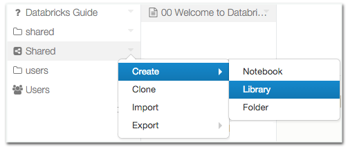
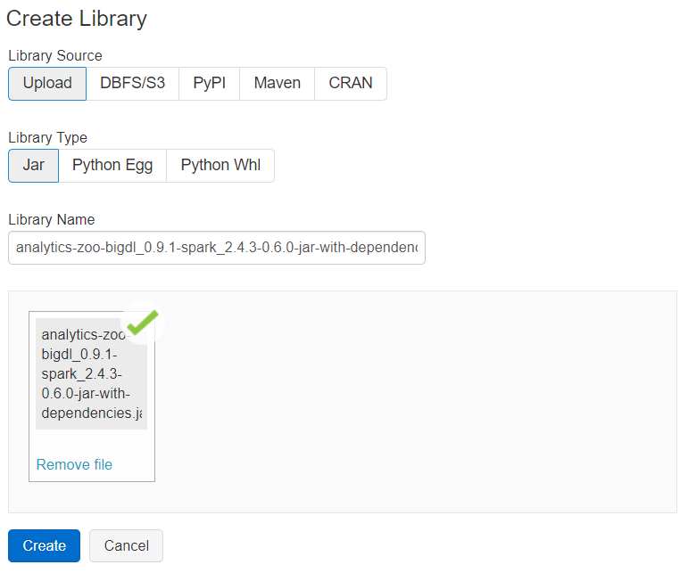
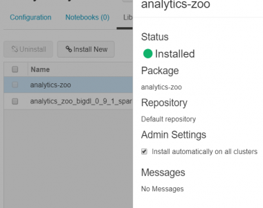
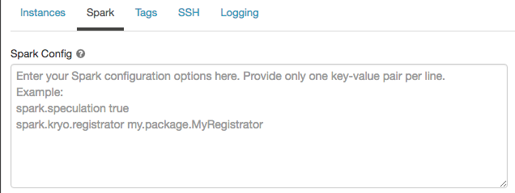
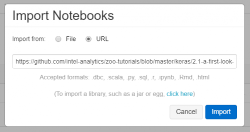

Databricks is a fast Apache Spark based big data analysis platform. Analytics Zoo program can run easily on Databricks spark cluster for distributed training or inference. This guide will introduce how to prepare Analytics Zoo environment as well as starting an Analytics Zoo notebook on Databricks.

- [Prerequisites](#Prerequisites)
- [Installing Analytics Zoo libraries](#Installing-Analytics-Zoo-libraries)
- [Setting Spark configuration](#Setting-Spark-configuration)
- [Running Analytics Zoo notebook on Databricks](#Running-Analytics-Zoo-notebook-on-Databricks)

### **Prerequisites**

Before you start this guide, make sure a Databricks workspace is ready and a cluster is created using the Databricks UI.

1. Create either [AWS Databricks](https://docs.databricks.com/getting-started/try-databricks.html)  workspace or [Azure Databricks](https://docs.microsoft.com/en-us/azure/azure-databricks/) workspace.
2. Create Databricks [clusters](https://docs.databricks.com/clusters/create.html) using the UI. Choose Databricks runtime version. This guide is tested on Runtime 5.5 LTS (includes Apache Spark 2.4.3, Scala 2.11).

### **Installing Analytics Zoo libraries**  

1. Install libraries. Right-click the Workspace folder. Select **Create > Library**.

 

2. Install Analytics Zoo python environment using PyPI. 

 

3. Install Analytics Zoo prebuilt jar package. Download Analytics Zoo prebuilt release package from the [Release Page](https://analytics-zoo.github.io/master/#release-download/). Please note that you should choose the same spark version of package as your Databricks runtime version. Unzip it. Find the jar named "analytics-zoo-bigdl_*-spark_*-jar-with-dependencies.jar" in the lib directory. Drop the jar on Databricks.

 

4. Make sure the jar file and analytics-zoo installed using PyPI are installed on all clusters. In **Libraries** tab of your cluster, check installed libraries and click “Install automatically on all clusters” option in **Admin Settings**.



### **Setting Spark configuration**

On the cluster configuration page, click the **Advanced Options** toggle. Click the **Spark** tab. You can provide custom [Spark configuration properties](https://spark.apache.org/docs/latest/configuration.html) in a cluster configuration. Please set it according to your cluster resource and program needs.  



See below for an example of Spark config setting needed by Analytics Zoo. Here it sets 1 core and 6g memory per executor and driver. Note that "spark.cores.max" needs to be properly set below.

```
spark.shuffle.reduceLocality.enabled false
spark.serializer org.apache.spark.serializer.JavaSerializer
spark.shuffle.blockTransferService nio
spark.databricks.delta.preview.enabled true
spark.executor.cores 1
spark.executor.memory 6g
spark.speculation false
spark.driver.memory 6g
spark.scheduler.minRegisteredResourcesRatio 1.0
spark.cores.max 4
spark.driver.cores 1
```

### **Running Analytics Zoo notebook on Databricks**

Open a new notebook. First call `init_nncontext()` at the beginning of your code. This will create a SparkContext with optimized performance configuration and initialize the BigDL engine. 

```python
from zoo.common.nncontext import*
sc = init_nncontext()
```

Output on Databricks:

```
Prepending /databricks/python/lib/python3.6/site-packages/bigdl/share/conf/spark-bigdl.conf to sys.path
Adding /databricks/python/lib/python3.6/site-packages/zoo/share/lib/analytics-zoo-bigdl_0.9.1-spark_2.4.3-0.6.0-jar-with-dependencies.jar to BIGDL_JARS
Prepending /databricks/python/lib/python3.6/site-packages/zoo/share/conf/spark-analytics-zoo.conf to sys.path
```

If you would like to run a completed Analytics Zoo notebook, you can import an Analytics Zoo notebook from a URL directly. 


For example, you may import a simple [Analytics Zoo tutorials notebook](https://github.com/intel-analytics/zoo-tutorials/blob/master/keras/2.1-a-first-look-at-a-neural-network.ipynb).



Note the above notebook runs on Spark local default; to make it run on Databricks cluster, please change the first Python cell in the notebook to:

```python
from zoo.common.nncontext import*
sc = init_nncontext()
```

