You can start BigDL with BigDL Amazon Machine Images (AMI).

---
## **AWS Marketplace AMI**

The easiest way to get started with BigDL is to launch the pre-configured BigDL Amazon Machine Image (AMI) from the AWS Marketplace. The AMI includes Apache Spark, BigDL, Python and Anaconda with ready-to-run Jupyter Notebooks. Within a few minutes you can run python code and investigate the architecture it uses to create an image recognition model. Upload your own data into one of the sample notebooks and you can try BigDL with your own data. 
 
To use the BigDL AMI in the AWS Marketplace, visit [https://aws.amazon.com/marketplace/] and search for 'BigDL'. Launch the AMI by clicking the "Continue to Subscribe" button from the BigDL Product Page. The software stack is free and open source. You only pay standard AWS charges. Because it includes Apache Spark, a t2.large instance is the minimum size recommended to run this BigDL AMI. Once you launch the AMI, type the domain name (URL) and port 8888 (ex: ec2-xxx-xxx-xxx-xxx.compute-1.amazonaws.com:8888) into your favorite web browser. The password for the Jupyter Notebook, which runs automatically, is the Instance ID (ex: i-08ba9c6fcdea6388f) of your EC2 Instance which you can find in your EC2 Dashboard [https://console.aws.amazon.com/ec2/v2/home]. 

If you ssh into your EC2 instance, you can use "docker ps" (ex: docker ps -a) to find the container id, and "docker exec -it <container-id> bash" to see what is installed. Use git to download additional notebooks to the /work directory (ex: "$ git clone github.com/intel-analytics/BigDL-Tutorial". Additional Jupyter Notebooks can be found at [https://github.com/intel-analytics/BigDL-Tutorials]

### **Detailed Instructions**
#### Login to the AWS Console & go to ec2 dashboard
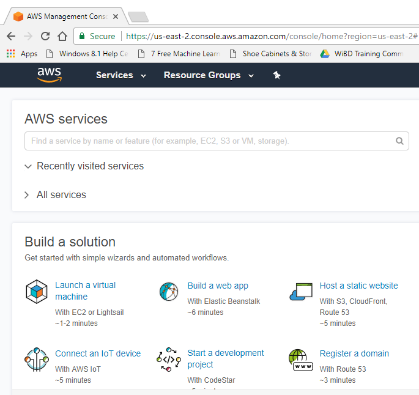 
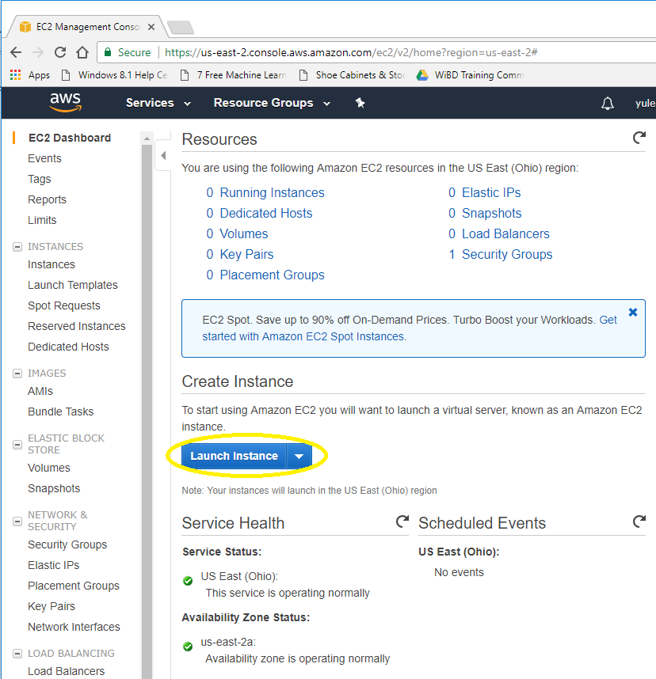 
#### Find BIGDL AMI in the Marketplace
To choose AMI, select AWS Marketplace, search “BigDL”
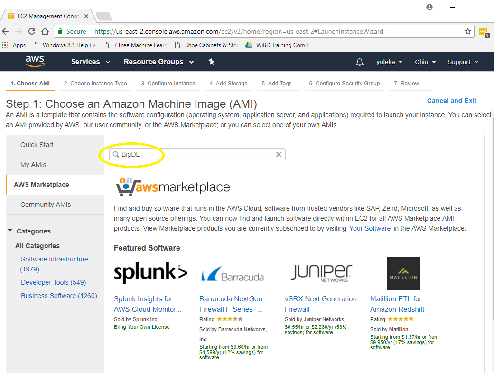 
#### Select BigDL with Apache Spark
 
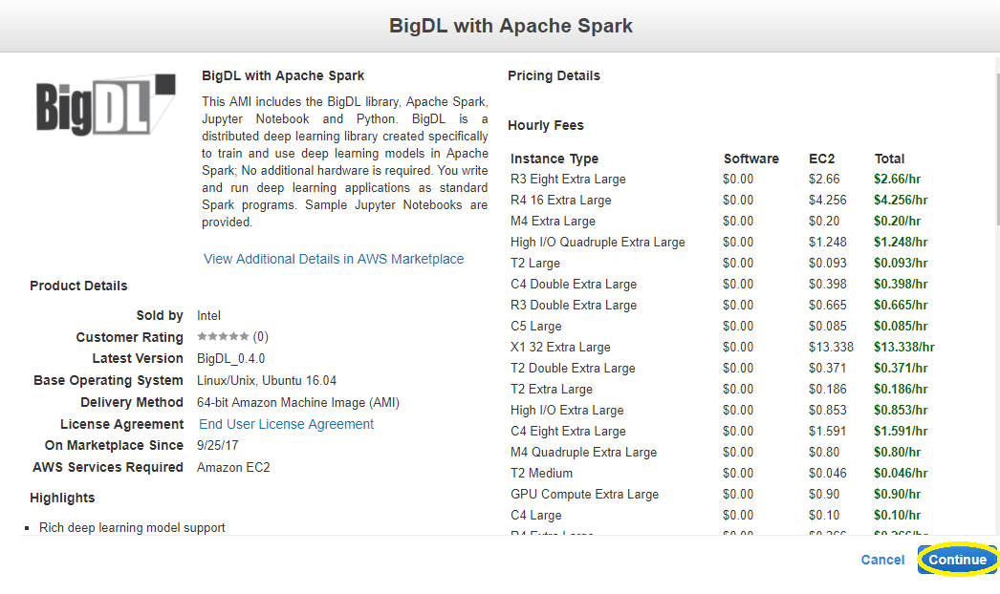 
#### Choosing and configuring instance
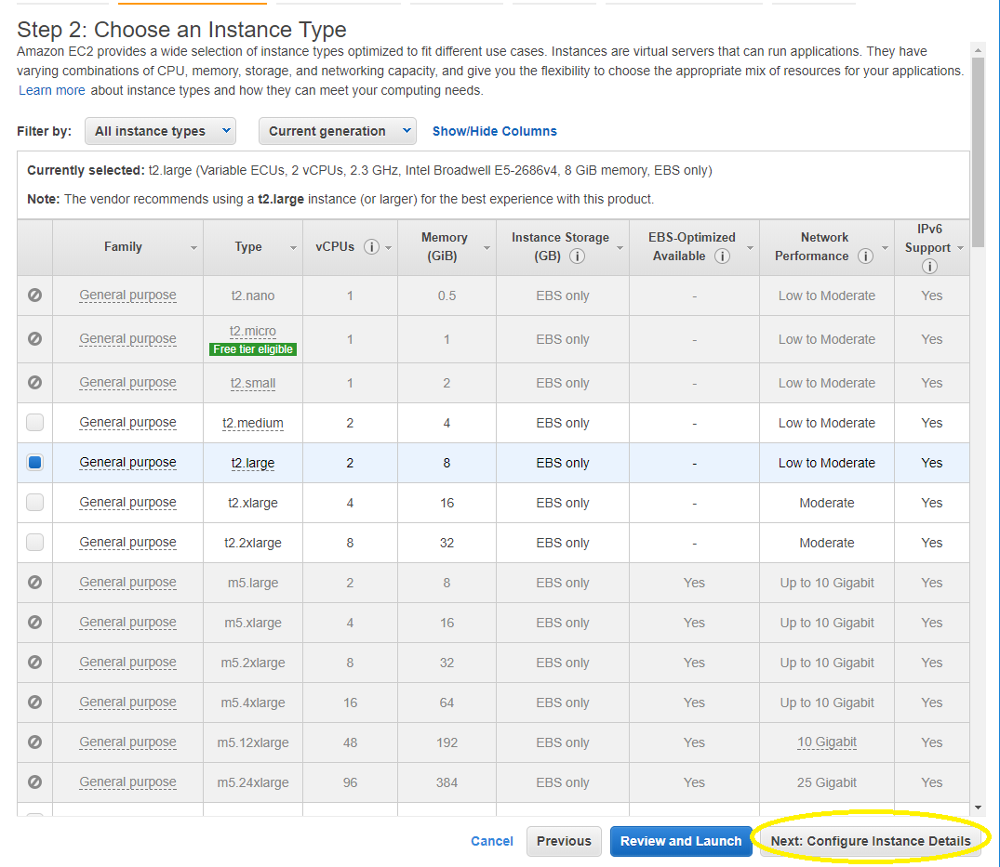 
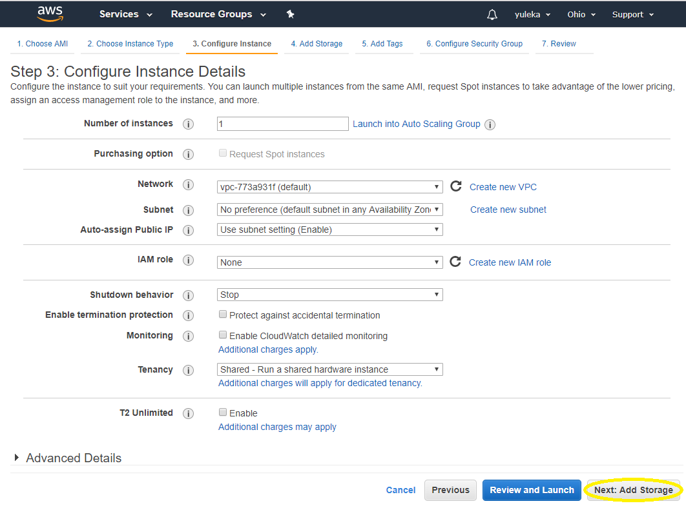 
#### Add storage and tags
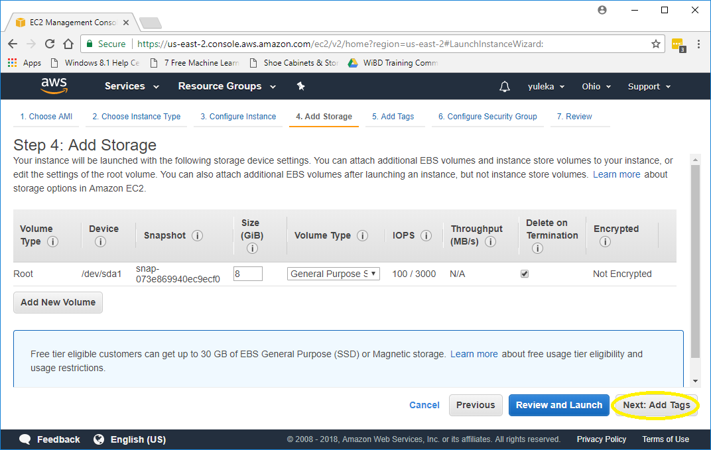 
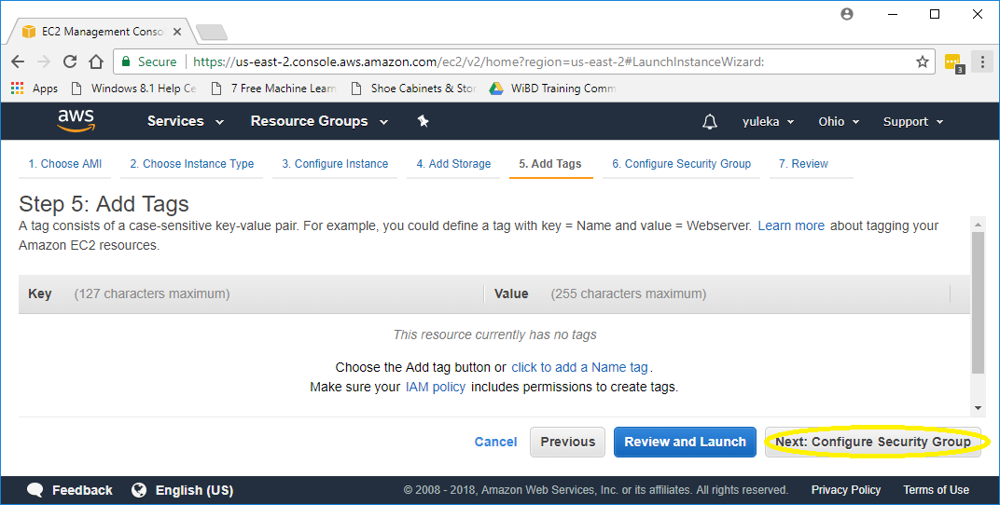 
#### Configure Security Group
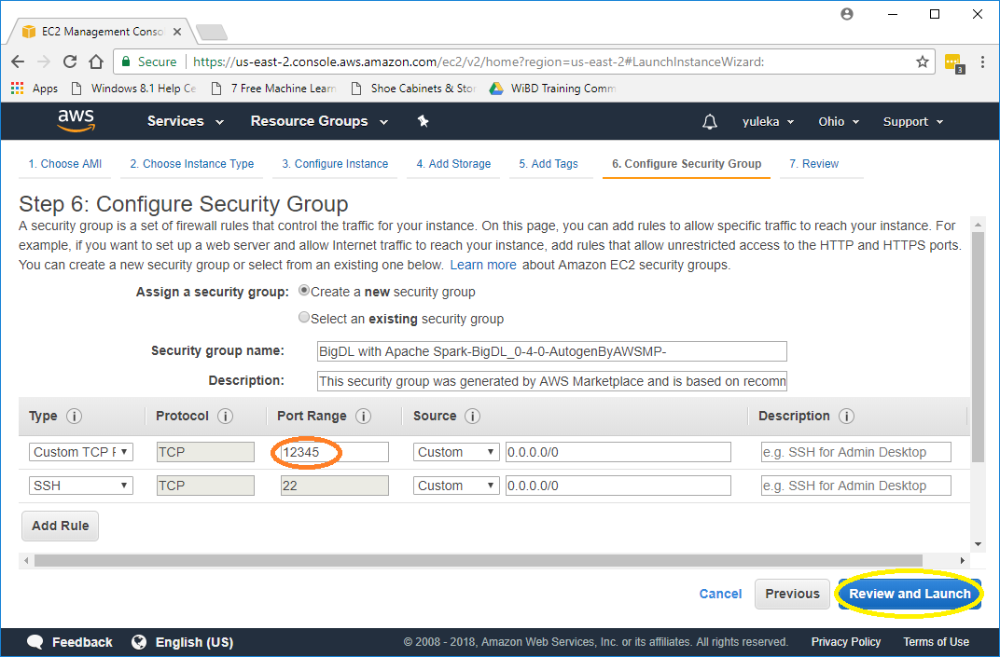 
#### Review and Launch
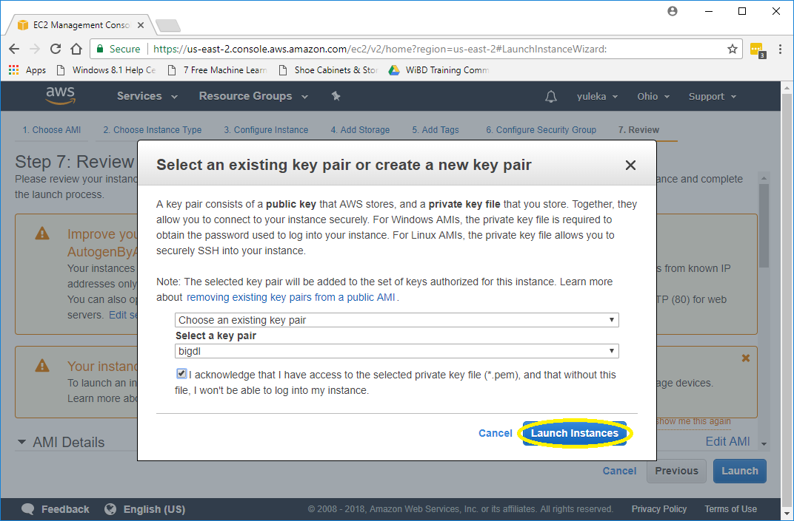 
#### Click the instance
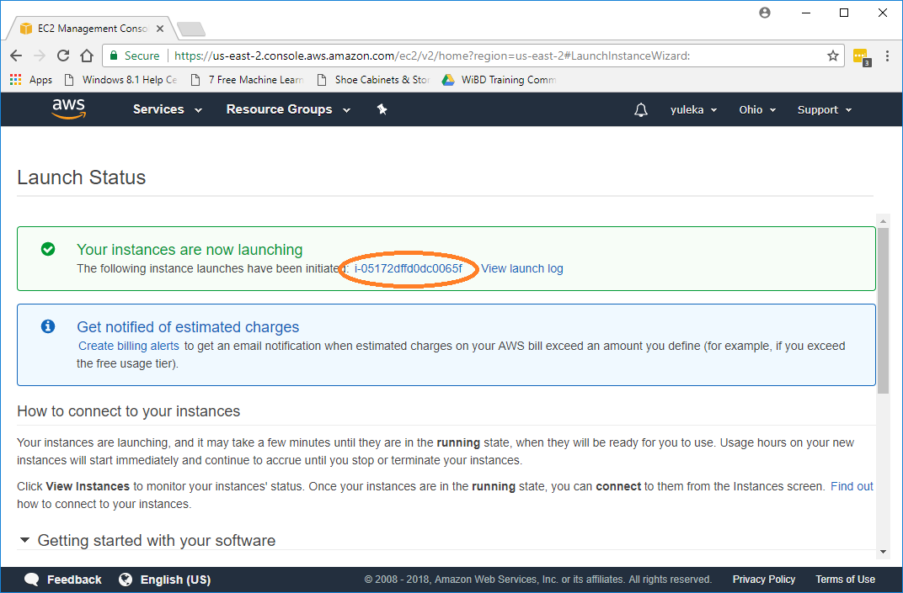 
#### When the status is running, copy the ip
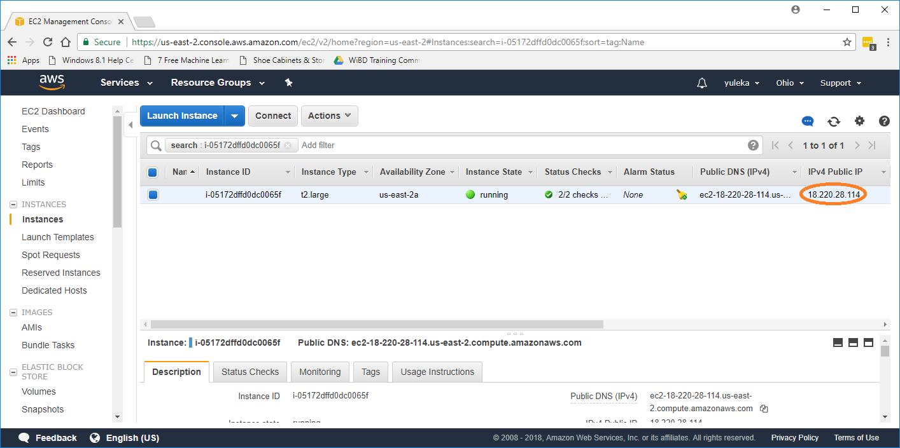 
#### Open it via a web browser with http://[ip]:12345
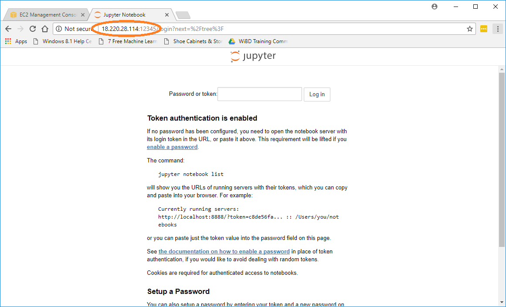 
#### Login the notebook with the instance ID
Copy the instance ID from dashboard and paste it as a password/token
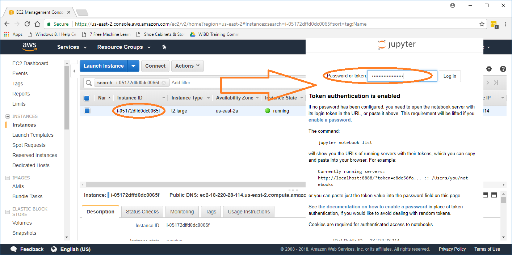
#### Have fun and build with BigDL!
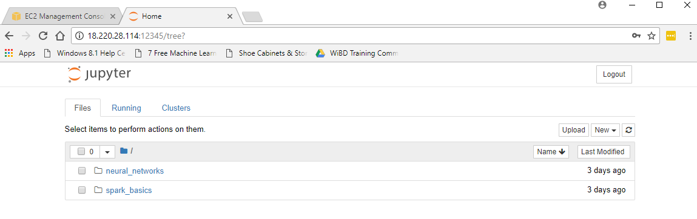 

---
## **The Public AMI**

To make it easier to try out BigDL examples on Spark using EC2, a public AMI is provided. It will automatically retrieve the latest BigDL package, download the necessary input data, and then run the specified BigDL example (using Java 8 on a Spark cluster). The details of the public AMI are shown in the table below.

|BigDL version |AMI version|Date        |AMI ID      |AMI Name          |Region               |Status    |
|--------------|-----------|------------|------------|----------------- |---------------------|----------|
|master        |0.2S       |Mar 13, 2017|ami-37b73957|BigDL Client 0.2S |US West (Oregon)     |Active    |
|master        |0.2S       |Apr 10, 2017|ami-8c87099a|BigDL Client 0.2S |US East (N. Virginia)|Active    |
|0.1.0         |0.1.0      |Apr 10, 2017|ami-9a8818fa|BigDL Client 0.1.0|US West (Oregon)     |Active    |
|0.1.0         |0.1.0      |Apr 10, 2017|ami-6476f872|BigDL Client 0.1.0|US East (N. Virginia)|Active    |


Please note that it is highly recommended to run BigDL using EC2 instances with Xeon E5 v3 or v4 processors.

After launching the AMI on EC2, please log on to the instance and run a "bootstrap.sh" script to download example scripts.

```bash
./bootstrap.sh
```

---
## **Before you start**

Before running the BigDL examples, you need to launch a Spark cluster on EC2 (you may refer to [https://github.com/amplab/spark-ec2](https://github.com/amplab/spark-ec2) for more instructions). In addition, to run the Inception-v1 example, you also need to start a HDFS cluster on EC2 to store the input image data.

---
## **Run BigDL Examples**


You can run BigDL examples using the `run.example.sh` script in home directory of your BigDL Client instance (e.g. `/home/ubuntu/`) with the following parameters:

* Mandatory parameters:
  
    * `-m|--model` which model to train, including
    
        * lenet: train the [LeNet](https://github.com/intel-analytics/BigDL/tree/master/spark/dl/src/main/scala/com/intel/analytics/bigdl/models/lenet) example
    
        * vgg: train the [VGG](https://github.com/intel-analytics/BigDL/tree/master/spark/dl/src/main/scala/com/intel/analytics/bigdl/models/vgg) example

        * inception-v1: train the [Inception v1](https://github.com/intel-analytics/BigDL/tree/master/spark/dl/src/main/scala/com/intel/analytics/bigdl/models/inception) example

        * perf: test the training speed using the [Inception v1](https://github.com/intel-analytics/BigDL/blob/master/spark/dl/src/main/scala/com/intel/analytics/bigdl/models/inception/Inception_v1.scala) model with dummy data

    * `-s|--spark-url` the master URL for the Spark cluster

    * `-n|--nodes` number of Spark slave nodes

    * `-o|--cores` number of cores used on each node

    * `-r|--memory` memory used on each node, e.g. 200g

    * `-b|--batch-size` batch size when training the model; it is expected to be a multiple of "nodes * cores"

    * `-f|--hdfs-data-dir` HDFS directory for the input images (for the "inception-v1" model training only)

* Optional parameters:

    * `-e|--max-epoch` the maximum number of epochs (i.e., going through all the input data once) used in the training; default to 90 if not specified

    * `-p|--spark` by default the example will run with Spark 1.5 or 1.6; to use Spark 2.0, please specify "spark_2.0" here (it is highly recommended to use _**Java 8**_ when running BigDL for Spark 2.0, otherwise you may observe very poor performance)

    * `-l|--learning-rate` by default the the example will use an initial learning rate of "0.01"; you can specify a different value here

After the training, you can check the log files and generated models in the home directory (e.g., `/home/ubuntu/`).  


---
## **Run the "inception-v1" example**

You can refer to the [Inception v1](https://github.com/intel-analytics/BigDL/tree/master/spark/dl/src/main/scala/com/intel/analytics/bigdl/models/inception) example to prepare the input [ImageNet](http://image-net.org/index) data here. Alternatively, you may also download just a small set of images (with dummy labels) to run the example as follows, which can be useful if you only want to try it out to see the training speed on a Spark cluster.

 * Download and prepare the input image data (a subset of the [Flickr Style](http://sergeykarayev.com/files/1311.3715v3.pdf) data)

```bash
  ./download.sh $HDFS-NAMENODE
```

  After the download completes, the downloaded images are stored in `hdfs://HDFS-NAMENODE:9000/seq`. (If the download fails with error "Unable to establish SSL connection." please check your network connection and retry this later.)

 * To run the "inception-v1" example on a 4-worker Spark cluster (using, say, the "m4.10xlarge" instance), run the example command below: 

```
  nohup bash ./run.example.sh --model inception-v1  \
         --spark-url spark://SPARK-MASTER:7077    \
         --nodes 4 --cores 20 --memory 150g       \
         --batch-size 400 --learning-rate 0.0898  \
         --hdfs-data-dir hdfs://HDFS-NAMENODE:9000/seq \
         --spark spark_2.0 --max-epoch 4 \
         > incep.log 2>&1 &     
```

* View output of the training in the log file generated by the previous step:
```bash
  $ tail -f incep.log
  2017-01-10 10:03:55 INFO  DistriOptimizer$:241 - [Epoch 1 0/5000][Iteration 1][Wall Clock XXX] Train 512 in XXXseconds. Throughput is XXX records/second. Loss is XXX.
  2017-01-10 10:03:58 INFO  DistriOptimizer$:241 - [Epoch 1 512/5000][Iteration 2][Wall Clock XXX] Train 512 in XXXseconds. Throughput is XXX records/second. Loss is XXX.
  2017-01-10 10:04:00 INFO  DistriOptimizer$:241 - [Epoch 1 1024/5000][Iteration 3][Wall Clock XXX] Train 512 in XXXseconds. Throughput is XXX records/second. Loss is XXX.
  2017-01-10 10:04:03 INFO  DistriOptimizer$:241 - [Epoch 1 1536/5000][Iteration 4][Wall Clock XXX] Train 512 in XXXseconds. Throughput is XXX records/second. Loss is XXX.
  2017-01-10 10:04:05 INFO  DistriOptimizer$:241 - [Epoch 1 2048/5000][Iteration 5][Wall Clock XXX] Train 512 in XXXseconds. Throughput is XXX records/second. Loss is XXX.
```  

---
## **Run the "perf" example**

To run the "perf" example on a 4-worker Spark cluster (using, say, the "m4.10xlarge" instance), you may try the example command below: 

```bash
  nohup bash ./run.example.sh --model perf  \
       --spark-url spark://SPARK-MASTER:7077    \
       --nodes 4 --cores 20 --memory 150g       \
       --spark spark_2.0 --max-epoch 4 \
       > perf.log 2>&1 &
```
