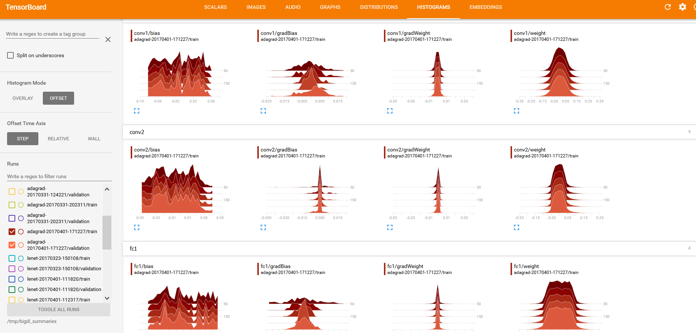
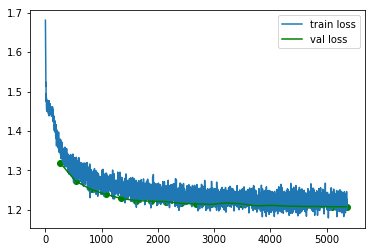

## Generating Summary
To enable visualization support, you need first properly configure to collect statistics summary in different stages of training. It should be done before the training starts. See examples below: 

### Generating summary in NNEstimator

**scala**
```scala
val estimator = NNEstimator(...)
...
val logdir = "mylogdir"
val appName = "myapp"
val trainSummary = TrainSummary(logdir, appName)
val validationSummary = ValidationSummary(logdir, appName)
estimator.setTrainSummary(trainSummary)
estimator.setValidationSummary(validationSummary)
...
val nnModel = estimator.fit(...)
```

**python**
```python
from bigdl.optim.optimizer import TrainSummary, ValidationSummary

estimator = NNEstimator(...)
...
log_dir = 'mylogdir'
app_name = 'myapp'
train_summary = TrainSummary(log_dir=log_dir, app_name=app_name)
val_summary = ValidationSummary(log_dir=log_dir, app_name=app_name)
estimator.set_train_summary(train_summary)
estimator.set_val_summary(val_summary)
...
nnModel = estimator.fit(...)
```
### Generating summary in Keras API  

**scala**
```scala
val model = [...new keras model]
...
val logdir = "mylogdir"
val appName = "myapp"
model.setTensorBoard(logdir, appName)
...
model.fit(...)
```

**python**
```python
model = [...new keras model]
...
log_dir = 'mylogdir'
app_name = 'myapp'
model.set_tensorboard(log_dir, app_name)
...
model.fit(...)
```

### Generating summary in KerasModel
**python**
```python
import tensorflow as tf
from zoo.tfpark import KerasModel
from bigdl.optim.optimizer import TrainSummary, ValidationSummary

model = [...new keras model]
model = KerasModel(model)
...
log_dir = 'mylogdir'
app_name = 'keras_model'
model.set_train_summary(TrainSummary(log_dir, app_name))
model.set_val_summary(ValidationSummary(log_dir, app_name))
...
model.fit(...)
```

### Generating summary in TFEstimator
**python**
```python
from zoo.tfpark.estimator import TFEstimator
from bigdl.optim.optimizer import TrainSummary, ValidationSummary

estimator = TFEstimator(...)
...
log_dir = 'mylogdir'
app_name = 'estimator'
estimator.set_train_summary(TrainSummary(log_dir, app_name))
estimator.set_val_summary(ValidationSummary(log_dir, app_name))
...
estimator.train(...)
```

**Notice**:  

If logdir is relative path, like `logdir/inpcetion_log`, the log will be stored in your local file system;  

If logdir is absolute path started with `/`, like `/user/logdir/inpcetion_log`, the log will be stored in your local file system;  

If logdir is URI started with `hdfs://[host:port]/`, like `hdfs://172.168.0.101:8020/user/logdir/inpcetion_log`, the log will be stored to HDFS;  

---

# Visualizing training with TensorBoard
With the summary info generated, we can then use [TensorBoard](https://pypi.python.org/pypi/tensorboard) to visualize the behaviors of the training program.  

### *Installing TensorBoard*

Prerequisites:

1. Python verison: 2.7, 3.4, 3.5, or 3.6
2. Pip version >= 9.0.1
3. tensorflow 1.13.1

### *Launching TensorBoard*

#### Loading from local directory

You can launch TensorBoard using the command below:
```bash
tensorboard --logdir=[logdir path]
```
After that, navigate to the TensorBoard dashboard using a browser. You can find the URL in the console output after TensorBoard is successfully launched; by default the URL is http://your_node:6006

#### Loading from HDFS

If the logdir is a HDFS folder, you need to configure the HDFS environment before running `tensorboard`.  
Prerequisites:
1. JDK >= 1.8, Orcale JDK recommended 
2. Hadoop >= 2.7

Set env before running `tensorboard`:
```
export JAVA_HOME=[your java home path]
export HADOOP_HOME=[your hadoop home path]
source ${HADOOP_HOME}/libexec/hadoop-config.sh
export LD_LIBRARY_PATH=${LD_LIBRARY_PATH}:${JAVA_HOME}/jre/lib/amd64/server
```
If the Hadoop cluster is in secure mode, also set the environment variable `KRB5CCNAME`:
```
export KRB5CCNAME={Path of Kerberos ticket cache file}
```
Run tensorboard, for example:
```
CLASSPATH=$(${HADOOP_HOME}/bin/hadoop classpath --glob) tensorboard --logdir=hdfs://[ip:port]/[hdfs path]
```


### *Visualizations in TensorBoard*

Within the TensorBoard dashboard, you will be able to read the visualizations of each run, including the “Loss” and “Throughput” curves under the SCALARS tab (as illustrated below):


And “weights”, “bias”, “gradientWeights” and “gradientBias” under the DISTRIBUTIONS and HISTOGRAMS tabs (as illustrated below):


As getting DISTRIBUTIONS and HISTOGRAMS may affect the training performance, so we don't enable this option by default. For example you want to fetch this parameters every 20 iteartions, you should call `trainSummary.setSummaryTrigger("Parameters", Trigger.severalIteration(20))`(`set_summary_trigger` in python API) before calling `setTrainSummary`.

---

## Retrieving summary from build-in API

You can use provided API to retrieve the summaries into readable format, and export them to other tools for further analysis or visualization.

* _**Example: Reading summary info in NNestimator**_ 

**scala**
```scala
val estimator = NNEstimator(...)
...
val logdir = "mylogdir"
val appName = "myapp"
val trainSummary = TrainSummary(logdir, appName)
val validationSummary = ValidationSummary(logdir, appName)
estimator.setTrainSummary(trainSummary)
estimator.setValidationSummary(validationSummary)
...
val nnModel = estimator.fit(...)
val trainLoss = trainSummary.readScalar("Loss")
val valLoss = validationSummary.readScalar("Loss")
```

**python**
```python
from bigdl.optim.optimizer import TrainSummary, ValidationSummary

estimator = NNEstimator(...)
...
log_dir = 'mylogdir'
app_name = 'myapp'
train_summary = TrainSummary(log_dir=log_dir, app_name=app_name)
val_summary = ValidationSummary(log_dir=log_dir, app_name=app_name)
estimator.set_train_summary(train_summary)
estimator.set_val_summary(val_summary)
...
train_loss = np.array(train_summary.read_scalar('Loss'))
val_loss = np.array(val_summary.read_scalar('Loss'))
```
* _**Example: Reading summary info in keras API**_

**scala**
```scala
val trainLoss = model.getTrainSummary("loss")
val valLoss = model.getValidationSummary("loss")
```
**python**
```python
train_loss = model.get_train_summary('loss')
val_loss = model.get_validation_summary('loss')
```


If your training job has finished and existed, but a new program wants retrieving summary with `readScalar`(`read_scalar` in python) API. 
You can re-create the TrainingSummary and ValidationSummary with the same `logDir` and `appName` in your new job. 


---

## Visualizing training with Jupyter notebook

If you're using Jupyter notebook, you can also draw the training curves using popular plotting tools (e.g. matplotlib) and show the plots inline. 

First, retrieve the summaries as instructed in [Retrieve Summary](#retrieving-summary-from-build-in-api). The retrieved summary is a list of tuples. Each tuple is a recorded event in format (iteration count, recorded value, timestamp). You can convert it to numpy array or dataframe to plot it. See example below:  

* _**Example: Plot the train/validation loss in Jupyter**_

```python
#retrieve train and validation summary object and read the loss data into ndarray's. 
loss = np.array(train_summary.read_scalar("Loss"))
val_loss  = np.array(val_summary.read_scalar("Loss"))

#plot the train and validation curves
# each event data is a tuple in form of (iteration_count, value, timestamp)
plt.plot(loss[:,0],loss[:,1],label='train loss')
plt.plot(val_loss[:,0],val_loss[:,1],label='val loss',color='green')
plt.scatter(val_loss[:,0],val_loss[:,1],color='green')
plt.legend();
```
 


