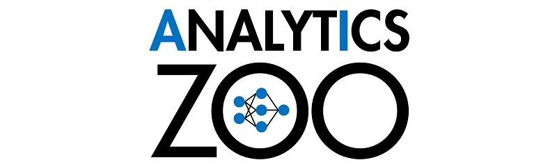
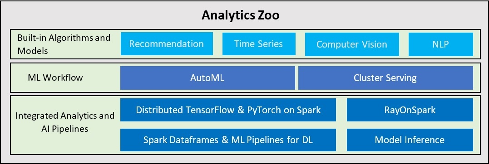

 

_A unified Data Analytics and AI platform for **distributed TensorFlow, Keras, PyTorch, Apache Spark/Flink and Ray**_

---

#  What is Analytics Zoo? 

Analytics Zoo provides a unified data analytics and AI platform that seamlessly unites TensorFlow, Keras, PyTorch, Spark, Flink and Ray programs into an integrated pipeline, which can transparently scale from a laptop to large clusters to process production big data.

 

* **Integrated Analytics and AI Pipelines** for easily prototyping and deploying end-to-end AI applications. 
    * Write [TensorFlow](https://analytics-zoo.github.io/master/#ProgrammingGuide/tensorflow/#tfpark-api) or [PyTorch](https://analytics-zoo.github.io/master/#ProgrammingGuide/pytorch/) inline with Spark code for distributed training and inference.
    * Native deep learning (TensorFlow/Keras/PyTorch/BigDL) support in [Spark ML](https://analytics-zoo.github.io/master/#ProgrammingGuide/nnframes) Pipelines.
    * Directly run Ray programs on big data cluster through [RayOnSpark](https://analytics-zoo.github.io/master/#ProgrammingGuide/rayonspark/). 
    * Plain Java/Python APIs for (TensorFlow/PyTorch/BigDL/OpenVINO) [Model Inference](https://analytics-zoo.github.io/master/#ProgrammingGuide/inference). 

* High-Level **ML Workflow** that automates the process of building large-scale machine learning applications.
    * Automatically distributed [Cluster Serving](https://analytics-zoo.github.io/master/#ClusterServingGuide/ProgrammingGuide) (for TensorFlow/PyTorch/Caffe/BigDL/OpenVINO models) with a simple pub/sub API. 
    * Scalable [AutoML](https://github.com/intel-analytics/analytics-zoo/blob/automl/pyzoo/zoo/automl/README.md) for time series prediction (that automatically generates features, selects models and tunes hyperparameters).

* **Built-in Algorithms and Models** for [Recommendation](https://analytics-zoo.github.io/master/#APIGuide/Models/recommendation/), [Time Series](https://analytics-zoo.github.io/master/#APIGuide/Models/anomaly-detection/), [Computer Vision](https://analytics-zoo.github.io/master/#APIGuide/Models/object-detection/) and [NLP](https://analytics-zoo.github.io/master/#APIGuide/Models/seq2seq/) applications.

---

# Why use Analytics Zoo? 

You may want to develop your AI solutions using Analytics Zoo if:

* You want to easily prototype the entire end-to-end pipeline that applies AI models (e.g., TensorFlow, Keras, PyTorch, BigDL, OpenVINO, etc.) to production big data.
* You want to transparently scale your AI applications from a laptop to large clusters with "zero" code changes.
* You want to deploy your AI pipelines to existing YARN or K8S clusters *WITHOUT* any modifications to the clusters.
* You want to automate the process of applying machine learning (such as feature engineering, hyperparameter tuning, model selection and distributed inference). 

---

# How to use Analytics Zoo? 

* Quick start with Analytics Zoo using the pre-built [Docker Image](https://analytics-zoo.github.io/master/#DockerUserGuide/index).
* Refer to the [Python](https://analytics-zoo.github.io/master/#PythonUserGuide/install/) and [Scala](https://analytics-zoo.github.io/master/#ScalaUserGuide/install/) installation guides to install Analytics Zoo.
* Visit the [Document Website](https://analytics-zoo.github.io/) for more information on Analytics Zoo.
* Check the [Powered By](https://analytics-zoo.github.io/master/#powered-by/) & [Presentations](https://analytics-zoo.github.io/master/#presentations/) pages for real-world applications using Analytics Zoo.
* Join the [Google Group](https://groups.google.com/forum/#!forum/bigdl-user-group) (or subscribe to the [Mail List](mailto:bigdl-user-group+subscribe@googlegroups.com)) for more questions and discussions on Analytics Zoo.

