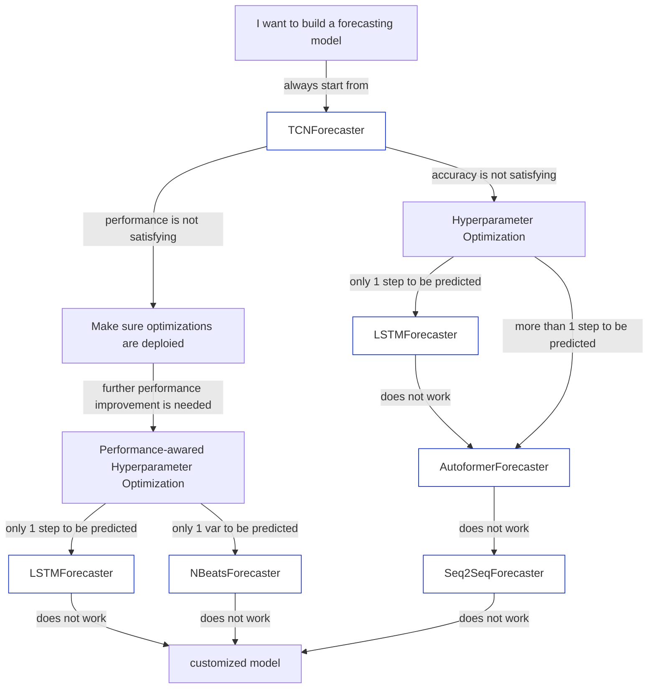

# Choose proper forecasting model

How to choose a forecasting model among so many built-in models (or build one by yourself) in Chronos? That's a common question when users want to build their first forecasting model. Different forecasting models are more suitable for different data and different metrics(accuracy or performances).

The flowchart below is designed to guide our users which forecasting model to try on your own data. Click on the blocks in the chart below to see its documentation/examples.

