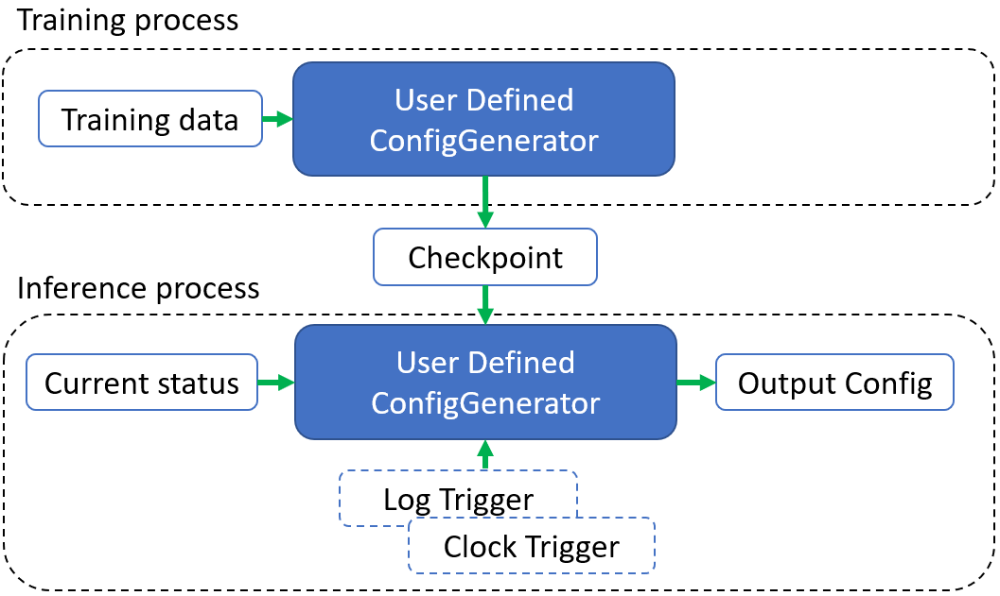

# Artificial Intelligence for IT operations (AIOps)

Chronos provides a template(i.e., `ConfigGenerator`) as an easy-to-use builder for an AIOps decision system with the usage of `Trigger`.

## How does it work

AIOps application typically relies on a decision system with one or multiple AI models. Generally, this AI system needs to be trained with some training data with a self-defined checkpoint. When using the AI system, we first initialize it throught previously trained checkpoint and inform the AI system with current status to get the suggested configuration.



Sometimes the AI system need to be informed some **timely** information (e.g., some events in log or some monitoring data every second). Chronos also defines some triggers for this kind of usage.

## Define ConfigGenerator

### Start from a trivial ConfigGenerator
Chronos provides `bigdl.chronos.aiops.ConfigGenerator` as a template for users to define their own AIOps AI system. Following is a "hello-world" case.

```python
class MyConfigGenerator(ConfigGenerator):
    def __init__(self):
        super().__init__()
        self.best_config = [3.0, 1.6]

    def genConfig(self):
        return self.best_config
```

For this self-defined `MyConfigGenerator`, we keep generate a fixed best config with out considering current status. This could be a startpoint or smoke test configgenerator for your system. The whole system even do not need to be trained.

### Add AI Model to ConfigGenerator
Any model could be used in `ConfigGenerator`, to name a few, sklearn, pytorch or tensorflow models are all valid. Following is a normal flow you may want to add your model.

```python
class MyConfigGenerator(ConfigGenerator):
    def __init__(self, path):
        super().__init__()
        self.model = load_model_from_checkpoint(path)

    def genConfig(self, current_status):
        return self.model(current_status)

    @staticmethod
    def train(train_data, path):
        train_model_and_save_checkpoint(train_data, path)
```

- In `MyConfigGenerator.train`, users will define the way to train their model and save to a specific path.
- In `MyConfigGenerator.__init__`, users will define the way to load the trained checkpoint.
- In `MyConfigGenerator.genConfig`, users will define the way to use the loaded model to do the prediction and get the suggested config.

Please refer to [ConfigGenerator API doc](../../PythonAPI/Chronos/aiops.html) for detailed information.

#### Use Chronos Forecaster/Anomaly detector
Chronos also provides some out-of-box forecasters and anomaly detectors for time series data for users to build their AIOps use-case easier.

Please refer to [Forecaster User Guide](./forecasting.html) and [Anomaly Detector User Guide](./anomaly_detection.html) for detailed information.

### Use trigger in ConfigGenerator
Sometimes the AI system need to be informed some **timely** information (e.g., some events in log or some monitoring data every second). Chronos also defines some triggers for this kind of usage. Following is a trivial case to help users understand what a `Trigger` can do. 

```python
class MyConfigGenerator(ConfigGenerator):
    def __init__(self):
        self.sweetpoint = 1
        super().__init__()

    def genConfig(self):
        return self.sweetpoint

    @triggerbyclock(2)
    def update_sweetpoint(self):
        self.sweetpoint += 1
```

In this case, once the `MyConfigGenerator` is initialized, `update_sweetpoint` will be called every 2 seconds, users will thus get an evolving ConfiguGenerator.

```python
mycg = MyConfigGenerator(1)
time.sleep(2)
assert mycg.genConfig() == 2
time.sleep(2)
assert mycg.genConfig() == 3
```

This trivial case may seem useless, but with a dedicated `update_sweetpoint`, such as get the CPU utils every second, users could bring useful information to their ConfigGenerator and make better decision with easy programming.

Please refer to [Trigger API doc](../../PythonAPI/Chronos/aiops.html) for detailed information.