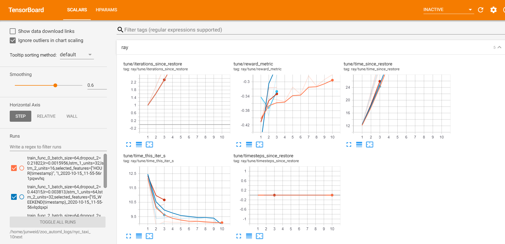
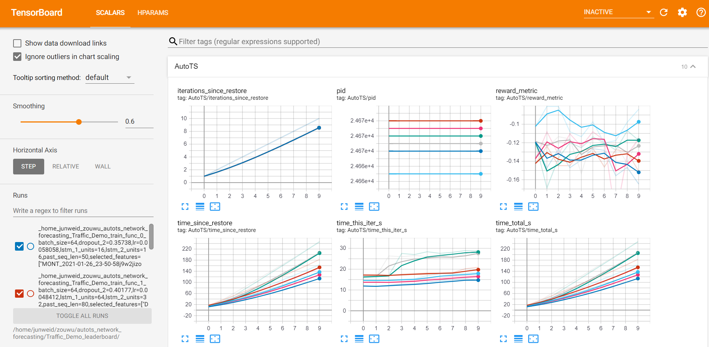
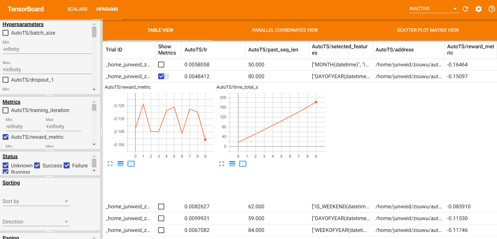

# Chronos User Guide

### **1 Overview**
_Chronos_ is an application framework for building large-scale time series analysis applications.

You can use _Chronos_ to do:

- **Data pre/post-processing and feature generation** (using [TSDataset](#data-processing-and-feature-engineering))
- **Time Series Forecasting** (using [Standalone Forecasters](#use-standalone-forecaster-pipeline), [Auto Models](#use-auto-forecasting-model) (with HPO) or [AutoTS](#use-autots-pipeline) (full AutoML enabled pipelines))
- **Anomaly Detection** (using [Anomaly Detectors](#anomaly-detection))
- **Synthetic Data Generation** (using [Simulators](#generate-synthetic-data))

---
### **2 Install**

Install `bigdl-chronos` and with target `[all]` to install the additional dependencies for _Chronos_. 

```bash
conda create -n my_env python=3.7
conda activate my_env
# stable version
pip install --upgrade bigdl-chronos[all]
# nightly built version
pip install --pre --upgrade bigdl-chronos[all]
```
---
### **3 Run**

_Chronos_ uses [Orca](../../Orca/Overview/orca.md) to enable distributed training and AutoML capabilities. Initial orca as below when you want to:

1. Use the distributed mode of a forecaster.
2. Use automl to distributedly tuning your model.
3. Use `XshardsTSDataset` to process time series dataset in distribution fashion.

Otherwise, there is no need to initialize an orca context.

View [Orca Context](../../Orca/Overview/orca-context.md) for more details. Note that argument `init_ray_on_spark` must be `True` for _Chronos_. 

```python
from bigdl.orca.common import init_orca_context, stop_orca_context

# run in local mode
init_orca_context(cluster_mode="local", cores=4, init_ray_on_spark=True)
# run on K8s cluster
init_orca_context(cluster_mode="k8s", num_nodes=2, cores=2, init_ray_on_spark=True)
# run on Hadoop YARN cluster
init_orca_context(cluster_mode="yarn-client", num_nodes=2, cores=2, init_ray_on_spark=True)

# >>> Start of Chronos Application >>>
# ...
# <<< End of Chronos Application <<<

stop_orca_context()
```
View [Quick Start](../QuickStart/chronos-autotsest-quickstart.md) for a more detailed example. 

---
### **4 Get Started**
This example run a forecasting task with automl optimization with `AutoTSEstimator` on New York City Taxi Dataset.

To run this example, install the following: `pip install --pre --upgrade bigdl-chronos[all]`.

```python
from bigdl.orca.automl import hp
from bigdl.chronos.data.repo_dataset import get_public_dataset
from bigdl.chronos.autots import AutoTSEstimator
from bigdl.orca import init_orca_context, stop_orca_context
from sklearn.preprocessing import StandardScaler

# initial orca context
init_orca_context(cluster_mode="local", cores=4, memory="8g")

# load dataset
tsdata_train, tsdata_val, tsdata_test = get_public_dataset(name='nyc_taxi')

# dataset preprocessing
stand = StandardScaler()
for tsdata in [tsdata_train, tsdata_val, tsdata_test]:
    tsdata.gen_dt_feature().impute()\
          .scale(stand, fit=tsdata is tsdata_train)

# AutoTSEstimator initalization
autotsest = AutoTSEstimator(model="tcn",
                            past_seq_len=hp.randint(50, 200),
                            future_seq_len=10)

# AutoTSEstimator fitting
tsppl = autotsest.fit(tsdata_train,
                      validation_data=tsdata_val)

# Evaluation
autotsest_mse = tsppl.evaluate(tsdata_test)

# stop orca context
stop_orca_context()
```
---
<span id="TSDataset"></span>
### **5 Data Processing and Feature Engineering**

Time series data is a special data formulation with its specific operations. _Chronos_ provides [`TSDataset`](../../PythonAPI/Chronos/tsdataset.html) as a time series dataset abstract for data processing (e.g. impute, deduplicate, resample, scale/unscale, roll sampling) and auto feature engineering (e.g. datetime feature, aggregation feature). Cascade call is supported for most of the methods. [`TSDataset`](../../PythonAPI/Chronos/tsdataset.html) can be initialized from a pandas dataframe and be directly used in [`AutoTSEstimator`](../../PythonAPI/Chronos/autotsestimator.html#autotsestimator). It can also be converted to a pandas dataframe or numpy ndarray for Forecasters and Anomaly Detectors.

[`TSDataset`](../../PythonAPI/Chronos/tsdataset.html) is designed for general time series processing while providing many specific operations for the convenience of different tasks(e.g. forecasting, anomaly detection).

#### **5.1 Basic concepts**
A time series can be interpreted as a sequence of real value whose order is timestamp. While a time series dataset can be a combination of one or a huge amount of time series. It may contain multiple time series since users may collect different time series in the same/different period of time (e.g. An AIops dataset may have CPU usage ratio and memory usage ratio data for two servers at a period of time. This dataset contains four time series). 

In [`TSDataset`](../../PythonAPI/Chronos/tsdataset.html), we provide **2** possible dimensions to construct a high dimension time series dataset (i.e. **feature dimension** and **id dimension**).
* feature dimension: Time series along this dimension might be independent or related. Though they may be related, they are assumed to have **different patterns and distributions** and collected on the **same period of time**. For example, the CPU usage ratio and Memory usage ratio for the same server at a period of time.
* id dimension: Time series along this dimension are assumed to have the **same patterns and distributions** and might by collected on the **same or different period of time**. For example, the CPU usage ratio for two servers at a period of time.

All the preprocessing operations will be done on each independent time series(i.e on both feature dimension and id dimension), while feature scaling will be only carried out on the feature dimension.

#### **5.2 Create a TSDataset**
Currently [`TSDataset`](../../PythonAPI/Chronos/tsdataset.html) supports initializing from a pandas dataframe through [`TSDataset.from_pandas`](../../PythonAPI/Chronos/tsdataset.html#bigdl.chronos.data.tsdataset.TSDataset.from_pandas) or from a parquet file through [`TSDataset.from_parquet`](../../PythonAPI/Chronos/tsdataset.html#bigdl.chronos.data.tsdataset.TSDataset.from_parquet). A typical valid time series dataframe `df` is shown below.

You can initialize a [`TSDataset`](../../PythonAPI/Chronos/tsdataset.html) by simply:
```python
# Server id  Datetime         CPU usage   Mem usage
# 0          08:39 2021/7/9   93          24            
# 0          08:40 2021/7/9   91          24              
# 0          08:41 2021/7/9   93          25              
# 0          ...              ...         ...
# 1          08:39 2021/7/9   73          79            
# 1          08:40 2021/7/9   72          80              
# 1          08:41 2021/7/9   79          80              
# 1          ...              ...         ...
tsdata = TSDataset.from_pandas(df,
                               dt_col="Datetime",
                               id_col="Server id",
                               target_col=["CPU usage",
                                           "Mem usage"])
```
`target_col` is a list of all elements along feature dimension, while `id_col` is the identifier that distinguishes the id dimension. `dt_col` is the datetime column. For `extra_feature_col`(not shown in this case), you should list those features that you are not interested for your task (e.g. you will **not** perform forecasting or anomaly detection task on this col).

If you are building a prototype for your forecasting/anomaly detection task and you need to split you dataset to train/valid/test set, you can use `with_split` parameter.[`TSDataset`](../../PythonAPI/Chronos/tsdataset.html) supports split with ratio by `val_ratio` and `test_ratio`.
#### **5.3 Time series dataset preprocessing**
[`TSDataset`](../../PythonAPI/Chronos/tsdataset.html) now supports [`impute`](../../PythonAPI/Chronos/tsdataset.html#bigdl.chronos.data.tsdataset.TSDataset.impute), [`deduplicate`](../../PythonAPI/Chronos/tsdataset.html#bigdl.chronos.data.tsdataset.TSDataset.deduplicate) and [`resample`](../../PythonAPI/Chronos/tsdataset.html#bigdl.chronos.data.tsdataset.TSDataset.resample). You may fill the missing point by [`impute`](../../PythonAPI/Chronos/tsdataset.html#bigdl.chronos.data.tsdataset.TSDataset.impute) in different modes. You may remove the records that are totally the same by [`deduplicate`](../../PythonAPI/Chronos/tsdataset.html#bigdl.chronos.data.tsdataset.TSDataset.deduplicate). You may change the sample frequency by [`resample`](../../PythonAPI/Chronos/tsdataset.html#bigdl.chronos.data.tsdataset.TSDataset.resample). A typical cascade call for preprocessing is:
```python
tsdata.deduplicate().resample(interval="2s").impute()
```
#### **5.4 Feature scaling**
Scaling all features to one distribution is important, especially when we want to train a machine learning/deep learning system. [`TSDataset`](../../PythonAPI/Chronos/tsdataset.html) supports all the scalers in sklearn through [`scale`](../../PythonAPI/Chronos/tsdataset.html#bigdl.chronos.data.tsdataset.TSDataset.scale) and [`unscale`](../../PythonAPI/Chronos/tsdataset.html#bigdl.chronos.data.tsdataset.TSDataset.unscale) method. Since a scaler should not fit on the validation and test set, a typical call for scaling operations is:
```python
from sklearn.preprocessing import StandardScaler
scale = StandardScaler()
# scale
for tsdata in [tsdata_train, tsdata_valid, tsdata_test]:
    tsdata.scale(scaler, fit=tsdata is tsdata_train)
# unscale
for tsdata in [tsdata_train, tsdata_valid, tsdata_test]:
    tsdata.unscale()
```
[`unscale_numpy`](../../PythonAPI/Chronos/tsdataset.html#bigdl.chronos.data.tsdataset.TSDataset.unscale_numpy) is specially designed for forecasters. Users may unscale the output of a forecaster by this operation. A typical call is:
```python
x, y = tsdata_test.scale(scaler)\
                  .roll(lookback=..., horizon=...)\
                  .to_numpy()
yhat = forecaster.predict(x)
unscaled_yhat = tsdata_test.unscale_numpy(yhat)
unscaled_y = tsdata_test.unscale_numpy(y)
# calculate metric by unscaled_yhat and unscaled_y
```
#### **5.5 Feature generation**
Other than historical target data and other extra feature provided by users, some additional features can be generated automatically by [`TSDataset`](../../PythonAPI/Chronos/tsdataset.html). [`gen_dt_feature`](../../PythonAPI/Chronos/tsdataset.html#bigdl.chronos.data.tsdataset.TSDataset.gen_dt_feature) helps users to generate 10 datetime related features(e.g. MONTH, WEEKDAY, ...). [`gen_global_feature`](../../PythonAPI/Chronos/tsdataset.html#bigdl.chronos.data.tsdataset.TSDataset.gen_global_feature) and [`gen_rolling_feature`](../../PythonAPI/Chronos/tsdataset.html#bigdl.chronos.data.tsdataset.TSDataset.gen_rolling_feature) are powered by tsfresh to generate aggregated features (e.g. min, max, ...) for each time series or rolling windows respectively.
#### **5.6 Sampling and exporting**
A time series dataset needs to be sampling and exporting as numpy ndarray/dataloader to be used in machine learning and deep learning models(e.g. forecasters, anomaly detectors, auto models, etc.).
```eval_rst
.. warning::
    You don't need to call any sampling or exporting methods introduced in this section when using `AutoTSEstimator`.
```
##### **5.6.1 Roll sampling**
Roll sampling (or sliding window sampling) is useful when you want to train a RR type supervised deep learning forecasting model. It works as the [diagram](#RR-forecast-image) shows. Please refer to the API doc [`roll`](../../PythonAPI/Chronos/tsdataset.html#bigdl.chronos.data.tsdataset.TSDataset.roll) for detailed behavior. Users can simply export the sampling result as numpy ndarray by [`to_numpy`](../../PythonAPI/Chronos/tsdataset.html#bigdl.chronos.data.tsdataset.TSDataset.to_numpy) or pytorch dataloader [`to_torch_data_loader`](../../PythonAPI/Chronos/tsdataset.html#bigdl.chronos.data.tsdataset.TSDataset.to_torch_data_loader).

```eval_rst
.. note:: 
    **Difference between `roll` and `to_torch_data_loader`**:
    
    `.roll(...)` performs the rolling before RR forecasters/auto models training while `.to_torch_data_loader(roll=True, ...)` performs rolling during the training.
    
    It is fine to use either of them when you have a relatively small dataset (less than 1G). `.to_torch_data_loader(roll=True, ...)` is recommended when you have a large dataset (larger than 1G) to save memory usage.
```

```eval_rst
.. note:: 
    **Roll sampling format**:
    
    As decribed in RR style forecasting concept, the sampling result will have the following shape requirement.

    | x: (sample_num, lookback, input_feature_num)
    | y: (sample_num, horizon, output_feature_num)

    Please follow the same shape if you use customized data creator.
```

A typical call of [`roll`](../../PythonAPI/Chronos/tsdataset.html#bigdl.chronos.data.tsdataset.TSDataset.roll) is as following:
```python
# forecaster
x, y = tsdata.roll(lookback=..., horizon=...).to_numpy()
forecaster.fit((x, y))
```

##### **5.6.2 Pandas Exporting**
Now we support pandas dataframe exporting through `to_pandas()` for users to carry out their own transformation. Here is an example of using only one time series for anomaly detection.
```python
# anomaly detector on "target" col
x = tsdata.to_pandas()["target"].to_numpy()
anomaly_detector.fit(x)
```
View [TSDataset API Doc](../../PythonAPI/Chronos/tsdataset.html#) for more details. 

---
### **6 Forecasting** 

_Chronos_ provides both deep learning/machine learning models and traditional statistical models for forecasting.

There're three ways to do forecasting:
- Use highly integrated [**AutoTS pipeline**](#use-autots-pipeline) with auto feature generation, data pre/post-processing, hyperparameter optimization.
- Use [**auto forecasting models**](#use-auto-forecasting-model) with auto hyperparameter optimization.
- Use [**standalone forecasters**](#use-standalone-forecaster-pipeline).

<span id="supported_forecasting_model"></span>

| Model   | Style | Multi-Variate | Multi-Step | Distributed\* | Auto Models | AutoTS | Backend |
| ----------------- | ----- | ------------- | ---------- | ----------- | ----------- | ----------- | ----------- |
| LSTM    | RR    | ✅             | ❌          | ✅           | ✅          | ✅         | pytorch  |
| Seq2Seq     | RR    | ✅             | ✅          | ✅           | ✅          | ✅         | pytorch  |
| TCN | RR    | ✅             | ✅          | ✅           | ✅          | ✅         | pytorch  |
| MTNet   | RR    | ✅             | ❌         | ✅           | ❌          | ✳️\*\*\*        | tensorflow |
| TCMF    | TS    | ✅             | ✅          | ✳️\*\*           | ❌          | ❌         | pytorch  |
| Prophet | TS    | ❌             | ✅          | ❌           | ✅          | ❌         | prophet  |
| ARIMA   | TS    | ❌             | ✅          | ❌           | ✅          | ❌         | pmdarima |

\* Distributed training/inferencing is only supported by standalone forecasters.<br>
\*\* TCMF only partially supports distributed training.<br>
\*\*\*  Auto tuning of MTNet is only supported in our deprecated AutoTS API.<br>


#### **6.1 Time Series Forecasting Concepts**
Time series forecasting is one of the most popular tasks on time series data. **In short, forecasing aims at predicting the future by using the knowledge you can learn from the history.**

##### **6.1.1 Traditional Statistical(TS) Style**
Traditionally, Time series forecasting problem was formulated with rich mathematical fundamentals and statistical models. Typically, one model can only handle one time series and fit on the whole time series before the last observed timestamp and predict the next few steps. Training(fit) is needed every time you change the last observed timestamp.


##### **6.1.2 Regular Regression(RR) Style**
Recent years, common deep learning architectures (e.g. RNN, CNN, Transformer, etc.) are being successfully applied to forecasting problem. Forecasting is transformed to a supervised learning regression problem in this style. A model can predict several time series. Typically, a sampling process based on sliding-window is needed, some terminology is explained as following:

- `lookback` / `past_seq_len`: the length of historical data along time. This number is tunable.
- `horizon` / `future_seq_len`: the length of predicted data along time. This number is depended on the task definition. If this value larger than 1, then the forecasting task is *Multi-Step*.
- `input_feature_num`: The number of variables the model can observe. This number is tunable since we can select a subset of extra feature to use.
- `output_feature_num`: The number of variables the model to predict. This number is depended on the task definition. If this value larger than 1, then the forecasting task is *Multi-Variate*.

<span id="RR-forecast-image"></span>


#### **6.2 Use AutoTS Pipeline**
For AutoTS Pipeline, we will leverage `AutoTSEstimator`, `TSPipeline` and preferably `TSDataset`. A typical usage of AutoTS pipeline basically contains 3 steps.
1. Prepare a `TSDataset` or customized data creator.
2. Init a `AutoTSEstimator` and call `.fit()` on the data.
3. Use the returned `TSPipeline` for further development.
```eval_rst
.. warning::
    `AutoTSTrainer` workflow has been deprecated, no feature updates or performance improvement will be carried out. Users of `AutoTSTrainer` may refer to `Chronos API doc <https://bigdl.readthedocs.io/en/latest/doc/PythonAPI/Chronos/autots.html>`_.
```
```eval_rst
.. note::
    `AutoTSEstimator` currently only support pytorch backend.
```
View [Quick Start](https://bigdl.readthedocs.io/en/latest/doc/Chronos/QuickStart/chronos-autotsest-quickstart.html) for a more detailed example.

##### **6.2.1 Prepare dataset**
`AutoTSEstimator` support 2 types of data input. 

You can easily prepare your data in `TSDataset` (recommended). You may refer to [here](#TSDataset) for the detailed information to prepare your `TSDataset` with proper data processing and feature generation. Here is a typical `TSDataset` preparation.
```python
from bigdl.chronos.data import TSDataset
from sklearn.preprocessing import StandardScaler

tsdata_train, tsdata_val, tsdata_test\
    = TSDataset.from_pandas(df, dt_col="timestamp", target_col="value", with_split=True, val_ratio=0.1, test_ratio=0.1)

standard_scaler = StandardScaler()
for tsdata in [tsdata_train, tsdata_val, tsdata_test]:
    tsdata.gen_dt_feature()\
          .impute(mode="last")\
          .scale(standard_scaler, fit=(tsdata is tsdata_train))
```
You can also create your own data creator. The data creator takes a dictionary config and returns a pytorch dataloader. Users may define their own customized key and add them to the search space. "batch_size" is the only fixed key.
```python
from torch.utils.data import DataLoader
def training_data_creator(config):
    return Dataloader(..., batch_size=config['batch_size'])
```
##### **6.2.2 Create an AutoTSEstimator**
`AutoTSEstimator` depends on the [Distributed Hyper-parameter Tuning](../../Orca/Overview/distributed-tuning.html) supported by Project Orca. It also provides time series only functionalities and optimization. Here is a typical initialization process.
```python
import bigdl.orca.automl.hp as hp
from bigdl.chronos.autots import AutoTSEstimator
auto_estimator = AutoTSEstimator(model='lstm',
                                 search_space='normal',
                                 past_seq_len=hp.randint(1, 10),
                                 future_seq_len=1,
                                 selected_features="auto") 
```
We prebuild three defualt search space for each build-in model, which you can use the by setting `search_space` to "minimal"，"normal", or "large" or define your own search space in a dictionary. The larger the search space, the better accuracy you will get and the more time will be cost.

`past_seq_len` can be set as a hp sample function, the proper range is highly related to your data. A range between 0.5 cycle and 3 cycle is reasonable.

`selected_features` is set to "auto" by default, where the `AutoTSEstimator` will find the best subset of extra features to help the forecasting task.
##### **6.2.3 Fit on AutoTSEstimator**
Fitting on `AutoTSEstimator` is fairly easy. A `TSPipeline` will be returned once fitting is completed.
```python
ts_pipeline = auto_estimator.fit(data=tsdata_train,
                                 validation_data=tsdata_val,
                                 batch_size=hp.randint(32, 64),
                                 epochs=5)
```
Detailed information and settings please refer to [AutoTSEstimator API doc](https://bigdl.readthedocs.io/en/latest/doc/PythonAPI/Chronos/autotsestimator.html#id1).
##### **6.2.4 Development on TSPipeline**
You may carry out predict, evaluate, incremental training or save/load for further development.
```python
# predict with the best trial
y_pred = ts_pipeline.predict(tsdata_test)

# evaluate the result pipeline
mse, smape = ts_pipeline.evaluate(tsdata_test, metrics=["mse", "smape"])
print("Evaluate: the mean square error is", mse)
print("Evaluate: the smape value is", smape)

# save the pipeline
my_ppl_file_path = "/tmp/saved_pipeline"
ts_pipeline.save(my_ppl_file_path)

# restore the pipeline for further deployment
from bigdl.chronos.autots import TSPipeline
loaded_ppl = TSPipeline.load(my_ppl_file_path)
```
Detailed information please refer to [TSPipeline API doc](../../PythonAPI/Chronos/autotsestimator.html#tspipeline).

```eval_rst
.. note::
    `init_orca_context` is not needed if you just use the trained TSPipeline for inference, evaluation or incremental fitting.
```
```eval_rst
.. note::
    Incremental fitting on TSPipeline just update the model weights the standard way, which does not involve AutoML.
```

#### **6.3 Use Standalone Forecaster Pipeline**

_Chronos_ provides a set of standalone time series forecasters without AutoML support, including deep learning models as well as traditional statistical models.

View some examples notebooks for [Network Traffic Prediction](https://github.com/intel-analytics/BigDL/tree/branch-2.0/python/chronos/use-case/network_traffic) 

The common process of using a Forecaster looks like below. 
```python
# set fixed hyperparameters, loss, metric...
f = Forecaster(...)
# input data, batch size, epoch...
f.fit(...)
# input test data x, batch size...
f.predict(...)
```
The input data can be easily get from `TSDataset`.
View [Quick Start](../QuickStart/chronos-tsdataset-forecaster-quickstart.md) for a more detailed example. Refer to [API docs](../../PythonAPI/Chronos/forecasters.html) of each Forecaster for detailed usage instructions and examples.

<span id="LSTMForecaster"></span>
###### **6.3.1 LSTMForecaster**

LSTMForecaster wraps a vanilla LSTM model, and is suitable for univariate time series forecasting.

View Network Traffic Prediction [notebook](https://github.com/intel-analytics/BigDL/blob/branch-2.0/python/chronos/use-case/network_traffic/network_traffic_model_forecasting.ipynb) and [LSTMForecaster API Doc](../../PythonAPI/Chronos/forecasters.html#lstmforecaster) for more details.

<span id="Seq2SeqForecaster"></span>
###### **6.3.2 Seq2SeqForecaster**

Seq2SeqForecaster wraps a sequence to sequence model based on LSTM, and is suitable for multivariant & multistep time series forecasting.

View [Seq2SeqForecaster API Doc](../../PythonAPI/Chronos/forecasters.html#seq2seqforecaster) for more details.

<span id="TCNForecaster"></span>
###### **6.3.3 TCNForecaster**

Temporal Convolutional Networks (TCN) is a neural network that use convolutional architecture rather than recurrent networks. It supports multi-step and multi-variant cases. Causal Convolutions enables large scale parallel computing which makes TCN has less inference time than RNN based model such as LSTM.

View Network Traffic multivariate multistep Prediction [notebook](https://github.com/intel-analytics/BigDL/blob/branch-2.0/python/chronos/use-case/network_traffic/network_traffic_multivariate_multistep_tcnforecaster.ipynb) and [TCNForecaster API Doc](../../PythonAPI/Chronos/forecasters.html#tcnforecaster) for more details.

<span id="MTNetForecaster"></span>
###### **6.3.4 MTNetForecaster**

MTNetForecaster wraps a MTNet model. The model architecture mostly follows the [MTNet paper](https://arxiv.org/abs/1809.02105) with slight modifications, and is suitable for multivariate time series forecasting.

View Network Traffic Prediction [notebook](https://github.com/intel-analytics/BigDL/blob/branch-2.0/python/chronos/use-case/network_traffic/network_traffic_model_forecasting.ipynb) and [MTNetForecaster API Doc](../../PythonAPI/Chronos/forecasters.html#mtnetforecaster) for more details.

<span id="TCMFForecaster"></span>
###### **6.3.5 TCMFForecaster**

TCMFForecaster wraps a model architecture that follows implementation of the paper [DeepGLO paper](https://arxiv.org/abs/1905.03806) with slight modifications. It is especially suitable for extremely high dimensional (up-to millions) multivariate time series forecasting.

View High-dimensional Electricity Data Forecasting [example](https://github.com/intel-analytics/BigDL/blob/branch-2.0/python/chronos/example/tcmf/run_electricity.py) and [TCMFForecaster API Doc](../../PythonAPI/Chronos/forecasters.html#tcmfforecaster) for more details.

<span id="ARIMAForecaster"></span>
###### **6.3.6 ARIMAForecaster**

ARIMAForecaster wraps a ARIMA model and is suitable for univariate time series forecasting. It works best with data that show evidence of non-stationarity in the sense of mean (and an initial differencing step (corresponding to the "I, integrated" part of the model) can be applied one or more times to eliminate the non-stationarity of the mean function.

View [ARIMAForecaster API Doc](../../PythonAPI/Chronos/forecasters.html#arimaforecaster) for more details.

<span id="ProphetForecaster"></span>
###### **6.3.7 ProphetForecaster**

ProphetForecaster wraps the Prophet model ([site](https://github.com/facebook/prophet)) which is an additive model where non-linear trends are fit with yearly, weekly, and daily seasonality, plus holiday effects and is suitable for univariate time series forecasting. It works best with time series that have strong seasonal effects and several seasons of historical data and is robust to missing data and shifts in the trend, and typically handles outliers well.

View Stock Prediction [notebook](https://github.com/intel-analytics/BigDL/blob/branch-2.0/python/chronos/use-case/fsi/stock_prediction_prophet.ipynb) and [ProphetForecaster API Doc](../../PythonAPI/Chronos/forecasters.html#prophetforecaster) for more details.

#### **6.4 Use Auto forecasting model**
Auto forecasting models are designed to be used exactly the same as Forecasters. The only difference is that you can set hp search function to the hyperparameters and the `.fit()` method will search the best hyperparameter setting.
```python
# set hyperparameters in hp search function, loss, metric...
f = Forecaster(...)
# input data, batch size, epoch...
f.fit(...)
# input test data x, batch size...
f.predict(...)
```
The input data can be easily get from `TSDataset`. Users can refer to detailed [API doc](../../PythonAPI/Chronos/automodels.html).

---
### **7 Anomaly Detection**

Anomaly Detection detects abnormal samples in a given time series. _Chronos_ provides a set of unsupervised anomaly detectors. 

View some examples notebooks for [Datacenter AIOps](https://github.com/intel-analytics/BigDL/tree/branch-2.0/python/chronos/use-case/AIOps).

#### **7.1 ThresholdDetector**

ThresholdDetector detects anomaly based on threshold. It can be used to detect anomaly on a given time series ([notebook](https://github.com/intel-analytics/BigDL/blob/branch-2.0/python/chronos/use-case/AIOps/AIOps_anomaly_detect_unsupervised.ipynb)), or used together with [Forecasters](#forecasting) to detect anomaly on new coming samples ([notebook](https://github.com/intel-analytics/BigDL/blob/branch-2.0/python/chronos/use-case/AIOps/AIOps_anomaly_detect_unsupervised_forecast_based.ipynb)). 

View [ThresholdDetector API Doc](../../PythonAPI/Chronos/anomaly_detectors.html#chronos-model-anomaly-th-detector) for more details.


#### **7.2 AEDetector**

AEDetector detects anomaly based on the reconstruction error of an autoencoder network. 

View anomaly detection [notebook](https://github.com/intel-analytics/BigDL/blob/branch-2.0/python/chronos/use-case/AIOps/AIOps_anomaly_detect_unsupervised.ipynb) and [AEDetector API Doc](../../PythonAPI/Chronos/anomaly_detectors.html#chronos-model-anomaly-ae-detector) for more details.

#### **7.3 DBScanDetector**

DBScanDetector uses DBSCAN clustering algortihm for anomaly detection. 

View anomaly detection [notebook](https://github.com/intel-analytics/BigDL/blob/branch-2.0/python/chronos/use-case/AIOps/AIOps_anomaly_detect_unsupervised.ipynb) and [DBScanDetector API Doc](../../PythonAPI/Chronos/anomaly_detectors.html#chronos-model-anomaly-dbscan-detector) for more details.

---
### **8 Generate Synthetic Data**

Chronos provides simulators to generate synthetic time series data for users who want to conquer limited data access in a deep learning/machine learning project or only want to generate some synthetic data to play with.

```eval_rst
.. note::
    DPGANSimulator is the only simulator chronos provides at the moment, more simulators are on their way.
```

#### **8.1 DPGANSimulator**
`DPGANSimulator` adopt DoppelGANger raised in [Using GANs for Sharing Networked Time Series Data: Challenges, Initial Promise, and Open Questions](http://arxiv.org/abs/1909.13403). The method is data-driven unsupervised method based on deep learning model with GAN (Generative Adversarial Networks) structure. The model features a pair of seperate attribute generator and feature generator and their corresponding discriminators `DPGANSimulator` also supports a rich and comprehensive input data (training data) format and outperform other algorithms in many evalution metrics.

Users may refer to detailed [API doc](https://bigdl.readthedocs.io/en/latest/doc/PythonAPI/Chronos/simulator.html#module-bigdl.chronos.simulator.doppelganger_simulator).

---
### **9 Useful Functionalities**

<span id="Visualization"></span>
#### **9.1 AutoML Visualization**

AutoML visualization provides two kinds of visualization. You may use them while fitting on auto models or AutoTS pipeline.
* During the searching process, the visualizations of each trail are shown and updated every 30 seconds. (Monitor view)
* After the searching process, a leaderboard of each trail's configs and metrics is shown. (Leaderboard view)

**Note**: AutoML visualization is based on tensorboard and tensorboardx. They should be installed properly before the training starts.

<span id="monitor_view">**Monitor view**</span>

Before training, start the tensorboard server through

```python
tensorboard --logdir=<logs_dir>/<name>
```

`logs_dir` is the log directory you set for your predictor(e.g. `AutoTSEstimator`, `AutoTCN`, etc.). `name ` is the name parameter you set for your predictor.

The data in SCALARS tag will be updated every 30 seconds for users to see the training progress.



After training, start the tensorboard server through

```python
tensorboard --logdir=<logs_dir>/<name>_leaderboard/
```

where `logs_dir` and `name` are the same as stated in [Monitor view](#monitor_view).

A dashboard of each trail's configs and metrics is shown in the SCALARS tag.



A leaderboard of each trail's configs and metrics is shown in the HPARAMS tag.



**Use visualization in Jupyter Notebook**

You can enable a tensorboard view in jupyter notebook by the following code.

```python
%load_ext tensorboard
# for scalar view
%tensorboard --logdir <logs_dir>/<name>/
# for leaderboard view
%tensorboard --logdir <logs_dir>/<name>_leaderboard/
```

#### **9.2 ONNX/ONNX Runtime support**
Users may export their trained(w/wo auto tuning) model to ONNX file and deploy it on other service. Chronos also provides an internal onnxruntime inference support for those **users who pursue low latency and higher throughput during inference on a single node**.

LSTM, TCN and Seq2seq has supported onnx in their forecasters, auto models and AutoTS. When users use these built-in models, they may call `predict_with_onnx`/`evaluate_with_onnx` for prediction or evaluation. They may also call `export_onnx_file` to export the onnx model file and `build_onnx` to change the onnxruntime's setting(not necessary).

```python
f = Forecaster(...)
f.fit(...)
f.predict_with_onnx(...)
```
#### **9.3 Distributed training**
LSTM, TCN and Seq2seq users can easily train their forecasters in a distributed fashion to **handle extra large dataset and utilize a cluster**. The functionality is powered by Project Orca.
```python
f = Forecaster(..., distributed=True)
f.fit(...)
f.predict(...)
f.to_local()  # collect the forecaster to single node
f.predict_with_onnx(...)  # onnxruntime only supports single node
```
#### **9.4 XShardsTSDataset**
```eval_rst
.. warning::
    `XShardsTSDataset` is still experimental.
```
`TSDataset` is a single thread lib with reasonable speed on large datasets(~10G). When you handle an extra large dataset or limited memory on a single node, `XShardsTSDataset` can be involved to handle the exact same functionality and usage as `TSDataset` in a distributed fashion.

```python
# a fully distributed forecaster pipeline
from orca.data.pandas import read_csv
from bigdl.chronos.data.experimental import XShardsTSDataset

shards = read_csv("hdfs://...")
tsdata, _, test_tsdata = XShardsTSDataset.from_xshards(...)
tsdata_xshards = tsdata.roll(...).to_xshards()
test_tsdata_xshards = test_tsdata.roll(...).to_xshards()

f = Forecaster(..., distributed=True)
f.fit(tsdata_xshards, ...)
f.predict(test_tsdata_xshards, ...)
```

### **10 Examples and Demos**
- Quickstarts
    - [Use AutoTSEstimator for Time-Series Forecasting](https://bigdl.readthedocs.io/en/latest/doc/Chronos/QuickStart/chronos-autotsest-quickstart.html)
    - [Use TSDataset and Forecaster for Time-Series Forecasting](https://bigdl.readthedocs.io/en/latest/doc/Chronos/QuickStart/chronos-tsdataset-forecaster-quickstart.html)
    - [Use Anomaly Detector for Unsupervised Anomaly Detection](https://bigdl.readthedocs.io/en/latest/doc/Chronos/QuickStart/chronos-anomaly-detector.html)
- Examples
    - [Use AutoLSTM on nyc taxi dataset](https://github.com/intel-analytics/BigDL/blob/branch-2.0/python/chronos/example/auto_model/autolstm_nyc_taxi.py)
    - [Use AutoProphet on nyc taxi dataset](https://github.com/intel-analytics/BigDL/blob/branch-2.0/python/chronos/example/auto_model/autoprophet_nyc_taxi.py)
    - [High dimension time series forecasting with Chronos TCMFForecaster](https://github.com/intel-analytics/BigDL/blob/branch-2.0/python/chronos/example/tcmf/run_electricity.py)
    - [Generate synthetic data with DPGANSimulator in a data-driven fashion](https://github.com/intel-analytics/BigDL/tree/branch-2.0/python/chronos/example/simulator)
- Use cases
    - [Unsupervised Anomaly Detection](https://github.com/intel-analytics/BigDL/blob/branch-2.0/python/chronos/use-case/AIOps/AIOps_anomaly_detect_unsupervised.ipynb)
    - [Unsupervised Anomaly Detection based on Forecasts](https://github.com/intel-analytics/BigDL/blob/branch-2.0/python/chronos/use-case/AIOps/AIOps_anomaly_detect_unsupervised_forecast_based.ipynb)
    - [Stock Price Prediction with LSTM](https://github.com/intel-analytics/BigDL/blob/branch-2.0/python/chronos/use-case/fsi/stock_prediction.ipynb)
    - [Stock Price Prediction with ProphetForecaster and AutoProphet](https://github.com/intel-analytics/BigDL/blob/branch-2.0/python/chronos/use-case/fsi/stock_prediction_prophet.ipynb)
    - [Network Traffic Forecasting with AutoTSEstimator](https://github.com/intel-analytics/BigDL/blob/branch-2.0/python/chronos/use-case/network_traffic/network_traffic_autots_forecasting.ipynb)
    - [Network Traffic Forecasting (using multivariate time series data)](https://github.com/intel-analytics/BigDL/blob/branch-2.0/python/chronos/use-case/network_traffic/network_traffic_model_forecasting.ipynb)
    - [Network Traffic Forecasting (using multistep time series data)](https://github.com/intel-analytics/BigDL/blob/branch-2.0/python/chronos/use-case/network_traffic/network_traffic_multivariate_multistep_tcnforecaster.ipynb)
