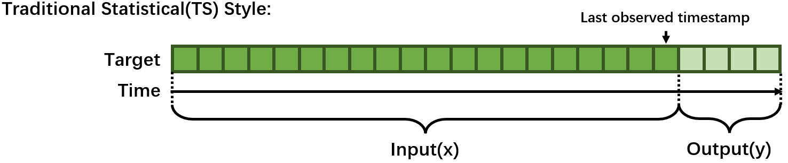
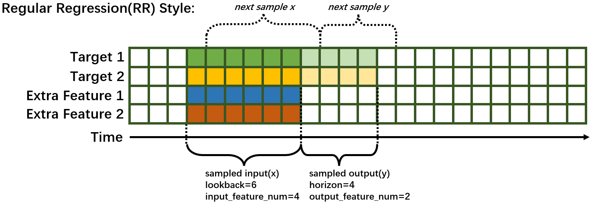

# Time series Forecasting Overview

_Chronos_ provides both deep learning/machine learning models and traditional statistical models for forecasting.

There're three ways to do forecasting:
- Use highly integrated [**AutoTS pipeline**](#use-autots-pipeline) with auto feature generation, data pre/post-processing, hyperparameter optimization.
- Use [**auto forecasting models**](#use-auto-forecasting-model) with auto hyperparameter optimization.
- Use [**standalone forecasters**](#use-standalone-forecaster-pipeline).

<span id="supported_forecasting_model"></span>

| Model   | Style | Multi-Variate | Multi-Step | Distributed\* | Auto Models | AutoTS | Backend |
| ----------------- | ----- | ------------- | ---------- | ----------- | ----------- | ----------- | ----------- |
| LSTM    | RR    | ✅             | ❌          | ✅           | ✅          | ✅         | pytorch  |
| Seq2Seq     | RR    | ✅             | ✅          | ✅           | ✅          | ✅         | pytorch  |
| TCN | RR    | ✅             | ✅          | ✅           | ✅          | ✅         | pytorch  |
| MTNet   | RR    | ✅             | ❌         | ✅           | ❌          | ✳️\*\*\*        | tensorflow |
| TCMF    | TS    | ✅             | ✅          | ✳️\*\*           | ❌          | ❌         | pytorch  |
| Prophet | TS    | ❌             | ✅          | ❌           | ✅          | ❌         | prophet  |
| ARIMA   | TS    | ❌             | ✅          | ❌           | ✅          | ❌         | pmdarima |

\* Distributed training/inferencing is only supported by standalone forecasters.<br>
\*\* TCMF only partially supports distributed training.<br>
\*\*\*  Auto tuning of MTNet is only supported in our deprecated AutoTS API.<br>


#### **1. Time Series Forecasting Concepts**
Time series forecasting is one of the most popular tasks on time series data. **In short, forecasing aims at predicting the future by using the knowledge you can learn from the history.**

##### **1.1 Traditional Statistical(TS) Style**
Traditionally, Time series forecasting problem was formulated with rich mathematical fundamentals and statistical models. Typically, one model can only handle one time series and fit on the whole time series before the last observed timestamp and predict the next few steps. Training(fit) is needed every time you change the last observed timestamp.



##### **1.2 Regular Regression(RR) Style**
Recent years, common deep learning architectures (e.g. RNN, CNN, Transformer, etc.) are being successfully applied to forecasting problem. Forecasting is transformed to a supervised learning regression problem in this style. A model can predict several time series. Typically, a sampling process based on sliding-window is needed, some terminology is explained as following:

- `lookback` / `past_seq_len`: the length of historical data along time. This number is tunable.
- `horizon` / `future_seq_len`: the length of predicted data along time. This number is depended on the task definition. If this value larger than 1, then the forecasting task is *Multi-Step*.
- `input_feature_num`: The number of variables the model can observe. This number is tunable since we can select a subset of extra feature to use.
- `output_feature_num`: The number of variables the model to predict. This number is depended on the task definition. If this value larger than 1, then the forecasting task is *Multi-Variate*.

<span id="RR-forecast-image"></span>


#### **2. Use AutoTS Pipeline**
For AutoTS Pipeline, we will leverage `AutoTSEstimator`, `TSPipeline` and preferably `TSDataset`. A typical usage of AutoTS pipeline basically contains 3 steps.
1. Prepare a `TSDataset` or customized data creator.
2. Init a `AutoTSEstimator` and call `.fit()` on the data.
3. Use the returned `TSPipeline` for further development.
```eval_rst
.. warning::
    `AutoTSTrainer` workflow has been deprecated, no feature updates or performance improvement will be carried out. Users of `AutoTSTrainer` may refer to `Chronos API doc <https://bigdl.readthedocs.io/en/latest/doc/PythonAPI/Chronos/autots.html>`_.
```
```eval_rst
.. note::
    `AutoTSEstimator` currently only support pytorch backend.
```
View [Quick Start](https://bigdl.readthedocs.io/en/latest/doc/Chronos/QuickStart/chronos-autotsest-quickstart.html) for a more detailed example.

##### **2.1 Prepare dataset**
`AutoTSEstimator` support 2 types of data input. 

You can easily prepare your data in `TSDataset` (recommended). You may refer to [here](#TSDataset) for the detailed information to prepare your `TSDataset` with proper data processing and feature generation. Here is a typical `TSDataset` preparation.
```python
from bigdl.chronos.data import TSDataset
from sklearn.preprocessing import StandardScaler

tsdata_train, tsdata_val, tsdata_test\
    = TSDataset.from_pandas(df, dt_col="timestamp", target_col="value", with_split=True, val_ratio=0.1, test_ratio=0.1)

standard_scaler = StandardScaler()
for tsdata in [tsdata_train, tsdata_val, tsdata_test]:
    tsdata.gen_dt_feature()\
          .impute(mode="last")\
          .scale(standard_scaler, fit=(tsdata is tsdata_train))
```
You can also create your own data creator. The data creator takes a dictionary config and returns a pytorch dataloader. Users may define their own customized key and add them to the search space. "batch_size" is the only fixed key.
```python
from torch.utils.data import DataLoader
def training_data_creator(config):
    return Dataloader(..., batch_size=config['batch_size'])
```
##### **2.2 Create an AutoTSEstimator**
`AutoTSEstimator` depends on the [Distributed Hyper-parameter Tuning](../../Orca/Overview/distributed-tuning.html) supported by Project Orca. It also provides time series only functionalities and optimization. Here is a typical initialization process.
```python
import bigdl.orca.automl.hp as hp
from bigdl.chronos.autots import AutoTSEstimator
auto_estimator = AutoTSEstimator(model='lstm',
                                 search_space='normal',
                                 past_seq_len=hp.randint(1, 10),
                                 future_seq_len=1,
                                 selected_features="auto") 
```
We prebuild three defualt search space for each build-in model, which you can use the by setting `search_space` to "minimal"，"normal", or "large" or define your own search space in a dictionary. The larger the search space, the better accuracy you will get and the more time will be cost.

`past_seq_len` can be set as a hp sample function, the proper range is highly related to your data. A range between 0.5 cycle and 3 cycle is reasonable.

`selected_features` is set to "auto" by default, where the `AutoTSEstimator` will find the best subset of extra features to help the forecasting task.
##### **2.3 Fit on AutoTSEstimator**
Fitting on `AutoTSEstimator` is fairly easy. A `TSPipeline` will be returned once fitting is completed.
```python
ts_pipeline = auto_estimator.fit(data=tsdata_train,
                                 validation_data=tsdata_val,
                                 batch_size=hp.randint(32, 64),
                                 epochs=5)
```
Detailed information and settings please refer to [AutoTSEstimator API doc](https://bigdl.readthedocs.io/en/latest/doc/PythonAPI/Chronos/autotsestimator.html#id1).
##### **2.4 Development on TSPipeline**
You may carry out predict, evaluate, incremental training or save/load for further development.
```python
# predict with the best trial
y_pred = ts_pipeline.predict(tsdata_test)

# evaluate the result pipeline
mse, smape = ts_pipeline.evaluate(tsdata_test, metrics=["mse", "smape"])
print("Evaluate: the mean square error is", mse)
print("Evaluate: the smape value is", smape)

# save the pipeline
my_ppl_file_path = "/tmp/saved_pipeline"
ts_pipeline.save(my_ppl_file_path)

# restore the pipeline for further deployment
from bigdl.chronos.autots import TSPipeline
loaded_ppl = TSPipeline.load(my_ppl_file_path)
```
Detailed information please refer to [TSPipeline API doc](../../PythonAPI/Chronos/autotsestimator.html#tspipeline).

```eval_rst
.. note::
    `init_orca_context` is not needed if you just use the trained TSPipeline for inference, evaluation or incremental fitting.
```
```eval_rst
.. note::
    Incremental fitting on TSPipeline just update the model weights the standard way, which does not involve AutoML.
```

#### **3. Use Standalone Forecaster Pipeline**

_Chronos_ provides a set of standalone time series forecasters without AutoML support, including deep learning models as well as traditional statistical models.

View some examples notebooks for [Network Traffic Prediction](https://github.com/intel-analytics/BigDL/tree/branch-2.0/python/chronos/use-case/network_traffic) 

The common process of using a Forecaster looks like below. 
```python
# set fixed hyperparameters, loss, metric...
f = Forecaster(...)
# input data, batch size, epoch...
f.fit(...)
# input test data x, batch size...
f.predict(...)
```
The input data can be easily get from `TSDataset`.
View [Quick Start](../QuickStart/chronos-tsdataset-forecaster-quickstart.md) for a more detailed example. Refer to [API docs](../../PythonAPI/Chronos/forecasters.html) of each Forecaster for detailed usage instructions and examples.

<span id="LSTMForecaster"></span>
###### **3.1 LSTMForecaster**

LSTMForecaster wraps a vanilla LSTM model, and is suitable for univariate time series forecasting.

View Network Traffic Prediction [notebook](https://github.com/intel-analytics/BigDL/blob/branch-2.0/python/chronos/use-case/network_traffic/network_traffic_model_forecasting.ipynb) and [LSTMForecaster API Doc](../../PythonAPI/Chronos/forecasters.html#lstmforecaster) for more details.

<span id="Seq2SeqForecaster"></span>
###### **3.2 Seq2SeqForecaster**

Seq2SeqForecaster wraps a sequence to sequence model based on LSTM, and is suitable for multivariant & multistep time series forecasting.

View [Seq2SeqForecaster API Doc](../../PythonAPI/Chronos/forecasters.html#seq2seqforecaster) for more details.

<span id="TCNForecaster"></span>
###### **3.3 TCNForecaster**

Temporal Convolutional Networks (TCN) is a neural network that use convolutional architecture rather than recurrent networks. It supports multi-step and multi-variant cases. Causal Convolutions enables large scale parallel computing which makes TCN has less inference time than RNN based model such as LSTM.

View Network Traffic multivariate multistep Prediction [notebook](https://github.com/intel-analytics/BigDL/blob/branch-2.0/python/chronos/use-case/network_traffic/network_traffic_multivariate_multistep_tcnforecaster.ipynb) and [TCNForecaster API Doc](../../PythonAPI/Chronos/forecasters.html#tcnforecaster) for more details.

<span id="MTNetForecaster"></span>
###### **3.4 MTNetForecaster**

MTNetForecaster wraps a MTNet model. The model architecture mostly follows the [MTNet paper](https://arxiv.org/abs/1809.02105) with slight modifications, and is suitable for multivariate time series forecasting.

View Network Traffic Prediction [notebook](https://github.com/intel-analytics/BigDL/blob/branch-2.0/python/chronos/use-case/network_traffic/network_traffic_model_forecasting.ipynb) and [MTNetForecaster API Doc](../../PythonAPI/Chronos/forecasters.html#mtnetforecaster) for more details.

<span id="TCMFForecaster"></span>
###### **3.5 TCMFForecaster**

TCMFForecaster wraps a model architecture that follows implementation of the paper [DeepGLO paper](https://arxiv.org/abs/1905.03806) with slight modifications. It is especially suitable for extremely high dimensional (up-to millions) multivariate time series forecasting.

View High-dimensional Electricity Data Forecasting [example](https://github.com/intel-analytics/BigDL/blob/branch-2.0/python/chronos/example/tcmf/run_electricity.py) and [TCMFForecaster API Doc](../../PythonAPI/Chronos/forecasters.html#tcmfforecaster) for more details.

<span id="ARIMAForecaster"></span>
###### **3.6 ARIMAForecaster**

ARIMAForecaster wraps a ARIMA model and is suitable for univariate time series forecasting. It works best with data that show evidence of non-stationarity in the sense of mean (and an initial differencing step (corresponding to the "I, integrated" part of the model) can be applied one or more times to eliminate the non-stationarity of the mean function.

View [ARIMAForecaster API Doc](../../PythonAPI/Chronos/forecasters.html#arimaforecaster) for more details.

<span id="ProphetForecaster"></span>
###### **3.7 ProphetForecaster**

ProphetForecaster wraps the Prophet model ([site](https://github.com/facebook/prophet)) which is an additive model where non-linear trends are fit with yearly, weekly, and daily seasonality, plus holiday effects and is suitable for univariate time series forecasting. It works best with time series that have strong seasonal effects and several seasons of historical data and is robust to missing data and shifts in the trend, and typically handles outliers well.

View Stock Prediction [notebook](https://github.com/intel-analytics/BigDL/blob/branch-2.0/python/chronos/use-case/fsi/stock_prediction_prophet.ipynb) and [ProphetForecaster API Doc](../../PythonAPI/Chronos/forecasters.html#prophetforecaster) for more details.

#### **4. Use Auto forecasting model**
Auto forecasting models are designed to be used exactly the same as Forecasters. The only difference is that you can set hp search function to the hyperparameters and the `.fit()` method will search the best hyperparameter setting.
```python
# set hyperparameters in hp search function, loss, metric...
f = Forecaster(...)
# input data, batch size, epoch...
f.fit(...)
# input test data x, batch size...
f.predict(...)
```
The input data can be easily get from `TSDataset`. Users can refer to detailed [API doc](../../PythonAPI/Chronos/automodels.html).