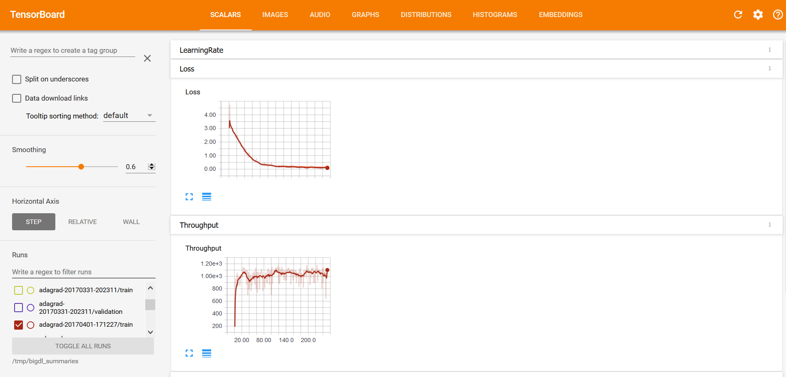

## **Visualizing training with TensorBoard**
With the summary info generated, we can then use [TensorBoard](https://pypi.python.org/pypi/tensorboard) to visualize the behaviors of the BigDL program.  

* **Installing TensorBoard**

Prerequisites:

1. Python verison: 2.7, 3.4, 3.5, or 3.6
2. Pip version >= 9.0.1

To install TensorBoard using Python 2, you may run the command:
```bash
pip install tensorboard==1.0.0a4
```

To install TensorBoard using Python 3, you may run the command:
```bash
pip3 install tensorboard==1.0.0a4
```

Please refer to [this page](https://github.com/intel-analytics/BigDL/tree/master/spark/dl/src/main/scala/com/intel/analytics/bigdl/visualization#known-issues) for possible issues when installing TensorBoard.

* **Launching TensorBoard**

You can launch TensorBoard using the command below:
```bash
tensorboard --logdir=/tmp/bigdl_summaries
```
After that, navigate to the TensorBoard dashboard using a browser. You can find the URL in the console output after TensorBoard is successfully launched; by default the URL is http://your_node:6006

* **Visualizations in TensorBoard**

Within the TensorBoard dashboard, you will be able to read the visualizations of each run, including the “Loss” and “Throughput” curves under the SCALARS tab (as illustrated below):


And “weights”, “bias”, “gradientWeights” and “gradientBias” under the DISTRIBUTIONS and HISTOGRAMS tabs (as illustrated below):


---