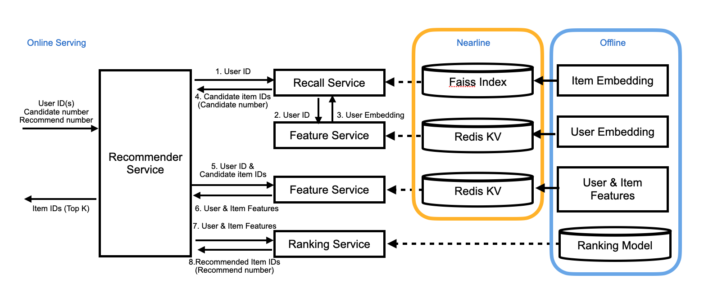

# Friesian Online Serving

## Table of contents
1. [Overview](#overview)
2. [Key Concepts](#key-concepts)
   1. [gRPC](#grpc)
   2. [Faiss](#faiss)
   3. [Redis](#redis)
   4. [Config Files](#config-files)
   5. [Ranking Service](#ranking-service)
   6. [Feature Service](#feature-service)
   7. [Recall Service](#recall-service)
   8. [Recommender Service](#recommender-service)
   9. [Service Proxy](#service-proxy)
3. [Pull Friesian Serving Docker Image](#pull-friesian-serving-docker-image)
4. [Start Ranking Service](#start-ranking-service)
5. [Start Feature Service](#start-feature-service)
6. [Start Recall Service](#start-recall-service)
7. [Start Recommender Service](#start-recommender-service)
8. [Scale-out for Big Data](#scale-out-for-big-data)
   1. [Redis for Big Data](#redis-for-big-data)
   2. [Scale Service with Envoy](#scale-service-with-envoy)
   3. [Use Scripts to Deploy Multiple Services](#use-scripts-to-deploy-multiple-services)

## Overview

The Friesian Online Serving is a set of **gRPC services** that enable users to do **real-time recommendation serving**. It consists of 4 services: **Recommender service**, **Recall Service**, **Feature Service**, and **Ranking Service**. It provides a simple gRPC API so users can easily build the gRPC client using their preferred language, send requests to the recommender server, and get the recommendation results. The overall architecture of the Friesian Online Serving is shown below:



A Client sends a **request** to the **Recommender service** and triggers the recommendation process. The **Recall service** generate candidates from millions of items based on embeddings and the **Ranking Service** ranks the candidates for the final recommendation results.

The Online Serving depends on offline and nearline stages:
- Offline: 
  - For ranking: prepare the user & item features and the ranking model for the ranking service.
    1. Preprocess the user & item data and save them as **user & item feature parquet files**.
    2. Train the **ranking model** and save it.
  - For vector search: prepare the user & item embedding vectors for the recall service to generate candidates.
    1. Preprocess the user & item data and save them as parquet files.
    2. Train the two-tower model, divide it into user and item models, and save them. 
    3. Use the user and item embedding models to get **user & item embedding vectors**.
- Nearline:
  - Load user & item feature parquet files and keep them in the Key-Value store. 
  - Load user embedding vectors and keep them in the Key-Value store.
  - Load item embedding vectors and build the faiss index. 

Before starting the online serving services, users should prepare the **faiss index** generated in the nearline step, **Redis** with user & item features and user embedding vectors loaded, and **the trained ranking model**.

## Key Concepts

### gRPC

[gRPC](https://grpc.io/) stands for Google Remote Procedure Call, it is a high performance, open source universal RPC framework. 

The Friesian Serving provides 4 types of gRPC services: Ranking Service, Feature Service, Recall Service and Recommender Service. They are defined in [the proto files](https://github.com/intel-analytics/BigDL/tree/main/scala/friesian/src/main/proto). Users can use `protoc` with a special gRPC plugin to generate client code from the proto files and use the client to call the deployed servers.

### Faiss

[Faiss](https://github.com/facebookresearch/faiss) is a library for efficient similarity search. The Recall Service uses intel optimized faiss to search similar candidates (100 ~ 1000 candidates) from millions of items. 

HNSWlibInt16_32 is used in the Recall Service.

### Redis

[Redis](https://redis.io/) stands for Remote Dictionary Server, is an open source, in-memory data store. It provides kv store and high performance data access in the Feature Service.

### Config Files

Each service has its config template for providing important information, and users can fill it in and pass it to the service using `-c config.yaml`.

### Ranking Service

The Ranking Service performs model inference and returns the results.

The recommendation service will call the ranking service, and users do not need to call this service directly.

#### API definition
 - `rpc doPredict(Content) returns (Prediction) {}`
    - Input: The `encodeStr` is a Base64 string encoded from a bigdl [Activity](https://github.com/intel-analytics/BigDL/blob/branch-2.0/scala/dllib/src/main/scala/com/intel/analytics/bigdl/dllib/nn/abstractnn/Activity.scala) serialized byte array.
    ```bash
    message Content {
        string encodedStr = 1;
    }
    ```
    - Output: The `predictStr` is a Base64 string encoded from a bigdl [Activity](https://github.com/intel-analytics/BigDL/blob/branch-2.0/scala/dllib/src/main/scala/com/intel/analytics/bigdl/dllib/nn/abstractnn/Activity.scala) (the inference result) serialized byte array.
    ```bash
    message Prediction {
        string predictStr = 1;
    }
    ```
   
#### Ranking service config template 

The config template for the Ranking Service is [config_ranking.yaml](https://github.com/intel-analytics/BigDL/blob/main/scala/friesian/src/main/resources/config/config_ranking.yaml).

You can uncomment the parameters you need and modify the values.

```yaml
######## Ranking Service

# Default: 8083, which port to create the server
servicePort: 8083

# Default: 0, open a port for prometheus monitoring tool, if set, user can check the
# performance using prometheus
# monitorPort: 

# model path must be provided
modelPath: 

# default: null, savedmodel input list if the model is tf savedmodel. If not provided, the inputs
# of the savedmodel will be arranged in alphabetical order
# savedModelInputs: 

# default: 1, number of models used in inference service
modelParallelism: 1
```
- servicePort: which port to create the server. Default: 8083.
- monitorPort: the port for prometheus monitoring tool, if set, user can check the performance using prometheus. Default: null.
- modelPath: the model path of the ranking model. This parameter must be provided.
- savedModelInputs: savedmodel input list if the model is tf savedmodel. If not provided, the inputs of the savedmodel will be arranged in alphabetical order. Example: serving_default_input_1:0, serving_default_input_2:0. Default: null.
- modelParallelism: number of models used in ranking service. It is recommended to use the number of physical cores as modelParallelism. Default: 1.


### Feature Service

The Feature Service searches user embeddings, user features or item features in Redis, and returns the features.

The recommendation or the recall service will call the feature service, and users do not need to call this service directly.

#### API definition
  - `rpc getUserFeatures(IDs) returns (Features) {}` and `rpc getItemFeatures(IDs) returns (Features) {}`
    - Input: The user/item id list for searching.
    ```bash
    message IDs {
        repeated int32 ID = 1;
    }
    ```
    - Output: `colNames` is a string list of the column names. `b64Feature` is a list of Base64 string, each string is encoded from java serialized array of objects. `ID` is a list of ids corresponding `b64Feature`.
    ```bash
    message Features {
        repeated string colNames = 1;
        repeated string b64Feature = 2;
        repeated int32 ID = 3;
    }
    ```
    
#### Feature service config template

The config template for the Feature Service is [config_feature.yaml](https://github.com/intel-analytics/BigDL/blob/main/scala/friesian/src/main/resources/config/config_feature.yaml).

You can uncomment the parameters you need and modify the values.

```yaml
######## Feature Service

### Basic setting

# Default: 8082, which port to create the server
servicePort: 8082

# Default: null, open a port for prometheus monitoring tool, if set, user can check the
# performance using prometheus
# monitorPort: 1235Ï

# 'kv', 'inference' or 'kv, inference' default: kv
serviceType: kv

# default: "", prefix for redis key
redisKeyPrefix:

# default: 0, item slot type on redis cluster. 0 means slot number use the default value 16384, 1 means all keys save to same slot, 2 means use the last character of id as hash tag.
# redisClusterItemSlotType: 2

# default: null, if serviceType='kv,inference', userFeatureColumns must be provided
# userFeatureColumns: 

# default: null, if serviceType='kv,inference', itemFeatureColumns must be provided
# itemFeatureColumns: 

# default: null, user model path or item model path must be provided if serviceType
# contains 'inference'. If serviceType=kv, usermodelPath, itemModelPath and modelParallelism will
# be ignored
# userModelPath:

# default: null, user model path or item model path must be provided if serviceType
# contains 'inference'. If serviceType=kv, usermodelPath, itemModelPath and modelParallelism will
# be ignored
# itemModelPath:

# default: 1, number of models used for inference
# modelParallelism: 

### Redis Configuration
# default: localhost:6379, if redisType=sentinel, redisUrl will be ignored
# redisUrl: 

# default: standalone, redis server type, can be "standalone", "sentinel", or "cluster"
# redisType:

# default: null, must be provided if redisType=sentinel
# redisSentinelMasterName:

# default: localhost:26379
# redisSentinelMasterURL:

# default: 2, The redis log emit interval in minutes
# logInterval: 
```
- servicePort: which port to create the server. Default: 8082.
- monitorPort: the port for prometheus monitoring tool, if set, user can check the performance using prometheus. Default: null.
- serviceType: `'kv'`, `'inference'` or `'kv, inference'`. `'kv'` means simple key-value search, `'inference'` means the feature service use the ids in the request and the provided model to get the inference result and return. `'kv,inference'` means the feature service get the user/item feature from the kv store and use the provided model to get the inference result and return. Note that if the serviceType contains `inference`, at least one of userFeatureColumns(and userModelPath) and itemFeatureColumns(and itemModelPath) should be provided.
- redisClusterItemSlotType: item slot type on `redis cluster`. 0 means slot number use the default value 16384, 1 means all keys save to same slot, 2 means use the last character of id as hash tag. Default: 0.
- userFeatureColumns: if serviceType='kv,inference', userFeatureColumns must be provided. Its order must be the same as the inputs of the model provided in the userModelPath. Default: null.
- itemFeatureColumns: if serviceType='kv,inference', itemFeatureColumns must be provided. Its order must be the same as the inputs of the model provided in the itemModelPath. Default: null.
- userModelPath: user model path or item model path must be provided if serviceType contains 'inference'. If serviceType=kv, usermodelPath, itemModelPath and modelParallelism will be ignored. Default: null.
- itemModelPath: user model path or item model path must be provided if serviceType contains 'inference'. If serviceType=kv, usermodelPath, itemModelPath and modelParallelism will be ignored. Default: null.
- modelParallelism: number of models used for inference. It is recommended to use the number of physical cores as modelParallelism. Default: 1.
- redisUrl: redisUrl for redis standalone and redis cluster. If redisType=sentinel, redisUrl will be ignored. Default: localhost:6379.
- redisType: redis server type, can be "standalone", "sentinel", or "cluster".
- redisSentinelMasterName: redis sential master name, it must be provided if redisType=sentinel. Default: null.
- redisSentinelMasterURL: redis sential master url, it must be provided if redisType=sentinel. Default: localhost:26379.
- logInterval: the redis log emit interval in minutes. Default: 2.

### Recall Service

The Recall Service searches item candidates in the built faiss index and returns candidates id list.

The recommendation service will call the recall service, and users do not need to call this service directly.

#### API definition
  - `rpc searchCandidates(Query) returns (Candidates) {}`
    - Input: `userID` is the id of the user to search similar item candidates. `k` is the number of candidates. 
    ```bash
    message Query {
        int32 userID = 1;
        int32 k = 2;
    }
    ```
    - Output: `candidate` is the list of ids of item candidates.
    ```bash
    message Candidates {
        repeated int32 candidate = 1;
    }
    ```
  
#### Recall service config template

The config template for the Recall Service is [config_recall.yaml](https://github.com/intel-analytics/BigDL/blob/main/scala/friesian/src/main/resources/config/config_recall.yaml).

You can uncomment the parameters you need and modify the values.

```yaml
######## Recall Service

# Default: 8084, which port to create the server
servicePort: 8084

# Default: null, open a port for prometheus monitoring tool, if set, user can check the
# performance using prometheus
# monitorPort: 1238

# default: 128, the dimensionality of the embedding vectors
indexDim: 50

# default: null, path to saved index path, must be provided
indexPath: 

# default: localhost:8980, feature service target
featureServiceURL: localhost:8085
```
- servicePort: which port to create the server. Default: 8084.
- monitorPort: the port for prometheus monitoring tool, if set, user can check the performance using prometheus. Default: null.
- indexDim: the dimensionality of the embedding vectors. Default: 128.
- indexPath: path to the saved index path, must be provided. The index file can be generated in the nearline part. Default: null.
- featureServiceURL: feature service target, the feature service target which provide user embedding vector inquiry. Default: localhost:8980.


### Recommender Service

The Recommender Service gets candidates from the recall service, calls the feature service to get the user and item candidate's features, then sorts the inference results from ranking service and returns the top recommendNum items.

Users can generate the client code using protoc plugin and [the recommender service proto file](https://github.com/intel-analytics/BigDL/tree/main/scala/friesian/src/main/proto/recommender.proto). Then use the client code to send RPC request to the recommender server.

#### API definition

The RecommendRequest consists of 3 parameters, recommendNum, candidateNum and ID list. `recommendNum` is the number of items to recommend. `candidateNum` is the number of generated candidates in the recall service. `ID` is a list of user ids to recommend.

The response of the recommender service is the RecommendIDProbs, `IDProbList` is a list of results corresponding to user `ID` in input. Each `IDProbs` consists of `ID` and `prob`, `ID` is the list of item ids, and `prob` is the corresponding probability.

  - `rpc getRecommendIDs(RecommendRequest) returns (RecommendIDProbs) {}`
    - Input: `ID` is a list of user ids to recommend. `recommendNum` is the number of items to recommend. `candidateNum` is the number of generated candidates to inference in ranking service.
    ```bash
    message RecommendRequest {
        int32 recommendNum = 1;
        int32 candidateNum = 2;
        repeated int32 ID = 3;
    }
    ```
    - Output: `IDProbList` is a list of results corresponding to user `ID` in input. Each `IDProbs` consists of `ID` and `prob`, `ID` is the list of item ids, and `prob` is the corresponding probability.
    ```bash
    message RecommendIDProbs {
        repeated IDProbs IDProbList = 1;
    }
    message IDProbs {
        repeated int32 ID = 1;
        repeated float prob = 2;
    }
    ```
    
#### Recommender service config template

The config template for the Recommender Service is [config_recommender.yaml](https://github.com/intel-analytics/BigDL/blob/main/scala/friesian/src/main/resources/config/config_recommender.yaml).

You can uncomment the parameters you need and modify the values.

```yaml
######## Recommend Service

# Default: 8980, which port to create the server
servicePort: 8980

# Default: null, open a port for prometheus monitoring tool, if set, user can check the
# performance using prometheus
# monitorPort: 1237

# default: null, must be provided, item column name
itemIDColumn: 

# default: null, must be provided, column names for inference, order related.
inferenceColumns: 

# default: 0, if set, ranking service request will be divided
inferenceBatch: 0

# default: localhost:8980, recall service target
recallServiceURL: localhost:8084

# default: localhost:8980, feature service target
featureServiceURL: localhost:8082

# default: localhost:8980, inference service target
rankingServiceURL: localhost:8083
```
- servicePort: which port to create the server. Default: 8980.
- monitorPort: the port for prometheus monitoring tool, if set, user can check the performance using prometheus. Default: null.
- itemIDColumn: item id column name, must be provided. Default: null.
- inferenceColumns: column names for inference, must be provided. It is order related, needs to be in the same order as the model in the ranking service. Default: null.
- inferenceBatch: the batch of inference, if set, the ranking service request will be divided. If it is 0, all candidate will be batched in a single request. Default: 0.
- recallServiceURL: the recall service target used in the recommender service.
- featureServiceURL: the feature service target used in the recommender service.
- rankingServiceURL: the ranking service target used in the recommender service.

### Service Proxy

Users can use service proxies such as [NGINX](https://www.nginx.com/), [envoy](https://www.envoyproxy.io/docs/envoy/latest/) to scale out the gRPC services to multiple servers. They can perform as server-side Load Balancer.

The client issues RPCs to the Load Balancer proxy. The LB distributes the RPC call to one of the available backend servers that implement the actual logic for serving the call.


If the user use a service proxy, the serviceURLs provided in the config files should be the proxy url.

## Pull Friesian Serving Docker Image

Users can pull the Friesian Serving docker image using `docker pull intelanalytics/friesian-serving`

## Start Ranking Service

1. Prepare the ranking model which trained in the offline stage.
2. Prepare the ranking config file. You can refer to [Ranking Service Config Template](#ranking-service-config-template). **Note** that we use the bind mount to mount the current directory into /opt/work/mnt in the container, so paths in the config file should start with `mnt/`
3. Put the model and config file under the current directory.
    ```
    └── $(pwd)
        ├── saved_model
        └── config_ranking.yaml
    ```
4. Start the docker container using

`docker run -it --net host --rm --name ranking -v $(pwd):/opt/work/mnt -e OMP_NUM_THREADS=1 intelanalytics/friesian-serving ranking -c mnt/config_ranking.yaml`

## Start Feature Service

1. Prepare the feature config file, which includes the redis configurations used in the nearline stage. You can refer to [Feature Service Config Template](#feature-service-config-template). **Note** that we use the bind mount to mount the current directory into /opt/work/mnt in the container, so paths in the config file should start with `mnt/`
2. Put the config file under the current directory.
   ```
    └── $(pwd)
        └── config_feature.yaml
    ```
3. Start the docker container using

`docker run -it --net host --rm --name feature -v $(pwd):/opt/work/mnt intelanalytics/friesian-serving feature -c mnt/config_feature.yaml`

## Start Recall Service

1. Prepare the faiss index file which generated in the nearline stage.
2. Prepare the recall config file. You can refer to [Recall Service Config Template](#recall-service-config-template). **Note** that we use the bind mount to mount the current directory into /opt/work/mnt in the container, so paths in the config file should start with `mnt/`
3. Put the faiss index file and the config file under the current directory.
   ```
   └── $(pwd)
        ├── item.idx
        └── config_recall.yaml
   ```
4. Start the docker container using

`docker run -it --net host --rm --name recall -v $(pwd):/opt/work/mnt intelanalytics/friesian-serving recall -c mnt/config_recall.yaml`

## Start Recommender Service

1. Prepare the recommender config file. You can refer to [Recommender Service Config Template](#recommender-service-config-template)
2. Put the config file under the current directory.
   ```
    └── $(pwd)
        └── config_recommender.yaml
    ```
3. Start the docker container using

`docker run -it --net host --rm --name recommender -v $(pwd):/opt/work/mnt intelanalytics/friesian-serving recommender -c mnt/config_recommender.yaml`

## Scale-out for Big Data

### Redis for Big Data

Redis is a component which is used in the feature service. Users should build their own redis server (standalone, sentiel or cluster) for the feature service.

#### Redis Cluster
For large data set, Redis standalone has no enough memory to store whole data set, data sharding and Redis cluster are supported to handle it. You only need to set up a Redis Cluster to get it work.

First, start N Redis instance on N machines.
```commandline
redis-server --cluster-enabled yes --cluster-config-file nodes-0.conf --cluster-node-timeout 50000 --appendonly no --save "" --logfile 0.log --daemonize yes --protected-mode no --port 6379
```
on each machine, choose a different port and start another M instances(M>=1), as the slave nodes of above N instances.

Then, call initialization command on one machine, if you choose M=1 above, use `--cluster-replicas 1`
``` commandline
redis-cli --cluster create 172.168.3.115:6379 172.168.3.115:6380 172.168.3.116:6379 172.168.3.116:6380 172.168.3.117:6379 172.168.3.117:6380 --cluster-replicas 1
```
and the Redis cluster would be ready.

#### Redis Sentinel
If the memory can hold the whole dataset, and the QPS of the feature service is very high that the latency is not acceptable, you can use redis sentinel which provides high availability for Redis to optimize the performance.

First, start 1 master and several replicas on multiple machines.

1. Modify `master_server`, `master_port`, `slave_server_list` and `slave_port_list` in [setup_redis_master_replicas.sh](https://github.com/intel-analytics/BigDL/tree/main/scala/friesian/scripts/setup_redis_master_replicas.sh)
2. Please make sure that the machines in `master_server` and `slave_server_list` can perform SSH login without password.
3. Run `bash setup_redis_master_replicas.sh` to start redis master and replicas.

Then, follow the [quickstart](https://redis.io/docs/manual/sentinel/#sentinel-quick-start) to start the redis sentiel.


### Scale Service with Envoy

Each of the services could be scaled out using [service proxy](#service-proxy). It is recommended to use the same resource, e.g. single machine with same CPU and memory, to test which service is bottleneck. From empirical observations, vector search and inference usually be.

We use [envoy](https://www.envoyproxy.io/docs/envoy/latest/) as the Load Balancer proxy here.

#### How to run envoy:
1. [download](https://www.envoyproxy.io/docs/envoy/latest/start/install) and deploy envoy(below use docker as example):
 * download: `docker pull envoyproxy/envoy-dev:21df5e8676a0f705709f0b3ed90fc2dbbd63cfc5`
2. run command: `docker run --rm -it  -p 9082:9082 -p 9090:9090 envoyproxy/envoy-dev:79ade4aebd02cf15bd934d6d58e90aa03ef6909e --config-yaml "$(cat path/to/service-specific-envoy.yaml)" --parent-shutdown-time-s 1000000`
3. validate: run `netstat -tnlp` to see if the envoy process is listening to the corresponding port in the envoy config file.
4. For details on envoy and how to scale out gRPC services using envoy, please read [envoy](envoy.md).

### Use Scripts to Deploy Multiple Services

We provide sample scripts to automatically deploy the whole pipeline across multiple servers. Following the steps below:

1. Prepare dataset & 5 config files for 5 services & 3 config files for nearline initial data loading.
2. Set up [redis sentinel or redis cluster](#redis-for-big-data).
3. [Pull Friesian-serving docker image](#pull-friesian-serving-docker-image).
4. Create NFS on the cluster.
5. Modify parameters in [config.sh](https://github.com/intel-analytics/BigDL/blob/main/scala/friesian/scripts/config.sh). If the SSH login without password is not enabled between the servers in the cluster, we need configure `SERVER_PASS` here.
```bash
#!/bin/bash
IMAGE_TAG="intelanalytics/friesian-serving"
CLUSTER_NAME=""
SERVER_PASS=""
RANKING_SERVER_LIST=('127.0.0.1')
RECALL_SERVER_LIST=('127.0.0.1')
FEATURE_SERVER_LIST=('127.0.0.1')
FEATURE_RECALL_SERVER_LIST=('127.0.0.1')
RECOMMENDER_SERVER_LIST=('127.0.0.1')

# Use nfs volume
VOLUME_TARGET="/opt/work/nfs"
VOLUME_DEVICE="/mnt/myshareddir"
VOLUME_ADDR="172.168.3.115"
VOLUME_CONF="type=volume,source=nfsvolume,target=$VOLUME_TARGET,volume-driver=local,volume-opt=type=nfs,volume-opt=device=:$VOLUME_DEVICE,volume-opt=o=addr=$VOLUME_ADDR"

# Use bind mounts
# VOLUME_TARGET="/opt/work/data"
# VOLUME_SOURCE="$(pwd)/data"
# VOLUME_CONF="type=bind,source=$VOLUME_SOURCE,target=$VOLUME_TARGET"

RANKING_INSTANCE_PER_NODE=1
RECOMMENDER_INSTANCE_PER_NODE=1
RECALL_INSTANCE_PER_NODE=1

OMP_NUM_THREADS=1
```
6. Run [script](https://github.com/intel-analytics/BigDL/blob/main/scala/friesian/scripts/setup_all_services.sh) to setup all services using `bash setup_all_services.sh`.
7. Modify envoy config files and start envoy on the proxy machines.
8. Run [script](https://github.com/intel-analytics/BigDL/blob/main/scala/friesian/scripts/shutdown-all-services.sh) to shut down all services using `bash shutdown-all-services.sh`.
