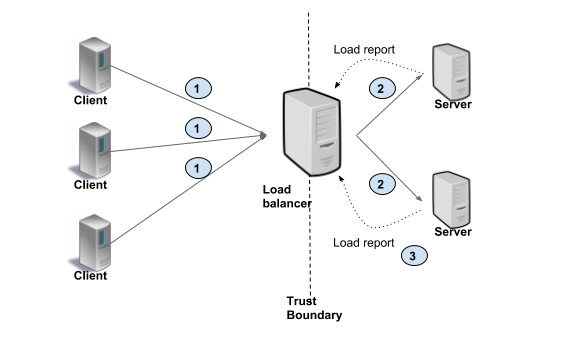

# Friesian Online Serving

## Table of contents
1. [Overview](#overview)
2. [Key Concepts](#key-concepts)
3. [Pull Friesian Serving Docker Image](#pull-friesian-serving-docker-image)
4. [Start Ranking Service](#start-ranking-service)
5. [Start Feature Service](#start-feature-service)
6. [Start Recall Service](#start-recall-service)
7. [Start Recommender Service](#start-recommender-service)
8. [Quick Start](#quick-start)

## Overview

The Friesian Online Serving is a set of **gRPC services** that enable users to do **real-time recommendation serving**. It consists of 4 services: **Recommender service**, **Recall Service**, **Feature Service**, and **Ranking Service**. It provides a simple gRPC API so users can easily build the gRPC client using their preferred language, send requests to the recommender server, and get the recommendation results. The overall architecture of the Friesian Online Serving is shown below:


A Client sends a **request** to the **Recommender service** and triggers the recommendation process. The **Recall service** generate candidates from millions of items based on embeddings and the **Ranking Service** ranks the candidates for the final recommendation results.

The Online Serving depends on offline and nearline:
- Offline: 
  - For ranking: prepare the user & item features and the ranking model for the ranking service.
    1. Preprocess the user & item data and save them as **user & item feature parquet files**.
    2. Train the **ranking model** and save it.
  - For vector search: prepare the user & item embedding vectors for the recall service to generate candidates.
    1. Preprocess the user & item data and save them as parquet files.
    2. Train the two-tower model, divide it into user and item models, and save them. 
    3. Use the user and item embedding models to get **user & item embedding vectors**.
- Nearline:
  - Load user & item feature parquet files and keep them in the Key-Value store. 
  - Load user embedding vectors and keep them in the Key-Value store.
  - Load item embedding vectors and build the faiss index. 

Before starting the online serving services, users should prepare the **faiss index** generated in the nearline step, **Redis** with user & item features and user embedding vectors loaded, and **the trained ranking model**.

## Key Concepts

### gRPC

[gRPC](https://grpc.io/) stands for Google Remote Procedure Call, it is a high performance, open source universal RPC framework. 

The Friesian Serving provides 4 types of gRPC services: Ranking Service, Feature Service, Recall Service and Recommender Service. They are defined in [the proto files](https://github.com/intel-analytics/BigDL/tree/main/scala/friesian/src/main/proto). Users can use `protoc` with a special gRPC plugin to generate client code from the proto files and use the client to call the deployed servers.

### Faiss

[Faiss](https://github.com/facebookresearch/faiss) is a library for efficient similarity search. The Recall Service uses intel optimized faiss to search similar candidates (100 ~ 1000 candidates) from millions of items. 

HNSWlibInt16_32 is used in the Recall Service.

### Redis

[Redis](https://redis.io/) stands for Remote Dictionary Server, is an open source, in-memory data store. It provides kv store and high performance data access in the Feature Service.

### Config Files

Users can pass important information to services using `-c config.yaml`


### Ranking Service

The Ranking Service performs model inference and returns the results.
 - `rpc doPredict(Content) returns (Prediction) {}`
    - Input: The `encodeStr` is a Base64 string encoded from a bigdl [Activity](https://github.com/intel-analytics/BigDL/blob/branch-2.0/scala/dllib/src/main/scala/com/intel/analytics/bigdl/dllib/nn/abstractnn/Activity.scala) serialized byte array.
    ```bash
    message Content {
        string encodedStr = 1;
    }
    ```
    - Output: The `predictStr` is a Base64 string encoded from a bigdl [Activity](https://github.com/intel-analytics/BigDL/blob/branch-2.0/scala/dllib/src/main/scala/com/intel/analytics/bigdl/dllib/nn/abstractnn/Activity.scala) (the inference result) serialized byte array.
    ```bash
    message Prediction {
        string predictStr = 1;
    }
    ```

### Feature Service

The Feature Service searches user embeddings, user features or item features in Redis, and returns the features.
  - `rpc getUserFeatures(IDs) returns (Features) {}` and `rpc getItemFeatures(IDs) returns (Features) {}`
    - Input: The user/item id list for searching.
    ```bash
    message IDs {
        repeated int32 ID = 1;
    }
    ```
    - Output: `colNames` is a string list of the column names. `b64Feature` is a list of Base64 string, each string is encoded from java serialized array of objects. `ID` is a list of ids corresponding `b64Feature`.
    ```bash
    message Features {
        repeated string colNames = 1;
        repeated string b64Feature = 2;
        repeated int32 ID = 3;
    }
    ```

### Recall Service

The Recall Service searches item candidates in the built faiss index and returns candidates id list.
  - `rpc searchCandidates(Query) returns (Candidates) {}`
    - Input: `userID` is the id of the user to search similar item candidates. `k` is the number of candidates. 
    ```bash
    message Query {
        int32 userID = 1;
        int32 k = 2;
    }
    ```
    - Output: `candidate` is the list of ids of item candidates.
    ```bash
    message Candidates {
        repeated int32 candidate = 1;
    }
    ```

### Recommender Service

The Recommender Service gets candidates from the recall service, calls the feature service to get the user and item candidate's features, then sorts the inference results from ranking service and returns the top recommendNum items.
  - `rpc getRecommendIDs(RecommendRequest) returns (RecommendIDProbs) {}`
    - Input: `ID` is a list of user ids to recommend. `recommendNum` is the number of items to recommend. `candidateNum` is the number of generated candidates to inference in ranking service.
    ```bash
    message RecommendRequest {
        int32 recommendNum = 1;
        int32 candidateNum = 2;
        repeated int32 ID = 3;
    }
    ```
    - Output: `IDProbList` is a list of results corresponding to user `ID` in input. Each `IDProbs` consists of `ID` and `prob`, `ID` is the list of item ids, and `prob` is the corresponding probability.
    ```bash
    message RecommendIDProbs {
        repeated IDProbs IDProbList = 1;
    }
    message IDProbs {
        repeated int32 ID = 1;
        repeated float prob = 2;
    }
    ```

### Service Proxy

Users can use service proxies such as [NGINX](https://www.nginx.com/), [envoy](https://www.envoyproxy.io/docs/envoy/latest/) to scale out the gRPC services to multiple servers. They can perform as server-side Load Balancer.

The client issues PRCs to the Load Balancer proxy. The LB distributes the RPC call to one of the available backend servers that implement the actual logic for serving the call.


## Pull Friesian Serving Docker Image

Users can pull the Friesian Serving docker image using `docker pull intelanalytics/friesian-serving`

## Start Ranking Service

`docker run -it --net host --rm --name ranking -v $(pwd):/opt/work/mnt -e OMP_NUM_THREADS=1 intelanalytics/friesian-serving ranking -c mnt/config_ranking.yaml`

## Start Feature Service

`docker run -it --net host --rm --name feature -v $(pwd):/opt/work/mnt intelanalytics/friesian-serving feature -c mnt/config_feature.yaml`

## Start Recall Service

`docker run -it --net host --rm --name recall -v $(pwd):/opt/work/mnt intelanalytics/friesian-serving recall -c mnt/config_recall.yaml`

## Start Recommender Service

`docker run -it --net host --rm --name recommender -v $(pwd):/opt/work/mnt intelanalytics/friesian-serving recommender -c mnt/config_recommender.yaml`

## Scale-out for Big Data

### Redis 

#### Redis Cluster
For large data set, Redis standalone has no enough memory to store whole data set, data sharding and Redis cluster are supported to handle it. You only need to set up a Redis Cluster to get it work.

First, start N Redis instance on N machines.
```
redis-server --cluster-enabled yes --cluster-config-file nodes-0.conf --cluster-node-timeout 50000 --appendonly no --save "" --logfile 0.log --daemonize yes --protected-mode no --port 6379
```
on each machine, choose a different port and start another M instances(M>=1), as the slave nodes of above N instances.

Then, call initialization command on one machine, if you choose M=1 above, use `--cluster-replicas 1`
```
redis-cli --cluster create 172.168.3.115:6379 172.168.3.115:6380 172.168.3.116:6379 172.168.3.116:6380 172.168.3.117:6379 172.168.3.117:6380 --cluster-replicas 1
```
and the Redis cluster would be ready.

#### Redis Sentinel

### Scale Service with Envoy
Each of the services could be scaled out. It is recommended to use the same resource, e.g. single machine with same CPU and memory, to test which service is bottleneck. From empirical observations, vector search and inference usually be.

#### How to run envoy:
1. [download](https://www.envoyproxy.io/docs/envoy/latest/start/install) and deploy envoy(below use docker as example):
 * download: `docker pull envoyproxy/envoy-dev:21df5e8676a0f705709f0b3ed90fc2dbbd63cfc5`
2. run command: `docker run --rm -it  -p 9082:9082 -p 9090:9090 envoyproxy/envoy-dev:79ade4aebd02cf15bd934d6d58e90aa03ef6909e --config-yaml "$(cat path/to/service-specific-envoy.yaml)" --parent-shutdown-time-s 1000000`
3. validate: run `netstat -tnlp` to see if the envoy process is listening to the corresponding port in the envoy config file.
4. For details on envoy and sample procedure, read [envoy](envoy.md).


## Quick Start

TODO: new demo

You can follow the following steps to run the WnD demo.
1. Prepare config files, WnD model and index
   1. WnD model: the WnD model is the output of the offline pipelines.
   2. index: the faiss index is generated in [Run nearline pipelines 6.](#run-nearline-pipelines)
   3. Prepare [config_feature.yaml](./src/main/resources/config/config_feature.yaml)
   4. Prepare [config_feature_vec.yaml](./src/main/resources/config/config_feature_vec.yaml)
   5. Prepare [config_ranking.yaml](./src/main/resources/config/config_ranking.yaml): modify `modelPath` and `savedModelInputs` according to your WnD model path and inputs.
   6. Prepare [config_recall.yaml](./src/main/resources/config/config_recall.yaml): modify `indexPath` and `indexDim` according to your index location and dimension. `featureServiceURL` according to `ip:port` the feature recall service listening on.
   7. Prepare [config_recommender.yaml](./src/main/resources/config/config_recommender.yaml): modify `itemIDColumn` and `inferenceColumns` according to the input order of the WnD model. `recallServiceURL`, `featureServiceURL` and `rankingServiceURL` according to the `ip:port` the corresponding service listening on.
   8. Your file structure will like:
   ```
    └── $(pwd)
        ├── recsys_wnd
        ├── item.idx
        ├── wnd_user.parquet
        ├── wnd_item.parquet
        ├── vec_feature_user_prediction.parquet
        ├── vec_feature_item_prediction.parquet
        ├── config_recommender.yaml
        ├── config_ranking.yaml
        ├── config_feature.yaml
        ├── config_feature_vec.yaml
        ├── config_recall.yaml
        └── nearline
            ├── config_feature.yaml
            ├── config_feature_vec.yaml
            └── config_recall.yaml
    ```
2. Start ranking service
   `docker run -it --net host --rm --name ranking -v $(pwd):/opt/work/mnt -e OMP_NUM_THREADS=1 intelanalytics/friesian-serving:0.1.0 ranking -c mnt/config_ranking.yaml`
3. Start feature service
   `docker run -it --net host --rm --name feature -v $(pwd):/opt/work/mnt intelanalytics/friesian-serving:0.1.0 feature -c mnt/config_feature.yaml`
4. Start feature recall service
   `docker run -it --net host --rm --name feature-recall -v $(pwd):/opt/work/mnt intelanalytics/friesian-serving:0.1.0 feature -c mnt/config_feature_vec.yaml`
5. Start recall service
   `docker run -it --net host --rm --name recall -v $(pwd):/opt/work/mnt intelanalytics/friesian-serving:0.1.0 recall -c mnt/config_recall.yaml`
6. Start recommender service
   `docker run -it --net host --rm --name recommender -v $(pwd):/opt/work/mnt intelanalytics/friesian-serving:0.1.0 recommender -c mnt/config_recommender.yaml`
7. Run client to test
   `docker run -it --net host --rm -v $(pwd):/opt/work/mnt intelanalytics/friesian-serving:0.1.0 client -target localhost:8980 -dataDir mnt/wnd_user.parquet -k 50 -clientNum 4 -testNum 2`

TODO: multi-server demo
