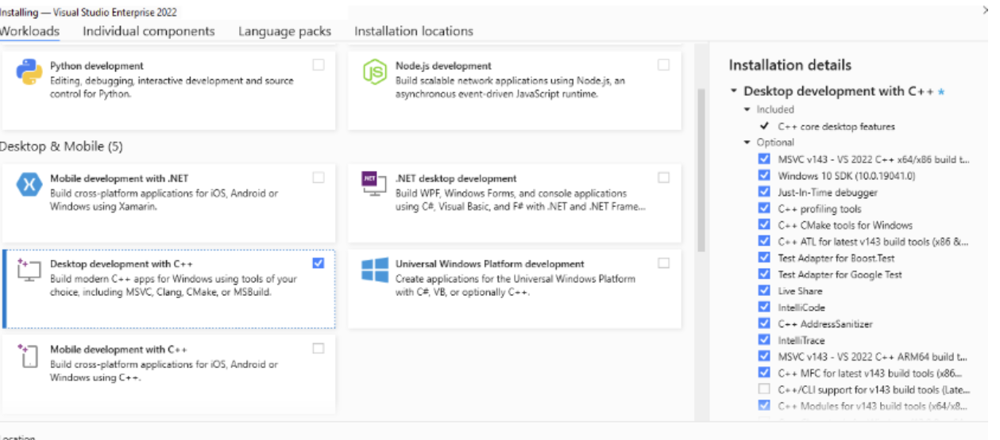
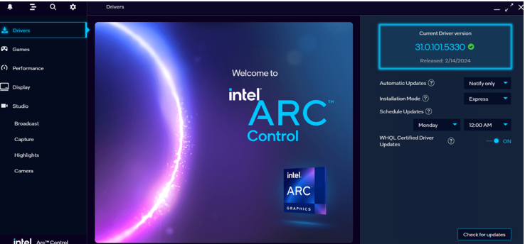
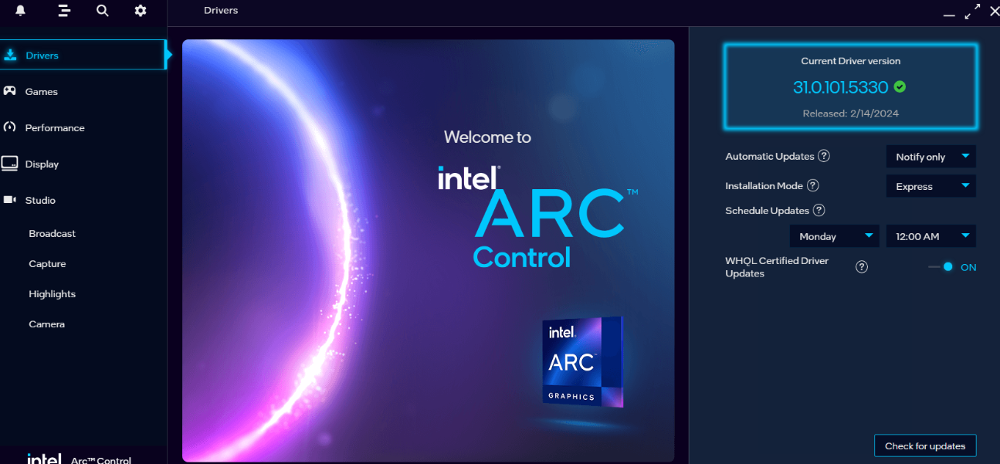
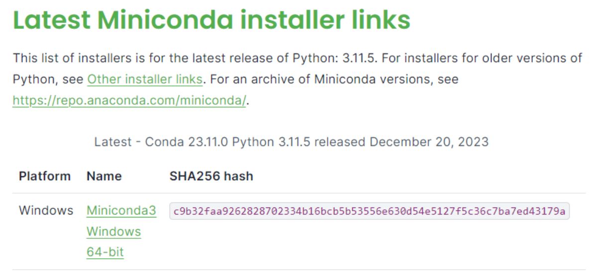
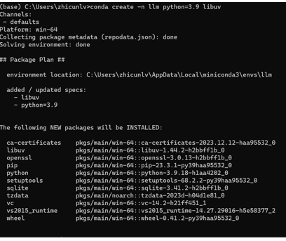
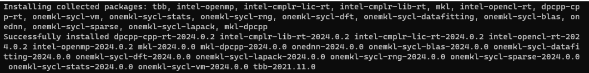

# Install BigDL-LLM on Windows for Intel GPU

## iGPU

### Install GPU driver

1. Step 1: Install Visual Studio 2022 Community Edition from [here]([Download Visual Studio Tools - Install Free for Windows, Mac, Linux (microsoft.com)](https://visualstudio.microsoft.com/downloads/)). 

   

> Note select `Desktop development with C++` during installation. 
>
> 
>
> The installation could be slow and cost 15 minutes. Need at least 7GB. 
>
> If you do not select this workload during installation, go to Tools > Get Tools and Features... to change workload following [this page]([Install C and C++ support in Visual Studio | Microsoft Learn](https://learn.microsoft.com/en-us/cpp/build/vscpp-step-0-installation?view=msvc-170#step-4---choose-workloads)). 

2. Step 2: Install latest GPU driver from [here]([Intel® Arc™ & Iris® Xe Graphics - Windows*](https://www.intel.com/content/www/us/en/download/785597/intel-arc-iris-xe-graphics-windows.html)). Note the process could be slow and It takes 10 minutes to download and install. Reboot is also needed.  After rebooting, we can check GPU status from GUI. 





### Install conda

We recommend using miniconda to create environment. Please refer to the [page]([Miniconda — Anaconda documentation](https://docs.anaconda.com/free/miniconda/)) to install miniconda. 

* Choose windows miniconda installer. Download and install. It takes a few minutes. 

  

* After installation, open `Anaconda prompt` and create an environment by `conda create -n llm python=3.9 libuv` . 

  > Note: if you encounter CondaHTTPError problem and fail to create the environment, please check the internet connection and proxy setting. You can define your proxy setting by `conda config --set proxy_servers.http your_http_proxy_IP:port` and `conda config --set proxy_servers.https your_https_proxy_IP:port`
  >
  > 

### Install oneAPI 

 Install oneAPI Base Toolkit with the help of pip. After ensuring  `conda` is ready, we can use `pip ` to install oneAPI Base Toolkit. 

```bash
pip install dpcpp-cpp-rt==2024.0.2 mkl-dpcpp==2024.0.0 onednn==2024.0.0
```

> If you encounter HTTP Timeout error, also check your internet and proxy setting in `pip.ini` file which is under "C:\Users\YourName\AppData\Roaming\pip"  folder. 

When you successfully install oneAPI from pip, you will see similar thing from the Anaconda prompt command line. 

### Install bigdl-llm

1. Step 1: Run the commands below in Anaconda prompt. 

```bash
conda create -n llm python=3.9 libuv # Already done in "Install conda" section
conda activate llm
pip install dpcpp-cpp-rt==2024.0.2 mkl-dpcpp==2024.0.0 onednn==2024.0.0 # Already done in "Install oneAPI" section
pip install --pre --upgrade bigdl-llm[xpu] -f https://developer.intel.com/ipex-whl-stable-xpu
```


2. Step 2: Now we can test whether all the components have been installed correctly. If we can import all the packages correctly following the python file below, then the installation is correct. 
   ```python
   import torch
   import time
   import argparse
   import numpy as np
   
   from bigdl.llm.transformers import AutoModel,AutoModelForCausalLM
   from transformers import AutoTokenizer, GenerationConfig
   ```

   Then we use phi-1.5 as an example to show how to run the model with bigdl-llm on windows. 
   ```python
   import torch
   import time
   import argparse
   import numpy as np
   
   from bigdl.llm.transformers import AutoModel,AutoModelForCausalLM
   from transformers import AutoTokenizer, GenerationConfig
   
   PHI1_5_PROMPT_FORMAT = " Question:{prompt}\n\n Answer:"
   generation_config = GenerationConfig(use_cache = True)
   
   if __name__ == '__main__':
       parser = argparse.ArgumentParser(description='Predict Tokens using `generate()` API for phi-1_5 model')
       parser.add_argument('--repo-id-or-model-path', type=str, default="microsoft/phi-1_5",
                           help='The huggingface repo id for the phi-1_5 model to be downloaded'
                                ', or the path to the huggingface checkpoint folder')
       parser.add_argument('--prompt', type=str, default="What is AI?",
                           help='Prompt to infer')
       parser.add_argument('--n-predict', type=int, default=32,
                           help='Max tokens to predict')
   
       args = parser.parse_args()
       model_path = args.repo_id_or_model_path
   
       # Load model in 4 bit,
       # which convert the relevant layers in the model into INT4 format
       # When running LLMs on Intel iGPUs for Windows users, we recommend setting `cpu_embedding=True` in the from_pretrained function.
       # This will allow the memory-intensive embedding layer to utilize the CPU instead of iGPU.
       model = AutoModelForCausalLM.from_pretrained(model_path,
                                                    load_in_4bit=True,
                                                    trust_remote_code=True)
   
       model = model.to('xpu')
   
       # Load tokenizer
       tokenizer = AutoTokenizer.from_pretrained(model_path,
                                                 trust_remote_code=True)
       
       # Generate predicted tokens
       with torch.inference_mode():
           prompt = PHI1_5_PROMPT_FORMAT.format(prompt=args.prompt)
           input_ids = tokenizer.encode(prompt, return_tensors="pt").to('xpu')
   
           # ipex model needs a warmup, then inference time can be accurate
           output = model.generate(input_ids,
                                   max_new_tokens=args.n_predict,
                                   generation_config = generation_config)
           # start inference
           st = time.time()
           # if your selected model is capable of utilizing previous key/value attentions
           # to enhance decoding speed, but has `"use_cache": false` in its model config,
           # it is important to set `use_cache=True` explicitly in the `generate` function
           # to obtain optimal performance with BigDL-LLM INT4 optimizations
   
           # Note that phi-1_5 uses GenerationConfig to enable 'use_cache'
           output = model.generate(input_ids, do_sample=False, max_new_tokens=args.n_predict, generation_config = generation_config)
           torch.xpu.synchronize()
           end = time.time()
           output = output.cpu()
           output_str = tokenizer.decode(output[0], skip_special_tokens=True)
           print(f'Inference time: {end-st} s')
           print('-'*20, 'Prompt', '-'*20)
           print(prompt)
           print('-'*20, 'Output', '-'*20)
           print(output_str)
   ```
   Here is the sample output on the laptop. 
   ```
   Inference time: 3.526491641998291 s
   -------------------- Prompt --------------------
   Question:What is AI?

   Answer:
   -------------------- Output --------------------
   Question:What is AI?

   Answer: AI stands for Artificial Intelligence, which is the simulation of human intelligence in machines.
   ```

   

