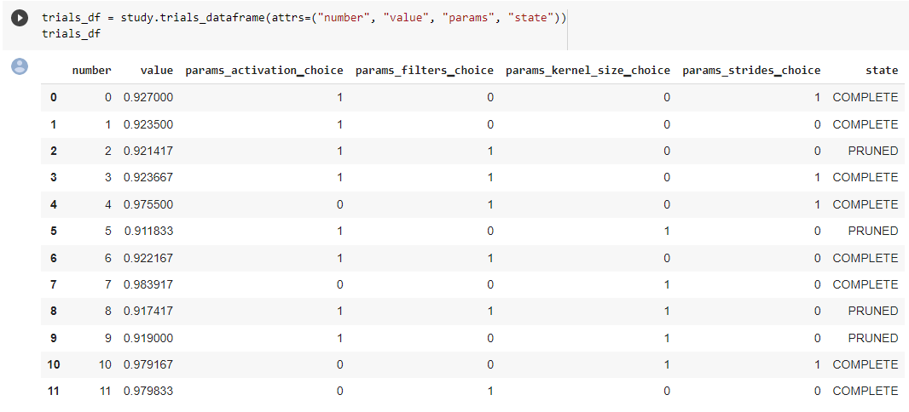

AutoML
***************

Nano provides built-in AutoML support through hyperparameter optimization.

By simply changing imports, you are able to search the model architecture (e.g. by specifying search spaces in layer/activation/function arguments when defining the model), or the training procedure (e.g. by specifying search spaces in ``learning_rate`` or ``batch_size``). You can simply use ``search`` on Model (for tensorflow) or on Trainier (for pytorch) to launch search trials, and ``search_summary`` to review the search results.

Under the hood, the objects (layers, activations, model, etc.) are implicitly turned into searchable objects at creation, which allows search spaces to be specified in their init arguments. Nano HPO collects those search spaces and passes them to the underlying HPO engine (i.e. Optuna) which generates hyperparameter suggestions accordingly. The instantiation and execution of the corresponding objects are delayed until the hyperparameter values are available in each trial.

Install
=======

If you have not installed BigDL-Nano, follow :doc:`Nano Install Guide <../Overview/nano.md#2-install>` to install it according to your system and framework (i.e. tensorflow or pytorch).

Next, install a few dependencies required for Nano HPO using below commands.

.. code-block:: console

    pip install ConfigSpace
    pip install optuna<=3.1.1

Search Spaces
=============

Search spaces are value range specifications that the search engine uses for sampling hyperparameters. The available search spaces in Nano HPO is defined in ``bigdl.nano.automl.hpo.space``. Refer to `Search Space API doc <../../PythonAPI/Nano/hpo_api.html#search-space>`_ for more details.

For Tensorflow Users
====================

Enable/Disable HPO for tensorflow
---------------------------------

For tensorflow training, you should call ``hpo_config.enable_hpo_tf`` before using Nano HPO.

``hpo_config.enable_hpo_tf`` will dynamically add searchable layers, activations, functions, optimizers, etc into the ``bigdl.nano.tf`` module. When importing layers, you need to change the imports from ``tf.keras.layers`` to ``bigdl.nano.tf.keras.layers``, so that you can specify search spaces in their init arguments. Note even if you don't need to search the model architecture, you still need to change the imports to use HPO.

.. code-block:: python
    :linenos:

    import bigdl.nano.automl as nano_automl
    nano_automl.hpo_config.enable_hpo_tf()

To disable HPO, use ``hpo_config.disable_hpo_tf``. This will remove the searchable objects from ``bigdl.nano.tf`` module.

.. code-block:: python
    :linenos:

    import bigdl.nano.automl as nano_automl
    nano_automl.hpo_config.disable_hpo_tf()

Search the Model Architecture
-----------------------------

To search different versions of your model, you can specify search spaces when defining the model using either sequential API, functional API or by subclassing ``tf.keras.Model``.

using Sequential API
^^^^^^^^^^^^^^^^^^^^

You can specify search spaces in layer arguments. Note that search spaces can only be specified in key-word argument (which means ``Dense(space.Int(...))`` should be changed to ``Dense(units=space.Int(...))``). Remember to import ``Sequential`` from ``bigdl.nano.automl.tf.keras`` instead of ``tensorflow.keras``

.. code-block:: python
    :linenos:

    from bigdl.nano.tf.keras.layers import Dense, Conv2D, Flatten
    from bigdl.nano.automl.tf.keras import Sequential
    model = Sequential()
    model.add(Conv2D(
        filters=space.Categorical(32, 64),
        kernel_size=space.Categorical(3, 5),
        strides=space.Categorical(1, 2),
        activation=space.Categorical("relu", "linear"),
        input_shape=input_shape))
    model.add(Flatten())
    model.add(Dense(10, activation="softmax"))

using Functional API
^^^^^^^^^^^^^^^^^^^^

You can specify search spaces in layer arguments. Note that if a layer is used more than once in the model, we strongly suggest you specify a ``prefix`` for each search space in such layers to distinguish them, or they will share the same search space (the last space will override all previous definition), as shown in the below example. Remember to import ``Model`` from ``bigdl.nano.automl.tf.keras`` instead of ``tensorflow.keras``.

.. code-block:: python
    :linenos:

    import bigdl.nano.automl.hpo.space as space
    from bigdl.nano.tf.keras import Input
    from bigdl.nano.tf.keras.layers import Dense, Dropout
    from bigdl.nano.automl.tf.keras import Model

    inputs = Input(shape=(784,))
    x = Dense(units=space.Categorical(8,16,prefix='dense_1'), activation="linear")(inputs)
    x = Dense(units=space.Categorical(32,64,prefix='dense_2'), activation="tanh")(x)
    x = Dropout(rate=space.Real(0.1,0.5, prefix='dropout'))(x)
    outputs = Dense(units=10)(x)
    model = Model(inputs=inputs, outputs=outputs, name="mnist_model")

by Subclassing tf.keras.Model
^^^^^^^^^^^^^^^^^^^^^^^^^^^^^^

For models defined by subclassing tf.keras.Model, use the decorator ``@hpo.tfmodel`` to turn the model into a searchable object. Then you will able to specify either search spaces or normal values in the model init arguments.

.. code-block:: python
    :linenos:

    import bigdl.nano.automl.hpo.space as space
    import bigdl.nano.automl.hpo as hpo
    @hpo.tfmodel()
    class MyModel(tf.keras.Model):
        def __init__(self, filters, kernel_size, strides, num_classes=10):
            super().__init__()
            self.conv1 = tf.keras.layers.Conv2D(filters=filters,
                                kernel_size=kernel_size,
                                strides=strides,
                                activation="relu")
            self.max1  = tf.keras.layers.MaxPooling2D(3)
            self.bn1   = tf.keras.layers.BatchNormalization()

            self.gap   = tf.keras.layers.GlobalAveragePooling2D()
            self.dense = tf.keras.layers.Dense(num_classes)

        def call(self, inputs, training=False):
            x = self.conv1(inputs)
            x = self.max1(x)
            x = self.bn1(x)
            x = self.gap(x)
            return self.dense(x)

    model = MyModel(
        filters=hpo.space.Categorical(32, 64),
        kernel_size=hpo.space.Categorical(3, 5),
        strides=hpo.space.Categorical(1, 2)
    )

Search the Learning Rate
------------------------

To search the learning rate, specify search space in ``learning_rate`` argument in the optimizer argument in ``model.compile``. Remember to import the optimizer from ``bigdl.nano.tf.optimizers`` instead of ``tf.keras.optimizers``.

.. code-block:: python
    :linenos:

    import bigdl.nano.automl.hpo.space as space
    from bigdl.nano.tf.optimizers import RMSprop
    model.compile(
        loss=keras.losses.SparseCategoricalCrossentropy(from_logits=True),
        optimizer=RMSprop(learning_rate=space.Real(0.0001, 0.01, log=True)),
        metrics=["accuracy"],
    )

Search the Batch Size
----------------------

To search the batch size, specify search space in ``batch_size`` argument in ``model.search``.

.. code-block:: python
    :linenos:

    import bigdl.nano.automl.hpo.space as space
    model.search(n_trials=2, target_metric='accuracy', direction="maximize",
        x=x_train, y=y_train,validation_data=(x_valid, y_valid),
        batch_size=space.Categorical(128,64))

Launch Hyperparameter Search and Review the Results
----------------------------------------------------

To launch hyperparameter search, call ``model.search`` after compile, as shown below. ``model.search`` runs the ``n_trials`` number of trials (meaning ``n_trials`` set of hyperparameter combinations are searched), and optimizes the ``target_metric`` in the specified ``direction``. Besides search arguments, you also need to specify fit arguments in ``model.search`` which will be used in the fitting process in each trial. Refer to `API docs <../../PythonAPI/Nano/hpo_api.html#bigdl.nano.automl.tf.keras.Model.search>`_ for details.

Call ``model.search_summary`` to retrieve the search results, which you can use to get all trial statistics in pandas dataframe format, pick the best trial, or do visualizations.  Examples of search results analysis and visualization can be found `here <#analysis-and-visualization>`_.

Finally, ``model.fit`` will automatically fit the model using the best set of hyper parameters found in the search. You can also use the hyperparameters from a particular trial other than the best one. Refer to `API docs <../../PythonAPI/Nano/tensorflow.html#bigdl.nano.tf.keras.Model.fit>`_ for details.

.. code-block:: python
    :linenos:

    model = ... # define the model
    model.compile(...)
    model.search(n_trials=100, target_metric='accuracy', direction="maximize",
        x=x_train, y=y_train, batch_size=32, epochs=20, validation_split=0.2)
    study = model.search_summary()
    model.fit(...)

For PyTorch Users
==================

Nano-HPO now only supports hyperparameter search for `pytorch-lightning <https://github.com/Lightning-AI/lightning>`_ modules.

Search the Model Architecture
-----------------------------

To search the model architecture, use the decorator ``@hpo.plmodel()`` to turn the model into a searchable object. Put the arguments that you want to search in the init arguments and use the arguments to construct the model. The arguments can be either space or non-space values, as shown below.

.. code-block:: python
    :linenos:

    import bigdl.nano.automl.hpo.space as space
    import bigdl.nano.automl.hpo as hpo

    @hpo.plmodel()
    class MyModel(pl.LightningModule):
        """Customized Model."""
        def __init__(self,out_dim1,out_dim2,dropout_1,dropout_2):
            super().__init__()
            layers = []
            input_dim = 32
            for out_dim, dropout in [(out_dim1, dropout_1),(out_dim2,dropout_2)]:
                layers.append(torch.nn.Linear(input_dim, out_dim))
                layers.append(torch.nn.Tanh())
                layers.append(torch.nn.Dropout(dropout))
                input_dim = out_dim
            layers.append(torch.nn.Linear(input_dim, 2))
            self.layers: torch.nn.Module = torch.nn.Sequential(*layers)
            self.save_hyperparameters()
        def forward(self, x):
            return self.layers(x)

    model = MyModel(
        out_dim1=space.Categorical(16,32),
        out_dim2=space.Categorical(16,32),
        dropout_1=space.Categorical(0.1, 0.2, 0.3, 0.4, 0.5),
        dropout_2 = 0.5)

Search the Learning Rate
-------------------------

``learning_rate`` can be specified in the init arguments of your model. You can use ``learning_rate`` to construct the optimizer in ``configure_optimizers()``, as shown below.

.. code-block:: python
    :linenos:

    import bigdl.nano.automl.hpo.space as space
    import bigdl.nano.automl.hpo as hpo

    @hpo.plmodel()
    class MyModel(pl.LightningModule):
        def __init__(self, ..., learning_rate=0.1):
            ...
            self.save_hyperparameters()
        def configure_optimizers(self):
            # set learning rate in the optimizer
            self.optimizer = torch.optim.Adam(self.layers.parameters(),
                                            lr=self.hparams.learning_rate)
            return [self.optimizer], []
    model = MyModel(..., learning_rate=space.Real(0.001,0.01,log=True))

Search the Batch Size
-------------------------

``batch_size`` can be specified in the init arguments of your model. You can use the ``batch_size`` to construct the ``DataLoader`` in ``train_dataloader()``, as shown below.

.. code-block:: python
    :linenos:

    import bigdl.nano.automl.hpo.space as space
    import bigdl.nano.automl.hpo as hpo
    @hpo.plmodel()
    class MyModel(pl.LightningModule):
        def __init__(self, ..., batch_size=16):
            ...
            self.save_hyperparameters()
        def train_dataloader(self):
            # set the batch size in train dataloader
            return DataLoader(RandomDataset(32, 64),
                            batch_size=self.hparams.batch_size)
    model = MyModel(..., batch_size = space.Categorical(32,64))

Launch Hyperparameter Search and Review the Results
----------------------------------------------------

First of all, import ``Trainer`` from ``bigdl.nano.pytorch`` instead of ``pytorch_lightning``. Remember to set ``use_hpo=True`` when initializing the ``Trainer``.

To launch hyperparameter search, call ``Trainer.search`` after model is defined. ``Trainer.search`` takes the decorated model as input. Similar to tensorflow, ``trainer.search`` runs the ``n_trials`` number of trials (meaning ``n_trials`` set of hyperparameter combinations are searched), and optimizes the ``target_metric`` in the specified ``direction``. There's an extra argument ``max_epochs`` which is used only in the fitting process in search trials without affecting ``Trainer.fit``. ``Trainer.search`` returns a model configured with the best set of hyper parameters.

Call ``Trainer.search_summary`` to retrieve the search results, which you can use to get all trial statistics in pandas dataframe format, pick the best trial, or do visualizations.  Examples of search results analysis and visualization can be found `here <#analysis-and-visualization>`_.

Finally you can use ``Trainer.fit()`` to fit the best model. You can also get a model constructed with hyperparameters from a particular trial other than the best one. Refer to `Trainer.search API doc <../../PythonAPI/Nano/hpo_api.html#bigdl.nano.pytorch.Trainer.search>`_ for more details.

.. code-block:: python
    :linenos:

    from bigdl.nano.pytorch import Trainer
    model = MyModel(...)
    trainer = Trainer(...,use_hpo=True)
    best_model = trainer.search(
        model,
        target_metric='val_loss',
        direction='minimize',
        n_trials=100,
        max_epochs=20,
    )
    study = trainer.search_summary()
    trainer.fit(best_model)

Resume Search
=================

You can call ``search`` more than once with flag ``resume=True`` to resume from a previous search instead of starting a new one.

The _resumed_ search will take into consideration all trials in the previous search when sampling hyperparameters. The trials in the resumed search will be stored in the same repo as the first search, and all trials will be retrieved as a whole by ``search_summary``.

Note that the flag ``resume`` is by default set to ``False``, which means each search will by default start from scratch and any previous search results will be overridden and can no longer be retrieved.

Use a Persistent Storage
-------------------------

By default, the storage used for storing trial info is created in-memory, so once the process is stopped the trial statistics can not be retrieved anymore. If you are expecting to run search for a long time and may resume search several times, it is highly recommended to use a persistent storage instead of the default in-memory storage.

To use a persistent storage, specify ``storage`` with an RDB url (e.g SQLlite, MySQL, etc.) in ``search``. The simplest way is to specify a sqllite url, as shown in the example below. It will automatically create a db file in the specified path. Also specify ``study_name`` so that all the search with the same name will be gathered into the same repo.

Example
--------

.. tabs::

    .. tab:: Tensorflow

        .. code-block:: python

         name = "resume-example"
         storage = "sqlite:///example.db"
         #the first search from scratch
         model.search(study_name=name, storage=storage,...)
         # the resumed search
         model.search(study_name=name, storage=storage, resume=True,...)

    .. tab:: PyTorch

        .. code-block:: python

         name = "resume-example"
         storage = "sqlite:///example.db"
         #the first search from scratch
         trainer.search(study_name=name, storage=storage,...)
         # the resumed search
         trainer.search(study_name=name, storage=storage, resume=True,...)

If the model/trainer object is still accessible along the searches (e.g. in a running jupyter notebook), the specification of ``storage`` and ``study_name`` can be omitted. Simply call ``search`` with ``resume=True`` to resume search.

Parallel Search
================

Parallel search allows trials to be run in multiple processes simultaneously. To use parallel search, you need to prepare an RDB database as storage. Then in ``search``, specify the database url for ``storage``, specify ``study_name``, and set ``n_parallels`` to the number of parallel processes you want to run.

We do not recommend SQLite as storage for parallel search as it may cause deadlocks and performance issues. Here we provide an example using MySQL.

Setup MySQL database
---------------------

If you already know how to create a database in MySQL, you can skip this step. We assume MySQL service is already installed and started in your local machine.

Create a new file with name ``setup_db.sql``, paste the below contents.

.. code-block:: sql
    :linenos:

    CREATE DATABASE IF NOT EXISTS example;
    CREATE USER IF NOT EXISTS bigdlhpo ;
    GRANT ALL PRIVILEGEs ON example.* TO bigdlhpo;
    FLUSH PRIVILEGES;

Run below command

.. code-block:: console

    $ sudo mysql -u root < setup_db.sql

The above command creates a new user ``bigdlhpo`` and a new database ``example``, and grants all access privileges on the ``example`` database to ``bigdlhpo``.

Install MySQL client for python
-------------------------------

Install ``mysqlclient`` so that search can access MySQL databases from python.

.. code-block:: console

    pip install mysqlclient

Example
--------

In search, specify ``storage`` to the MySQL database ``example`` we just created as user ``bigdlhpo``, specify ``study_name`` and also set ``n_parallels=8``.

.. tabs::

    .. tab:: Tensorflow

        .. code-block:: python

         name = "parallel-example-tf"
         storage = "mysql://bigdlhpo@localhost/example"
         # the first search from scratch
         model.search(study_name=name,
                    storage=storage,
                    n_parallels=8,
                    ...)

    .. tab:: PyTorch

        .. code-block:: python

         name = "parallel-example-torch"
         storage = "mysql://bigdlhpo@localhost/example"
         #the first search from scratch
         trainer.search(study_name=name,
                    storage=storage,
                    n_parallels=8,
                    ...)

Analysis and Visualization
============================

The result of ``search_summary`` can be used for further analysis and visualization.

Get trial statistics as dataframe
---------------------------------

You can export the trial statistics as pandas dataframe, as shown below.

.. tabs::

    .. tab:: Tensorflow

        .. code-block:: python

         ...
         study = model.search_summary()
         trials_df = study.trials_dataframe(attrs=("number", "value", "params", "state"))

    .. tab:: PyTorch

        .. code-block:: python

         ...
         study = trainer.search_summary()
         trials_df = study.trials_dataframe(attrs=("number", "value", "params", "state"))

Below an example of the trials history we have exported as below.

Plot Hyperparamter Optimization History
--------------------------------------------------------

You can also plot the optimization history as shown below.

.. tabs::

    .. tab:: Tensorflow

        .. code-block:: python

         ...
         study = model.search_summary()

         from bigdl.nano.automl.hpo.visualization import plot_optimization_history
         plot1=plot_optimization_history(study)

    .. tab:: PyTorch

        .. code-block:: python

         ...
         study = trainer.search_summary()

         from bigdl.nano.automl.hpo.visualization import plot_optimization_history
         plot_optimization_history(study)

Example plot as below. It is an interactive chart which you can zoom-in and zoom-out and select data points.

.. only:: html

    .. raw:: html

        <iframe src='../../../_static/hpovis/optimization_history.html' height="400px" width="100%" scrolling='no'></iframe>

Plot Intermediate Values
--------------------------------------------------------

You can also plot the intermediate values as shown below. This plot shows the metric result on each epoch/step of each trial, including pruned trials.

.. tabs::

    .. tab:: Tensorflow

        .. code-block:: python

         ...
         study = model.search_summary()

         from bigdl.nano.automl.hpo.visualization import plot_intermediate_values
         plot_intermediate_values(study)

    .. tab:: PyTorch

        .. code-block:: python

         ...
         study = trainer.search_summary()

         from bigdl.nano.automl.hpo.visualization import plot_intermediate_values
         plot_intermediate_values(study)

Example plot as below. It is an interactive chart which you can zoom-in and zoom-out and select data points.

.. only:: html

    .. raw:: html

        <iframe src='../../../_static/hpovis/intermediate_values.html' height="400px" width="100%" scrolling='no'></iframe>

Plot the Hyperparameters in Parallel Coordinates
------------------------------------------------

You can plot the hyperparamters in parallel coordinates chart.

.. tabs::

    .. tab:: Tensorflow

        .. code-block:: python

         ...
         study = model.search_summary()

         from bigdl.nano.automl.hpo.visualization import plot_parallel_coordinate
         plot_parallel_coordinate(study)

    .. tab:: PyTorch

        .. code-block:: python

         ...
         study = trainer.search_summary()

         from bigdl.nano.automl.hpo.visualization import plot_parallel_coordinate
         plot_parallel_coordinate(study)

Example plot as below. It is an interactive chart which you can zoom-in and zoom-out and select data points.

.. only:: html

    .. raw:: html

        <iframe src='../../../_static/hpovis/parallel_coordinate.html' height="400px" width="100%" scrolling='no'></iframe>

Plot the Hyperparameter Contour
------------------------------------------------

You can plot the hyperparameter contour chart.

.. tabs::

    .. tab:: Tensorflow

        .. code-block:: python

         ...
         study = model.search_summary()

         from bigdl.nano.automl.hpo.visualization import plot_contour
         plot_contour(study)

    .. tab:: PyTorch

        .. code-block:: python

         ...
         study = trainer.search_summary()

         from bigdl.nano.automl.hpo.visualization import plot_contour
         plot_contour(study)

Example plot as below. It is an interactive chart which you can zoom-in and zoom-out and select data points.

.. only:: html

    .. raw:: html

        <iframe src='../../../_static/hpovis/contour.html' height="400px" width="100%" scrolling='no'></iframe>

Inspect Hyperparameter Importance by accuracy
---------------------------------------------

You can plot the hyperparameter importance according to their relationship to accuracy.

.. tabs::

    .. tab:: Tensorflow

        .. code-block:: python

         ...
         study = model.search_summary()

         from bigdl.nano.automl.hpo.visualization import plot_param_importances
         plot_param_importances(study)

    .. tab:: PyTorch

        .. code-block:: python

         ...
         study = trainer.search_summary()

         from bigdl.nano.automl.hpo.visualization import plot_param_importances
         plot_param_importances(study)

Example plot as below. It is an interactive chart which you can zoom-in and zoom-out and select data points.

.. only:: html

    .. raw:: html

        <iframe src='../../../_static/hpovis/param_importance.html' height="400px" width="100%" scrolling='no'></iframe>

Inspect Hyperparameter Importance by latency
--------------------------------------------

You can plot the hyperparameter importance according to their relationship to latency.

.. tabs::

    .. tab:: Tensorflow

        .. code-block:: python

         ...
         study = model.search_summary()

         from bigdl.nano.automl.hpo.visualization import plot_param_importances
         plot_param_importances(study, target=lambda t: t.duration.total_seconds(), target_name="duration")

    .. tab:: PyTorch

        .. code-block:: python

         ...
         study = trainer.search_summary()

         from bigdl.nano.automl.hpo.visualization import plot_param_importances
         plot_param_importances(study, target=lambda t: t.duration.total_seconds(), target_name="duration")

Example plot as below. It is an interactive chart which you can zoom-in and zoom-out and select data points.

.. only:: html

    .. raw:: html

        <iframe src='../../../_static/hpovis/param_importance_latency.html' height="400px" width="100%" scrolling='no'></iframe>

