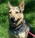

# BigDL-Nano PyTorch ONNXRuntime Acceleration Quickstart

**In this guide we will describe how to apply ONNXRuntime Acceleration on inference pipeline with the APIs delivered by BigDL-Nano in 4 simple steps**

### **Step 0: Prepare Environment**
We recommend using [conda](https://docs.conda.io/projects/conda/en/latest/user-guide/install/) to prepare the environment. Please refer to the [install guide](../../UserGuide/python.md) for more details.

```bash
conda create py37 python==3.7.10 setuptools==58.0.4
conda activate py37
# nightly bulit version
pip install --pre --upgrade bigdl-nano[pytorch]
# set env variables for your conda environment
source bigdl-nano-init
```

Before you start with onnxruntime accelerator, you are required to install some onnx packages as follows to set up your environment with ONNXRuntime acceleration.
```bash
pip install onnx onnxruntime
```
### **Step 1: Load the data**
```python
from torchvision.io import read_image
from bigdl.nano.pytorch.vision import transforms

paths = ["../Image/cat.jpg", "../Image/dog.jpg"]
data_transform =  transforms.Compose([transforms.RandomCrop(224),
                                     transforms.RandomHorizontalFlip(p=0.3),
                                     transforms.ToPILImage(),
                                     transforms.ToTensor(),
                                     transforms.Normalize([0.485, 0.456, 0.406], [0.229, 0.224, 0.225])])
cat = data_transform(read_image(paths[0]))
dog = data_transform(read_image(paths[1]))
```
Let’s have a quick look at our data<br>




### **Step 2: Prepare the Model**
```python
import torch
import torch.nn as nn
from torchvision.models import resnet18
# define your own model
class Predictor(nn.Module):
    def __init__(self):
        super().__init__()
        self.resnet18=resnet18(pretrained=True)

    def forward(self, x):
        y_hat = self.resnet18(x)
        return y_hat.argmax(dim=1)
# (Optional) Something else, like training ...
# trainer = Trainer()
# trainer.fit(model, data_loader)
```

### **Step 3: Apply ONNXRumtime Acceleration**
When you're ready, you can simply append the following part to enable your ONNXRuntime acceleration.
```python
batch = torch.stack([cat, dog])
predictor = Predictor()
predictor.eval()
predictor(batch)
# trace your model as an ONNXRuntime model
# The argument `input_sample` is not required in the following cases:
# you have run `trainer.fit` before trace
# The Model has `example_input_array` set
from bigdl.nano.pytorch import Trainer
ort_predictor = Trainer.trace(predictor, accelerator="onnxruntime", input_sample=batch)

# The usage is almost the same with any PyTorch module
ort_predictor(batch)
```
- Note
    `ort_predictor` is not trainable any more, so you can't use like trainer.fit(ort_model, dataloader)