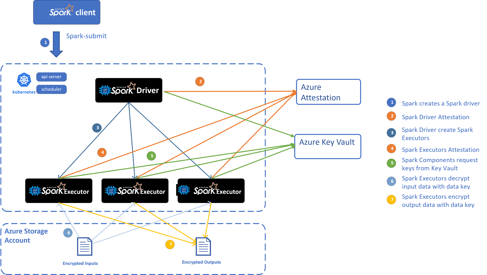
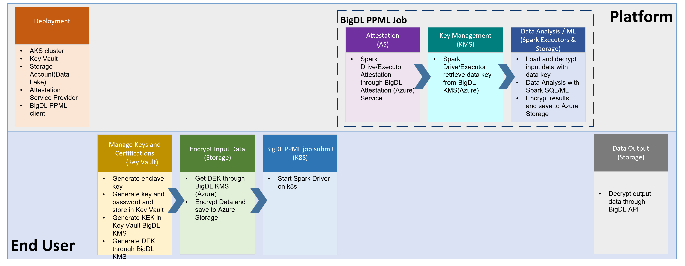

# Privacy Preserving Machine Learning (PPML) on Azure User Guide

## 1. Introduction
Protecting privacy and confidentiality is critical for large-scale data analysis and machine learning. BigDL ***PPML*** combines various low-level hardware and software security technologies (e.g., [Intel® Software Guard Extensions (Intel® SGX)](https://www.intel.com/content/www/us/en/architecture-and-technology/software-guard-extensions.html), [Library Operating System (LibOS)](https://events19.linuxfoundation.org/wp-content/uploads/2017/12/Library-OS-is-the-New-Container-Why-is-Library-OS-A-Better-Option-for-Compatibility-and-Sandboxing-Chia-Che-Tsai-UC-Berkeley.pdf) such as [Graphene](https://github.com/gramineproject/graphene) and [Occlum](https://github.com/occlum/occlum), [Federated Learning](https://en.wikipedia.org/wiki/Federated_learning), etc.), so that users can continue to apply standard Big Data and AI technologies (such as Apache Spark, Apache Flink, Tensorflow, PyTorch, etc.) without sacrificing privacy.

BigDL PPML on Azure solution integrate BigDL ***PPML*** technology with Azure Services(Azure Kubernetes Service, Azure Storage Account, Azure Key Vault, etc.) to facilitate Azure customer to create Big Data and AI applications while getting high privacy and confidentiality protection.

### Overall Architecture


### End-to-End Workflow


## 2. Setup
### 2.1 Install Azure CLI
Before you setup your environment, please install Azure CLI on your machine according to [Azure CLI guide](https://docs.microsoft.com/en-us/cli/azure/install-azure-cli).

Then run `az login` to login to Azure system before you run the following Azure commands.

### 2.2 Create Azure Linux VM for hosting BigDL PPML image
#### 2.2.1 Create Resource Group
On your machine, create resource group or use your existing resource group. Example code to create resource group with Azure CLI:
```
az group create \
    --name myResourceGroup \
    --location myLocation \
    --output none
```

#### 2.2.2 Create Linux VM with SGX support
Create Linux VM through Azure [CLI](https://docs.microsoft.com/en-us/azure/developer/javascript/tutorial/nodejs-virtual-machine-vm/create-linux-virtual-machine-azure-cli)/[Portal](https://docs.microsoft.com/en-us/azure/virtual-machines/linux/quick-create-portal)/Powershell.
For size of the VM, please choose DCSv3 Series VM with more than 4 vCPU cores.

#### 2.2.3 Start AESM service on Linux VM
* ubuntu 20.04
```bash
echo 'deb [arch=amd64] https://download.01.org/intel-sgx/sgx_repo/ubuntu focal main' | tee /etc/apt/sources.list.d/intelsgx.list
wget -qO - https://download.01.org/intel-sgx/sgx_repo/ubuntu/intel-sgx-deb.key | apt-key add -
sudo apt update
apt-get install libsgx-dcap-ql
apt install sgx-aesm-service
```
* ubuntu 18.04
```bash
echo 'deb [arch=amd64] https://download.01.org/intel-sgx/sgx_repo/ubuntu bionic main' | tee /etc/apt/sources.list.d/intelsgx.list
wget -qO - https://download.01.org/intel-sgx/sgx_repo/ubuntu/intel-sgx-deb.key | apt-key add -
sudo apt update
apt-get install libsgx-dcap-ql
apt install sgx-aesm-service
```

#### 2.2.4 Pull BigDL PPML image and run on Linux VM
* Go to Azure Marketplace, search "BigDL PPML" and find `BigDL PPML: Secure Big Data AI on Intel SGX` product. Click "Create" button which will lead you to `Subscribe` page.
On `Subscribe` page, input your subscription, your Azure container registry, your resource group and your location. Then click `Subscribe` to subscribe BigDL PPML to your container registry.

* Go to your Azure container regsitry (i.e. myContainerRegistry), check `Repostirories`, and find `intel_corporation/bigdl-ppml-trusted-big-data-ml-python-gramine`
* Login to the created VM. Then login to your Azure container registry, pull BigDL PPML image as needed.
  * If you want to run with 16G SGX memory, you can pull the image as below:
    ```bash
    docker pull myContainerRegistry.azurecr.io/intel_corporation/bigdl-ppml-trusted-big-data-ml-python-gramine:2.2.0-SNAPSHOT-16g
    ```
  * If you want to run with 32G SGX memory, you can pull the image as below:
    ```bash
    docker pull myContainerRegistry.azurecr.io/intel_corporation/bigdl-ppml-trusted-big-data-ml-python-gramine:2.2.0-SNAPSHOT-32g
    ```
  * If you want to run with 64G SGX memory, you can pull the image as below:
    ```bash
    docker pull myContainerRegistry.azurecr.io/intel_corporation/bigdl-ppml-trusted-big-data-ml-python-gramine:2.2.0-SNAPSHOT-64g
    ```
* Start container of this image
  The example script to start the image is as below:
  ```bash
  #!/bin/bash

  export LOCAL_IP=YOUR_LOCAL_IP
  export DOCKER_IMAGE=myContainerRegistry.azurecr.io/intel_corporation/bigdl-ppml-trusted-big-data-ml-python-gramine:2.2.0-SNAPSHOT-16g

  sudo docker run -itd \
      --privileged \
      --net=host \
      --cpuset-cpus="0-5" \
      --oom-kill-disable \
      --device=/dev/gsgx \
      --device=/dev/sgx/enclave \
      --device=/dev/sgx/provision \
      -v /var/run/aesmd/aesm.socket:/var/run/aesmd/aesm.socket \
      --name=spark-local \
      -e LOCAL_IP=$LOCAL_IP \
      $DOCKER_IMAGE bash
  ```

### 2.3 Create AKS(Azure Kubernetes Services) or use existing AKs
First, login to your client VM and enter your BigDL PPML container:
```bash
docker exec -it spark-local bash
```
Then run `az login` to login to Azure system.

Create AKS or use existing AKS with Intel SGX support.
In your BigDL PPML container, you can run `/ppml/trusted-big-data-ml/azure/create-aks.sh` to create AKS with confidential computing support.

Note: Please use the same VNet information of your client to create AKS. And use DC-Series VM size(i.e.Standard_DC8ds_v3) to create AKS.
```bash
/ppml/trusted-big-data-ml/azure/create-aks.sh \
    --resource-group myResourceGroup \
    --vnet-resource-group myVnetResourceGroup \
    --vnet-name myVnetName \
    --subnet-name mySubnetName \
    --cluster-name myAKSName \
    --vm-size myAKSNodeVMSize \
    --node-count myAKSInitNodeCount

```
You can check the information by running:
```bash
/ppml/trusted-big-data-ml/azure/create-aks.sh --help
```

### 2.4 Create Azure Data Lake Store Gen 2
#### 2.4.1 Create Data Lake Storage account or use an existing one.
The example command to create Data Lake store is as below:
```bash
az dls account create --account myDataLakeAccount --location myLocation --resource-group myResourceGroup
```
* Create Container to put user data

  Example command to create container
  ```bash
  az storage fs create -n myFS --account-name myDataLakeAccount --auth-mode login
  ```
* Create folder, upload file/folder

  Example command to create folder
  ```bash
  az storage fs directory create -n myDirectory -f myFS --account-name myDataLakeAccount --auth-mode login
  ```
  Example command to upload file
  ```bash
  az storage fs file upload -s "path/to/file" -p myDirectory/file  -f  myFS --account-name myDataLakeAccount --auth-mode login
  ```
  Example command to upload directory
  ```bash
  az storage fs directory upload -f myFS --account-name myDataLakeAccount -s "path/to/directory" -d myDirectory --recursive
  ```
#### 2.4.2  Access data in Hadoop through ABFS(Azure Blob Filesystem) driver
You can access Data Lake Storage in Hadoop filesytem by such URI:  ```abfs[s]://file_system@account_name.dfs.core.windows.net/<path>/<path>/<file_name>```
##### Authentication
The ABFS driver supports two forms of authentication so that the Hadoop application may securely access resources contained within a Data Lake Storage Gen2 capable account.
- Shared Key: This permits users to access to ALL resources in the account. The key is encrypted and stored in Hadoop configuration.

- Azure Active Directory OAuth Bearer Token: Azure AD bearer tokens are acquired and refreshed by the driver using either the identity of the end user or a configured Service Principal. Using this authentication model, all access is authorized on a per-call basis using the identity associated with the supplied token and evaluated against the assigned POSIX Access Control List (ACL).

By default, in our solution, we use shared key authentication.
- Get Access key list of the storage account:
  ```bash
  az storage account keys list -g MyResourceGroup -n myDataLakeAccount
  ```
Use one of the keys for authentication.

### 2.5 Create Azure Key Vault
#### 2.5.1 Create or use an existing Azure Key Vault
Example command to create key vault
```bash
az keyvault create -n myKeyVault -g myResourceGroup -l location
```
Take note of the following properties for use in the next section:

* The name of the secret object in the key vault
* The object type (secret, key, or certificate)
* The name of your Azure key vault resource
* The Azure tenant ID that the subscription belongs to

#### 2.5.2 Set access policy for the client VM
* Run such command to get the system identity:
  ```bash
  az vm identity assign -g myResourceGroup -n myVM
  ```
  The output would be like this:
  ```bash
  {
    "systemAssignedIdentity": "ff5505d6-8f72-4b99-af68-baff0fbd20f5",
    "userAssignedIdentities": {}
  }
  ```
  Take note of the systemAssignedIdentity of the client VM.

* Set access policy for client VM

  Example command:
  ```bash
  az keyvault set-policy --name myKeyVault --object-id <mySystemAssignedIdentity> --secret-permissions all --key-permissions all unwrapKey wrapKey
  ```

#### 2.5.3 AKS access Key Vault
##### 2.5.3.1 Set access for AKS VM ScaleSet
###### a. Find your VM ScaleSet in your AKS, and assign system managed identity to VM ScaleSet.
```bash
az vm identity assign -g myResourceGroup -n myAKSVMSS
```
The output would be like below:
```bash
principalId: xxxxxxxxx
tenantId: xxxxxxxxxxx
type: SystemAssigned, UserAssigned
userAssignedIdentities:
  ? /subscriptions/xxxx/resourceGroups/xxxxx/providers/Microsoft.ManagedIdentity/userAssignedIdentities/bigdl-ks-agentpool
  : clientId: xxxxxx
    principalId: xxxxx
```
Take note of principalId of the first line as System Managed Identity of your VMSS.
###### b. Set access policy for AKS VM ScaleSet
Example command:
```bash
az keyvault set-policy --name myKeyVault --object-id <systemManagedIdentityOfVMSS> --secret-permissions get --key-permissions get unwrapKey
```

## 3. Run Spark PPML jobs
Login to your client VM and enter your BigDL PPML container:
```bash
docker exec -it spark-local bash
```
Then run `az login` to login to Azure system.
### 3.1 Save kubeconfig to secret
Login to AKS use such command:
```bash
az aks get-credentials --resource-group  myResourceGroup --name myAKSCluster
```
Run such script to save kubeconfig to secret
```bash
/ppml/trusted-big-data-ml/azure/kubeconfig-secret.sh
```
### 3.2 Generate keys
Run such scripts to generate keys:
```bash
/ppml/trusted-big-data-ml/azure/generate-keys-az.sh
```
When entering the passphrase or password, you could input the same password by yourself; and these passwords could also be used for the next step of generating other passwords. Password should be longer than 6 bits and contain numbers and letters, and one sample password is "3456abcd". These passwords would be used for future remote attestations and to start SGX enclaves more securely.

After generate keys, run such command to save keys in Kubernetes.
```
kubectl apply -f /ppml/trusted-big-data-ml/work/keys/keys.yaml
```
### 3.3 Generate password
Run such script to save the password to Azure Key Vault
```bash
/ppml/trusted-big-data-ml/azure/generate-password-az.sh myKeyVault used_password_when_generate_keys
```
### 3.4 Create the RBAC
```bash
kubectl create serviceaccount spark
kubectl create clusterrolebinding spark-role --clusterrole=edit --serviceaccount=default:spark --namespace=default
```
### 3.5 Create image pull secret from your Azure container registry
  * If you already logged in to your Azure container registry, find your docker config json file (i.e. ~/.docker/config.json), and create secret for your registry credential like below:
  ```bash
  kubectl create secret generic regcred \
  --from-file=.dockerconfigjson=<path/to/.docker/config.json> \
  --type=kubernetes.io/dockerconfigjson
  ```
  * If you haven't logged in to your Azure container registry, you can create secret for your registry credential using your username and password:
  ```bash
  kubectl create secret docker-registry regcred --docker-server=myContainerRegistry.azurecr.io --docker-username=<your-name> --docker-password=<your-pword> --docker-email=<your-email>
  ```

### 3.6 Add image pull secret to service account
```bash
kubectl patch serviceaccount spark -p '{"imagePullSecrets": [{"name": "regcred"}]}'
```
### 3.7 Run PPML spark job
The example script to run PPML spark job on AKS is as below. You can also refer to `/ppml/trusted-big-data-ml/azure/submit-spark-sgx-az.sh`
```bash
export RUNTIME_DRIVER_MEMORY=8g
export RUNTIME_DRIVER_PORT=54321

RUNTIME_SPARK_MASTER=
AZ_CONTAINER_REGISTRY=myContainerRegistry
BIGDL_VERSION=2.2.0-SNAPSHOT
SGX_MEM=16g
SPARK_EXTRA_JAR_PATH=
SPARK_JOB_MAIN_CLASS=
ARGS=
DATA_LAKE_NAME=
DATA_LAKE_ACCESS_KEY=
KEY_VAULT_NAME=
PRIMARY_KEY_PATH=
DATA_KEY_PATH=

export secure_password=`az keyvault secret show --name "key-pass" --vault-name $KEY_VAULT_NAME --query "value" | sed -e 's/^"//' -e 's/"$//'`

bash bigdl-ppml-submit.sh \
    --master $RUNTIME_SPARK_MASTER \
    --deploy-mode client \
    --sgx-enabled true \
    --sgx-driver-jvm-memory 2g \
    --sgx-executor-jvm-memory 7g \
    --driver-memory 8g \
    --driver-cores 4 \
    --executor-memory 18g \
    --executor-cores 4 \
    --num-executors 2 \
    --conf spark.cores.max=8 \
    --name spark-decrypt-sgx \
    --conf spark.kubernetes.container.image=$AZ_CONTAINER_REGISTRY.azurecr.io/intel_corporation/bigdl-ppml-trusted-big-data-ml-python-gramine:$BIGDL_VERSION-$SGX_MEM \
    --driver-template /ppml/trusted-big-data-ml/azure/spark-driver-template-az.yaml \
    --executor-template /ppml/trusted-big-data-ml/azure/spark-executor-template-az.yaml \
    --jars local://$SPARK_EXTRA_JAR_PATH \
    --conf spark.hadoop.fs.azure.account.auth.type.${DATA_LAKE_NAME}.dfs.core.windows.net=SharedKey \
    --conf spark.hadoop.fs.azure.account.key.${DATA_LAKE_NAME}.dfs.core.windows.net=${DATA_LAKE_ACCESS_KEY} \
    --conf spark.hadoop.fs.azure.enable.append.support=true \
    --conf spark.bigdl.kms.type=AzureKeyManagementService \
    --conf spark.bigdl.kms.azure.vault=$KEY_VAULT_NAME \
    --conf spark.bigdl.kms.key.primary=$PRIMARY_KEY_PATH \
    --conf spark.bigdl.kms.key.data=$DATA_KEY_PATH \
    --class $SPARK_JOB_MAIN_CLASS \
    --verbose \
    $SPARK_EXTRA_JAR_PATH \
    $ARGS
```
### 3.8 Run simple query python example
This is an example script to run simple query python example job on AKS with data stored in Azure data lake store.
```bash
export RUNTIME_DRIVER_MEMORY=6g
export RUNTIME_DRIVER_PORT=54321

RUNTIME_SPARK_MASTER=
AZ_CONTAINER_REGISTRY=myContainerRegistry
BIGDL_VERSION=2.2.0-SNAPSHOT
SGX_MEM=16g
SPARK_VERSION=3.1.3

DATA_LAKE_NAME=
DATA_LAKE_ACCESS_KEY=
INPUT_DIR_PATH=xxx@$DATA_LAKE_NAME.dfs.core.windows.net/xxx
KEY_VAULT_NAME=
PRIMARY_KEY_PATH=
DATA_KEY_PATH=

export secure_password=`az keyvault secret show --name "key-pass" --vault-name $KEY_VAULT_NAME --query "value" | sed -e 's/^"//' -e 's/"$//'`

bash bigdl-ppml-submit.sh \
    --master $RUNTIME_SPARK_MASTER \
    --deploy-mode client \
    --sgx-enabled true \
    --sgx-driver-jvm-memory 2g \
    --sgx-executor-jvm-memory 7g \
    --driver-memory 6g \
    --driver-cores 4 \
    --executor-memory 24g \
    --executor-cores 2 \
    --num-executors 1 \
    --name simple-query-sgx \
    --conf spark.kubernetes.container.image=$AZ_CONTAINER_REGISTRY.azurecr.io/intel_corporation/bigdl-ppml-trusted-big-data-ml-python-gramine:$BIGDL_VERSION-$SGX_MEM \
    --driver-template /ppml/trusted-big-data-ml/azure/spark-driver-template-az.yaml \
    --executor-template /ppml/trusted-big-data-ml/azure/spark-executor-template-az.yaml \
    --conf spark.hadoop.fs.azure.account.auth.type.${DATA_LAKE_NAME}.dfs.core.windows.net=SharedKey \
    --conf spark.hadoop.fs.azure.account.key.${DATA_LAKE_NAME}.dfs.core.windows.net=${DATA_LAKE_ACCESS_KEY} \
    --conf spark.hadoop.fs.azure.enable.append.support=true \
    --properties-file /ppml/trusted-big-data-ml/work/bigdl-$BIGDL_VERSION/conf/spark-bigdl.conf \
    --conf spark.executor.extraClassPath=/ppml/trusted-big-data-ml/work/bigdl-$BIGDL_VERSION/jars/*:/ppml/trusted-big-data-ml/work/spark-$SPARK_VERSION/jars/* \
    --conf spark.driver.extraClassPath=/ppml/trusted-big-data-ml/work/bigdl-$BIGDL_VERSION/jars/*:/ppml/trusted-big-data-ml/work/spark-$SPARK_VERSION/jars/* \
    --py-files /ppml/trusted-big-data-ml/work/bigdl-$BIGDL_VERSION/python/bigdl-ppml-spark_$SPARK_VERSION-$BIGDL_VERSION-python-api.zip,/ppml/trusted-big-data-ml/work/bigdl-$BIGDL_VERSION/python/bigdl-spark_$SPARK_VERSION-$BIGDL_VERSION-python-api.zip,/ppml/trusted-big-data-ml/work/bigdl-$BIGDL_VERSION/python/bigdl-dllib-spark_$SPARK_VERSION-$BIGDL_VERSION-python-api.zip \
    /ppml/trusted-big-data-ml/work/examples/simple_query_example.py \
    --kms_type AzureKeyManagementService \
    --azure_vault $KEY_VAULT_NAME \
    --primary_key_path $PRIMARY_KEY_PATH \
    --data_key_path $DATA_KEY_PATH \
    --input_encrypt_mode aes/cbc/pkcs5padding \
    --output_encrypt_mode plain_text \
    --input_path $INPUT_DIR_PATH/people.csv \
    --output_path $INPUT_DIR_PATH/simple-query-result.csv
```
## 4. Run TPC-H example
TPC-H queries are implemented using Spark DataFrames API running with BigDL PPML.

### 4.1 Generating tables

Go to [TPC Download](https://www.tpc.org/tpc_documents_current_versions/current_specifications5.asp) site, choose `TPC-H` source code, then download the TPC-H toolkits.
After you download the TPC-h tools zip and uncompressed the zip file. Go to `dbgen` directory and create a makefile based on `makefile.suite`, and run `make`.

This should generate an executable called `dbgen`.

```
./dbgen -h
```

`dbgen` gives you various options for generating the tables. The simplest case is running:

```
./dbgen
```
which generates tables with extension `.tbl` with scale 1 (default) for a total of rougly 1GB size across all tables. For different size tables you can use the `-s` option:
```
./dbgen -s 10
```
will generate roughly 10GB of input data.

### 4.2 Generate primary key and data key
Generate primary key and data key, then save to file system.

The example code for generating the primary key and data key is like below:

```bash
BIGDL_VERSION=2.2.0-SNAPSHOT
SPARK_VERSION=3.1.3
java -cp /ppml/trusted-big-data-ml/work/bigdl-$BIGDL_VERSION/jars/*:/ppml/trusted-big-data-ml/work/spark-$SPARK_VERSION/conf/:/ppml/trusted-big-data-ml/work/spark-$SPARK_VERSION/jars/* \
    -Xmx10g \
    com.intel.analytics.bigdl.ppml.examples.GenerateKeys \
    --kmsType AzureKeyManagementService \
    --vaultName xxx \
    --primaryKeyPath xxx/keys/primaryKey \
    --dataKeyPath xxx/keys/dataKey
```

### 4.3 Encrypt Data
Encrypt data with specified BigDL `AzureKeyManagementService`

The example code of encrypting data is like below:

```bash
BIGDL_VERSION=2.2.0-SNAPSHOT
SPARK_VERSION=3.1.3
java -cp /ppml/trusted-big-data-ml/work/bigdl-$BIGDL_VERSION/jars/*:/ppml/trusted-big-data-ml/work/spark-$SPARK_VERSION/conf/:/ppml/trusted-big-data-ml/work/spark-$SPARK_VERSION/jars/* \
    -Xmx10g \
    com.intel.analytics.bigdl.ppml.examples.tpch.EncryptFiles \
    --kmsType AzureKeyManagementService \
    --vaultName xxx \
    --primaryKeyPath xxx/keys/primaryKey \
    --dataKeyPath xxx/keys/dataKey \
    --inputPath xxx/dbgen \
    --outputPath xxx/dbgen-encrypted
```

After encryption, you may upload encrypted data to Azure Data Lake store.

The example script is like below:

```bash
az storage fs directory upload -f myFS --account-name myDataLakeAccount -s xxx/dbgen-encrypted -d myDirectory --recursive
```

### 4.4 Running
Make sure you set the INPUT_DIR and OUTPUT_DIR in `TpchQuery` class before compiling to point to the
location of the input data and where the output should be saved.

The example script to run a query is like:

```bash
export RUNTIME_DRIVER_MEMORY=8g
export RUNTIME_DRIVER_PORT=54321

export secure_password=`az keyvault secret show --name "key-pass" --vault-name $KEY_VAULT_NAME --query "value" | sed -e 's/^"//' -e 's/"$//'`

RUNTIME_SPARK_MASTER=
AZ_CONTAINER_REGISTRY=myContainerRegistry
BIGDL_VERSION=2.2.0-SNAPSHOT
SGX_MEM=16g
SPARK_VERSION=3.1.3

DATA_LAKE_NAME=
DATA_LAKE_ACCESS_KEY=
KEY_VAULT_NAME=
PRIMARY_KEY_PATH=
DATA_KEY_PATH=
INPUT_DIR=xxx/dbgen-encrypted
OUTPUT_DIR=xxx/output

bash bigdl-ppml-submit.sh \
    --master $RUNTIME_SPARK_MASTER \
    --deploy-mode client \
    --sgx-enabled true \
    --sgx-driver-jvm-memory 2g \
    --sgx-executor-jvm-memory 7g \
    --driver-memory 8g \
    --driver-cores 4 \
    --executor-memory 18g \
    --executor-cores 4 \
    --num-executors 2 \
    --conf spark.cores.max=8 \
    --name spark-tpch-sgx \
    --conf spark.kubernetes.container.image=$AZ_CONTAINER_REGISTRY.azurecr.io/intel_corporation/bigdl-ppml-trusted-big-data-ml-python-gramine:$BIGDL_VERSION-$SGX_MEM \
    --driver-template /ppml/trusted-big-data-ml/azure/spark-driver-template-az.yaml \
    --executor-template /ppml/trusted-big-data-ml/azure/spark-executor-template-az.yaml \
    --conf spark.sql.auto.repartition=true \
    --conf spark.default.parallelism=400 \
    --conf spark.sql.shuffle.partitions=400 \
    --conf spark.hadoop.fs.azure.account.auth.type.${DATA_LAKE_NAME}.dfs.core.windows.net=SharedKey \
    --conf spark.hadoop.fs.azure.account.key.${DATA_LAKE_NAME}.dfs.core.windows.net=${DATA_LAKE_ACCESS_KEY} \
    --conf spark.hadoop.fs.azure.enable.append.support=true \
    --conf spark.bigdl.kms.type=AzureKeyManagementService \
    --conf spark.bigdl.kms.azure.vault=$KEY_VAULT_NAME \
    --conf spark.bigdl.kms.key.primary=$PRIMARY_KEY_PATH \
    --conf spark.bigdl.kms.key.data=$DATA_KEY_PATH \
    --class com.intel.analytics.bigdl.ppml.examples.tpch.TpchQuery \
    --verbose \
    local:///ppml/trusted-big-data-ml/work/bigdl-$BIGDL_VERSION/jars/bigdl-ppml-spark_$SPARK_VERSION-$BIGDL_VERSION.jar \
    $INPUT_DIR $OUTPUT_DIR aes/cbc/pkcs5padding plain_text [QUERY]
```

INPUT_DIR is the TPC-H's data dir.
OUTPUT_DIR is the dir to write the query result.
The optional parameter [QUERY] is the number of the query to run e.g 1, 2, ..., 22
