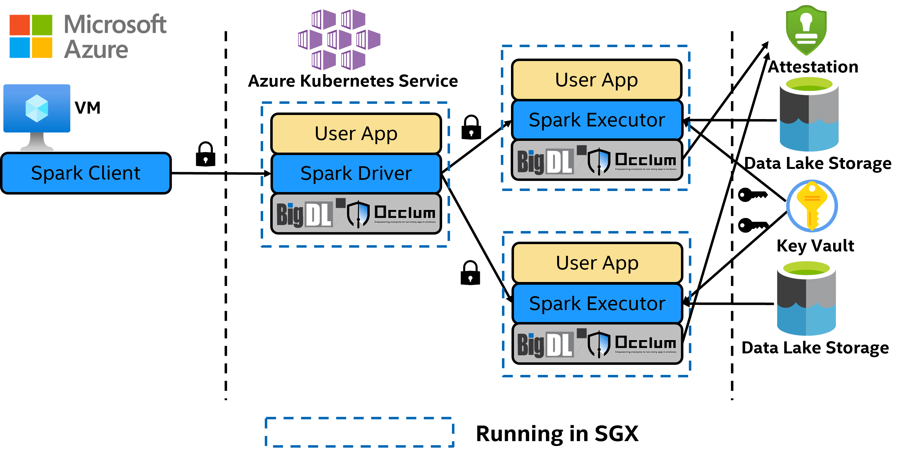
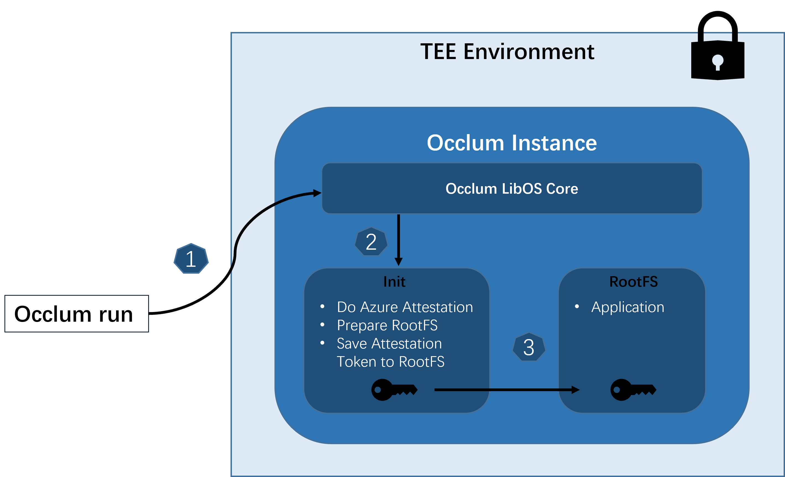

# BigDL PPML Azure Occlum Example

## Overview

This documentation demonstrates how to run standard Apache Spark applications with BigDL PPML and Occlum on Azure Intel SGX enabled Confidential Virtual machines ([DCsv3](https://docs.microsoft.com/en-us/azure/virtual-machines/dcv3-series) or [Azure Kubernetes Service (AKS)](https://azure.microsoft.com/en-us/services/kubernetes-service/)). These Azure Virtual Machines include the Intel SGX extensions.

Key points:

* Azure Cloud Services:  
    * [Azure Data Lake Storage](https://azure.microsoft.com/en-us/services/storage/data-lake-storage/): a secure cloud storage platform that provides scalable, cost-effective storage for big data analytics. 
    * [Key Vault](https://azure.microsoft.com/en-us/services/key-vault/): Safeguard cryptographic keys and other secrets used by cloud apps and services. Although, this solution works for all Azure Key Valut types, it is recommended to use [Azure Key Vault Managed HSM](https://learn.microsoft.com/en-us/azure/key-vault/managed-hsm/overview) (FIPS 140-2 Level 3) for better safety.
    * [Attestation Service](https://azure.microsoft.com/en-us/services/azure-attestation/): A unified solution for remotely verifying the trustworthiness of a platform and integrity of the binaries running inside it.

    

* Occlum: Occlum is a memory-safe, multi-process library OS (LibOS) for Intel SGX. As a LibOS, it enables legacy applications to run on Intel® SGX with little to no modifications of source code, thus protecting the confidentiality and integrity of user workloads transparently.

    

* For Azure attestation details in Occlum init process please refer to [`maa_init`](https://github.com/occlum/occlum/tree/master/demos/remote_attestation/azure_attestation/maa_init).

## Prerequisites

* Set up Azure VM on Azure
    * [DCsv3](https://docs.microsoft.com/en-us/azure/virtual-machines/dcv3-series) for [single node spark example](#single-node-spark-examples-on-azure).
    * [Azure Kubernetes Service (AKS)](https://azure.microsoft.com/en-us/services/kubernetes-service/) for [distributed Spark examples](#distributed-spark-example-on-aks).
* Prepare image of Spark
* (Required for distributed Spark examples only) Download [Spark 3.1.2](https://archive.apache.org/dist/spark/spark-3.1.2/spark-3.1.2-bin-hadoop3.2.tgz) and extract Spark binary. Install OpenJDK-8, and `export SPARK_HOME=${Spark_Binary_dir}`.

Pull the image from [Dockerhub](https://hub.docker.com/r/intelanalytics/bigdl-ppml-azure-occlum).

```bash
docker pull intelanalytics/bigdl-ppml-azure-occlum:2.1.0
```

## Single Node Spark Examples on Azure

Single node Spark Examples require 1 Azure VM with SGX. All examples are running in SGX. You can apply it to your application with a few changes in dockerfile or scripts.

### SparkPi example

Run the SparkPi example with `run_spark_on_occlum_glibc.sh`.

```bash
docker run --rm -it \
    --name=azure-ppml-example-with-occlum \
    --device=/dev/sgx/enclave \
    --device=/dev/sgx/provision \
    intelanalytics/bigdl-ppml-azure-occlum:2.1.0 bash 
cd /opt
bash run_spark_on_occlum_glibc.sh pi
```

### Nytaxi example with Azure NYTaxi

Run the Nytaxi example with `run_azure_nytaxi.sh`.

```bash
docker run --rm -it \
    --name=azure-ppml-example-with-occlum \
    --device=/dev/sgx/enclave \
    --device=/dev/sgx/provision \
    intelanalytics/bigdl-ppml-azure-occlum:2.1.0 bash 
bash run_azure_nytaxi.sh
```

You should get Nytaxi dataframe count and aggregation duration when succeed.

## Distributed Spark Examples on AKS

### SparkPi on AKS

Configure environment variables in `run_spark_pi.sh`, `driver.yaml` and `executor.yaml`. Then you can submit SparkPi task with `run_spark_pi.sh`.

```bash
bash run_spark_pi.sh
```

### Nytaxi on AKS

Configure environment variables in `run_nytaxi_k8s.sh`, `driver.yaml` and `executor.yaml`. Then you can submit Nytaxi query task with `run_nytaxi_k8s.sh`.
```bash
bash run_nytaxi_k8s.sh
```

## Known issues

1. If you meet the following error when running the docker image:

    ```bash
    aesm_service[10]: Failed to set logging callback for the quote provider library.
    aesm_service[10]: The server sock is 0x5624fe742330
    ```

    This may be associated with [SGX DCAP](https://github.com/intel/linux-sgx/issues/812). And it's expected error message if not all interfaces in quote provider library are valid, and will not cause a failure.

2. If you meet the following error when running MAA example:

    ```bash
    [get_platform_quote_cert_data ../qe_logic.cpp:352] p_sgx_get_quote_config returned NULL for p_pck_cert_config.
    thread 'main' panicked at 'IOCTRL IOCTL_GET_DCAP_QUOTE_SIZE failed', /opt/src/occlum/tools/toolchains/dcap_lib/src/occlum_dcap.rs:70:13
    note: run with `RUST_BACKTRACE=1` environment variable to display a backtrace
    [ERROR] occlum-pal: The init process exit with code: 101 (line 62, file src/pal_api.c)
    [ERROR] occlum-pal: Failed to run the init process: EINVAL (line 150, file src/pal_api.c)
    [ERROR] occlum-pal: Failed to do ECall: occlum_ecall_broadcast_interrupts with error code 0x2002: Invalid enclave identification. (line 26, file src/pal_interrupt_thread.c)
    /opt/occlum/build/bin/occlum: line 337:  3004 Segmentation fault      (core dumped) RUST_BACKTRACE=1 "$instance_dir/build/bin/occlum-run" "$@"
    ```

    This may be associated with [[RFC] IOCTRL IOCTL_GET_DCAP_QUOTE_SIZE failed](https://github.com/occlum/occlum/issues/899).

## Reference

1.	<https://github.com/intel-analytics/BigDL-PPML-Azure-Occlum-Example> 
2.	<https://www.intel.com/content/www/us/en/developer/tools/software-guard-extensions/overview.html> 
3.	<https://www.databricks.com/glossary/what-are-spark-applications>
4.	<https://github.com/occlum/occlum> 
5.	<https://github.com/intel-analytics/BigDL>
6.	<https://docs.microsoft.com/en-us/azure/open-datasets/dataset-taxi-yellow>
7.	<https://azure.microsoft.com/en-us/services/storage/data-lake-storage/>
8.	<https://azure.microsoft.com/en-us/services/key-vault/>
9.	<https://azure.microsoft.com/en-us/services/azure-attestation/>
10.	<https://github.com/Azure-Samples/confidential-container-samples/blob/main/confidential-big-data-spark/README.md>
11.	<https://bigdl.readthedocs.io/en/latest/doc/PPML/Overview/ppml.html> 
