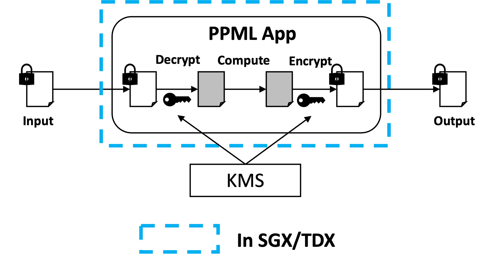

# Develop your own Big Data & AI applications with BigDL PPML

### 0. Understand E2E Security with PPML

Basic design guidelines for PPML applications are as follows:

* Data in use/computation should be protected by SGX.
* Data in transmit/network should be protected by encryption or TLS.
* Data at rest/storage should be protected by encryption.

This design ensures plain text data only be used in SGX, while in all others stages data is fully encrypted.



To our knowledge, most existing big data frameworks or systems have already provided network or storage protection. You can find more details in [Secure Your Services](https://bigdl.readthedocs.io/en/latest/doc/PPML/QuickStart/secure_your_services.html).

Please check with your admin or security department for security features and services available. We recommend building PPML applications based on the following conditions:

1. If you have network and storage protection enabled, and you want to secure computation with SGX. Then you can directly migrate your application into SGX with BigDL PPML. Please jump to [Migrate existing applications with BigDL PPML](#1-migrate-existing-applications-with-bigdl-ppml).
2. If you don't have any security features enabled, especially storage protection. Then you can use PPMLContext and recommended KMS. Please jump to [Enhance your applications with PPMLContext](#2-enhance-your-applications-with-ppmlcontext).

### 1. Migrate existing applications with BigDL PPML

This working model doesn't require any code change. You can reuse existing code and applications. The only difference is that your cluster manager/admin needs to set up a new execution environment for PPML applications.

You can find more details in these articles: 

* [Installation for PPML](https://bigdl.readthedocs.io/en/latest/doc/PPML/Overview/install.html).
* [Hello World Example](https://bigdl.readthedocs.io/en/latest/doc/PPML/Overview/quicktour.html).
* [Deployment for production](https://bigdl.readthedocs.io/en/latest/doc/PPML/QuickStart/deploy_ppml_in_production.html).

### 2. Enhance your applications with PPMLContext

In this section, we will introduce how to secure your applications with `PPMLContext`. It requires a few code changes and configurations for your applications.

First, you need to create a `PPMLContext`, which wraps `SparkSession` and provides methods to read encrypted data files into plain-text RDD/DataFrame and write DataFrame to encrypted data files. Then you can read & write data through `PPMLContext`.

If you are familiar with Spark, you may find that the usage of `PPMLContext` is very similar to Spark.

#### 2.1 Create PPMLContext

- create a PPMLContext with `appName`

   This is the simplest way to create a `PPMLContext`. When you don't need to read/write encrypted files, you can use this way to create a `PPMLContext`.

   <details open>
    <summary>scala</summary>

   ```scala
   import com.intel.analytics.bigdl.ppml.PPMLContext

   val sc = PPMLContext.initPPMLContext("MyApp")
   ```

   </details>

  <details>
    <summary>python</summary>

   ```python
   from bigdl.ppml.ppml_context import *

   sc = PPMLContext("MyApp")
   ```

   </details>

   If you want to read/write encrypted files, then you need to provide more information.

- create a PPMLContext with `appName` & `ppmlArgs`

   `ppmlArgs` is ppml arguments in a Map, `ppmlArgs` varies according to the kind of Key Management Service (KMS) you are using. Key Management Service (KMS) is used to generate `primaryKey` and `dataKey` to encrypt/decrypt data. We provide 3 types of KMS ——SimpleKeyManagementService, EHSMKeyManagementService, AzureKeyManagementService.

   Refer to [KMS Utils](https://github.com/intel-analytics/BigDL/blob/main/ppml/services/kms-utils/docker/README.md) to use KMS to generate `primaryKey` and `dataKey`, then you are ready to create **PPMLContext** with `ppmlArgs`.

  - For `SimpleKeyManagementService`:

      <details open>
       <summary>scala</summary>

      ```scala
      import com.intel.analytics.bigdl.ppml.PPMLContext

      val ppmlArgs: Map[String, String] = Map(
             "spark.bigdl.kms.type" -> "SimpleKeyManagementService",
             "spark.bigdl.kms.simple.id" -> "your_app_id",
             "spark.bigdl.kms.simple.key" -> "your_app_key",
             "spark.bigdl.kms.key.primary" -> "/your/primary/key/path/primaryKey",
             "spark.bigdl.kms.key.data" -> "/your/data/key/path/dataKey"
         )

      val sc = PPMLContext.initPPMLContext("MyApp", ppmlArgs)
      ```

      </details>


      <details>
       <summary>python</summary>

      ```python
      from bigdl.ppml.ppml_context import *

      ppml_args = {"kms_type": "SimpleKeyManagementService",
                   "simple_app_id": "your_app_id",
                   "simple_app_key": "your_app_key",
                   "primary_key_path": "/your/primary/key/path/primaryKey",
                   "data_key_path": "/your/data/key/path/dataKey"
                  }

      sc = PPMLContext("MyApp", ppml_args)
      ```

      </details>

   - For `EHSMKeyManagementService`:

      <details open>
       <summary>scala</summary>

      ```scala
      import com.intel.analytics.bigdl.ppml.PPMLContext

      val ppmlArgs: Map[String, String] = Map(
             "spark.bigdl.kms.type" -> "EHSMKeyManagementService",
             "spark.bigdl.kms.ehs.ip" -> "your_server_ip",
             "spark.bigdl.kms.ehs.port" -> "your_server_port",
             "spark.bigdl.kms.ehs.id" -> "your_app_id",
             "spark.bigdl.kms.ehs.key" -> "your_app_key",
             "spark.bigdl.kms.key.primary" -> "/your/primary/key/path/primaryKey",
             "spark.bigdl.kms.key.data" -> "/your/data/key/path/dataKey"
      )

      val sc = PPMLContext.initPPMLContext("MyApp", ppmlArgs)
      ```

     </details>

     <details>
       <summary>python</summary>

      ```python
      from bigdl.ppml.ppml_context import *

      ppml_args = {"kms_type": "EHSMKeyManagementService",
                   "kms_server_ip": "your_server_ip",
                   "kms_server_port": "your_server_port"
                   "ehsm_app_id": "your_app_id",
                   "ehsm_app_key": "your_app_key",
                   "primary_key_path": "/your/primary/key/path/primaryKey",
                   "data_key_path": "/your/data/key/path/dataKey"
                  }

      sc = PPMLContext("MyApp", ppml_args)
      ```

      </details>

   - For `AzureKeyManagementService`


     the parameter `clientId` is not necessary, you don't have to provide this parameter.

      <details open>
       <summary>scala</summary>

      ```scala
      import com.intel.analytics.bigdl.ppml.PPMLContext

      val ppmlArgs: Map[String, String] = Map(
             "spark.bigdl.kms.type" -> "AzureKeyManagementService",
             "spark.bigdl.kms.azure.vault" -> "key_vault_name",
             "spark.bigdl.kms.azure.clientId" -> "client_id",
             "spark.bigdl.kms.key.primary" -> "/your/primary/key/path/primaryKey",
             "spark.bigdl.kms.key.data" -> "/your/data/key/path/dataKey"
         )

      val sc = PPMLContext.initPPMLContext("MyApp", ppmlArgs)
      ```

     </details>

     <details>
       <summary>python</summary>

       ```python
       from bigdl.ppml.ppml_context import *

       ppml_args = {"kms_type": "AzureKeyManagementService",
                    "azure_vault": "your_azure_vault",
                    "azure_client_id": "your_azure_client_id",
                    "primary_key_path": "/your/primary/key/path/primaryKey",
                    "data_key_path": "/your/data/key/path/dataKey"
                   }

       sc = PPMLContext("MyApp", ppml_args)
       ```

     </details>

- create a PPMLContext with `sparkConf` & `appName` & `ppmlArgs`

   If you need to set Spark configurations, you can provide a `SparkConf` with Spark configurations to create a `PPMLContext`.

   <details open>
    <summary>scala</summary>

   ```scala
   import com.intel.analytics.bigdl.ppml.PPMLContext
   import org.apache.spark.SparkConf

   val ppmlArgs: Map[String, String] = Map(
       "spark.bigdl.kms.type" -> "SimpleKeyManagementService",
       "spark.bigdl.kms.simple.id" -> "your_app_id",
       "spark.bigdl.kms.simple.key" -> "your_app_key",
       "spark.bigdl.kms.key.primary" -> "/your/primary/key/path/primaryKey",
       "spark.bigdl.kms.key.data" -> "/your/data/key/path/dataKey"
   )

   val conf: SparkConf = new SparkConf().setMaster("local[4]")

   val sc = PPMLContext.initPPMLContext(conf, "MyApp", ppmlArgs)
   ```

  </details>

  <details>
    <summary>python</summary>

   ```python
   from bigdl.ppml.ppml_context import *
   from pyspark import SparkConf

   ppml_args = {"kms_type": "SimpleKeyManagementService",
                "simple_app_id": "your_app_id",
                "simple_app_key": "your_app_key",
                "primary_key_path": "/your/primary/key/path/primaryKey",
                "data_key_path": "/your/data/key/path/dataKey"
               }

   conf = SparkConf()
   conf.setMaster("local[4]")

   sc = PPMLContext("MyApp", ppml_args, conf)
   ```

  </details>

#### 2.2 Read and Write Files

To read/write data, you should set the `CryptoMode`:

- `plain_text`: no encryption
- `AES/CBC/PKCS5Padding`: for CSV, JSON and text file
- `AES_GCM_V1`: for PARQUET only
- `AES_GCM_CTR_V1`: for PARQUET only

To write data, you should set the `write` mode:

- `overwrite`: Overwrite existing data with the content of dataframe.
- `append`: Append new content of the dataframe to existing data or table.
- `ignore: Ignore the current write operation if data/table already exists without any error.
- `error`: Throw an exception if data or table already exists.
- `errorifexists`: Throw an exception if data or table already exists.

<details open>
  <summary>scala</summary>

```scala
import com.intel.analytics.bigdl.ppml.crypto.{AES_CBC_PKCS5PADDING, PLAIN_TEXT}

// read data
val df = sc.read(cryptoMode = PLAIN_TEXT)
         ...

// write data
sc.write(dataFrame = df, cryptoMode = AES_CBC_PKCS5PADDING)
.mode("overwrite")
...
```

</details>

<details>
  <summary>python</summary>

```python
from bigdl.ppml.ppml_context import *

# read data
df = sc.read(crypto_mode = CryptoMode.PLAIN_TEXT)
  ...

# write data
sc.write(dataframe = df, crypto_mode = CryptoMode.AES_CBC_PKCS5PADDING)
.mode("overwrite")
...
```

</details>

<details><summary>expand to see the examples of reading/writing CSV, PARQUET, JSON and text file</summary>

The following examples use `sc` to represent an initialized `PPMLContext`

**read/write CSV file**

<details open>
  <summary>scala</summary>

```scala
import com.intel.analytics.bigdl.ppml.PPMLContext
import com.intel.analytics.bigdl.ppml.crypto.{AES_CBC_PKCS5PADDING, PLAIN_TEXT}

// read a plain csv file and return a DataFrame
val plainCsvPath = "/plain/csv/path"
val df1 = sc.read(cryptoMode = PLAIN_TEXT).option("header", "true").csv(plainCsvPath)

// write a DataFrame as a plain csv file
val plainOutputPath = "/plain/output/path"
sc.write(df1, PLAIN_TEXT)
.mode("overwrite")
.option("header", "true")
.csv(plainOutputPath)

// read a encrypted csv file and return a DataFrame
val encryptedCsvPath = "/encrypted/csv/path"
val df2 = sc.read(cryptoMode = AES_CBC_PKCS5PADDING).option("header", "true").csv(encryptedCsvPath)

// write a DataFrame as a encrypted csv file
val encryptedOutputPath = "/encrypted/output/path"
sc.write(df2, AES_CBC_PKCS5PADDING)
.mode("overwrite")
.option("header", "true")
.csv(encryptedOutputPath)
```

</details>

<details>
  <summary>python</summary>

```python
# import
from bigdl.ppml.ppml_context import *

# read a plain csv file and return a DataFrame
plain_csv_path = "/plain/csv/path"
df1 = sc.read(CryptoMode.PLAIN_TEXT).option("header", "true").csv(plain_csv_path)

# write a DataFrame as a plain csv file
plain_output_path = "/plain/output/path"
sc.write(df1, CryptoMode.PLAIN_TEXT)
.mode('overwrite')
.option("header", True)
.csv(plain_output_path)

# read a encrypted csv file and return a DataFrame
encrypted_csv_path = "/encrypted/csv/path"
df2 = sc.read(CryptoMode.AES_CBC_PKCS5PADDING).option("header", "true").csv(encrypted_csv_path)

# write a DataFrame as a encrypted csv file
encrypted_output_path = "/encrypted/output/path"
sc.write(df2, CryptoMode.AES_CBC_PKCS5PADDING)
.mode('overwrite')
.option("header", True)
.csv(encrypted_output_path)
```

</details>

**read/write PARQUET file**

<details open>
  <summary>scala</summary>

```scala
import com.intel.analytics.bigdl.ppml.PPMLContext
import com.intel.analytics.bigdl.ppml.crypto.{AES_GCM_CTR_V1, PLAIN_TEXT}

// read a plain parquet file and return a DataFrame
val plainParquetPath = "/plain/parquet/path"
val df1 = sc.read(PLAIN_TEXT).parquet(plainParquetPath)

// write a DataFrame as a plain parquet file
plainOutputPath = "/plain/output/path"
sc.write(df1, PLAIN_TEXT)
.mode("overwrite")
.parquet(plainOutputPath)

// read a encrypted parquet file and return a DataFrame
val encryptedParquetPath = "/encrypted/parquet/path"
val df2 = sc.read(AES_GCM_CTR_V1).parquet(encryptedParquetPath)

// write a DataFrame as a encrypted parquet file
val encryptedOutputPath = "/encrypted/output/path"
sc.write(df2, AES_GCM_CTR_V1)
.mode("overwrite")
.parquet(encryptedOutputPath)
```

</details>


<details>
  <summary>python</summary>

```python
# import
from bigdl.ppml.ppml_context import *

# read a plain parquet file and return a DataFrame
plain_parquet_path = "/plain/parquet/path"
df1 = sc.read(CryptoMode.PLAIN_TEXT).parquet(plain_parquet_path)

# write a DataFrame as a plain parquet file
plain_output_path = "/plain/output/path"
sc.write(df1, CryptoMode.PLAIN_TEXT)
.mode('overwrite')
.parquet(plain_output_path)

# read a encrypted parquet file and return a DataFrame
encrypted_parquet_path = "/encrypted/parquet/path"
df2 = sc.read(CryptoMode.AES_GCM_CTR_V1).parquet(encrypted_parquet_path)

# write a DataFrame as a encrypted parquet file
encrypted_output_path = "/encrypted/output/path"
sc.write(df2, CryptoMode.AES_GCM_CTR_V1)
.mode('overwrite')
.parquet(encrypted_output_path)
```

</details>

**read/write JSON file**

<details open>
  <summary>scala</summary>

```scala
import com.intel.analytics.bigdl.ppml.PPMLContext
import com.intel.analytics.bigdl.ppml.crypto.{AES_CBC_PKCS5PADDING, PLAIN_TEXT}

// read a plain json file and return a DataFrame
val plainJsonPath = "/plain/json/path"
val df1 = sc.read(PLAIN_TEXT).json(plainJsonPath)

// write a DataFrame as a plain json file
val plainOutputPath = "/plain/output/path"
sc.write(df1, PLAIN_TEXT)
.mode("overwrite")
.json(plainOutputPath)

// read a encrypted json file and return a DataFrame
val encryptedJsonPath = "/encrypted/parquet/path"
val df2 = sc.read(AES_CBC_PKCS5PADDING).json(encryptedJsonPath)

// write a DataFrame as a encrypted parquet file
val encryptedOutputPath = "/encrypted/output/path"
sc.write(df2, AES_CBC_PKCS5PADDING)
.mode("overwrite")
.json(encryptedOutputPath)
```

</details>

<details>
  <summary>python</summary>

```python
# import
from bigdl.ppml.ppml_context import *

# read a plain json file and return a DataFrame
plain_json_path = "/plain/json/path"
df1 = sc.read(CryptoMode.PLAIN_TEXT).json(plain_json_path)

# write a DataFrame as a plain json file
plain_output_path = "/plain/output/path"
sc.write(df1, CryptoMode.PLAIN_TEXT)
.mode('overwrite')
.json(plain_output_path)

# read a encrypted json file and return a DataFrame
encrypted_json_path = "/encrypted/parquet/path"
df2 = sc.read(CryptoMode.AES_CBC_PKCS5PADDING).json(encrypted_json_path)

# write a DataFrame as a encrypted parquet file
encrypted_output_path = "/encrypted/output/path"
sc.write(df2, CryptoMode.AES_CBC_PKCS5PADDING)
.mode('overwrite')
.json(encrypted_output_path)
```

</details>

**read textfile**

<details open>
  <summary>scala</summary>

```scala
import com.intel.analytics.bigdl.ppml.PPMLContext
import com.intel.analytics.bigdl.ppml.crypto.{AES_CBC_PKCS5PADDING, PLAIN_TEXT}

// read from a plain csv file and return a RDD
val plainCsvPath = "/plain/csv/path"
val rdd1 = sc.textfile(plainCsvPath) // the default cryptoMode is PLAIN_TEXT

// read from a encrypted csv file and return a RDD
val encryptedCsvPath = "/encrypted/csv/path"
val rdd2 = sc.textfile(path=encryptedCsvPath, cryptoMode=AES_CBC_PKCS5PADDING)
```

</details>

<details>
  <summary>python</summary>

```python
# import
from bigdl.ppml.ppml_context import *

# read from a plain csv file and return a RDD
plain_csv_path = "/plain/csv/path"
rdd1 = sc.textfile(plain_csv_path) # the default crypto_mode is "plain_text"

# read from a encrypted csv file and return a RDD
encrypted_csv_path = "/encrypted/csv/path"
rdd2 = sc.textfile(path=encrypted_csv_path, crypto_mode=CryptoMode.AES_CBC_PKCS5PADDING)
```

</details>

</details>

For more usage with `PPMLContext` Python API, please refer to [PPMLContext Python API](https://github.com/intel-analytics/BigDL/blob/main/python/ppml/src/bigdl/ppml/README.md).
