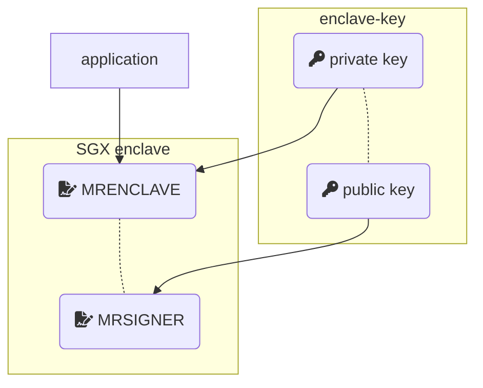

# Deploy PPML (Privacy Preserving Machine Learning) Applications in the Production Environment

PPML applications built on Intel SGX (Software Guard Extensions) are quite different from normal machine learning applications during deployment. More specifically, user applications are packaged with BigDL, Spark and LibOS etc into SGX enclave. This SGX enclave is runnable in Intel SGX.

However, Intel SGX requires applications (enclave) to be signed by a user-specified key, i.e., `enclave-key`. This requirement helps SGX applications ensure their integrity and build trust with attestation. However, it also separates PPML deployment into 2 stages:

1. Stage 1: Test & Development with BigDL PPML. This stage focuses on functionality and performance. Users/customers can use a randomly generated key or a user-specified key for signing, development and testing.
2. Stage 2: Build & Deployment. This stage focuses on safety and security. That means we have to separate signing out of deployment.
  * Build & sign applications with enclave-key.
  * Deploy applications.

Due to security and privacy considerations, only stage 1 is fully covered by BigDL PPML image. Customers/users need to handle Stage 2 carefully by themselves. In this guide, we will demonstrate how to go through these 2 stages step by step.

## 0. Prerequisite

Common requirements:

* Intel Xeon Server with SGX enabled. You can find more details in [Install SGX Driver for Xeon Server](https://bigdl.readthedocs.io/en/latest/doc/PPML/QuickStart/install_sgx_driver.html).
* Docker & Kubernetes.

Stage 1:

* BigDL PPML image, e.g., `intelanalytics/bigdl-ppml-trusted-big-data-ml-python-graphene` or `intelanalytics/bigdl-ppml-trusted-big-data-ml-scala-occlum`. You can pull these images from DockerHub.
* `enclave-key` for signing SGX applications. It should be generated by RSA, with at least [2048 bits](https://en.wikipedia.org/wiki/RSA_numbers#RSA-2048).

Stage 2:

* Secured environment for signing applications & Build image. This environment has access to `enclave-key` and can build image based on BigDL PPML image.

## 1. Test & Development with PPML image

BigDL PPML provides necessary dependencies for building, signing, debugging and testing SGX applications. In this stage, we recommend using a random key (RSA-2048) provided by BigDL PPML. This key will be used for building & signing SGX enclave. The whole workflow is as follows:

1. Configurations
2. Build & Sign SGX enclave with key
3. Run applications

## 2. Build & Deployment your applications

### Sign applications & Build your image

Note that: `enclave-key` is related to `mr_signer` and `mr_enclave`.

### Deploy applications

## References

1. [Intel SGX (Software Guard Extensions)](https://www.intel.com/content/www/us/en/developer/tools/software-guard-extensions/overview.html)
2. 