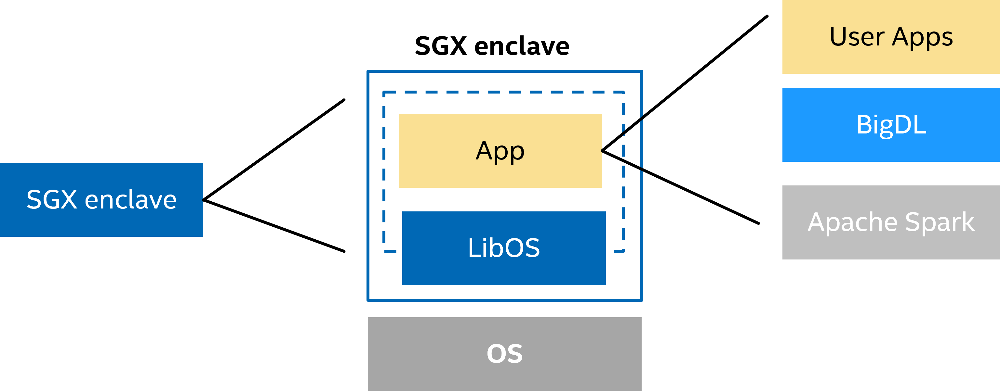
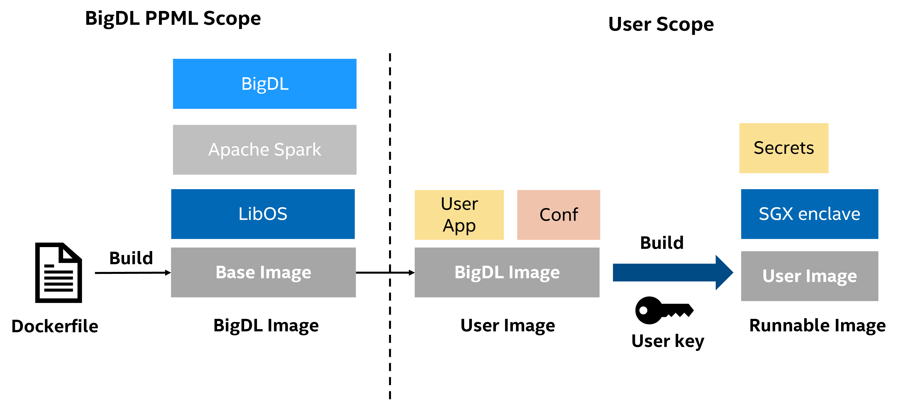
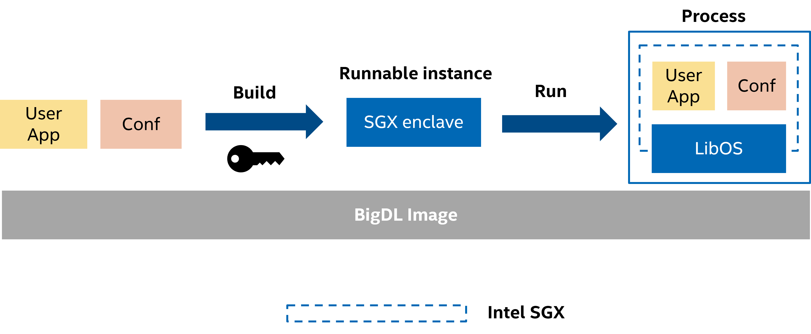
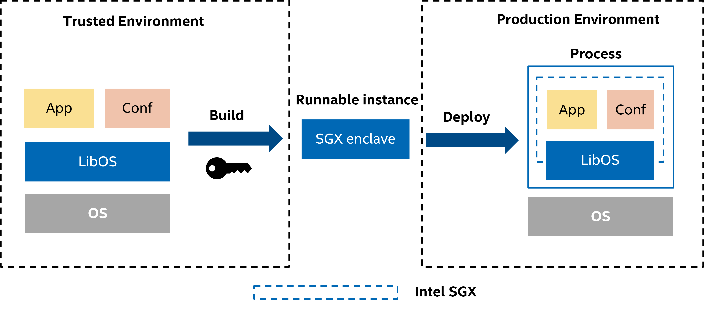

# Deploy PPML (Privacy Preserving Machine Learning) Applications in the Production Environment

PPML applications built on Intel SGX (Software Guard Extensions) are quite different from normal machine learning applications during deployment. More specifically, user applications are packaged with BigDL, Spark and LibOS etc into SGX enclave. This SGX enclave is runnable in Intel SGX.



However, Intel SGX requires applications (enclave) to be signed by a user-specified key, i.e., `enclave-key`. This requirement helps SGX applications ensure their integrity and build trust with attestation. However, it also separates PPML deployment into 2 stages:

1. Stage 1: Test & Development with BigDL PPML. This stage focuses on functionality and performance. Users/customers can use a randomly generated key or a user-specified key for signing, development and testing.
2. Stage 2: Build & Deployment. This stage focuses on safety and security. That means we have to separate signing out of deployment.
  * Build & sign applications with `enclave-key` in a secured environment. * Note that `enclave-key` is only involved in this sub-stage. *
  * Deploy applications in the production environment.



Due to security and privacy considerations (e.g., `enclave-key` security), only stage 1 is fully covered by BigDL PPML image. Customers/users need to handle Stage 2 carefully by themselves, especially when they are building their applications with `enclave-key`. Because `enclave-key` is related to `MRENCLAVE` and `MRSIGNER`. When setting up SGX attestation for integrity, you need to verify MRENCLAVE or MRSIGNER.

* MRENCLAVE, i.e., Enclave Identity. MRENCLAVE uniquely identifies any particular enclave, so using the Enclave Identity will restrict access to the sealed data only to instances of that enclave.
* MRSIGNER, i.e., Signing Identity. MRSIGNER will be the same for all enclaves signed with the same authority.

You can find more details in [Intel SGX Developer Guide](https://download.01.org/intel-sgx/linux-1.5/docs/Intel_SGX_Developer_Guide.pdf).


```eval_rst
.. mermaid::

   graph LR
      subgraph SGX enclave
      MRENCLAVE(fa:fa-file-signature MRENCLAVE)
      MRSIGNER(fa:fa-file-signature MRSIGNER)
      end
      subgraph enclave-key
      private_key(fa:fa-key private key)
      public_key(fa:fa-key public key)
      end
      private_key --> MRENCLAVE
      ppml_application(PPML Applicaiton) --> MRENCLAVE
      public_key --> MRSIGNER
```

In this guide, we will demonstrate how to go through these 2 stages step by step.

## 0. Prerequisite

* Intel Xeon Server with SGX enabled. You can find more details in [Install SGX Driver for Xeon Server](https://bigdl.readthedocs.io/en/latest/doc/PPML/QuickStart/install_sgx_driver.html).
* Docker & Kubernetes.
* BigDL PPML image, e.g., `intelanalytics/bigdl-ppml-trusted-big-data-ml-python-graphene` or `intelanalytics/bigdl-ppml-trusted-big-data-ml-scala-occlum`. You can pull these images from DockerHub.
* `enclave-key` for signing SGX applications. It should be generated by RSA, with at least [2048 bits](https://en.wikipedia.org/wiki/RSA_numbers#RSA-2048).


## 1. Test & Development with PPML image

BigDL PPML provides necessary dependencies for building, signing, debugging and testing SGX applications. In this stage, we recommend using a random key (RSA-2048) provided by BigDL PPML. This key will be used for building & signing SGX enclave. The whole workflow is as follows:

1. Configurations.
2. Build & Sign SGX enclave with key (randomly generated key or user-provided key).
3. Run applications.



Note that all PPML examples are following this workflow. It will greatly accelerate testing and debugging. But, accessing or mounting `enclave-key` in the deployment environment is not safe. Don't use this workflow in production.

## 2. Build & Deployment your applications

After finishing development and testing, almost all parameters or configurations are fixed. In that case, we can build customer image with these settings.

### Build & sign applications with `enclave-key` in a secured environment

1. Configurations.
2. Build & Sign SGX enclave with `enclave-key` in BigDL PPML image.
3. Package SGX enclave into `customer image`.

Note that a `secured environment` is required for signing applications & build image. This environment has access to `enclave-key` and can build image based on BigDL PPML image. This environment doesn't need SGX.

After building & signing, we can get `MRSIGNER` or `MRENCLAVE` in the command line or logs.

### Deploy applications in the production environment

During application deployment, users/customers can enable attestation for integrity. To avoid changing applications or frameworks, you can set up an open-source attestation service. This attestation service will verify `MRSIGNER` or `MRENCLAVE` of your applications. We recommend using [Intel eHSM](https://github.com/intel/ehsm) for both key management and attestation service.

1. Deploy the `customer image`.
2. Run PPML applications in customer image.



## References

1. [Intel SGX (Software Guard Extensions)](https://www.intel.com/content/www/us/en/developer/tools/software-guard-extensions/overview.html)
2. [Install SGX Driver for Xeon Server](https://bigdl.readthedocs.io/en/latest/doc/PPML/QuickStart/install_sgx_driver.html)
3. [RSA-2048](https://en.wikipedia.org/wiki/RSA_numbers#RSA-2048)
4. [Intel SGX Developer Guide](https://download.01.org/intel-sgx/linux-1.5/docs/Intel_SGX_Developer_Guide.pdf)
