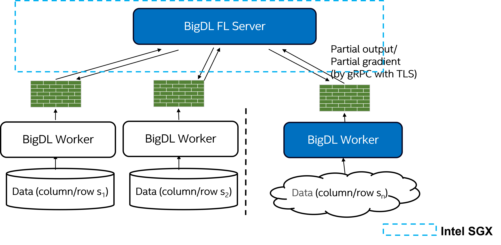

# Vertical Federated Learning
Vertical Federated Learning (VFL) is a federated machine learning case where multiple data sets share the same sample ID space but differ in feature space. 

VFL is supported in BigDL PPML. It allows users to train a federated machine learning model where data features are held by different parties. In BigDL PPML, the following VFL scenarios are supported.
* Private Set Intersection: To get data intersection of different VFL parties.
* Neural Network Model: To train common neural network model with Pytorch or Tensorflow backend across VFL parties.
* FGBoost Model: To train gradient boosted decision tree (GBDT) model across multiple VFL parties.

## Quick Start Examples
For each scenario, an quick start example is available in following links.
* [Private Set Intersection](https://github.com/intel-analytics/BigDL/blob/main/python/ppml/example/psi/psi-tutorial.md): A PSI example of getting intersection of two parties
* [Pytorch Neural Network Model](https://github.com/intel-analytics/BigDL/blob/main/python/ppml/example/pytorch_nn_lr/pytorch-nn-lr-tutorial.md): An Pytorch based Logistic Regression application by two parties
* [Tensorflow Neural Network Model](https://github.com/intel-analytics/BigDL/blob/main/python/ppml/example/tensorflow_nn_lr/tensorflow-nn-lr-tutorial.md): An Tensorflow based Logistic Regression application by two parties
* [FGBoost Model](https://github.com/intel-analytics/BigDL/blob/main/python/ppml/example/fgboost_regression/fgboost-tutorial.md): An federated Gradient Boosted Regression Tree application by two parties

## System Architecture
The high-level architecture is shown in the diagram below. This includes the components of the BigDL PPML FL and [SGX](https://www.intel.com/content/www/us/en/developer/tools/software-guard-extensions/overview.html) for Privacy Preservation.

## Next steps
For detailed usage of BigDL PPML VFL, please see [User Guide](user_guide.md)  
For BigDL PPML VFL with Homomorphic Encryption, please see [VFL HE](vfl_he.md) 
