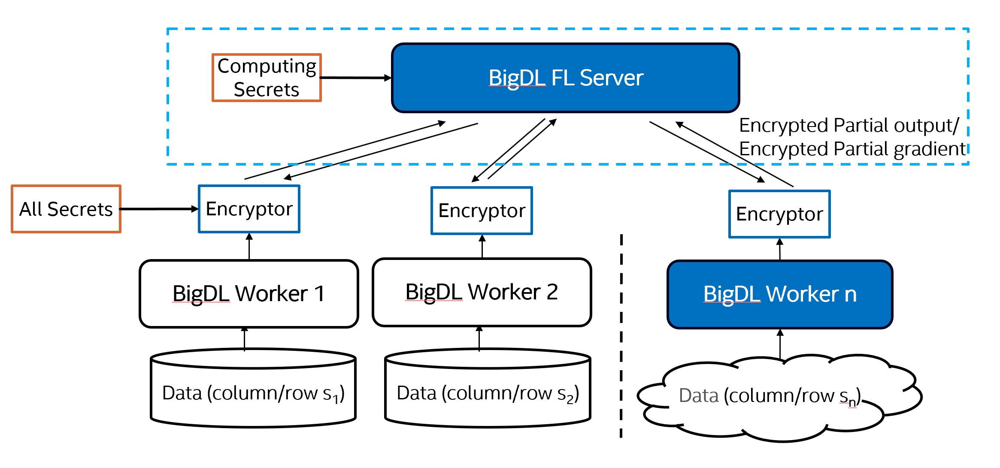

# Vertical Federated Learning with Homomorphic Encryption
Vertical Federated Learning (VFL) is a federated machine learning case where multiple data sets share the same sample ID space but differ in feature space. To protect user data, data(partial output) passed to server should be encrytped, and server should be trusted and running in SGX environment. See the diagram below:

In some cases, third party doesn't has a trusted computing environment, to run the BigDL FL server. So we introduce a new solution using Homomorphic Encryption to protect the data passed to FL server.

## System Architecture
The high-level architecture is shown in the diagram below.   
  
Different from VFL with SGX, this solution will encrypt all the data passed to FL server, using CKKS encryptor. Server only holds computing secrets to compute loss and gradient with the cipher data, server has not secrets to see what's inside the cipher data. So the data passed to server is very safe, even FL server is not protected by SGX.

## Quick Start Examples
* [VFL with Homomorphic Encryption](https://github.com/intel-analytics/BigDL/blob/main/scala/ppml/src/main/scala/com/intel/analytics/bigdl/ppml/fl/example/ckks/README.md): A example of VFL Logistic Regression with HE on census dataset.

