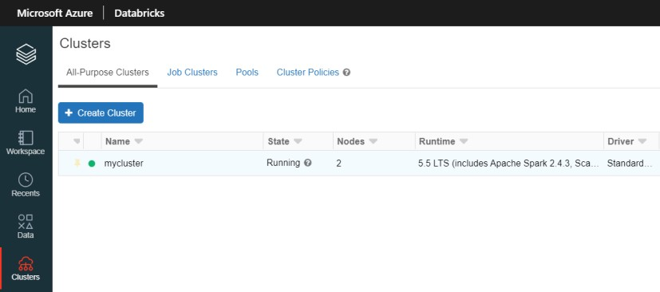
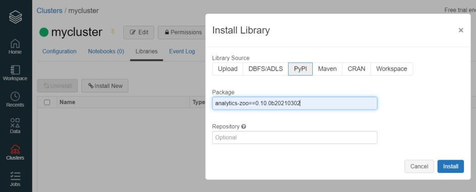
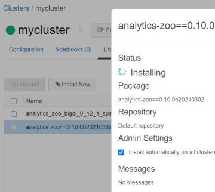
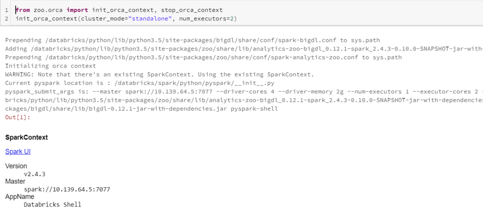

# Databricks User Guide

---

You can run Analytics Zoo program on the [Databricks](https://databricks.com/) cluster as follows.

### **1. Create a Databricks Cluster**

- Create either [AWS Databricks](https://docs.databricks.com/getting-started/try-databricks.html) workspace or [Azure Databricks](https://docs.microsoft.com/en-us/azure/azure-databricks/) workspace. 
- Create a Databricks [clusters](https://docs.databricks.com/clusters/create.html) using the UI. Choose Databricks runtime version. This guide is tested on Runtime 5.5 LTS (includes Apache Spark 2.4.3, Scala 2.11).

### **2. Installing Analytics Zoo libraries**

In the left pane, click **Clusters** and select your cluster.



Install Analytics Zoo python environment using PyPI. Click **Libraries > Install New > PyPI**. Install official released version by texting "analytics-zoo" library. Or install latest [nightly build](https://pypi.org/project/analytics-zoo/#history) of Analytics Zoo with the specified version.



Install Analytics Zoo prebuilt jar package. Click **Libraries > Install New > Upload > Jar**. Download Analytics Zoo prebuilt package from [Release Page](../release.md). Please note that you should choose the same spark version of package as your Databricks runtime version. Unzip it. Find jar named "analytics-zoo-bigdl_*-spark_*-jar-with-dependencies.jar" in the lib directory. Drop the jar on Databricks.


Make sure the jar file and analytics-zoo (with PyPI) are installed on all clusters. In **Libraries** tab of your cluster, check installed libraries and click “Install automatically on all clusters” option in **Admin Settings**.



### **3. Setting Spark configuration**

On the cluster configuration page, click the **Advanced Options** toggle. Click the **Spark** tab. You can provide custom [Spark configuration properties](https://spark.apache.org/docs/latest/configuration.html) in a cluster configuration. Please set it according to your cluster resource and program needs.


See below for an example of Spark config setting needed by Analytics Zoo. Here it sets 1 core per executor. Note that "spark.cores.max" needs to be properly set below.

```
spark.shuffle.reduceLocality.enabled false
spark.serializer org.apache.spark.serializer.JavaSerializer
spark.shuffle.blockTransferService nio
spark.databricks.delta.preview.enabled true
spark.executor.cores 1
spark.speculation false
spark.scheduler.minRegisteredResourcesRatio 1.0
spark.cores.max 4
```

### **4. Running Analytics Zoo on Databricks**

Open a new notebook, and call `init_orca_context` at the beginning of your code (with `cluster_mode` set to "standalone").

```python
from zoo.orca import init_orca_context, stop_orca_context
init_orca_context(cluster_mode="standalone", num_executors=2)
```

Output on Databricks:


