# Databricks User Guide

---

You can run BigDL program on the [Databricks](https://databricks.com/) cluster as follows.
### **1. Create a Databricks Cluster**

- Create either an [AWS Databricks](https://docs.databricks.com/getting-started/try-databricks.html) workspace or an [Azure Databricks](https://docs.microsoft.com/en-us/azure/azure-databricks/) workspace. 
- Create a Databricks [cluster](https://docs.databricks.com/clusters/create.html) using the UI. Choose Databricks runtime version. This guide is tested on Runtime 9.1 LTS (includes Apache Spark 3.1.2, Scala 2.12).

### 2. Download BigDL Libraries

Download the BigDL package from [here](https://oss.sonatype.org/content/repositories/snapshots/com/intel/analytics/bigdl/bigdl-assembly-spark_3.1.2/2.1.0-SNAPSHOT/), scroll down to the bottom, choose the **latest** release **bigdl-assembly-spark_3.1.2-2.1.0-*-fat-jars.zip**.

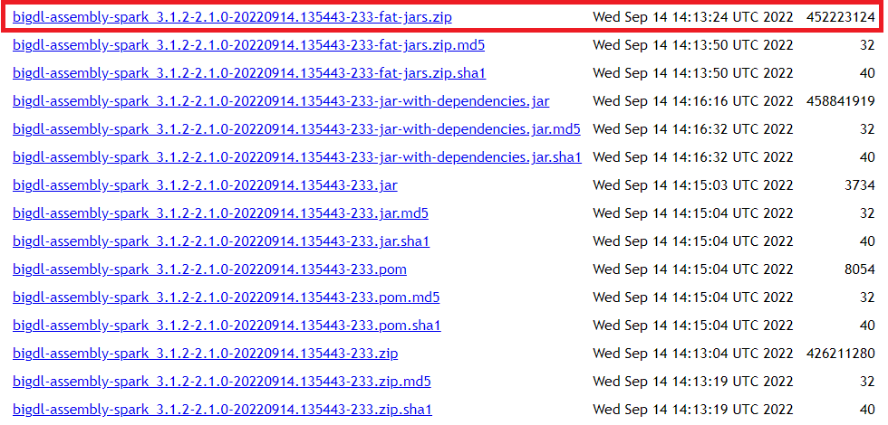

Unzip the zip file, we only need two files:

- jars/**bigdl-assembly-spark_3.1.2-2.1.0-SNAPSHOT-jar-with-dependencies.jar**
- python/**bigdl-spark_3.1.2-2.1.0-SNAPSHOT-python-api.zip**

### 3. Install BigDL Java dependencies

In the Databricks left panel, click **Compute** and select your cluster.

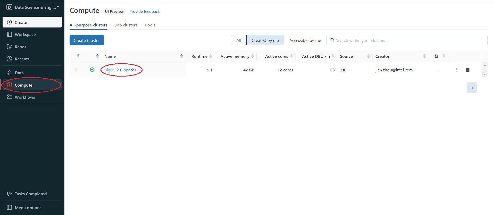

Install BigDL java packages using **bigdl-assembly-spark_3.1.2-2.1.0-SNAPSHOT-jar-with-dependencies.jar** from [step 2](#2. Download BigDL Libraries). Click **Libraries > Install New > Library Source(Upload) > Library Type (Jar)**. Drop the jar on Databricks.

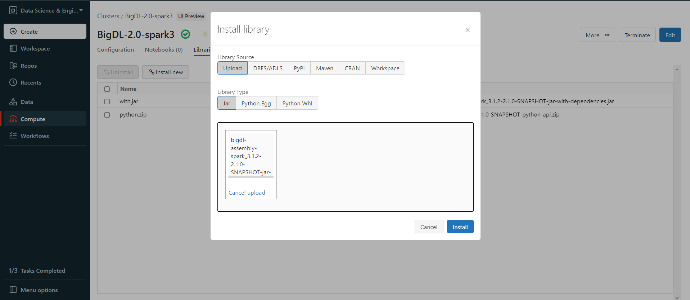

After upload finishes, click **Install**.

> Tips: if you find your upload process is really slow, try to use **Databricks CLI** to upload, see [Appendix B](#Appendix B) for details.

### 4. Install BigDL Python libraries

Install BigDL python environment using **bigdl-spark_3.1.2-2.1.0-SNAPSHOT-python-api.zip** from [step 2](#2. Download BigDL Libraries). However, Databricks can only upload **Jar**, **Python Egg** and **Python Whl**, but doesn't support **Zip**, so we can not simply upload the python api zip and install it like what we do in Step 3. You can upload and install the zip package in one of the following ways.

#### 4.1 Upload and Install through DBFS

**First, upload the zip package to [DBFS](https://docs.databricks.com/dbfs/index.html).** In the left panel, click **Data > DBFS**, if your panel don't have DBFS, see [Appendix A](#Appendix A). then choose or create a folder and right click in the folder, choose **Upload here**.

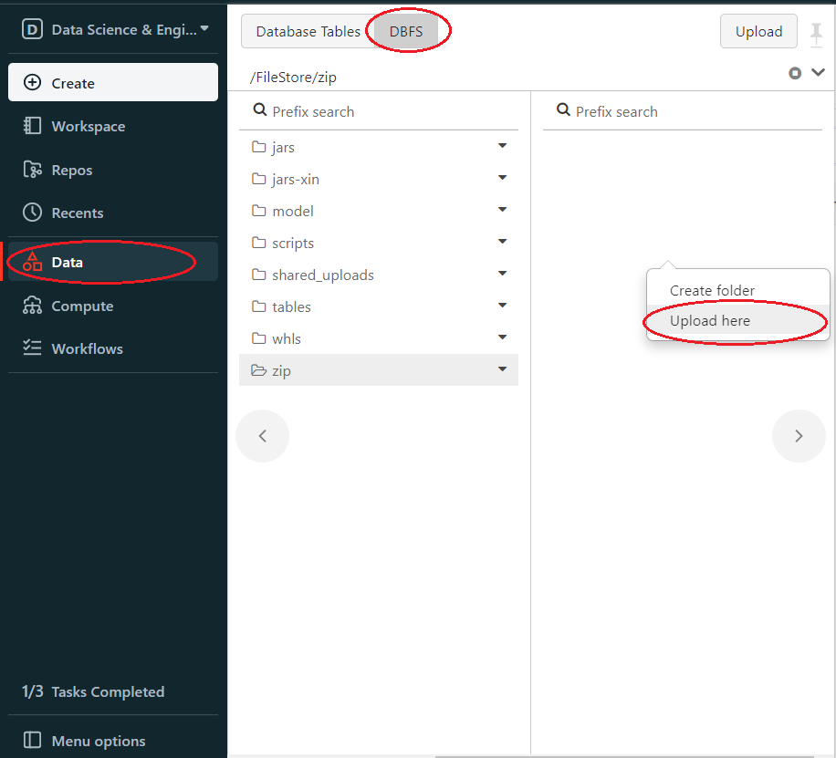

Upload your zip package.

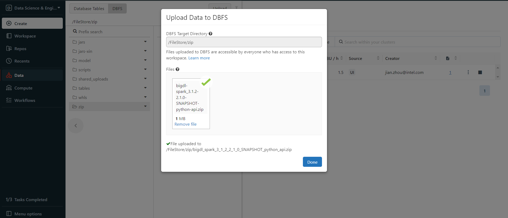

right click the uploaded zip package and choose **Copy path**, copy the **Spark API Format** path.

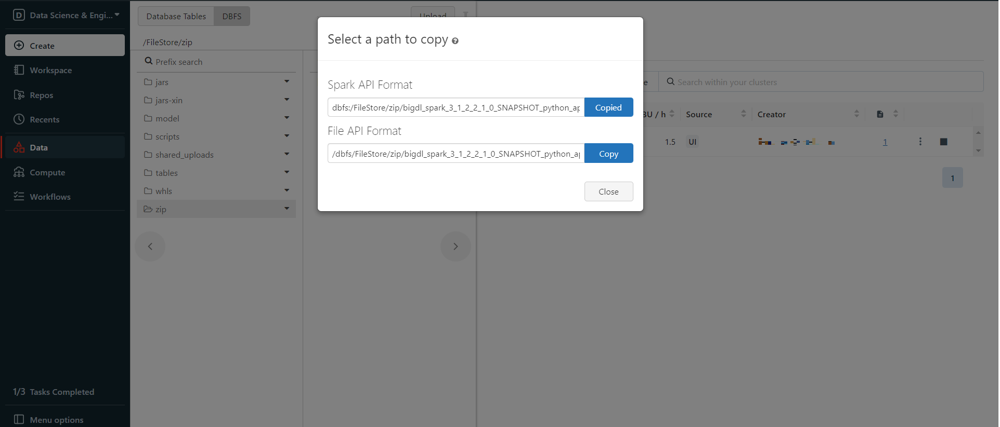

**Then install the zip package from DBFS.** In the left panel, click **Compute > choose your cluster > Libraries > Install new > Library Source(DBFS/ADLS) > Library Type(Python Egg) > paste the path > Install**

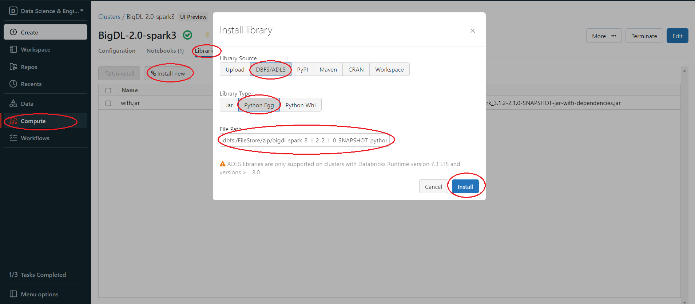

#### 4.2 Change the File Extension Name

You can simply change the **bigdl-spark_3.1.2-2.1.0-SNAPSHOT-python-api.zip** extension name(**.zip**) to **.egg**, Egg are essentially a zip format package. Then in the left panel, click **Compute > choose your cluster > Libraries > Install new > Library Source(Upload) > Library Type(Python Egg) > Install**

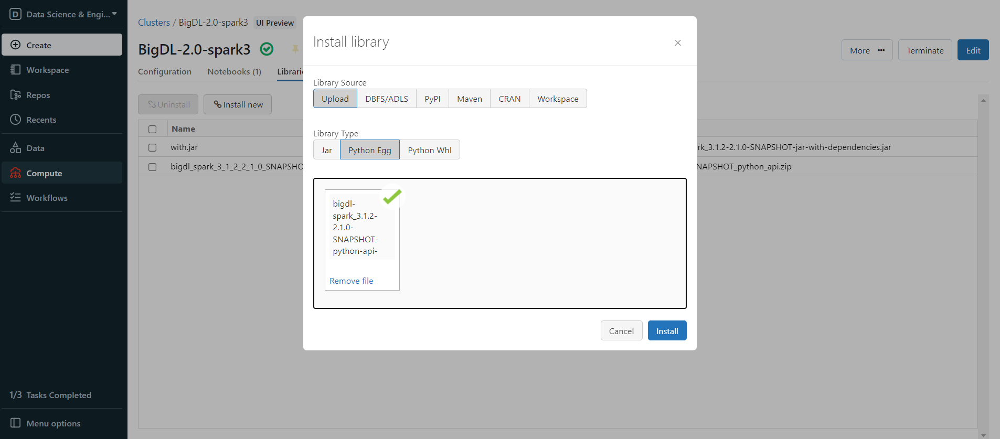

### **5. Set Spark configuration**

On the cluster configuration page, click the **Advanced Options** toggle. Click the **Spark** tab. You can provide custom [Spark configuration properties](https://spark.apache.org/docs/latest/configuration.html) in a cluster configuration. Please set it according to your cluster resource and program needs.


See below for an example of Spark config setting needed by BigDL. Here it sets 2 core per executor. Note that "spark.cores.max" needs to be properly set below.

```
spark.executor.cores 2
spark.cores.max 4
```

### **6. Run BigDL on Databricks**

Open a new notebook, and call `init_orca_context` at the beginning of your code (with `cluster_mode` set to "spark-submit").

```python
from bigdl.orca import init_orca_context, stop_orca_context
init_orca_context(cluster_mode="spark-submit")
```

Output on Databricks:

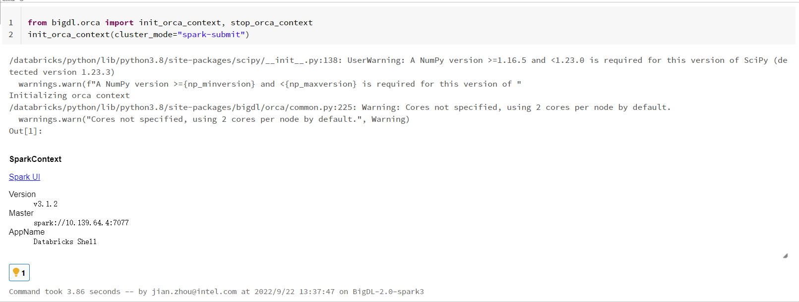


### **7. Install other third-party libraries on Databricks if necessary**

If you want to use other third-party libraries, check related Databricks documentation of [libraries for AWS Databricks](https://docs.databricks.com/libraries/index.html) and [libraries for Azure Databricks](https://docs.microsoft.com/en-us/azure/databricks/libraries/).

### Appendix A

If there is no DBFS in your panel,  go to **User profile > Admin Console > Workspace settings > Advanced > Enabled DBFS File Browser**

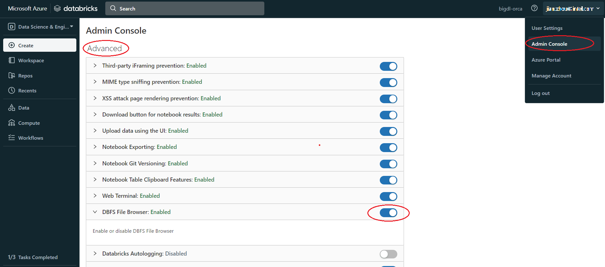

### Appendix B

Use **Databricks CLI** to upload file to DBFS.

**Install and config Azure Databricks CLI**

1. Install Python, need Python version 2.7.9 and above if you’re using Python 2 or Python 3.6 and above if you’re using Python 3.

2. Run `pip install databricks-cli`

3. Set authentication, Click **user profile icon > User Settings > Access tokens > Generate new token > generate > copy the token**, make sure to **copy** the token and store it in a secure location, **it won't show again**.

   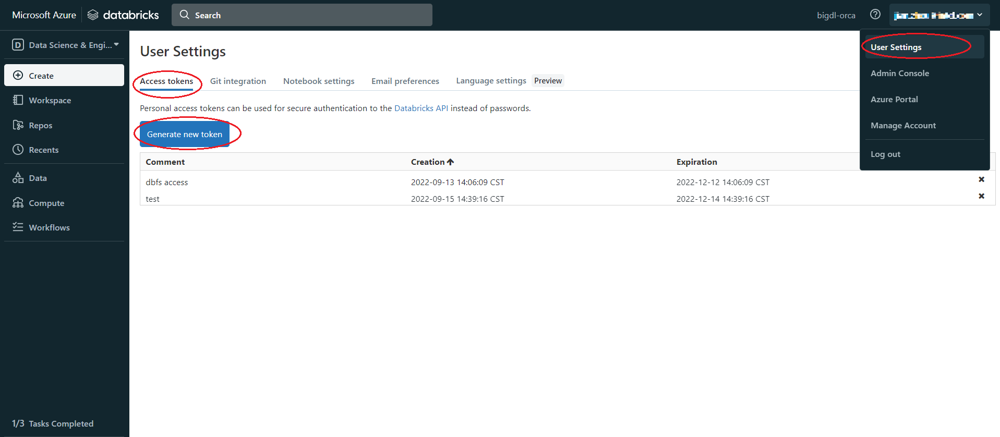

4. Copy the URL of Databricks host, the format is `https://adb-<workspace-id>.<random-number>.azuredatabricks.net`, you can copy it from your Databricks web page URL.

   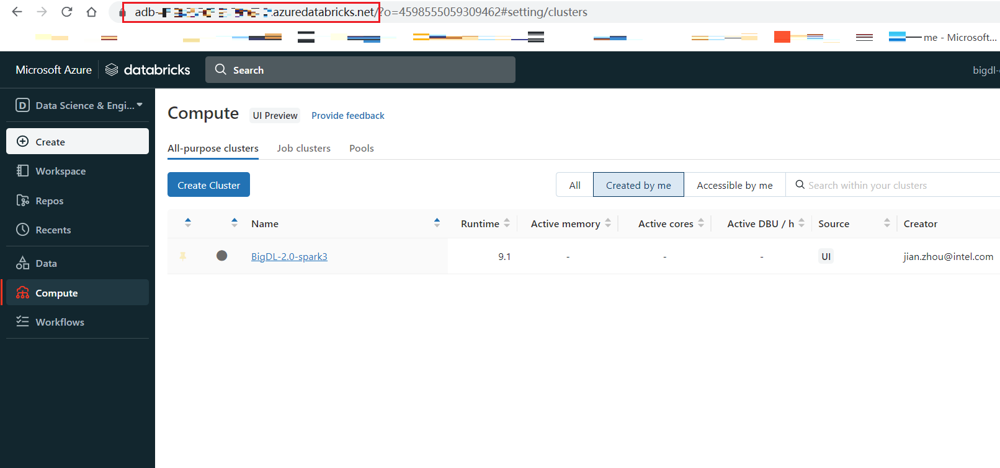

5. In cmd run `dbfs config --token` as shown below:

   ```
   dbfs configure --token
   Databricks Host (should begin with https://): https://your.url.from.step.4
   Token: your-token-from-step-3
   ```

6. Verify whether you are able to connect to DBFS, run "databricks fs ls".

   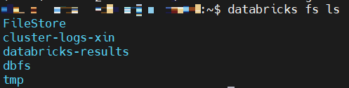

**Upload through Databricks CLI**

Now, we can use Databricks CLI to upload file to DBFS. run command:

```
dbfs cp /your/local/filepath/bigdl-assembly-spark_3.1.2-2.1.0-SNAPSHOT-jar-with-dependencies.jar dbfs:/FileStore/jars/stable/bigdl-assembly-spark_3.1.2-2.1.0-SNAPSHOT-jar-with-dependencies.jar
```

After command finished, check DBFS in Databricks, in left panel, click **Data > DBFS > your upload directory**, if you do not see DBFS in your panel, see [Appendix A](#Appendix A).

**Install package from DBFS**

In the left panel, click **Compute > choose your cluster > Libraries > Install new > Library Source(DBFS/ADLS) > Library Type(your package type)**.

