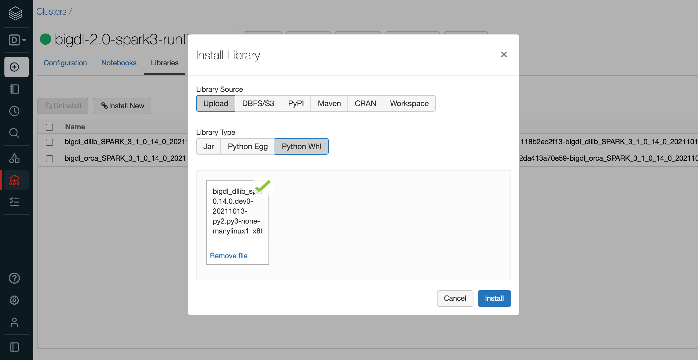

# Databricks User Guide

---

You can run BigDL program on the [Databricks](https://databricks.com/) cluster as follows.
### **1. Create a Databricks Cluster**

- Create either [AWS Databricks](https://docs.databricks.com/getting-started/try-databricks.html) workspace or [Azure Databricks](https://docs.microsoft.com/en-us/azure/azure-databricks/) workspace. 
- Create a Databricks [clusters](https://docs.databricks.com/clusters/create.html) using the UI. Choose Databricks runtime version. This guide is tested on Runtime 7.3 (includes Apache Spark 3.0.1, Scala 2.12).

### **2. Installing BigDL Python libraries**

In the left pane, click **Clusters** and select your cluster.


Install BigDL DLLib python environment using prebuilt release Wheel package. Click **Libraries > Install New > Upload > Python Whl**. Download BigDL DLLib prebuilt Wheel [here](https://sourceforge.net/projects/analytics-zoo/files/dllib-py). Choose a wheel with timestamp for the same Spark version and platform as Databricks runtime. Download and drop it on Databricks.



Install BigDL Orca python environment using prebuilt release Wheel package. Click **Libraries > Install New > Upload > Python Whl**. Download Bigdl Orca prebuilt Wheel [here](https://sourceforge.net/projects/analytics-zoo/files/dllib-py). Choose a wheel with timestamp for the same Spark version and platform as Databricks runtime. Download and drop it on Databricks.


If you want to use other BigDL libraries (Friesian, Chronos, Nano, Serving, etc.), download prebuilt release Wheel package from [here](https://sourceforge.net/projects/analytics-zoo/files/) and install to cluster in the similar ways.


### **3. Installing BigDL Java libraries**

Install BigDL DLLib prebuilt jar package. Click **Libraries > Install New > Upload > Jar**. Download BigDL DLLib prebuilt package from [Release Page](../release.md). Please note that you should choose the same spark version of package as your Databricks runtime version. Find jar named "bigdl-dllib-spark_*-jar-with-dependencies.jar" in the lib directory. Drop the jar on Databricks.


Install BigDL Orca prebuilt jar package. Click **Libraries > Install New > Upload > Jar**. Download BigDL Orca prebuilt package from [Release Page](../release.md). Please note that you should choose the same spark version of package as your Databricks runtime version. Find jar named "bigdl-orca-spark_*-jar-with-dependencies.jar" in the lib directory. Drop the jar on Databricks.


If you want to use other BigDL libraries (Friesian, Chronos, Nano, Serving, etc.), download prebuilt jar package from [Release Page](../release.md) and install to cluster in the similar ways.


Make sure the jar files and whl files are installed on all clusters. In **Libraries** tab of your cluster, check installed libraries and click “Install automatically on all clusters” option in **Admin Settings**.


### **4. Setting Spark configuration**

On the cluster configuration page, click the **Advanced Options** toggle. Click the **Spark** tab. You can provide custom [Spark configuration properties](https://spark.apache.org/docs/latest/configuration.html) in a cluster configuration. Please set it according to your cluster resource and program needs.


See below for an example of Spark config setting needed by BigDL. Here it sets 2 core per executor. Note that "spark.cores.max" needs to be properly set below.

```
spark.serializer org.apache.spark.serializer.JavaSerializer
spark.shuffle.blockTransferService nio
spark.databricks.delta.preview.enabled true
spark.executor.cores 2
spark.speculation false
spark.scheduler.minRegisteredResourcesRatio 1.0
spark.scheduler.maxRegisteredResourcesWaitingTime 3600s
spark.cores.max 4
```

### **5. Running BigDL on Databricks**

Open a new notebook, and call `init_orca_context` at the beginning of your code (with `cluster_mode` set to "spark-submit").

```python
from bigdl.orca import init_orca_context, stop_orca_context
init_orca_context(cluster_mode="spark-submit")
```

Output on Databricks:


### **6. Install other third-party libraries on Databricks if necessary**

If you want to use other third-party libraries, check related Databricks documentation of [libraries for AWS Databricks](https://docs.databricks.com/libraries/index.html) and [libraries for Azure Databricks](https://docs.microsoft.com/en-us/azure/databricks/libraries/).
