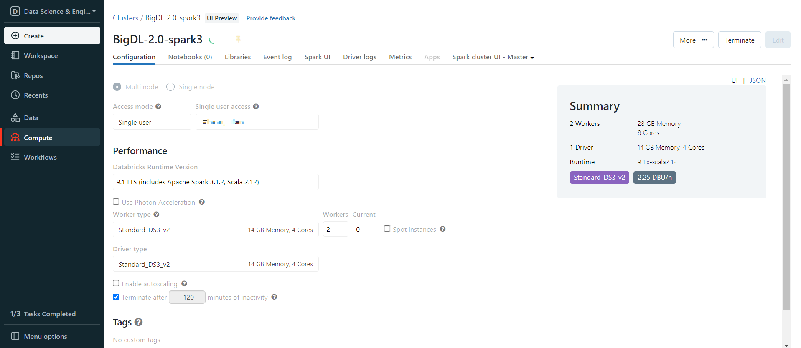
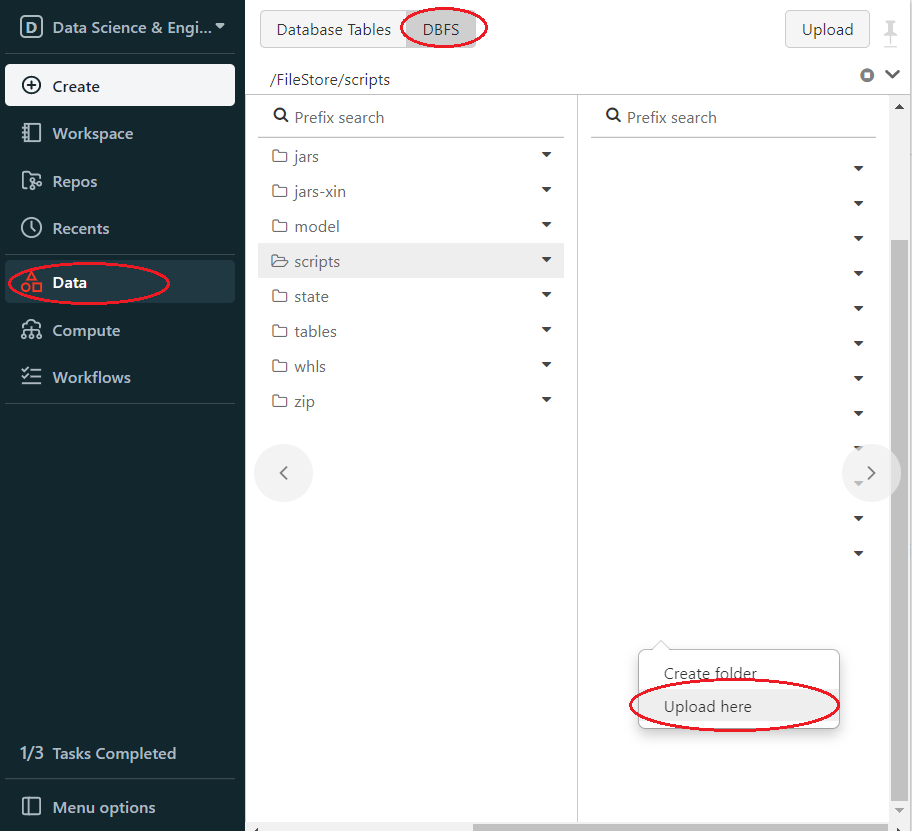
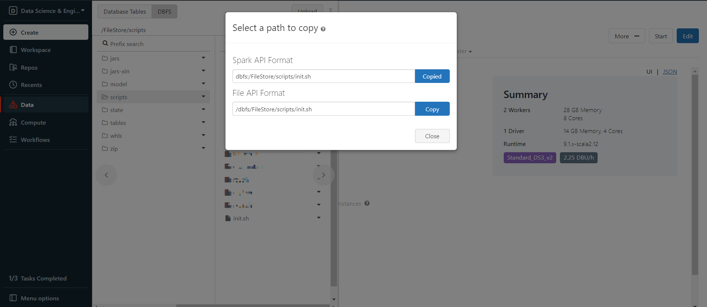
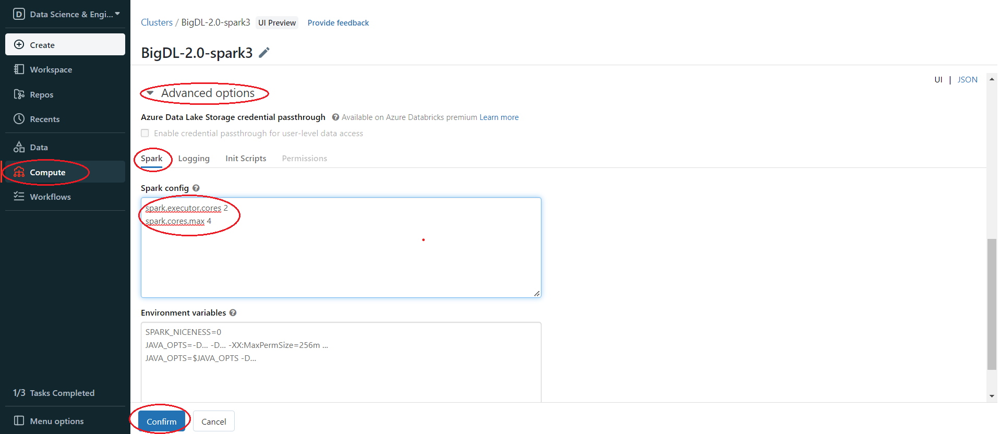
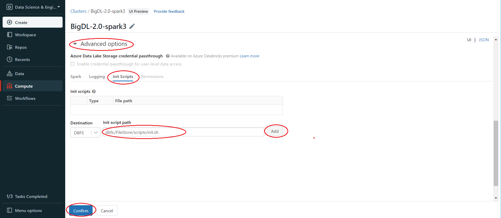

# Databricks User Guide

---

You can run BigDL program on the [Databricks](https://databricks.com/) cluster as follows.
### **1. Create a Databricks Cluster**

- Create either an [AWS Databricks](https://docs.databricks.com/getting-started/try-databricks.html) workspace or an [Azure Databricks](https://docs.microsoft.com/en-us/azure/azure-databricks/) workspace. 
- Create a Databricks [cluster](https://docs.databricks.com/clusters/create.html) using the UI. Choose Databricks runtime version. This guide is tested on Runtime 9.1 LTS (includes Apache Spark 3.1.2, Scala 2.12).



### 2. Generate initialization script

[Init script](https://learn.microsoft.com/en-us/azure/databricks/clusters/init-scripts) is used to Install BigDL or other libraries. First, you need to put the **init script** into [DBFS](https://docs.databricks.com/dbfs/index.html), you can use one of the following ways.

**a. Generate init script in Databricks notebook**

Create a Databricks notebook and execute

```python
init_script = """
#!/bin/bash

# install bigdl-orca, add other bigdl modules if you need
/databricks/python/bin/pip install pip install --pre --upgrade bigdl-orca-spark3[ray]

# install other necessary libraries, here we install libraries needed in this tutorial
/databricks/python/bin/pip install tensorflow==2.9.1
/databricks/python/bin/pip install pyarrow==8.0.0
/databricks/python/bin/pip install psutil

# copy bigdl jars to databricks
cp /databricks/python/lib/python3.8/site-packages/bigdl/share/*/lib/*.jar /databricks/jars
"""

# Change the first parameter to your DBFS path
dbutils.fs.put("dbfs:/FileStore/scripts/init.sh", init_script, True)
```

To make sure the init script is in DBFS, in the left panel, click **Data > DBFS > check your script save path**.

> if you do not see DBFS in your panel, see [Appendix A](#appendix-a).

**b. Create init script in local and upload to DBFS**

Create a file **init.sh**(or any other filename) in your computer, the file content is

```bash
#!/bin/bash

# install bigdl-orca, add other bigdl modules if you need
/databricks/python/bin/pip install pip install --pre --upgrade bigdl-orca-spark3[ray]

# install other necessary libraries, here we install libraries needed in this tutorial
/databricks/python/bin/pip install tensorflow==2.9.1
/databricks/python/bin/pip install pyarrow==8.0.0
/databricks/python/bin/pip install psutil

# copy bigdl jars to databricks
cp /databricks/python/lib/python3.8/site-packages/bigdl/share/*/lib/*.jar /databricks/jars
```

Then upload **init.sh** to DBFS.  In Databricks left panel, click **Data > DBFS > Choose or create upload directory > Right click > Upload here**.



Now the init script is in DBFS, right click the init.sh and choose **Copy path**, copy the **Spark API Format** path.



### 3. Set Spark configuration

In the left panel, click **Compute > Choose your cluster > edit > Advanced options > Spark > Confirm**. You can provide custom [Spark configuration properties](https://spark.apache.org/docs/latest/configuration.html) in a cluster configuration. Please set it according to your cluster resource and program needs.



See below for an example of Spark config setting **needed** by BigDL. Here it sets 2 core per executor. Note that "spark.cores.max" needs to be properly set below.

```
spark.executor.cores 2
spark.cores.max 4
```

### 4. Install BigDL Libraries

Use the init script from [step 2](#2-generate-initialization-script) to install BigDL libraries. In the left panel, click **Compute > Choose your cluster > edit > Advanced options > Init Scripts > Paste init script path > Add > Confirm**.



Then start or restart the cluster. After starting/restarting the cluster, the libraries specified in the init script are all installed.

### **5. Run BigDL on Databricks**

Open a new notebook, and call `init_orca_context` at the beginning of your code (with `cluster_mode` set to "spark-submit").

```python
from bigdl.orca import init_orca_context, stop_orca_context
init_orca_context(cluster_mode="spark-submit")
```

Output on Databricks:


**Run ncf_train example on Databricks**

Create a notebook and run the following example. Note that to make things simple, we are just generating some dummy data for this example.

```python
import math
import argparse
import os
import random

from bigdl.orca import init_orca_context, stop_orca_context
from bigdl.orca.learn.tf2.estimator import Estimator
from pyspark.sql.types import StructType, StructField, IntegerType
from bigdl.orca import OrcaContext


def build_model(num_users, num_items, class_num, layers=[20, 10], include_mf=True, mf_embed=20):
    import tensorflow as tf
    from tensorflow.keras.layers import Input, Embedding, Dense, Flatten, concatenate, multiply

    num_layer = len(layers)
    user_input = Input(shape=(1,), dtype='int32', name='user_input')
    item_input = Input(shape=(1,), dtype='int32', name='item_input')

    mlp_embed_user = Embedding(input_dim=num_users, output_dim=int(layers[0] / 2),
                               input_length=1)(user_input)
    mlp_embed_item = Embedding(input_dim=num_items, output_dim=int(layers[0] / 2),
                               input_length=1)(item_input)

    user_latent = Flatten()(mlp_embed_user)
    item_latent = Flatten()(mlp_embed_item)

    mlp_latent = concatenate([user_latent, item_latent], axis=1)
    for idx in range(1, num_layer):
        layer = Dense(layers[idx], activation='relu',
                      name='layer%d' % idx)
        mlp_latent = layer(mlp_latent)

    if include_mf:
        mf_embed_user = Embedding(input_dim=num_users,
                                  output_dim=mf_embed,
                                  input_length=1)(user_input)
        mf_embed_item = Embedding(input_dim=num_users,
                                  output_dim=mf_embed,
                                  input_length=1)(item_input)
        mf_user_flatten = Flatten()(mf_embed_user)
        mf_item_flatten = Flatten()(mf_embed_item)

        mf_latent = multiply([mf_user_flatten, mf_item_flatten])
        concated_model = concatenate([mlp_latent, mf_latent], axis=1)
        prediction = Dense(class_num, activation='softmax', name='prediction')(concated_model)
    else:
        prediction = Dense(class_num, activation='softmax', name='prediction')(mlp_latent)

    model = tf.keras.Model([user_input, item_input], prediction)
    return model


if __name__ == '__main__':
    executor_cores = 2
    lr = 0.001
    epochs = 5
    batch_size = 8000
    model_dir = "/dbfs/FileStore/model/ncf/"
    backend = "ray" # ray or spark
    data_dir = './'
    save_path = model_dir + "ncf.h5"
    
    sc = init_orca_context(cluster_mode="spark-submit")

    spark = OrcaContext.get_spark_session()

    num_users, num_items = 6000, 3000
    rdd = sc.range(0, 50000).map(
        lambda x: [random.randint(0, num_users - 1), random.randint(0, num_items - 1), random.randint(0, 4)])
    schema = StructType([StructField("user", IntegerType(), False),
                         StructField("item", IntegerType(), False),
                         StructField("label", IntegerType(), False)])
    data = spark.createDataFrame(rdd, schema)
    train, test = data.randomSplit([0.8, 0.2], seed=1)

    config = {"lr": lr, "inter_op_parallelism": 4, "intra_op_parallelism": executor_cores}


    def model_creator(config):
        import tensorflow as tf

        model = build_model(num_users, num_items, 5)
        print(model.summary())
        optimizer = tf.keras.optimizers.Adam(config["lr"])
        model.compile(optimizer=optimizer,
                      loss='sparse_categorical_crossentropy',
                      metrics=['sparse_categorical_crossentropy', 'accuracy'])
        return model


    steps_per_epoch = math.ceil(train.count() / batch_size)
    val_steps = math.ceil(test.count() / batch_size)

    estimator = Estimator.from_keras(model_creator=model_creator,
                                     verbose=False,
                                     config=config,
                                     backend=backend,
                                     model_dir=model_dir)
    estimator.fit(train,
                  batch_size=batch_size,
                  epochs=epochs,
                  feature_cols=['user', 'item'],
                  label_cols=['label'],
                  steps_per_epoch=steps_per_epoch,
                  validation_data=test,
                  validation_steps=val_steps)

    predictions = estimator.predict(test,
                                    batch_size=batch_size,
                                    feature_cols=['user', 'item'],
                                    steps=val_steps)
    print("Predictions on validation dataset:")
    predictions.show(5, truncate=False)

    print("Saving model to: ", save_path)
    estimator.save(save_path)

    # load with estimator.load(save_path)

    stop_orca_context()
```

### **6. Other ways to install third-party libraries on Databricks if necessary**

If you want to use other ways to install third-party libraries, check related Databricks documentation of [libraries for AWS Databricks](https://docs.databricks.com/libraries/index.html) and [libraries for Azure Databricks](https://docs.microsoft.com/en-us/azure/databricks/libraries/).

### Appendix A

If there is no DBFS in your panel,  go to **User profile > Admin Console > Workspace settings > Advanced > Enabled DBFS File Browser**


### Appendix B

Use **Databricks CLI** to upload file to DBFS. When you upload a large file to DBFS, using Databricks CLI could be faster than using the Databricks web UI.

**Install and config Azure Databricks CLI**

1. Install Python, need Python version 2.7.9 and above if you’re using Python 2 or Python 3.6 and above if you’re using Python 3.

2. Run `pip install databricks-cli`

3. Set authentication, Click **user profile icon > User Settings > Access tokens > Generate new token > generate > copy the token**, make sure to **copy** the token and store it in a secure location, **it won't show again**.

   

4. Copy the URL of Databricks host, the format is `https://adb-<workspace-id>.<random-number>.azuredatabricks.net`, you can copy it from your Databricks web page URL.

   

5. In cmd run `dbfs config --token` as shown below:

   ```
   dbfs configure --token
   Databricks Host (should begin with https://): https://your.url.from.step.4
   Token: your-token-from-step-3
   ```

6. Verify whether you are able to connect to DBFS, run "databricks fs ls".

   

**Upload through Databricks CLI**

Now, we can use Databricks CLI to upload file to DBFS. run command:

```
dbfs cp /your/local/filepath/bigdl-assembly-spark_3.1.2-2.1.0-SNAPSHOT-jar-with-dependencies.jar dbfs:/FileStore/jars/stable/bigdl-assembly-spark_3.1.2-2.1.0-SNAPSHOT-jar-with-dependencies.jar
```

After command finished, check DBFS in Databricks, in left panel, click **Data > DBFS > your upload directory**, if you do not see DBFS in your panel, see [Appendix A](#appendix-a).

**Install package from DBFS**

In the left panel, click **Compute > choose your cluster > Libraries > Install new > Library Source(DBFS/ADLS) > Library Type(your package type)**.

