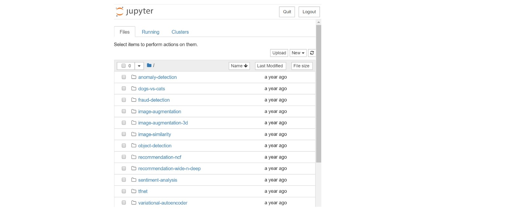

# Docker User Guide

---

### **1. Pull Docker Image**

You may pull a Docker image from the  [Docker Hub](https://hub.docker.com/r/intelanalytics/bigdl/tags).

To pull the nightly build version, use
```bash
sudo docker pull intelanalytics/bigdl:0.14.0-SNAPSHOT
```

To pull other versions, please refer to [BigDL Docker Hub Tags](https://hub.docker.com/r/intelanalytics/bigdl/tags?page=1&ordering=last_updated), select a tag and use
```bash
sudo docker pull intelanalytics/bigdl:tag_name
```

**Configuring resources**

For Docker Desktop users, the default resources (2 CPUs and 2GB memory) are relatively small, and you may want to change them to larger values (8GB memory and 4 CPUs should be a good estimate for most examples, and the exact memory requirements vary for different applications). For more information, view the Docker documentation for [MacOS](https://docs.docker.com/docker-for-mac/#resources) and [Windows](https://docs.docker.com/docker-for-windows/#resources).

**Speed up pulling image by adding mirrors**

To speed up pulling the image from DockerHub, you may add the registry-mirrors key and value by editing `daemon.json` (located in `/etc/docker/` folder on Linux):
```
{
  "registry-mirrors": ["https://<my-docker-mirror-host>"]
}
```
For instance, users in China may add the USTC mirror as follows:
```
{
  "registry-mirrors": ["https://docker.mirrors.ustc.edu.cn"]
}
```


After that, flush changes and restart docker：

```
sudo systemctl daemon-reload
sudo systemctl restart docker
```

### **2. Launch Docker Container**

After pulling the BigDL Docker image, you can launch an BigDL Docker container:
```
sudo docker run -it --rm --net=host \
    -e NOTEBOOK_PORT=12345 \
    -e NOTEBOOK_TOKEN="your-token" \
    -e http_proxy=http://your-proxy-host:your-proxy-port \
    -e https_proxy=https://your-proxy-host:your-proxy-port \
    intelanalytics/bigdl:0.14.0-SNAPSHOT bash
```

* The value 12345 is a user specified port number.
* The value "your-token" is a user specified string.
* If you need to use http/https proxy, please use -e http_proxy/https_proxy

Once the container is successfully launched, you will automatically login into the container and see this as the output:
```
root@[hostname]:/opt/work#
```

The /opt/work directory contains:

* start-notebook.sh is used for starting the jupyter notebook. You can specify the environment settings and spark settings to start a specified jupyter notebook.
* bigdl-${BigDL_VERSION} is the BigDL home of BigDL distribution.
* spark-${SPARK_VERSION} is the Spark home.
* BigDL is cloned from https://github.com/intel-analytics/BigDL.git, contains apps, examples using BigDL.
* opt/download-bigdl.sh is used for downloading BigDL distributions.

### **3. Run Jupyter Notebook Examples in the Container**

After a Docker container is launched and user login into the container, you can start the Jupyter Notebook service inside the container.

#### **3.1 Start the Jupyter Notebook services**

In the `/opt/work` directory, run this command line to start the Jupyter Notebook service:
```
source activate bigdl
./start-notebook.sh
```

You will see the output message like below. This means the Jupyter Notebook service has started successfully within the container.
```
[I 07:40:39.354 NotebookApp] Serving notebooks from local directory: /opt/work/bigdl-0.14.0-SNAPSHOT/apps
[I 07:40:39.355 NotebookApp] Jupyter Notebook 6.4.6 is running at:
[I 07:40:39.355 NotebookApp] http://(the-host-name):12345/?token=...
[I 07:40:39.355 NotebookApp]  or http://127.0.0.1:12345/?token=...
[I 07:40:39.355 NotebookApp] Use Control-C to stop this server and shut down all kernels (twice to skip confirmation).
```

#### **3.2 Connect to Jupyter Notebook service from a browser**

After the Jupyter Notebook service is successfully started, you can connect to the Jupyter Notebook service from a browser.

1. Get the IP address of the container
2. Launch a browser, and connect to the Jupyter Notebook service with the URL: https://container-ip-address:port-number/?token=your-token
As a result, you will see the Jupyter Notebook like this:



#### **3.3 Run BigDL Jupyter Notebooks**

After connecting to the Jupyter Notebook in the browser, you can run multiple BigDL Jupyter Notebook examples. The example shown below is the “dogs-vs-cats”.

* Click into the "dogs-vs-cats" folder:


* Open the notebook file:


* Start to run the "dogs-vs-cats" notebook:


* Run through the example and check the prediction:


### **4. Shut Down Docker Container**

You should shut down the BigDL Docker container after using it.

1. You can list all the active Docker containers by command line:
```
sudo docker ps
```

2. You will see your docker containers:
```
CONTAINER ID        IMAGE                                        COMMAND                  CREATED             STATUS              PORTS               NAMES
40de2cdad025        intelanalytics/bigdl:0.14.0-SNAPSHOT         "/opt/work/start-n..."   3 hours ago         Up 3 hours                              upbeat_al
```

3. Shut down the corresponding docker container by its ID:
```
$sudo docker rm -f 40de2cdad025
```
