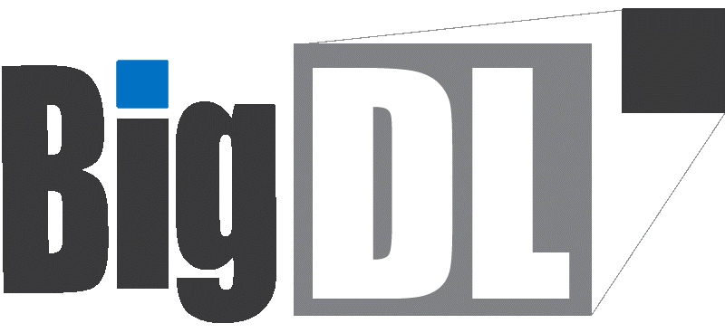

.. |br| raw:: html

    

BigDL Documentation
===========================

BigDL Architecture
----------------------------

.. raw:: html

    

        

            

                Domain Specific Toolkits
            

            

                <a href="doc/PPML/Overview/ppml.html" class="doc-button video-upper-text"> DLLib </a>
                

                    <iframe src="https://www.youtube.com/embed/d0vcXf5CLdM" title="YouTube video player" frameborder="0" allow="accelerometer; autoplay; clipboard-write; encrypted-media; gyroscope; picture-in-picture" allowfullscreen></iframe>
                

            

            

                <a href="doc/PPML/Overview/ppml.html" class="doc-button video-upper-text"> Nano </a>
                

                    <iframe src="https://www.youtube.com/embed/d0vcXf5CLdM" title="YouTube video player" frameborder="0" allow="accelerometer; autoplay; clipboard-write; encrypted-media; gyroscope; picture-in-picture" allowfullscreen></iframe>
                

            

            

                <a href="doc/PPML/Overview/ppml.html" class="doc-button video-upper-text"> Orca </a>
                

                    <iframe src="https://www.youtube.com/embed/d0vcXf5CLdM" title="YouTube video player" frameborder="0" allow="accelerometer; autoplay; clipboard-write; encrypted-media; gyroscope; picture-in-picture" allowfullscreen></iframe>
                

            

        

        

        

            

                End-to-End Distributed AI Pipelines
            

            

                <a href="doc/PPML/Overview/ppml.html" class="doc-button video-upper-text"> Chronos </a>
                

                    <iframe src="https://www.youtube.com/embed/d0vcXf5CLdM" title="YouTube video player" frameborder="0" allow="accelerometer; autoplay; clipboard-write; encrypted-media; gyroscope; picture-in-picture" allowfullscreen></iframe>
                

            

            

                <a href="doc/PPML/Overview/ppml.html" class="doc-button video-upper-text"> Friesian </a>
                

                    <iframe src="https://www.youtube.com/embed/d0vcXf5CLdM" title="YouTube video player" frameborder="0" allow="accelerometer; autoplay; clipboard-write; encrypted-media; gyroscope; picture-in-picture" allowfullscreen></iframe>
                

            

            

                <a href="doc/PPML/Overview/ppml.html" class="doc-button video-upper-text"> PPML </a>
                

                    <iframe src="https://www.youtube.com/embed/d0vcXf5CLdM" title="YouTube video player" frameborder="0" allow="accelerometer; autoplay; clipboard-write; encrypted-media; gyroscope; picture-in-picture" allowfullscreen></iframe>
                

            

        

        

            
Laptop

            
K8s

            
Apache Hadoop/Spark

            
Ray

            
Cloud

        

    

What can you do with BigDL?
----------------------------

.. grid:: 1 1 3 3

    .. grid-item-card::
        :shadow: none
        :class-card: sd-mb-2 doc-card 
        :class-header: doc-card-header what-can-you-do-header
        :class-footer: doc-card-footer 

        **Build Distributed AI on Spark with** |br|
        |bigdl-logo| **DLlib**
        ^^^
        - Build Deep Learning programs with Scala and run on Spark (`link <dummy.html>`_)
        - Build Deep Learning programs in **Python** and run on Spark (`link <dummy.html>`_)

        +++
        .. button-ref:: doc/DLLib/Overview/dllib
            :expand:
            :class: doc-button doc-button-outlined

            Get Started

    .. grid-item-card::
        :shadow: none
        :class-card: sd-mb-2 doc-card 
        :class-header: doc-card-header what-can-you-do-header
        :class-footer: doc-card-footer 

        **Accelerate TF/PyTorch Programs with** |br|
        |bigdl-logo| **Nano**
        ^^^
        - Accelerate Tensorflow Training  (`link <dummy.html>`_) and Inference  (`link <dummy.html>`_) with Nano
        - Accelerate PyTorch Training  (`link <dummy.html>`_) and Inference  (`link <dummy.html>`_) with Nano
        +++
        .. button-ref:: doc/Nano/Overview/nano
            :expand:
            :class: doc-button doc-button-outlined

            Get Started

    .. grid-item-card::
        :shadow: none
        :class-card: sd-mb-2 doc-card 
        :class-header: doc-card-header what-can-you-do-header
        :class-footer: doc-card-footer 

        **Make TF/PyTorch Programs Distributed with** |br|
        |bigdl-logo| **Orca**
        ^^^
        - distributed data processing using XShards  (`link <dummy.html>`_)
        - make local tensorflow or pytorch training distributed  (`link <dummy.html>`_)
        - make local tensorlfow or pytroch inference distributed  (`link <dummy.html>`_)
        - use distributed hyper paramter tuning (`link <dummy.html>`_)
        +++
        .. button-ref:: doc/Orca/Overview/Orca
            :expand:
            :class: doc-button doc-button-outlined

            Get Started

.. grid:: 1 1 3 3

    .. grid-item-card::
        :shadow: none
        :class-card: sd-mb-2 doc-card 
        :class-header: doc-card-header what-can-you-do-header
        :class-footer: doc-card-footer 

        **Build Time Series Applications with** |br|
        |bigdl-logo| **Chronos**
        ^^^
        - use built-in models and/or built-in AutoML to do time series Forecasting, and anomaly detection (`link <dummy.html>`_)
        - use TSDataset to do process time series data (`link <dummy.html>`_)
        - accelerate and tune 3rd party time series models (`link <dummy.html>`_)
        +++
        .. button-ref:: doc/Chronos/Overview/chronos
            :expand:
            :class: doc-button doc-button-outlined

            Get Started

    .. grid-item-card::
        :shadow: none
        :class-card: sd-mb-2 doc-card 
        :class-header: doc-card-header what-can-you-do-header
        :class-footer: doc-card-footer 

        **Build Large-scale Recommendation System with** |br|
        |bigdl-logo| **Friesian**
        ^^^
        - use built-in models to build recommendation Systems(`link <dummy.html>`_)
        - use built-in feature engineering tool to prepare features (`link <dummy.html>`_)

        +++
        .. button-ref:: doc/PPML/Overview/ppml
            :expand:
            :class: doc-button doc-button-outlined

            Get Started

    .. grid-item-card::
        :shadow: none
        :class-card: sd-mb-2 doc-card 
        :class-header: doc-card-header what-can-you-do-header
        :class-footer: doc-card-footer 

        **Build Protected and Secured AI with** |br|
        |bigdl-logo| **PPML**
        ^^^
        - run DL applications unmodified in trustred cluster environment (`link <dummy.html>`_)
        +++
        .. button-ref:: doc/PPML/Overview/ppml
            :expand:
            :class: doc-button doc-button-outlined

            Get Started

Find the right document for you
----------------------------
.. grid:: 1 1 2 2

    .. grid-item-card::
        :text-align: center
        :shadow: none
        :class-card: sd-mb-2 doc-card 
        :class-header: doc-card-header doc-card-header-with-icon
        :class-footer: doc-card-footer doc-card-footer-with-badges right-document-footer

        **Getting Started** |br|
        :material-outlined:`rocket_launch;2.5em`
        ^^^
        BigDL makes it easy for data scientists and data engineers to build end-to-end, distributed AI applications. 
        The BigDL 2.0 release combines the original BigDL and Analytics Zoo projects.
        +++
        .. raw:: html

            <a href="doc/PPML/Overview/ppml.html" class="doc-badge"> Getting Strated </a>

    .. grid-item-card::
        :text-align: center
        :shadow: none
        :class-card: sd-mb-2 doc-card 
        :class-header: doc-card-header doc-card-header-with-icon
        :class-footer: doc-card-footer doc-card-footer-with-badges right-document-footer

        **User Guides** |br|
        :material-outlined:`auto_stories;2.5em`

        ^^^
        BigDL makes it easy for data scientists and data engineers to build end-to-end, distributed AI applications. 
        The BigDL 2.0 release combines the original BigDL and Analytics Zoo projects.

        +++
        .. raw:: html

            <a href="doc/PPML/Overview/ppml.html" class="doc-badge"> DLLib </a>
            <a href="doc/PPML/Overview/ppml.html" class="doc-badge"> Nano </a>
            <a href="doc/PPML/Overview/ppml.html" class="doc-badge"> Orca </a>
            <a href="doc/PPML/Overview/ppml.html" class="doc-badge"> Chronos </a>
            <a href="doc/PPML/Overview/ppml.html" class="doc-badge"> Friesian </a>
            <a href="doc/PPML/Overview/ppml.html" class="doc-badge"> PPML </a>
        
.. grid:: 1 1 2 2

    .. grid-item-card::
        :text-align: center
        :shadow: none
        :class-card: sd-mb-2 doc-card 
        :class-header: doc-card-header doc-card-header-with-icon
        :class-footer: doc-card-footer doc-card-footer-with-badges right-document-footer

        **API Reference** |br|
        :material-outlined:`api;2.5em`
        ^^^
        BigDL makes it easy for data scientists and data engineers to build end-to-end, distributed AI applications. 
        The BigDL 2.0 release combines the original BigDL and Analytics Zoo projects.
        +++
        .. raw:: html

            <a href="doc/PPML/Overview/ppml.html" class="doc-badge"> API Reference </a>

    .. grid-item-card::
        :text-align: center
        :shadow: none
        :class-card: sd-mb-2 doc-card 
        :class-header: doc-card-header doc-card-header-with-icon
        :class-footer: doc-card-footer doc-card-footer-with-badges right-document-footer

        **Developer Guides** |br|
        :material-outlined:`terminal;2.5em`
        ^^^
        BigDL makes it easy for data scientists and data engineers to build end-to-end, distributed AI applications. 
        The BigDL 2.0 release combines the original BigDL and Analytics Zoo projects.

        +++
        .. raw:: html

            <a href="doc/PPML/Overview/ppml.html" class="doc-badge"> Developer Guides </a>

.. meta::
   :google-site-verification: hG9ocvSRSRTY5z8g6RLn97_tdJvYRx_tVGhNdtZZavM

.. 
    Add JQuery codes to adjust card header/footers to the max height among all headers/footer inside certain cards group. 
    Note the for each cards group should have separate class name for identification purposes. 

.. raw:: html 

     