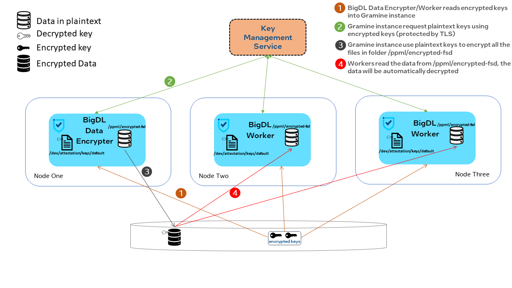

# Gramine PPML Base Image

This folder contains the Dockerfile needed to build the Gramine PPML Base Image.

## Build Image

To build the image, setup the proxy settings in the `build-docker-image.sh` if proxy is needed.  Otherwise, just run `./build-docker-image.sh` to build the image.


## For those who wants to extend this image:

### New working directory

The working directory is now set to `/ppml/` instead of `/ppml/trusted-big-data-ml/`.

For instance, the `bash.manifest.template` originally loads the library from `/ppml/trusted-big-data-ml/work/lib`.  Now, it will load the library from `/ppml/work/lib`

All the corresponding files including

1. bash.manifest.template
2. clean.sh
3. init.sh
4. Makefile

are changed accordingly.

### Mount files needed by bash.manifest.template

The following four directories required by the `bash.manifest.template` are no longer added to the image.
```bash
  { path = "/root/.kube/", uri = "file:/root/.kube/" },
  { path = "/root/.keras", uri = "file:/root/.keras" },
  { path = "/root/.m2", uri = "file:/root/.m2" },
  { path = "/root/.zinc", uri = "file:/root/.zinc" },
```


To ensure that the `bash.manifest.template` works correctly, add the following block into your image's Dockerfile:

```dockerfile
RUN  mkdir -p /root/.keras/datasets && \
     mkdir -p /root/.zinc && \
     mkdir -p /root/.m2 && \
     mkdir -p /root/.kube/
```

### Set ENV in your image

The image have Python3.7 installed.  If this is what you needed, put the following command into your image:
```dockerfile
ENV PYTHONPATH   /usr/lib/python3.7:/usr/lib/python3.7/lib-dynload:/usr/local/lib/python3.7/dist-packages:/usr/lib/python3/dist-packages
```

Otherwise, install your version of Python and set the `PYTHONPATH` accordingly.

Besides, you may also want to set the `WORKDIR` and the `ENTRYPOINT` in your image.

## What is included in the image?

The image only contains these important components:

1. Python3.7 and some packages.
2. Gramine.
3. Three patches applied to the Python source code and its packages.
4. Package sgxsdk and dcap, required by remote attestation.
5. Script for register MREnclave and verify remote EHSM (The jars required are not fully provided).


## How to use the encryption/decryption function provided by Gramine?

This image provides two folders which can be used to encrypt/decrypt data, which are:

1. /ppml/encrypted-fs
2. /ppml/encrypted-fsd

### encrypted-fs

The `/ppml/encrypted-fs` folder uses **mr_signer** for encryption/decryption.  The **mr_signer** is co-related to the machine.  Therefore, the content encrypted on one node cannot be decrypted by another node.

To do the encryption, just simply copy files into the `/ppml/encrypted-fs` directory within the Gramine instance.

The decryption is done automatically when you perform the read operation in Gramine instance.


### encrypted-fsd

The `/ppml/encrypted-fsd` folder provides the functionality to encrypt on one node and decrypt on any nodes with the same key file.

The architecture for `/ppml/encrypted-fsd` can be found here:



To see how to enable the usage of `/ppml/encrypted-fsd`, you can refer to file `../trusted-deep-learning/entrypoint.sh` and file `./encrypted-fsd.sh`.
