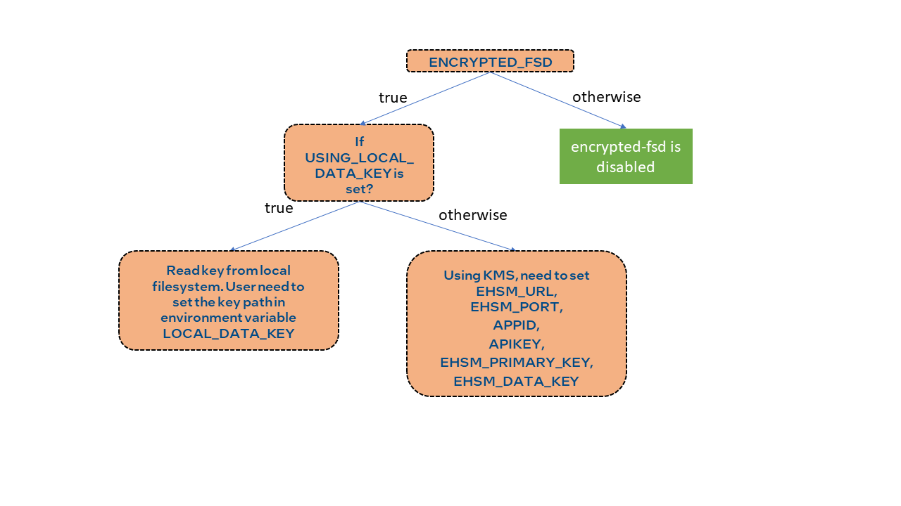

# Gramine PPML Base Image

This folder contains the Dockerfile needed to build the Gramine PPML Base Image.

## Build Image

To build the image, setup the proxy settings in the `build-docker-image.sh` if proxy is needed.  Otherwise, just run `./build-docker-image.sh` to build the image.

## For those who wants to extend this image:

### New working directory

The working directory is now set to `/ppml/` instead of `/ppml/trusted-big-data-ml/`.

For instance, the `bash.manifest.template` originally loads the library from `/ppml/trusted-big-data-ml/work/lib`.  Now, it will load the library from `/ppml/work/lib`

All the corresponding files including

1. bash.manifest.template
2. clean.sh
3. init.sh
4. Makefile

are changed accordingly.

### Set ENV in your image

The image have Python3.7 and python3.8 installed.

The `PYTHONPATH` has already been setup for you.  The default python version is 3.8.10

If this is not what you want, install your version of Python and set the `PYTHONPATH` accordingly.

Besides, you may also want to set the `WORKDIR` and the `ENTRYPOINT` in your image.

## What is included in the image?

The image only contains these important components:

1. Python3.8.10 and some packages.
2. Gramine.
3. Three patches applied to the Python source code and its packages.
4. Package sgxsdk and dcap, required by remote attestation.
5. Script for register MREnclave and verify remote EHSM.

## How to use the encryption/decryption function provided by Gramine?

This image provides two folders which can be used to encrypt/decrypt data, which are:

1. /ppml/encrypted-fs
2. /ppml/encrypted-fsd

### encrypted-fs

The `/ppml/encrypted-fs` folder uses **mr_signer** for encryption/decryption.  The **mr_signer** is co-related to the machine.  Therefore, the content encrypted on one node cannot be decrypted by another node.

To do the encryption, just simply copy files into the `/ppml/encrypted-fs` directory within the Gramine instance.

The decryption is done automatically when you perform the read operation in Gramine instance.

### encrypted-fsd

The `/ppml/encrypted-fsd` folder provides the functionality to encrypt on one node and decrypt on any nodes with the same key file.

The architecture for `/ppml/encrypted-fsd` can be found here:

To see how to enable the usage of `/ppml/encrypted-fsd`, you can refer to file `../trusted-deep-learning/entrypoint.sh` and file `./encrypted-fsd.sh`.

Basically, the reason why contents encrypted on one node can be decrypted on another node is that the keys used for encryption/decryption are the same.

The `entrypoint.sh` and `encrypted-fsd.sh` will try to write the same key into `/dev/attestation/keys/sgx_data_key` in the gramine instance. Currently, there are two ways to write the key into `/dev/attestation/keys/sgx_data_key`. Please refer to the following figure.

**ENCRYPTED_FSD**: If set to true, the gramine instance will try to acquire the key from **KMS** or **local filesystem** and write the first 16 bytes into **/dev/attestation/keys/sgx_data_key**.

**USING_LOCAL_DATA_KEY**: If set to true, the gramine instance will not use KMS but read the key from **LOCAL_DATA_KEY** which is a file.

> Warning: Please be noted that **USING_LOCAL_DATA_KEY** is only a test feature and should not be used in any **production environment** due to security consideration.

**EHSM_URL**: The URL for the Key management service.  The EHSM_URL will be used for constructing a https url.

**EHSM_PORT**: The port for the key management service.  Default to 3000.

**APPID, APIKEY**: These are required by the KMS and also the remote attestation service.

**EHSM_PRIMARY_KEY**: Primary key required by KMS service, this key is encrypted, so it is safe to write it on disk.
Default to  `/ppml/encrypted_keys/encrypted_primary_key`

**EHSM_DATA_KEY**: Data key required by KMS service, also used for encryption/decryption.  This key is encrypted, so it is safe to write it on disk.  Default to `/ppml/encrypted_keys/encrypted_data_key`