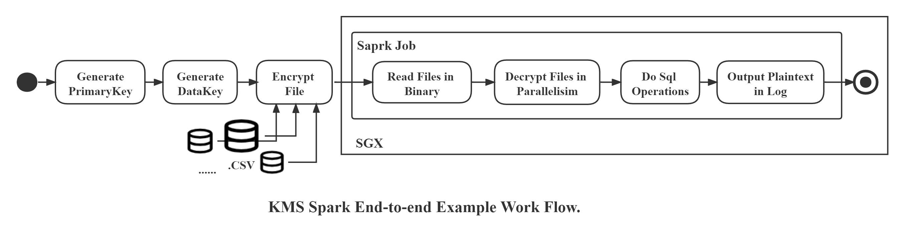

# Client API for Key Management System

BigDL implements its key management system based on [eHSM](https://github.com/intel/ehsm/) (SGX Enclave Based Hardware Security Module). It enables users to receive a central key management service by using client APIs here, which allow users to generate keys and encrypt/decrypt data files safely and conveniently.

In the following, we present with a end-to-end  kms example.

## 1. Deploy KMS Server

The KMS server is based on [eHSM](https://github.com/intel/ehsm/) , it can be downloaded and deployed following commands below:

```
git clone https://github.com/intel/ehsm.git 
cd ehsm
./docker/build_and_run.sh -b
./docker/build_and_run.sh -r
```

Then, you will get a KMS server running in a docker container.

## 2. Deploy KMS Client

The KMS client in this example is running in the environment of [SGX-based Trusted Big Data ML](https://github.com/intel-analytics/BigDL/tree/branch-2.0/ppml/trusted-big-data-ml/python/docker-graphene), in which we have deployed necessary requirements. You can also do the same in other trusted execution environments, like Trusted Realtime ML etc., after installing python modules listed in `requirement.yml` with pip. 

Prepare and start the client container as below:

```bash
export ENCLAVE_KEY_PATH=YOUR_LOCAL_ENCLAVE_KEY_PATH
export DATA_PATH=YOUR_LOCAL_DATA_PATH
export KEYS_PATH=YOUR_LOCAL_KEYS_PATH
export LOCAL_IP=YOUR_LOCAL_IP
export DOCKER_IMAGE=intelanalytics/bigdl-ppml-trusted-big-data-ml-python-graphene:0.14.0-SNAPSHOT

sudo docker pull $DOCKER_IMAGE

sudo docker run -itd \
    --privileged \
    --net=host \
    --cpuset-cpus="0-5" \
    --oom-kill-disable \
    --device=/dev/gsgx \
    --device=/dev/sgx/enclave \
    --device=/dev/sgx/provision \
    -v $ENCLAVE_KEY_PATH:/graphene/Pal/src/host/Linux-SGX/signer/enclave-key.pem \
    -v /var/run/aesmd/aesm.socket:/var/run/aesmd/aesm.socket \
    -v $DATA_PATH:/ppml/trusted-big-data-ml/work/data/kms-example \
    -v $KEYS_PATH:/ppml/trusted-big-data-ml/work/keys \
    -v $SECURE_PASSWORD_PATH:/ppml/trusted-big-data-ml/work/password \
    --name=kms-client \
    -e LOCAL_IP=$LOCAL_IP \
    -e SGX_MEM_SIZE=64G \
    $DOCKER_IMAGE bash
```

Pay attention to the variables and set them to correct values according to your operating environment. As for data, we use [iris.csv](https://www.kaggle.com/saurabh00007/iriscsv). All the files put at `$DATA_PATH` will be mounted to `/ppml/trusted-big-data-ml/data/kms-example`, encrypted and decrypted automatically later. You can learn about how to generate `$KEYS_PATH` and `$SECURE_PASSWORD_PATH` in **Prepare data, key and password** section [here](https://github.com/intel-analytics/BigDL/tree/9973fbf0c65525934830461d6085defae48de84d/ppml/trusted-big-data-ml/python/docker-graphene#2-prepare-data-key-and-password).
## 3. Run The End-to-end Example

A file encryption/decryption example is used to illustrate the KMS, in which the decryption process is done as a spark job in SGX. Its workflow can be seen as below:

<div align="center">
<p align="center"> <br></p>
</div>


Enter the client container deployed in the previous step and run the shell script:

```bash
sudo docker exec -it kms-client bash
cd /ppml/trusted-big-data-ml
bash work/test-suites/kms-e2e-example.sh
```

Then it takes a little time to operate in SGX, and you are expected to get output as below:

```bash
[INFO] Start To Process Outside SGX...
[INFO] Generate Primary Key Start...
Writing generated primary key to local file...
Generate Primary Key Successfully!
[INFO] Generate Data Key Start...
Writing generated data key to local file...
Generate Data Key Successfully!
[INFO] Encrypt Files Start...
Encrypt Successfully! Encrypted Output Is /ppml/trusted-big-data-ml/work/encrypted_output/iris_2.csv.encrypted
Encrypt Successfully! Encrypted Output Is /ppml/trusted-big-data-ml/work/encrypted_output/iris_1.csv.encrypted
[INFO] Encrypted Files Are Saved Under /ppml/trusted-big-data-ml/work/encrypted_output.
[INFO] Decrypt The Ciphere Files Inside SGX...

[INFO] The Result Of Decrypted CSV Files Content Queried By Spark Is As Below:
 |-- sepal length: double (nullable = false)
 |-- sepal width: double (nullable = false)
 |-- petal length: double (nullable = false)
 |-- petal width: double (nullable = false)
 |-- class: string (nullable = false)
|sepal length|sepal width|petal length|petal width|          class|
|         6.6|        3.0|         4.4|        1.4|Iris-versicolor|
|         6.8|        2.8|         4.8|        1.4|Iris-versicolor|
|         6.7|        3.0|         5.0|        1.7|Iris-versicolor|
|         6.0|        2.9|         4.5|        1.5|Iris-versicolor|
|         5.7|        2.6|         3.5|        1.0|Iris-versicolor|
|         5.5|        2.4|         3.8|        1.1|Iris-versicolor|
|         5.5|        2.4|         3.7|        1.0|Iris-versicolor|
|         5.8|        2.7|         3.9|        1.2|Iris-versicolor|
|         6.0|        2.7|         5.1|        1.6|Iris-versicolor|
|         5.4|        3.0|         4.5|        1.5|Iris-versicolor|
|         6.0|        3.4|         4.5|        1.6|Iris-versicolor|
|         6.7|        3.1|         4.7|        1.5|Iris-versicolor|
|         6.3|        2.3|         4.4|        1.3|Iris-versicolor|
|         5.6|        3.0|         4.1|        1.3|Iris-versicolor|
|         5.5|        2.5|         4.0|        1.3|Iris-versicolor|
|         5.5|        2.6|         4.4|        1.2|Iris-versicolor|
|         6.1|        3.0|         4.6|        1.4|Iris-versicolor|
|         5.8|        2.6|         4.0|        1.2|Iris-versicolor|
|         5.0|        2.3|         3.3|        1.0|Iris-versicolor|
|         5.6|        2.7|         4.2|        1.3|Iris-versicolor|
```

