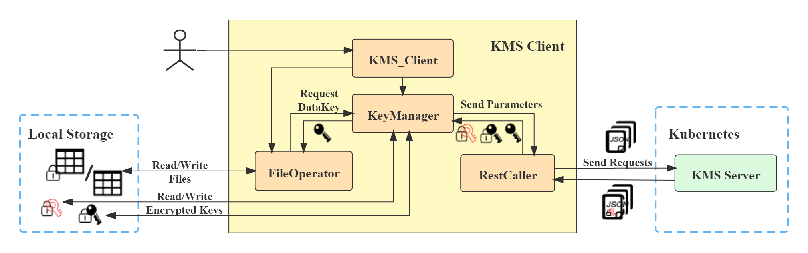
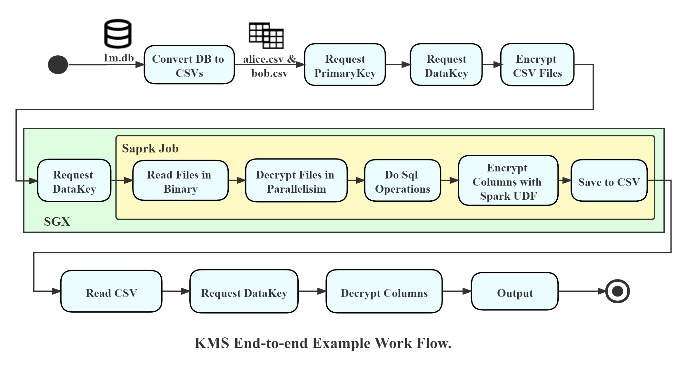

# KMS Client Usage for BigDL PPML with KMS

BigDL implements its key management system based on [eHSM](https://github.com/intel/ehsm/) (SGX Enclave Based Hardware Security Module). It enables users to receive a central key management service by using client APIs here, which allow users to generate keys and encrypt/decrypt data files safely and conveniently.

In the following, we will present a end-to-end BigDL PPML with KMS example.

<div align="center">
<p align="center"> <br></p>
KMS Client Architecture
</div>

## 1. Deploy BigDL PPML with KMS Server

The KMS server is based on open-sourced project [eHSM](https://github.com/intel/ehsm/) , it can be downloaded and deployed following commands below:

```
git clone https://github.com/intel/ehsm.git 
cd ehsm
./docker/build_and_run.sh -b
./docker/build_and_run.sh -r
```

Then, you will get a KMS server running in a docker container. If encounter any problem, you can refer to [eHSM](https://github.com/intel/ehsm/). In the future, this can be deployed as a K8S service from a deployment yaml.

## 2. Encrypt Your Data Files

This step is to encrypt your data files using keys generated by KMS server. It can be done in two ways: 

1. Encrypt outside the container, if a python environment is ready on your local host.
2. Encrypt inside the container, where we provide a pre-prepared working environment with necessary dependencies.

Details of the two schemes are in the following.

### **Scheme 1: Encrypt On Your Local Host**

In this mode, you should first install necessary packages on pip using the below command:

```bash
# At BigDL/.
cd /ppml/kms-client # Go to kms-client directory
pip install -r requirement.yml
```

Then, you are allowed to generate primary and data keys, and use them to encrypt your original data files under a directory

```bash
export INPUT_DIR_PATH=YOUR_DATA_FILE_DIRECTORY_PATH # For example, multiple CSV files are in this directory
export KMS_SERVER_IP=YOUR_KMS_SERVER_IP # IP address of node where the previous KMS server is deployed

# Step 1. Generate Primary Key And Data Key
# Keys in ciphertext are saved at current path as default
python ./KMS_Client.py --api generate_primary_key --ip $KMS_SERVER_IP
python ./KMS_Client.py --api generate_data_key --ip $KMS_SERVER_IP --pkp ./encrypted_primary_key

# Step 2. Encyypt The Input Directory Outside SGX With KMS
python ./KMS_Client.py --api encrypt_directory_with_key --ip $KMS_SERVER_IP  --dir $INPUT_DIR_PATH --pkp ./encrypted_primary_key --dkp ./encrypted_data_key
encrypted_path=$INPUT_DIR_PATH.encrypted
echo "[INFO] The Output Path is $encrypted_path"
```

### **Scheme 2: Encrypt Inside a BigDL PPML Container**

Users without a ready python environment can turn to use a pre-prepared BigDL PPML container. 

We have deployed necessary requirements in [SGX-based Trusted Big Data ML](https://github.com/intel-analytics/BigDL/tree/branch-2.0/ppml/trusted-big-data-ml/python/docker-graphene). You can also do the same in other trusted execution environments, like Trusted Realtime ML etc., after installing python modules listed in `requirement.yml` with pip.

Pay attention to the variables and set them to correct values according to your operating environment.

```bash
export INPUT_DIR_PATH=YOUR_DATA_FILE_DIRECTORY_PATH # For example, multiple CSV files are in this directory
export KMS_SERVER_IP=YOUR_KMS_SERVER_IP # IP address of node where the previous KMS server is deployed
export DOCKER_IMAGE=intelanalytics/bigdl-ppml-trusted-big-data-ml-python-graphene:0.14.0-SNAPSHOT

sudo docker pull $DOCKER_IMAGE

sudo docker run -itd \
    --privileged \
    --net=host \
    --cpuset-cpus="0-5" \
    --oom-kill-disable \
    --device=/dev/gsgx \
    --device=/dev/sgx/enclave \
    --device=/dev/sgx/provision \
    -v /var/run/aesmd/aesm.socket:/var/run/aesmd/aesm.socket \
    -v $INPUT_DIR_PATH:/ppml/trusted-big-data-ml/work/input \
    --name=encryption-client \
    -e KMS_SERVER_IP=$KMS_SERVER_IP
    $DOCKER_IMAGE bash
```

Now, a container named `kms-client` has been started and we will encrypt files inside it:

```bash
docker exec -it encryption-client bash
cd /ppml/trusted-big-data-ml

# Step 1. Generate Primary Key And Data Key
# Keys in ciphertext are saved at current path as default
python ./work/kms-client/KMS_Client.py --api generate_primary_key --ip $KMS_SERVER_IP
python ./work/kms-client/KMS_Client.py --api generate_data_key --ip $KMS_SERVER_IP --pkp ./encrypted_primary_key

# Step 2. Encyypt The Input Directory Outside SGX With KMS
python ./work/kms-client/KMS_Client.py --api encrypt_directory_with_key --ip $KMS_SERVER_IP  --dir /ppml/trusted-big-data-ml/work/input --pkp ./encrypted_primary_key --dkp ./encrypted_data_key
```

## 3. Run BigDL PPML with KMS Client at Spark Local Mode

### **3.1 Start a BigDL PPML Container with KMS Client**

The KMS client in this example is running in a BigDL PPML container. Please make sure the SGX-Graphene is available.

Prepare and start the Graphene-SGX-based client container as below. As for `ENCLAVE_KEY_PATH`, `SPARK_KEY_PATH` and `SECURE_PASSWORD_PATH`, please refer to  [SGX-based Trusted Big Data ML](https://github.com/intel-analytics/BigDL/tree/branch-2.0/ppml/trusted-big-data-ml/python/docker-graphene#prepare-the-key).

```bash
export INPUT_DIR_PATH=YOUR_DATA_FILE_DIRECTORY_PATH # Encrypted Data Files Is Under This Directory
export KMS_SERVER_IP=YOUR_KMS_SERVER_IP
export LOCAL_IP=YOUR_LOCAL_IP
export ENCLAVE_KEY_PATH=YOUR_LOCAL_ENCLAVE_KEY_PATH
export SPARK_KEY_PATH=YOUR_SPARK_KEY_PATH
export SECURE_PASSWORD_PATH=YOUR_SECURE_PASSWORD_PATH
export ENCRYPT_PRIMARY_KEY=YOUR_ENCRYPT_PRIMARY_KEY # The encrypt_primary_key generated in the previous step
export ENCRYPT_DATA_KEY=YOUR_ENCRYPT_DATA_KEY # The encrypt_data_key generated in the previous step
export DOCKER_IMAGE=intelanalytics/bigdl-ppml-trusted-big-data-ml-python-graphene:0.14.0-SNAPSHOT

sudo docker pull $DOCKER_IMAGE
sudo docker run -itd \
    --privileged \
    --net=host \
    --cpuset-cpus="0-5" \
    --oom-kill-disable \
    --device=/dev/gsgx \
    --device=/dev/sgx/enclave \
    --device=/dev/sgx/provision \
    -v $ENCLAVE_KEY_PATH:/graphene/Pal/src/host/Linux-SGX/signer/enclave-key.pem \
    -v /var/run/aesmd/aesm.socket:/var/run/aesmd/aesm.socket \
    -v $SPARK_KEY_PATH:/ppml/trusted-big-data-ml/work/keys \
    -v $SECURE_PASSWORD_PATH:/ppml/trusted-big-data-ml/work/password \
    -v $INPUT_DIR_PATH:/ppml/trusted-big-data-ml/work/input/plain.encrypted \
    -v $ENCRYPT_PRIMARY_KEY:/ppml/trusted-big-data-ml/work/input/keys/encrypt_primary_key \
    -v $ENCRYPT_DATA_KEY:/ppml/trusted-big-data-ml/work/input/keys/encrypt_data_key \
    --name=kms-client \
    -e LOCAL_IP=$LOCAL_IP \
    -e SGX_MEM_SIZE=64G \
    -e KMS_SERVER_IP=$KMS_SERVER_IP
    -e ENCRYPT_KEYS_PATH=/ppml/trusted-big-data-ml/work/input/keys
    -e INPUT_DIR_PATH=/ppml/trusted-big-data-ml/work/input/plain.encrypted
    $DOCKER_IMAGE bash
```

### **3.2 Run The End-to-end BigDL PPML Example with KMS**

A file encryption/decryption example is used to illustrate the KMS, in which the decryption process is done as a spark job in SGX. Its workflow can be seen as below:

<div align="center">


  <p align="center"> <br></p>

  </div>

  

Now you have encrypted data files. Then we will decrypt the files in SGX and do some business operations. After that, the results will be encrypted again by columns before going out of SGX. Finally, the output will be decrypted and presented at the client side.

Enter the client container deployed in the previous step and run the below commands.

  ```bash
  docker exec -it kms-client bash
  cd /ppml/trusted-big-data-ml
  bash init.sh # Graphene-SGX Initiation
  
  # Step 1. Decrypt The Encrypted Files As A Spark Job Inside SGX And Then Encrypt Columns
  export OUT_DIR_PATH=YOUR_OUTPUT_SAVE_DIR # You can decide a directory path for output files, it will be created automatically
  SGX=1 ./pal_loader bash -c "bash ./work/kms-client/DecryptFilesWithSpark.sh $INPUT_DIR_PATH $ENCRYPT_KEYS_PATH $KMS_SERVER_IP $LOCAL_IP $OUT_DIR_PATH" 2>&1 > spark-inside-sgx.log
  
  # Step 2. Decrypt The colums And Ouput With KMS API
  python /ppml/trusted-big-data-ml/work/kms-client/KMS_Client.py --api decrypt_csv_columns --ip $KMS_SERVER_IP --dir $OUT_DIR_PATH --pkp $ENCRYPT_KEYS_PATH/encrypted_primary_key --dkp $ENCRYPT_KEYS_PATH/encrypted_data_key
  ```

  Then it takes a little time to operate in SGX, and you are expected to get output files under directory `$output_path`. You will get screen output similar to below:

  ```bash
  [INFO] Start To Generate Keys...
  [INFO] Primary Key Generated Successfully at ./encrypted_primary_key
  [INFO] Data Key Generated Successfully at ./encrypted_data_key
  [INFO] Start To Encrypt...
  [INFO] Encrypt Files Start...
  [INFO] Encrypt Successfully! Encrypted Output Is /ppml/trusted-big-data-ml/1m_csv.encrypted/tmp_mock_r_table.csv.encrypted
  ......
  [INFO] Encrypted Files.
  [INFO] The Directory Is Encrypted, Saved At /ppml/trusted-big-data-ml/1m_csv.encrypted
  [INFO] Decrypt The Ciphere Files Inside SGX...
  ......
  [INFO] The Output is Saved At /ppml/trusted-big-data-ml/1m_csv.encrypted.col_encrypted
  [INFO] Retrieve Output At Client Side.
  [INFO] Start To Decrypt Columns...
  [INFO] Column Decryption Start...
  [INFO] Decryption Finished. The Output Is /ppml/trusted-big-data-ml/1m_csv.encrypted.col_encrypted/tmp_mock_a_table.csv.encrypted/part-00001-7357c8d7-33bd-4173-b306-6fdbe5657591-c000.csv.col_decrypted
  ......
  [INFO] Total Elapsed Time For Columns Decrytion: 940.2687749862671 s
  ```

## 4. Run BigDL PPML with KMS Client at K8S Mode

This will be released in the future.

## 5. BigDL PPML with KMS Client API Usage

You can do below operations supported by BigDL PPML with KMS Client APIs. Please make sure KMS Server has been prepared. Parameter `port` in below commands is optional as it is set to `3000`, which is the default value of KMS Server.

- Request a primary key and save it locally in ciphertext:

  ```bash
  python ./work/kms-client/KMS_Client.py -api generate_primary_key -ip <KMS_SERVER_IP> [-port <KMS_SERVER_PORT>]
  ```

- Request a data key with prepared primary key and save it locally in ciphertext:

  ```bash
  python ./work/kms-client/KMS_Client.py -api generate_primary_key -ip <KMS_SERVER_IP> [-port <KMS_SERVER_PORT>] -pkp <PRIMARYED_KEY_PATH>
  ```

- Encrypt a file without holding keys (keys will be generated automatically):

  ```bash
  python ./work/kms-client/KMS_Client.py -api encrypt_file_without_key -ip <KMS_SERVER_IP> [-port <KMS_SERVER_PORT>] -dfp <DATA_FILE_PATH>
  ```

- Encrypt a file with specified keys (if you have generated keys before, you will find encrypted key files named `encrypted_primary_key` and `encyrpted_data_key`, and you can use them again in the following):

  ```bash
  python ./work/kms-client/KMS_Client.py -api encrypt_file_with_key -ip <KMS_SERVER_IP> [-port <KMS_SERVER_PORT>] -pkp <PRIMARYED_KEY_PATH> -dkp <DATA_KEY_PATH> -dfp <DATA_FILE_PATH>
  ```

- Decrypted a file with according keys:

  ```bash
  python ./work/kms-client/KMS_Client.py -api decrypt_file -ip <KMS_SERVER_IP> [-port <KMS_SERVER_PORT>] -pkp <PRIMARYED_KEY_PATH> -dkp <DATA_KEY_PATH> -dfp <ENCYRPTED_DATA_FILE_PATH>
  ```

- Automatically generate keys and encrypt all files under a directory:

  ```bash
  python ./work/kms-client/KMS_Client.py -api encrypt_directory_without_key -ip <KMS_SERVER_IP> [-port <KMS_SERVER_PORT>] -dir <DIRECTORY_TO_BE_ENCRYPTED> [-sdp <SAVE_DIRECTORY_PATH>]
  ```
- Encrypt all files under a directory with existing keys:

  ```bash
  python ./work/kms-client/KMS_Client.py -api encrypt_directory_with_key -ip <KMS_SERVER_IP> [-port <KMS_SERVER_PORT>] -dir <DIRECTORY_TO_BE_ENCRYPTED> -pkp <PRIMARYED_KEY_PATH> -dkp <DATA_KEY_PATH> [-sdp <SAVE_DIRECTORY_PATH>]

- Get plaintext data key from a `encyrpted_data_key`:

  ```bash
  python ./work/kms-client/KMS_Client.py -api get_data_key_plaintext -ip <KMS_SERVER_IP> [-port <KMS_SERVER_PORT>] -pkp <PRIMARYED_KEY_PATH> -dkp <DATA_KEY_PATH>
  ```

- Decrypt columns of CSVs under a directory:

  ```bash
  python ./work/kms-client/KMS_Client.py -api decrypt_csv_columns -ip <KMS_SERVER_IP> [-port <KMS_SERVER_PORT>] -pkp <PRIMARYED_KEY_PATH> -dkp <DATA_KEY_PATH> -dir <DIRECTORY_TO_BE_ENCRYPTED>
  ```

