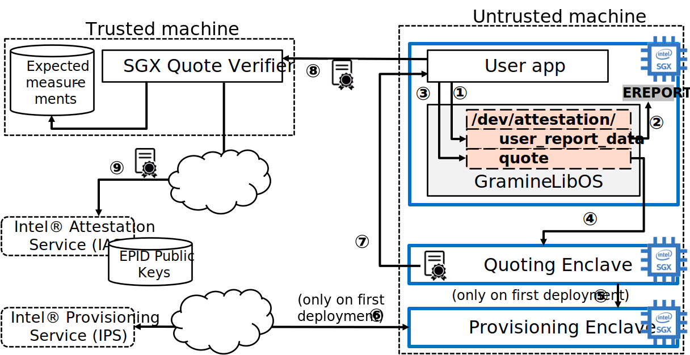
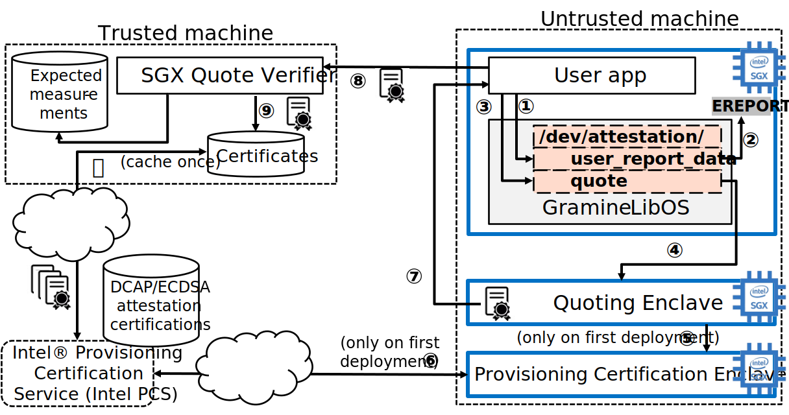
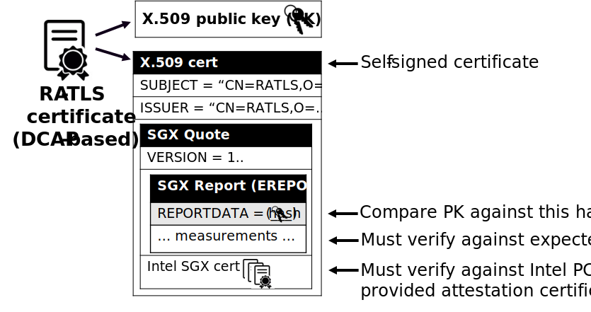

Attestation and Secret Provisioning
===================================

Gramine is typically used to create and run Trusted Execution Environments
(:term:`TEE`). A very important aspect of a TEE is :term:`Attestation`. Broadly
speaking, attestation is a mechanism for a remote user to verify that the
application runs on a real hardware in an up-to-date TEE with the expected
initial state.

There are two types of attestation: :term:`Local Attestation` and
:term:`Remote Attestation`. Local attestation is used when two TEEs run on the
same physical machine and remote attestation is used when a user attests a TEE
running on a remote physical machine. In the following, even though Gramine
attestation flows are designed to be TEE-agnostic, we discuss only :term:`SGX`
attestation flows (the SGX flows are currently the only ones implemented).

By itself, remote attestation only provides the assurance to the user that the
remotely executing TEE is trusted, that the correct code is executed and that
the data is processed securely. In addition to this assurance, the user needs to
create a :term:`Secure Channel` for trusted communication with the remote TEE.
In many cases, the user also wants :term:`Secret Provisioning` to transparently
provision secret keys and other sensitive data to the remote TEE.

Gramine provides support for all three levels of attestation flows:

#. :term:`Local Attestation` and :term:`Remote Attestation` are exposed to the
   application via ``/dev/attestation`` pseudo-filesystem. SGX local attestation
   in Gramine relies on the ``EREPORT`` hardware instruction. SGX remote
   attestation uses the Intel SGX PSW's AESM service and the Intel IAS service
   (for EPID flows) or DCAP libraries (for ECDSA/DCAP flows) under the hood.

#. :term:`Secure Channel` is constructed using the RA-TLS libraries.
   :term:`RA-TLS` uses raw ``/dev/attestation`` pseudo-files under the hood.

#. :term:`Secret Provisioning` is built using the Secret Provisioning libraries.
   These libraries use RA-TLS under the hood.

Applications running under Gramine can use each of the above three levels to
build their attestation flows. Each next level builds on the previous one and
exposes a simpler API to the application (but also is more restricted in its
functionality).

In addition to these three Gramine-native flows, there is also an option to use
third-party attestation & secret provisioning solutions. This option may be
better suited for complex deployments, for example, deploying chained
micro-services in the public cloud. Please refer to :ref:`third_party_solutions`
for specific examples.

Remote Attestation flows for EPID and DCAP
------------------------------------------

Remote attestation in Intel SGX comes in two flavours: :term:`EPID` and
:term:`DCAP`. The former is used in client machines whereas the latter is used
in data center environments. The details of these flows will be described in the
following sections. Here we give a high-level description of both of these
remote attestation schemes.

The diagram above shows EPID based remote attestation. The user application runs
in an SGX enclave on a remote untusted machine, whereas the end user waits for
the attestation evidence from this enclave on a trusted machine.

EPID based remote attestation starts with the enclavized user application
opening the special file ``/dev/attestation/user_report_data`` for write (step
1). Under the hood, Gramine uses the ``EREPORT`` hardware instruction to
generate an :term:`SGX Report` (step 2). After the SGX report is generated, the
application opens another special file ``/dev/attestation/quote`` for read (step
3). Under the hood, Gramine communicates with the :term:`Quoting Enclave` to
receive the :term:`SGX Quote` (step 4). In turn, the Quoting Enclave uses the
EPID key provided by the :term:`Provisioning Enclave` (step 5, only during
initial deployment of this SGX machine). The Provisioning Enclave requests the
EPID key associated with this SGX machine from the internet-accessible
:term:`Intel Provisioning Service` (step 6, only during initial deployment).
The Quoting Enclave generates the SGX quote from the provided-by-application SGX
report and sends it back to the enclavized user application. The application
stores this SGX quote in its enclave memory and can later send it to the remote
user (verifier) upon request. When the remote user wants to validate the SGX
enclave, it requests remote attestation with it, and the enclavized application
forwards the SGX quote to the remote trusted machine (step 8). Finally, the
remote user consults the :term:`Intel Attestation Service` (by forwarding the
SGX quote to this service), which returns back whether this SGX quote can be
trusted (step 9). Finally, the remote user also verifies the enclave
measurements embedded in the SGX quote against the expected ones. After this
verification procedure, the remote user can trust the SGX enclave on the
untrusted machine and start sending inputs/receiving enclave outputs.

The diagram above shows DCAP based remote attestation. The DCAP flows are very
similar to EPID flows, but rather than using the EPID keys and consulting the
Intel Attestation Service, the DCAP flows instead use the classic PKI with X.509
certificate chains.

The DCAP flows are the same as EPID flows in steps 1-4. However, the Quoting
Enclave talks to the :term:`Provisioning Certification Enclave` (PCE) rather
than the :term:`Provisioning Enclave` (step 5). The PCE uses another Intel
service called :term:`Intel Provisioning Certification Service` (PCS) to obtain
the attestation collateral: attestation certificates and certificate revocation
lists for the SGX machine (step 6). Also, the end user does not need to consult
a web service from Intel each time a new SGX quote arrives -- instead the end
user periodically fetches the DCAP attestation certificates and caches them on a
local machine (preliminary step 0). When the SGX quote arrives, the user
compares the certificates embedded in the quote against these cached
certificates (step 9).

Low-level ``/dev/attestation`` interface
----------------------------------------

The first level of the ``/dev/attestation`` pseudo-filesystem exposes the
low-level abstractions of *attestation report* and *attestation quote* objects
(:term:`SGX Report` and :term:`SGX Quote` in SGX parlance), in the form of the
below pseudo-files:

- ``/dev/attestation/user_report_data`` pseudo-file can be opened for read or
  write access. Typically, it is opened and written into before opening and
  reading from the ``/dev/attestation/report`` and ``/dev/attestation/quote``
  files, such that they can use the user-provided report data. In case of Intel
  SGX, user report data can be an arbitrary string of size 64B; this string is
  embedded in the SGX report/quote.

- ``/dev/attestation/target_info`` pseudo-file can be opened for read and write.
  Typically, it is opened and written into before opening and reading from the
  ``/dev/attestation/report`` file, such that the latter can use the provided
  target info. In case of Intel SGX, target info is an opaque blob of size 512B.

- ``/dev/attestation/my_target_info`` pseudo-file can be opened for read and
  will contain the target info of this enclave. The resulting target info blob
  can be passed to another enclave as part of the local attestation flow. In
  case of Intel SGX, target info is an opaque blob of size 512B.

- ``/dev/attestation/report`` pseudo-file can be opened for read and will
  contain the SGX report. Before opening this file for read, user report data
  must be written into ``/dev/attestation/user_report_data`` and target info
  must be written into ``/dev/attestation/target_info``. Otherwise the obtained
  report will contain incorrect or stale user report data and target info.

- ``/dev/attestation/quote`` pseudo-file can be opened for read and will contain
  the SGX quote. Before opening this file for read, user report data must be
  written into ``/dev/attestation/user_report_data``. Otherwise the obtained
  attestation quote will contain incorrect or stale user report data.

The resulting report can be passed to another TEE as part of the local
attestation flow. In case of Intel SGX, the obtained report is the SGX report
created by the ``EREPORT`` hardware instruction.

The resulting quote can be passed to another TEE or service as part of the
remote attestation flow. In case of Intel SGX, the obtained quote is the SGX
quote created by the :term:`Quoting Enclave` (accessed via the AESM service).

Using the above files, the user application may construct arbitrary attestation
flows. Typically, the application will write a secure hash of the unique public
key generated by the TEE instance into ``/dev/attestation/user_report_data``,
such that when the remote user receives the SGX quote (with user report data
embedded), the remote user can tie the TEE instance to the TEE's public key.

Please note that these files are process-local, so there is no need to add
locking between processes when setting the user report data/target info or
reading the report/quote.

An example of this low-level interface can be found under
``LibOS/shim/test/regression/attestation.c``. Here is a C code snippet of how
the remote attestation flow may look like in your application::

    sgx_report_data_t user_report_data = {0};
    memcpy(&user_report_data, "some-dummy-data", sizeof("some-dummy-data"));

    int fd1 = open("/dev/attestation/user_report_data", O_WRONLY);
    write(fd1, &user_report_data, sizeof(user_report_data));

    uint8_t quote[SGX_QUOTE_MAX_SIZE];
    int fd2 = open("/dev/attestation/quote", O_RDONLY);
    read(fd2, &quote, sizeof(quote));

    /* ...send `quote` to the remote user for verification... */

The remote user should receive this attestation quote and verify it. In case of
Intel SGX, this verification flow depends on whether the SGX remote attestation
is EPID based or DCAP/ECDSA based:

- :term:`EPID` based quote verification is done with the help of the Intel
  Attestation Service (:term:`IAS`). In particular, the remote user should
  forward the received SGX quote to the well-known IAS endpoint via a secure
  internet connection and get the IAS attestation report (not to be confused
  with SGX report!) back. The user then should examine the contents of the IAS
  attestation report and decide whether to trust the remote SGX enclave or not.

- :term:`DCAP` based quote verification is done with the help of the Intel DCAP
  libraries. These libraries encapsulate the complicated DCAP flows (extracting
  Intel SGX certificates from the
  :term:`Intel Provisioning Certification Service`, caching these certificates
  in the Provisioning Certificate Caching Service, etc.).

Gramine does *not* provide any pseudo-files under ``/dev/attestation`` for
verification of the attestation quote. Instead, the remote user is encouraged to
use the :program:`quote_dump`, :program:`ias_request` and
:program:`verify_ias_report` tools shipped together with Gramine (for
EPID based quote verification) or to use the Intel DCAP libraries and tools (for
DCAP based quote verification).

The ``/dev/attestation`` pseudo-filesystem also exposes pseudo-files to set the
encryption keys (see also :doc:`manifest-syntax`):

- ``/dev/attestation/keys/<key_name>`` file contains the encryption key with a
  given name (the default key name is ``default``). Typically, it is opened
  before the actual application runs and filled with a 128-bit key obtained from
  a remote secret provisioning service. The format of the file is a 16-byte raw
  binary value.

.. note::
   Previously, ``/dev/attestation/protected_files_key`` was used for setting the
   default encryption key, and Gramine still supports that file for backward
   compatibility.

   Note that the old file (``/dev/attestation/protected_files_key``) uses a
   32-character hex value, and the new files
   (``/dev/attestation/keys/<key_name>``) use a 16-byte raw binary value.

Mid-level RA-TLS interface
--------------------------

As can be seen from the previous section, the low-level ``/dev/attestation``
interface provides only bare-bones TEE attestation functionality and does not
provide any convenient interface for user-side quote verification. Also, that
low-level interface provides no means to transfer any data to/from the TEE other
than the attestation quote itself.

:term:`RA-TLS` interface hides the complexity of the low-level
``/dev/attestation`` flows and provides a simple and powerful abstraction of a
TLS connection between the TEE and the remote user (enhanced with
remote-attestation flows). Using RA-TLS, the application can securely send and
receive arbitrary data to/from the remote user. RA-TLS is currently tied to
Intel SGX but can be adapted for other TEEs.

RA-TLS integrates Intel SGX remote attestation into the TLS connection setup.
Conceptually, it extends the standard X.509 certificate with SGX-related
information (SGX quote). The additional information allows the remote user
(verifier) of the certificate to verify that it is indeed communicating with an
SGX enclave (attester).

The diagram above shows the standard X.509 certificate generated by RA-TLS (the
diagram shows the DCAP based RA-TLS certificate, but the EPID based RA-TLS
certificate is conceptually similar). This certificate is self-signed because
the actual chain of trust is stored in the Intel SGX certificates embedded in
the SGX quote. The most important concept behind the RA-TLS certificate is that
it embeds the SGX quote (in one of the unused X.509 extension fields), which in
turn embeds the SGX report and the complete Intel SGX certificate chain.
Therefore, the RA-TLS certificate contains all the SGX-relevant information.
Also, notice how the SGX report's REPORTDATA field contains the secure hash of
the ephemeral public key generated by the enclavized application -- this is how
this RA-TLS certificate is tied to the enclavized application that generated it.

RA-TLS is shipped as three libraries: ``ra_tls_attest.so``, EPID based
``ra_tls_verify_epid.so`` and DCAP/ECDSA based ``ra_tls_verify_dcap.so``.
The interfaces exposed by these libraries can be found in the following header:
:file:`Pal/src/host/Linux-SGX/tools/ra-tls/ra_tls.h`.

The examples of using RA-TLS can be found under ``CI-Examples/ra-tls-mbedtls``.

``ra_tls_attest.so``
^^^^^^^^^^^^^^^^^^^^

This library creates the self-signed RA-TLS certificate. This library must be
loaded into the SGX enclave. The library relies on the pseudo-FS
``/dev/attestation`` to retrieve the SGX quote and embed it into the RA-TLS
certificate. The library is *not* thread-safe.

The library expects the following information in the manifest for EPID based
attestation:

- ``sgx.remote_attestation = true`` -- remote attestation is enabled.
- ``sgx.ra_client_spid`` -- client SPID for EPID remote attestation.
- ``sgx.ra_client_linkable`` -- client linkable/unlinkable attestation mode.

For DCAP/ECDSA based attestation, the library expects instead:

- ``sgx.remote_attestation = true`` -- remote attestation is enabled.
- ``sgx.ra_client_spid = ""`` -- hints that this is a DCAP attestation, *not*
  EPID attestation.

The library uses the following environment variables if available:

- ``RA_TLS_CERT_TIMESTAMP_NOT_BEFORE`` -- the generated RA-TLS certificate uses
  this timestamp-not-before value, in the format "20010101000000" (this is also
  the default value if environment variable is not available).
- ``RA_TLS_CERT_TIMESTAMP_NOT_AFTER`` -- the generated RA-TLS certificate uses
  this timestamp-not-after value, in the format "20301231235959" (this is also
  the default value if environment variable is not available).

``ra_tls_verify_epid.so``
^^^^^^^^^^^^^^^^^^^^^^^^^

This library contains the verification callback that should be registered with
the TLS library during verification of the TLS certificate. It verifies the
RA-TLS certificate and the SGX quote by sending it to the Intel Attestation
Service (IAS) and retrieving the attestation report from IAS. This library is
*not* thread-safe.

The library uses the following SGX-specific environment variables, representing
SGX measurements:

- ``RA_TLS_MRSIGNER`` -- verify that the attesting enclave has this
  ``MRSIGNER``. This is a hex string.
- ``RA_TLS_MRENCLAVE`` -- verify that the attesting enclave has this
  ``MRENCLAVE``. This is a hex string.
- ``RA_TLS_ISV_PROD_ID`` -- verify that the attesting enclave has this
  ``ISV_PROD_ID``. This is a decimal string.
- ``RA_TLS_ISV_SVN`` -- verify that the attesting enclave has this ``ISV_SVN``.
  This is a decimal string.

For each of these settings, you may specify the special value ``any`` to skip
verifying a particular measurement. This used to be the default, which would
be used if a particular environment variable wasn't present. This behavior
has been deprecated and will become a hard error in the future.

The four SGX measurements above may be also verified via a user-specified
callback with the signature ``int (*callback)(char* mrenclave, char* mrsigner,
char* isv_prod_id, char* isv_svn)``. This callback must be registered via
``ra_tls_set_measurement_callback()``. The measurements from the received SGX
quote are passed as four arguments. It is up to the user to implement the
correct verification of SGX measurements in this callback (e.g., by comparing
against expected values stored in a central database).

The library also uses the following SGX-specific environment variables:

- ``RA_TLS_ALLOW_OUTDATED_TCB_INSECURE`` (optional) -- whether to allow outdated
  TCB as returned in the IAS attestation report or returned by the DCAP
  verification library. Value ``1`` means "allow outdated TCB". Note that
  allowing outdated TCB is **insecure** and should be used only for debugging
  and testing. Outdated TCB is not allowed by default.

- ``RA_TLS_ALLOW_DEBUG_ENCLAVE_INSECURE`` (optional) -- whether to allow debug
  enclaves (enclaves with ``SECS.ATTRIBUTES.DEBUG`` bit set to one). Value ``1``
  means "allow debug enclaves". Note that allowing debug enclaves is
  **insecure** and should be used only for debugging and testing. Debug enclaves
  are not allowed by default.

The library uses the following EPID-specific environment variables if available:

- ``RA_TLS_EPID_API_KEY`` (mandatory) -- client API key for EPID remote
  attestation.
- ``RA_TLS_IAS_REPORT_URL`` (optional) -- URL for IAS "verify attestation
  evidence" API endpoint. If not specified, the default hard-coded URL for IAS
  is used.
- ``RA_TLS_IAS_SIGRL_URL`` (optional) -- URL for IAS "Retrieve SigRL" API
  endpoint. If not specified, the default hard-coded URL for IAS is used.
- ``RA_TLS_IAS_PUB_KEY_PEM`` (optional) -- public key of IAS. If not specified,
  the default hard-coded public key is used.

``ra_tls_verify_dcap.so``
^^^^^^^^^^^^^^^^^^^^^^^^^

Similarly to ``ra_tls_verify_epid.so``, this library contains the verification
callback that should be registered with the TLS library during verification of
the TLS certificate. Verifies the RA-TLS certificate and the SGX quote by
forwarding it to DCAP verification library (``libsgx_dcap_quoteverify.so``) and
checking the result. This library is *not* thread-safe.

The library uses the same SGX-specific environment variables as
``ra_tls_verify_epid.so`` and ignores the EPID-specific environment variables.
Similarly to the EPID version, instead of using environment variables, the four
SGX measurements may be verified via a user-specified callback registered via
``ra_tls_set_measurement_callback()``.

The library expects all the DCAP infrastructure to be installed and working
correctly on the host.

High-level Secret Provisioning interface
----------------------------------------

In some cases, the mid-level interface of RA-TLS is an overkill. Sometimes all
the TEE application needs is a couple secrets provisioning into it and nothing
more. E.g., an image recognition application may only need a single encryption
key to decrypt the inputs (model file, classification file, image file) and the
same key to encrypt the outputs. Such an application doesn't need a TLS
communication with the remote user but simply a way to securely obtain this
single key from a well-known location.

This is the scenario where the high-level :term:`Secret Provisioning` interface
comes into play. Secret Provisioning is shipped together with Gramine in the
form of (helper) shared libraries. These libraries are reference implementations
for the flows to provision secrets from a trusted machine (service, verifier) to
an enclavized application (client, attester). These libraries rely heavily on
RA-TLS and re-use the same configuration parameters as listed in the previous
section.

Secret Provisioning libraries hide the complexity of RA-TLS but use it under the
hood for communication between the enclavized application and the trusted
service. Conceptually, an enclavized client application and a trusted service
establish a secure RA-TLS communication channel via TLS mutual attestation. The
service sends its normal X.509 certificate for verification by client, whereas
the enclavized client sends its RA-TLS X.509 certificate with the SGX quote for
verification by the service. After this mutual attestation, the trust is
established, and the service provisions the secrets to the enclavized client.
The established TLS channel may be either closed after provisioning these
initial secrets or may be further used by both parties for continued secure
communication.

Secret Provisioning is shipped as three libraries: ``secret_prov_attest.so``,
EPID based ``secret_prov_verify_epid.so`` and DCAP/ECDSA based
``secret_prov_verify_dcap.so``.

The examples of using RA-TLS can be found under ``CI-Examples/ra-tls-secret-prov``.
The examples include minimalistic provisioning of constant-string secrets as
well as provisioning of an encryption key and its later use for encrypted files.

``secret_prov_attest.so``
^^^^^^^^^^^^^^^^^^^^^^^^^

This library is typically linked into enclavized applications. The application
calls into this library to initiate the RA-TLS session with the remote trusted
service for secret provisioning. Alternatively, the library runs before
application's entry point, initializes the RA-TLS session, receives the secret
and stashes it in an environment variable ``SECRET_PROVISION_SECRET_STRING``.
In both cases, the application may call into the library to continue secure
communication with the trusted party and/or to retrieve the secret. This
library is *not* thread-safe.

The library expects the same configuration information in the manifest and
environment variables as RA-TLS. In addition, the library uses the following
environment variables if available:

- ``SECRET_PROVISION_CONSTRUCTOR`` (optional) -- set it to ``1/true/TRUE`` to
  initialize the RA-TLS session and retrieve the secret before the application
  starts. By default, it is not set, thus secret provisioning must be explicitly
  requested by the application.

- ``SECRET_PROVISION_SET_PF_KEY`` (optional) -- set it to ``1/true/TRUE`` to
  indicate that the provisioned secret is a protected-files master key. The key
  must be a 32-char null-terminated AES-GCM encryption key in hex format,
  similar to ``sgx.insecure__protected_files_key`` manifest option. This
  environment variable is checked only if ``SECRET_PROVISION_CONSTRUCTOR`` is
  set. The library puts the provisioned key into
  ``/dev/attestation/protected_files_key`` so that Gramine recognizes it.

- ``SECRET_PROVISION_SERVERS`` (optional) -- a comma, semicolon or space
  separated list of server names with ports to connect to for secret
  provisioning. Example: ``localhost:4433;trusted-server:443``. If not set,
  defaults to ``localhost:4433``. Alternatively, the application can specify it
  as an argument of ``secret_provision_start()``.

- ``SECRET_PROVISION_CA_CHAIN_PATH`` (required) -- a path to the CA chain of
  certificates to verify the server. Alternatively, the application can specify
  it as an argument of ``secret_provision_start()``.

The secret may be retrieved by the application in two ways:

- Reading ``SECRET_PROVISION_SECRET_STRING`` environment variable. It is updated
  only if ``SECRET_PROVISION_CONSTRUCTOR`` is set to true and if the secret is
  representable as a string of maximum 4K characters.

- Calling ``secret_provision_get()`` function. It always updates its pointer
  argument to the secret (or ``NULL`` if secret provisioning failed).

``secret_prov_verify_epid.so``
^^^^^^^^^^^^^^^^^^^^^^^^^^^^^^

This library is typically linked into a normal, non-enclavized application
(secret provisioning service). The service calls into this library to listen for
clients in an endless loop. When a new client connects, the service initiates an
RA-TLS session with the client, verifies the RA-TLS X.509 certificate of the
client, and provisions the secret to the client if verification is successful.
The service can register a callback to continue secure communication with the
client (instead of simply closing the session after the first secret is sent to
the client). This library is *not* thread-safe. This library uses EPID based
RA-TLS flows underneath.

The library expects the same configuration information in the manifest and
environment variables as RA-TLS.

``secret_prov_verify_dcap.so``
^^^^^^^^^^^^^^^^^^^^^^^^^^^^^^

Similarly to ``secret_prov_verify_epid.so``, this library is used in
secret-provisioning services. The only difference is that this library uses
DCAP based RA-TLS flows underneath.

The library uses the same SGX-specific environment variables as
``secret_prov_verify_epid.so`` and ignores the EPID-specific environment
variables. The library expects all the DCAP infrastructure to be installed and
working correctly on the host.

.. _third_party_solutions:

Third-Party Solutions
---------------------

The three Gramine-native interfaces described above are quite limited in their
functionality. For example, RA-TLS currently creates only self-signed X.509
certificates that may not fit well in traditional Public Key Infrastructure
(PKI) flows.  As another example, our Secret Provisioning service is only a
*minimal reference implementation*: it is not scalable, it cannot verify
multiple different enclaves, it doesn't allow flexible attestation rules, etc.

Therefore, a more fully-fledged, centralized attestation & secret provisioning
solution may be required. This is especially true in cloud deployments: in the
cloud, it makes sense to have a single service that manages remote attestation
and secret provisioning. The end users do *not* perform attestation of separate
enclaves but only perform attestation and verification of this single service.
This service itself runs in the SGX enclave, and is bootstrapped with a policy
file that contains all the secure measurements and policies for each of the
participating SGX applications.

Fortunately, there are several such solutions that integrate with Gramine. We
describe one of them below, and we will add more solutions in the future.

Edgeless Marblerun
^^^^^^^^^^^^^^^^^^

.. image:: ./img/marblerun.svg
   :target: ./img/marblerun.svg
   :alt: Figure: Edgeless Marblerun integration with Gramine

Marblerun is the service mesh for confidential computing from Edgeless Systems.
Marblerun consists of two parts: the Coordinator (the centralized attestation &
secret provisioning service) and the Marbles (separate Gramine applications).
The Coordinator needs to be deployed once in the cluster and the Marble
component needs to be integrated with each Gramine application. Marblerun
Coordinator is configured with a simple JSON document (the manifest). It
specifies the topology of the cluster, the infrastructure properties, and
provides configuration parameters for each Gramine application.

Marblerun integrates with Gramine using the "premain" trick. In essence,
instead of starting the Gramine application directly, Marblerun requires
modifications to the Gramine manifest file to start its "premain" executable
first. This "premain" executable attests itself to the Coordinator, receives
secrets from the Coordinator, patches command-line arguments, environment
variables and files with these secrets, and only then starts the main Gramine
application. This "premain" executable together with the Gramine application is
referred to as a Marble. For more details, see `Marblerun docs on Gramine
integration
<https://docs.edgeless.systems/marblerun/#/building-services/gramine>`__.

The Coordinator serves as a centralized service for remote attestation of
Marbles and provisioning of secrets to them. The Coordinator verifies the
identity and integrity of each newly spawned Marble before admitting it to the
trusted cluster. Each Marble tries to register itself with the Coordinator by
sending an activation request to it. This request contains the SGX quote, which
allows the Coordinator to verify that the Marble (and thus the Gramine
application) adheres to the Marblerun manifest in effect.

End users do not perform remote attestation on each Gramine application but
instead they only attest the Coordinator. After attesting the Coordinator and
verifying its manifest, the end user gains trust in the whole cluster.
Afterwards, the end user can establish conventional TLS connections to
individual Gramine applications in the cluster and use them as normal. The
Coordinator acts as a Certificate Authority (CA) for these connections.

For more information, refer to official Marblerun resources:

- `Official website <https://www.marblerun.sh>`__
- `Marblerun documentation <https://docs.edgeless.systems/marblerun/#/>`__
- `GitHub repository <https://github.com/edgelesssys/marblerun>`__
