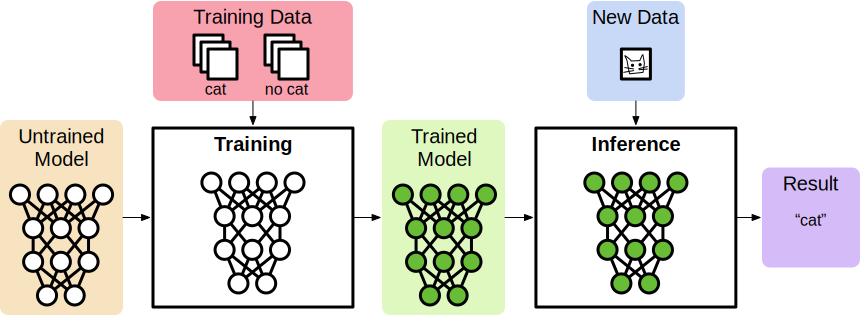
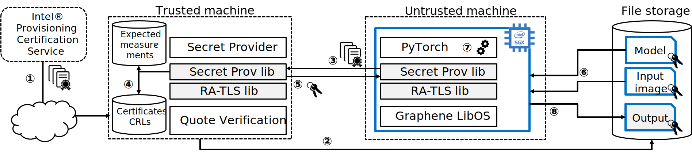

PyTorch PPML Framework Tutorial
===============================

.. highlight:: sh

.. todo::

   This page describes the steps required for the old Graphene repository. It
   will be soon updated with the steps for the new Gramine and Examples
   repositories.

This tutorial presents a framework for developing PPML (Privacy-Preserving
Machine Learning) applications with Intel SGX and Gramine. We use `PyTorch
<https://pytorch.org>`__ as an example ML framework. However, this tutorial can
be applied to other ML frameworks like OpenVINO, TensorFlow, etc.

Introduction
------------

Machine Learning (ML) is increasingly utilized in many real-world applications.
ML algorithms are first trained on massive amounts of known past data and then
deployed to interpret unknown future data, which allows us to forecast weather,
classify images, recommend content, and so on.

As machine learning pervades our daily lives, privacy concerns emerge as one of
the key issues about this technology.  In this tutorial, we focus on protecting
the confidentiality and integrity of the input data when the computation takes
place on an untrusted platform such as a public cloud virtual machine. We also
protect the model for cases where the model owner is concerned about protecting
their IP. In particular, we highlight how to build the PPML framework based on
PyTorch in an untrusted cloud using Intel SGX and Gramine.

In general, ML workloads have two phases: training and inference. Both can be
viewed as an application that takes inputs and produces an output. Training
applications take a training dataset as input and produce a trained model.
Inference applications take new data and the trained model as inputs and produce
the result (the prediction).

The goal of this tutorial is to show how these applications -- PyTorch workloads
in particular -- can run in an untrusted environment (like a public cloud),
while still ensuring the confidentiality and integrity of sensitive input data
and the model. To this end, we use Intel SGX enclaves to isolate PyTorch's
execution to protect data confidentiality and integrity, and to provide a
cryptographic proof that the program is correctly initialized and running on
legitimate hardware with the latest patches. We also use Gramine to simplify
the task of porting PyTorch to SGX, without any changes to the ML application
and scripts.

In this tutorial, we will show the complete workflow for PyTorch running inside
an SGX enclave using Gramine and its features of Secret Provisioning and
Protected Files. We rely on the new ECDSA/DCAP remote attestation scheme
developed by Intel for untrusted cloud environments.

To run the PyTorch application on a particular SGX platform, the owner of the
SGX platform must retrieve the corresponding SGX certificate from the Intel
Provisioning Certification Service, along with Certificate Revocation Lists
(CRLs) and other SGX-identifying information (1). Typically, this is a part of
provisioning the SGX platform in a cloud or a data center environment, and the
end user can access it as a service (in other words, the end user doesn't need
to deal with the details of this SGX platform provisioning but instead uses a
simpler interface provided by the cloud/data center vendor).

As a second preliminary step, the user must encrypt the input and model files
with her cryptographic (wrap) key and send these protected files to the remote
storage accessible from the SGX platform (2).

Next, the remote platform starts PyTorch inside of the SGX enclave.  Meanwhile,
the user starts the secret provisioning application on her own machine. The two
machines establish a TLS connection using RA-TLS (3), the user verifies that the
remote platform has a genuine up-to-date SGX processor and that the application
runs in a genuine SGX enclave (4), and finally provisions the cryptographic wrap
key to this remote platform (5). Note that during build time, Gramine informs
the user of the expected measurements of the SGX application.

After the cryptographic wrap key is provisioned, the remote platform may start
executing the application. Gramine uses Protected FS to transparently decrypt
the input and the model files using the provisioned key when the PyTorch
application starts (6). The application then proceeds with execution on
plaintext files (7). When the PyTorch script is finished, the output file is
encrypted with the same cryptographic key and saved to the cloud provider's file
storage (8). At this point, the protected output may be forwarded to the remote
user who will decrypt it and analyze its contents.

Prerequisites
-------------

- Ubuntu 18.04. This tutorial should work on other Linux distributions as well,
  but for simplicity we provide the steps for Ubuntu 18.04 only.

  Please install the following dependencies::

      sudo apt-get install libnss-mdns libnss-myhostname

- PyTorch (Python3). PyTorch is a framework for machine learning based on
  Python. Please `install PyTorch <https://pytorch.org/get-started/locally/>`__
  before you proceed (don't forget to choose Linux as the target OS). We will
  use Python3 in this tutorial.

- Intel SGX Driver and SDK/PSW. You need a machine that supports Intel SGX and
  FLC/DCAP. Please follow `this guide
  <https://download.01.org/intel-sgx/latest/linux-latest/docs/Intel_SGX_Installation_Guide_Linux_2.13_Open_Source.pdf>`__
  to install the Intel SGX driver and SDK/PSW. Make sure to install the driver
  with ECDSA/DCAP attestation.

- Gramine. Follow `Quick Start
  <https://gramine.readthedocs.io/en/latest/quickstart.html>`__ to build
  Gramine. In this tutorial, we will use both non-SGX and SGX-backed versions
  of Gramine. Make sure you build both Gramine loaders.

Executing Native PyTorch
------------------------

We start with a very simple example script written in Python3 for PyTorch-based
ML inferencing. Gramine already provides a minimalistic and *insecure* `PyTorch
example <https://github.com/gramineproject/examples/tree/master/pytorch>`__
which does not have confidentiality guarantees for input/output files and does
not use remote attestation. In this tutorial, we will use this existing PyTorch
example as a basis and will improve it to protect all user files.

Go to the directory with Gramine's PyTorch example::

   cd <gramine examples repository>/pytorch

The directory contains a Python script ``pytorchexample.py`` and other relevant
files.  The script reads a `pretrained AlexNet model
<https://pytorch.org/docs/stable/torchvision/models.html>`__ and an image
``input.jpg``, and infers the class of an object in the image.  Then, the script
writes the top-5 classification results to a file ``result.txt``.

We first download and save the pre-trained AlexNet model::

   python3 download-pretrained-model.py

This command uses the ``download-pretrained-model.py`` script to download a
pretrained model and save it as a serialized file ``alexnet-pretrained.pt``.
See `Saving and Loading Models in PyTorch
<https://pytorch.org/tutorials/beginner/saving_loading_models.html>`__ for more
details.

Now simply run the following command to run PyTorch inferencing::

   python3 pytorchexample.py

This will execute native PyTorch which will write the classification results to
``result.txt``. The provided example image is a photo of a dog, therefore the
output file contains "Labrador retriever" as a first result.

In later sections, we will run exactly the same Python script but with Gramine
and inside SGX enclaves.

Executing PyTorch with Gramine
-------------------------------

In the next two sections, we will run the exact same PyTorch example with
Gramine. We will first run PyTorch with non-SGX Gramine (for illustrative
purposes) and then with SGX-backed Gramine. Note that this part of the tutorial
still only shows the non-PPML workflow where Gramine doesn't protect
input/output user files; the end-to-end PPML workflow will be described below.

The porting effort to run PyTorch in Gramine is minimal and boils down to
creation of the *Gramine PyTorch-specific manifest file*.  When Gramine runs
an executable, it reads a manifest file that describes the execution environment
including the security posture, environment variables, dynamic libraries,
arguments, and so on.  In the rest of this tutorial, we will create this
manifest file and explain its options and rationale behind them. Note that the
manifest file contains both general non-SGX options for Gramine and
SGX-specific ones.  Please refer to `this
<https://gramine.readthedocs.io/en/latest/manifest-syntax.html>`__ for further
details about the syntax of Gramine manifests.

Executing PyTorch with non-SGX Gramine
^^^^^^^^^^^^^^^^^^^^^^^^^^^^^^^^^^^^^^^

Let's run the PyTorch example using Gramine, but without an SGX enclave.

Navigate to the PyTorch example directory we examined in the previous section::

   cd <gramine examples repository>/pytorch

Let's take a look at the template manifest file ``pytorch.manifest.template``
(recall that PyTorch is a collection of libraries and utilities but it uses
Python as the actual executable). For illustrative purposes, we will look at
only a few entries of the file. Note that we can simply ignore SGX-specific keys
(starting with the ``sgx.`` prefix) for our non-SGX run.

Notice that the manifest file is not secure because it propagates untrusted
command-line arguments and environment variables into the enclave. We
keep these work-arounds in this tutorial for simplicity, but this configuration
must not be used in production::

   loader.insecure__use_cmdline_argv = true
   loader.insecure__use_host_env = true

We mount the entire glibc host-level directory to the ``/lib`` directory seen
inside Gramine. This trick allows to transparently replace standard C libraries
with Gramine-patched libraries::

   fs.mounts = [
     { path = "/lib", uri = "file:{{ gramine.runtime() }}/" },
     ...
   ]

We also mount other directories such as ``/usr``,  ``/etc``, and ``/tmp``
required by Python and PyTorch (they search for libraries and utility files in
these system directories).

Finally, we mount the path containing the Python packages installed via pip::

   fs.mounts = [
     ...
     { path = "{{ env.HOME }}/.local/lib", uri = "file:{{ env.HOME }}/.local/lib" },
   ]

Now we can run ``make`` to build/copy all required Gramine files::

   make

This command will autogenerate a couple new files:

#. Generate the actual non-SGX Gramine manifest (``pytorch.manifest``) from the
   template manifest file. This file will be used by Gramine to decide on
   different manifest options how to execute PyTorch inside Gramine.

Now, launch Gramine via :command:`gramine-direct`. You can simply append the
arguments after the application path.  Our example takes
:file:`pytorchexample.py` as an argument::

   gramine-direct ./pytorch pytorchexample.py

That's it. You have run the PyTorch example with Gramine. You can check
:file:`result.txt` to make sure it ran correctly.

Executing PyTorch with Gramine in SGX Enclave
^^^^^^^^^^^^^^^^^^^^^^^^^^^^^^^^^^^^^^^^^^^^^^

In this section, we will learn how to use Gramine to run the same PyTorch
example inside an Intel SGX enclave.  Let's go back to the manifest template
(recall that the manifest keys starting with ``sgx.`` are SGX-specific syntax;
these entries are ignored if Gramine runs in non-SGX mode).

Below, we will highlight some of the SGX-specific manifest options in
:file:`pytorch.manifest.template`.  SGX syntax is fully described `here
<https://gramine.readthedocs.io/en/latest/manifest-syntax.html?highlight=manifest#sgx-syntax>`__.

First, here are the following SGX-specific lines in the manifest template::

   sgx.trusted_files = [
     "file:{{ entrypoint }}",
     "file:{{ gramine.runtime() }}/",
   ]
   ...

``sgx.trusted_files`` specifies a list of files and directories that will be
hashed during the generation of the final SGX manifest file (using the
utility :command:`gramine-sgx-sign`) and appended to this manifest file. In
runtime they will be allowed to be read only if the hash matches. In the case
of directories they are recursively traversed and all files inside them are
hashed.

The PyTorch manifest template also contains ``sgx.allowed_files`` list. It
specifies files unconditionally allowed by the enclave::

   sgx.allowed_files = [
     "file:{{ env.HOME }}/.local/lib",
   ]

This line unconditionally allows all Python libraries in the path to be loaded
into the enclave. Ideally, the developer needs to replace it with
``sgx.trusted_files`` for each of the dependent Python libraries.

Allowed files are *not* cryptographically hashed and verified.  Thus, this is
*insecure* and discouraged for production use (unless you are sure that the
contents of the files are irrelevant to security of your workload). Here, we use
these allowed files only for simplicity.

Now we desribed how the manifest template looks like and what the SGX-specific
manifest entries represent. Let's prepare all the files needed to run PyTorch in
an SGX enclave::

   make SGX=1

The above command performs the following tasks:

#. Generates the final SGX manifest file :file:`pytorch.manifest.sgx`.

#. Signs the manifest and generates the SGX signature file containing SIGSTRUCT
   (:file:`pytorch.sig`).

#. Creates a dummy EINITTOKEN token file :file:`pytorch.token` (this file is
   used for backwards compatibility with SGX platforms with EPID and without
   Flexible Launch Control).

After running this command and building all the required files, we can use
:command:`gramine-sgx` to launch the PyTorch workload inside an SGX enclave::

   gramine-sgx ./pytorch pytorchexample.py

It will run exactly the same Python script but inside the SGX enclave. Again,
you can verify that PyTorch ran correctly by examining :file:`result.txt`.

End-To-End Confidential PyTorch Workflow
----------------------------------------

Background on Remote Attestation, RA-TLS and Secret Provisioning
^^^^^^^^^^^^^^^^^^^^^^^^^^^^^^^^^^^^^^^^^^^^^^^^^^^^^^^^^^^^^^^^

Intel SGX provides a way for the SGX enclave to attest itself to the remote
user. This way the user gains trust in the SGX enclave running in an untrusted
environment, ships the application code and data, and is sure that the *correct*
application was executed inside a *genuine* SGX enclave. This process of gaining
trust in a remote SGX machine is called Remote Attestation (RA).

Gramine has two features that transparently add SGX RA to the application: (1)
RA-TLS augments normal SSL/TLS sessions with an SGX-specific handshake callback,
and (2) Secret Provisioning establishes a secure SSL/TLS session between the SGX
enclave and the remote user so that the user may gain trust in the remote
enclave and provision secrets to it. Secret Provisioning builds on top of RA-TLS
and typically runs before the application. Both features are provided as opt-in
libraries.

The Secret Provisioning library provides a simple non-programmatic API to
applications: it transparently initializes the environment variable
``SECRET_PROVISION_SECRET_STRING`` with a secret obtained from the remote user
during remote attestation. In our PyTorch example, the provisioned secret is the
confidential (master, or wrap) key to encrypt/decrypt user files. To inform
Gramine that the obtained secret is indeed the key for file encryption, it is
enough to set the environment variable ``SECRET_PROVISION_SET_PF_KEY``.

Note that RA-TLS and Secret Provisioning work both with the EPID-based and the
ECDSA/DCAP schemes of SGX remote attestation. Since this tutorial concentrates
on an untrusted-cloud scenario, we use the ECDSA/DCAP attestation framework.

Background on Protected Files
^^^^^^^^^^^^^^^^^^^^^^^^^^^^^

Gramine provides a feature of `Protected Files
<https://gramine.readthedocs.io/en/latest/manifest-syntax.html?highlight=protected#protected-files>`__,
which encrypts files and transparently decrypts them when the application reads
or writes them. Integrity- or confidentiality-sensitive files (or whole
directories) accessed by the application must be marked as protected files in
the Gramine manifest. New files created in a protected directory are
automatically treated as protected. The encryption format used for protected
files is borrowed from the similar feature of Intel SGX SDK.

This feature can be combined with Secret Provisioning such that the files are
encrypted/decrypted using the provisioned wrap key, as explained in the previous
section.

Preparing Confidential PyTorch Example
^^^^^^^^^^^^^^^^^^^^^^^^^^^^^^^^^^^^^^

In this section, we will transform our native PyTorch application into an
end-to-end confidential application.  We will encrypt all user files before
starting the enclave, mark them as protected, let the enclave communicate with
the secret provisioning server to get attested and receive the master wrap key
for encryption and decryption of protected files, and finally run the actual
PyTorch inference.

We will use the previous non-confidential PyTorch example as a starting point,
so copy the entire PyTorch directory::

   cd <gramine examples repository>
   cp -R pytorch pytorch-confidential

We will also use the reference implementation of Secret Provisioning found under
``CI-Examples/ra-tls-secret-prov`` directory (in the core Gramine repository),
so build and copy all the relevant files from there::

   cd <gramine repository>/CI-Examples/ra-tls-secret-prov
   make -C ../../Pal/src/host/Linux-SGX/tools/ra-tls dcap
   make dcap pf_crypt

The second line in the above snippet creates Gramine-specific DCAP libraries
for preparation and verification of SGX quotes (needed for SGX remote
attestation). The last line builds the required DCAP binaries and copies
relevant Gramine utilities such as ``pf_crypt`` to encrypt input files.

The last line also builds the secret provisioning server
``secret_prov_server_dcap``.  We will use this server to provision the master
wrap key (used to encrypt/decrypt protected input and output files) to the
PyTorch enclave.  See `Secret Provisioning Minimal Examples
<https://github.com/gramineproject/gramine/tree/master/CI-Examples/ra-tls-secret-prov>`__
for more information.

Preparing Input Files
^^^^^^^^^^^^^^^^^^^^^

The user must encrypt all input files: ``input.jpg``, ``classes.txt``, and
``alexnet-pretrained.pt``.  For simplicity, we re-use the already-existing stuff
from the ``CI-Examples/ra-tls-secret-prov`` directory.  In particular, we re-use
the confidential wrap key::

   cd <gramine examples repository>/pytorch-confidential
   mkdir files
   cp <gramine repository>/CI-Examples/ra-tls-secret-prov/files/wrap-key files/

In real deployments, the user must replace this ``wrap-key`` with her own
128-bit encryption key.

We also re-use the ``pf_crypt`` utility (with its ``libsgx_util.so`` helper
library and required mbedTLS libraries) that encrypts/decrypts the files::

   cp <gramine repository>/CI-Examples/ra-tls-secret-prov/libs/libsgx_util.so .
   cp <gramine repository>/CI-Examples/ra-tls-secret-prov/libs/libmbed*.so* .
   cp <gramine repository>/CI-Examples/ra-tls-secret-prov/pf_crypt .

Let's also make sure that ``alexnet-pretrained.pt`` network-model file exists
under our new directory::

   python3 download-pretrained-model.py

Now let's encrypt the original plaintext files. We first move these files under
the ``plaintext/`` directory and then encrypt them using the wrap key::

   mkdir plaintext/
   mv input.jpg classes.txt alexnet-pretrained.pt plaintext/

   LD_LIBRARY_PATH=. ./pf_crypt encrypt -w files/wrap-key -i plaintext/input.jpg -o input.jpg
   LD_LIBRARY_PATH=. ./pf_crypt encrypt -w files/wrap-key -i plaintext/classes.txt -o classes.txt
   LD_LIBRARY_PATH=. ./pf_crypt encrypt -w files/wrap-key -i plaintext/alexnet-pretrained.pt -o alexnet-pretrained.pt

You can verify now that the input files are encrypted. In real deployments,
these files must be shipped to the remote untrusted cloud.

Preparing Secret Provisioning
^^^^^^^^^^^^^^^^^^^^^^^^^^^^^

The user must prepare the secret provisioning server and start it. For this,
copy the secret provisioning executable and its helper library from
``CI-Examples/ra-tls-secret-prov`` to the current directory::

   cp <gramine repository>/CI-Examples/ra-tls-secret-prov/libs/libsecret_prov_verify_dcap.so .
   cp <gramine repository>/CI-Examples/ra-tls-secret-prov/secret_prov_server_dcap .

Also, copy the server-identifying certificates so that in-Gramine secret
provisioning library can verify the provisioning server (via classical X.509
PKI)::

   cp -R <gramine repository>/CI-Examples/ra-tls-secret-prov/ssl ./

These certificates are dummy mbedTLS-provided certificates; in production, you
would want to generate real certificates for your secret-provisioning server and
use them.

Now we can launch the secret provisioning server::

    ./secret_prov_server_dcap &

In this tutorial, we simply run it locally (``localhost:4433`` as configured in
the manifest) for simplicity. In reality, the user must run it on a trusted
remote machine.  In that case, ``loader.env.SECRET_PROVISION_SERVERS`` in the
manifest (see below) must point to the address of the remote-user machine. We
launch the server in the background.

Preparing Manifest File
^^^^^^^^^^^^^^^^^^^^^^^

Finally, let's modify the manifest file.  Open ``pytorch.manifest.template``
with your favorite text editor.

Replace ``trusted_files`` with ``protected_files`` for the input files::

   sgx.protected_files = [
     "file:classes.txt",
     "file:input.jpg",
     "file:alexnet-pretrained.pt",
   ]

Also add ``result.txt`` as a protected file so that PyTorch writes the
*encrypted* result into it::

   sgx.protected_files = [
     "file:result.txt",
   ]

Now, let's add the secret provisioning library to the manifest. Append the
current directory ``./`` to ``LD_LIBRARY_PATH`` so that PyTorch and Gramine
add-ons search for libraries in the current directory::

   # this instructs in-Gramine dynamic loader to search for dependencies in the current directory
   loader.env.LD_LIBRARY_PATH = "/lib:/usr/lib:{{ arch_libdir }}:/usr/{{ arch_libdir }}:./"

Add the following lines to enable remote secret provisioning and allow protected
files to be transparently decrypted by the provisioned key. Recall that we
launched the secret provisioning server locally on the same machine, so we
re-use the same ``ssl/`` directory and specify ``localhost``. For more info on
the used environment variables and other manifest options, see `here
<https://github.com/gramineproject/gramine/tree/master/Pal/src/host/Linux-SGX/tools#secret-provisioning-libraries>`__::

   sgx.remote_attestation = true

   loader.env.LD_PRELOAD = "libsecret_prov_attest.so"
   loader.env.SECRET_PROVISION_CONSTRUCTOR = "1"
   loader.env.SECRET_PROVISION_SET_PF_KEY = "1"
   loader.env.SECRET_PROVISION_CA_CHAIN_PATH = "ssl/ca.crt"
   loader.env.SECRET_PROVISION_SERVERS = "localhost:4433"

   sgx.trusted_files = [
     "file:libsecret_prov_attest.so",
     "file:ssl/ca.crt",
   ]

The ``libsecret_prov_attest.so`` library provides the in-enclave logic to attest
the SGX enclave, Gramine instance, and the application running in it to the
remote secret-provisioning server. Gramine needs to locate this library, so
let's copy it to our working directory::

   cp <gramine repository>/CI-Examples/ra-tls-secret-prov/libs/libsecret_prov_attest.so ./

Building and Executing End-To-End PyTorch Example
^^^^^^^^^^^^^^^^^^^^^^^^^^^^^^^^^^^^^^^^^^^^^^^^^

Now that we prepared the files and the manifest, let's re-generate the manifest
files, tokens, and signatures::

   make clean
   make SGX=1

It is also important to remove the file :file:`result.txt` if it exists.
Otherwise the Protected FS will detect the already-existing file and fail. So
let's remove it unconditionally::

   rm -f result.txt

We are ready to run the end-to-end PyTorch example. Notice that we didn't change
a line of code in the Python script. Moreover, we can run it with exactly the
same command used in the previous section::

   gramine-sgx ./pytorch pytorchexample.py

This should run PyTorch with encrypted input files and generate the encrypted
:file:`result.txt` output file. Note that we already launched the secret
provisioning server on the same machine, so secret provisioning will run
locally.

Decrypting Output File
^^^^^^^^^^^^^^^^^^^^^^

After our protected PyTorch inference is finished, you'll see :file:`result.txt`
in the directory. This file is encrypted with the same key as was used for
encryption of input files. In order to decrypt it, use the following command::

   LD_LIBRARY_PATH=. ./pf_crypt decrypt -w files/wrap-key -i result.txt -o plaintext/result.txt

You can check the result written in :file:`plaintext/result.txt`. It must be the
same as in our previous runs.

Cleaning Up
^^^^^^^^^^^

When done, don't forget to terminate the secret provisioning server::

   killall secret_prov_server_dcap
