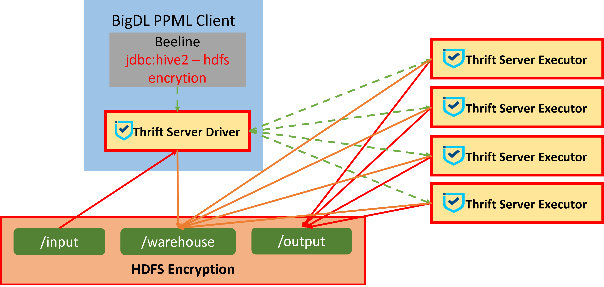
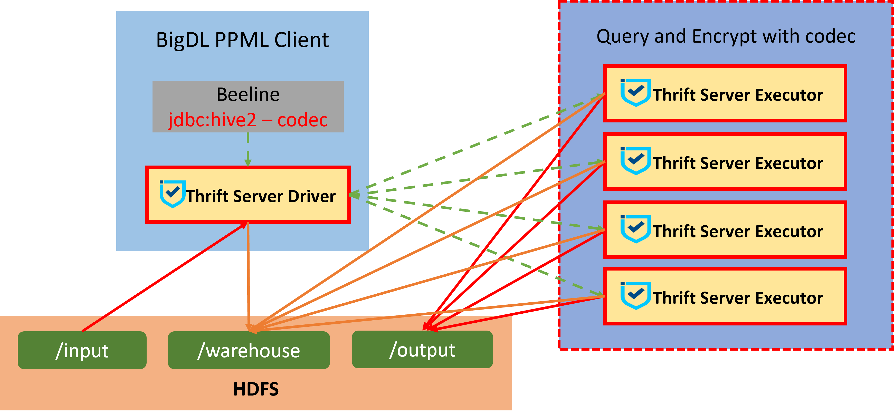
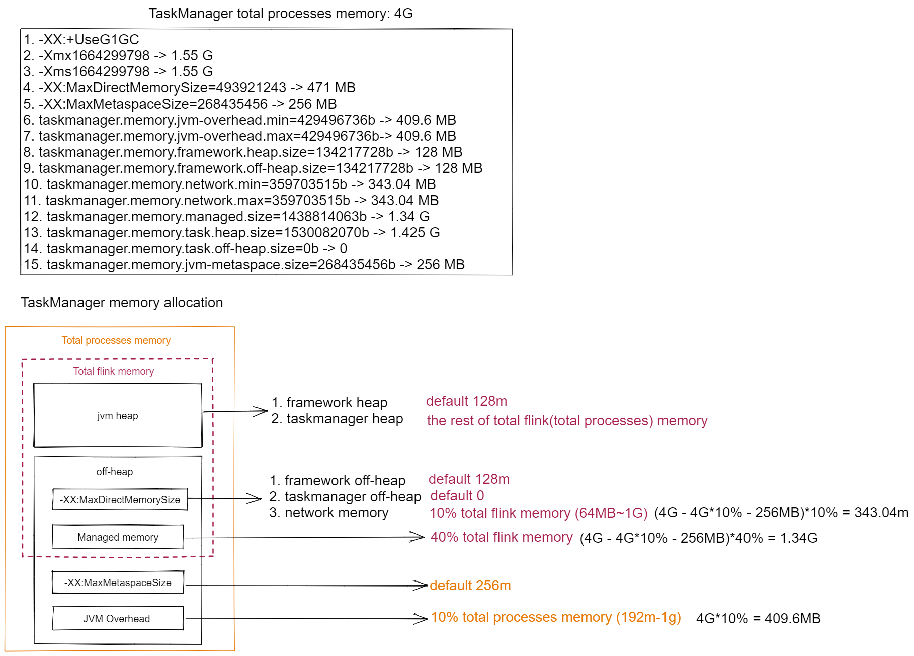

- [Gramine Bigdata Toolkit Overview](#gramine-bigdata-toolkit-overview)
  - [Before Running Code](#before-running-code)
    - [1. Build Docker Images](#1-build-docker-images)
      - [1.1 Build Bigdata Base Image](#11-build-bigdata-base-image)
      - [1.2 Build Custom Image](#12-build-custom-image)
    - [2. Prepare SSL key](#2-prepare-ssl-key)
      - [2.1 Prepare the Key](#21-prepare-the-key)
      - [2.2 Prepare the Password](#22-prepare-the-password)
    - [3. Register MREnclave(optional)](#3-register-mrenclaveoptional)
      - [3.1 Deploy EHSM KMS\&AS](#31-deploy-ehsm-kmsas)
      - [3.2 Enroll yourself in EHSM](#32-enroll-yourself-in-ehsm)
      - [3.3 Attest EHSM Server](#33-attest-ehsm-server)
      - [3.4 Register your MREnclave to EHSM](#34-register-your-mrenclave-to-ehsm)
      - [3.5 Enable Attestation in configuration](#35-enable-attestation-in-configuration)
- [Spark](#spark)
  - [SGX](#sgx)
    - [Spark Submit](#spark-submit)
      - [1 Prepare k8s service account and kubeconfig](#1-prepare-k8s-service-account-and-kubeconfig)
      - [2 Start the client container](#2-start-the-client-container)
      - [3 Init the client and run Spark applications on k8s (1.3 can be skipped if you are using 1.4 to submit jobs)](#3-init-the-client-and-run-spark-applications-on-k8s-13-can-be-skipped-if-you-are-using-14-to-submit-jobs)
        - [3.1 Configure `spark-executor-template.yaml` in the container](#31-configure-spark-executor-templateyaml-in-the-container)
        - [3.2 Submit spark command](#32-submit-spark-command)
        - [3.3 Spark-Pi example](#33-spark-pi-example)
      - [4 Use bigdl-ppml-submit.sh to submit ppml jobs](#4-use-bigdl-ppml-submitsh-to-submit-ppml-jobs)
        - [4.1 Spark-Pi on local mode](#41-spark-pi-on-local-mode)
        - [4.2 Spark-Pi on local sgx mode](#42-spark-pi-on-local-sgx-mode)
        - [4.3 Spark-Pi on client mode](#43-spark-pi-on-client-mode)
        - [4.4 Spark-Pi on cluster mode](#44-spark-pi-on-cluster-mode)
        - [4.5 bigdl-ppml-submit.sh explanations](#45-bigdl-ppml-submitsh-explanations)
    - [Spark Thrift Server](#spark-thrift-server)
      - [1. Start thrift server](#1-start-thrift-server)
        - [1.1 Prepare the configuration file](#11-prepare-the-configuration-file)
        - [1.2 Three ways to start](#12-three-ways-to-start)
        - [1.3 Use beeline to connect Thrift Server](#13-use-beeline-to-connect-thrift-server)
      - [2. Enable transparent encryption](#2-enable-transparent-encryption)
        - [2.1 HDFS Transparent Encryption](#21-hdfs-transparent-encryption)
        - [2.2 Gramine file system encryption](#22-gramine-file-system-encryption)
        - [2.3 Bigdl PPML Codec](#23-bigdl-ppml-codec)
    - [Spark Configuration Explanations](#spark-configuration-explanations)
      - [1. BigDL PPML SGX-related configurations](#1-bigdl-ppml-sgx-related-configurations)
      - [2. Spark security configurations](#2-spark-security-configurations)
        - [2.1 Spark RPC](#21-spark-rpc)
      - [3 env MALLOC\_ARENA\_MAX explanations](#3-env-malloc_arena_max-explanations)
  - [TDXVM](#tdxvm)
    - [1. Deploy PCCS](#1-deploy-pccs)
    - [2. Deploy BigDL Remote Attestation Service](#2-deploy-bigdl-remote-attestation-service)
    - [3. Start BigDL bigdata client](#3-start-bigdl-bigdata-client)
    - [4. Enable Attestation in configuration](#4-enable-attestation-in-configuration)
    - [5. Submit spark task](#5-submit-spark-task)
- [Flink](#flink)
  - [SGX](#sgx-1)
    - [1. Enter the client container](#1-enter-the-client-container)
    - [2. Prepare Flink security configuration](#2-prepare-flink-security-configuration)
      - [2.1 prepare ssl keystore](#21-prepare-ssl-keystore)
    - [3. Submit Flink job on native k8s mode on SGX](#3-submit-flink-job-on-native-k8s-mode-on-sgx)
    - [4. Flink total process memory](#4-flink-total-process-memory)
    - [5. Flink security configurations](#5-flink-security-configurations)
      - [5.1 SSL Configuration](#51-ssl-configuration)
      - [5.2 Local Storage](#52-local-storage)

# Gramine Bigdata Toolkit Overview

This image is designed for the big data field in Privacy Preserving Machine Learning (PPML). Users can run end-to-end big data analytics applications (Spark, Flink, Hive and Flink) with a distributed cluster on Intel Software Guard Extensions (SGX) or Trust Domain Extensions (TDX).

## Before Running Code
### 1. Build Docker Images

**Tip:** if you want to skip building the image, you can use our public image `intelanalytics/bigdl-ppml-trusted-bigdata-gramine-reference:latest` for a quick start, which is provided for a demo purpose. Do not use it in production. All public images are as follows:
- intelanalytics/bigdl-ppml-trusted-bigdata-gramine-base:2.3.0-SNAPSHOT
- intelanalytics/bigdl-ppml-trusted-bigdata-gramine-reference:latest(8G EPC and log level is error)
- intelanalytics/bigdl-ppml-trusted-bigdata-gramine-reference-16g:2.3.0-SNAPSHOT
- intelanalytics/bigdl-ppml-trusted-bigdata-gramine-reference-8g:2.3.0-SNAPSHOT
- intelanalytics/bigdl-ppml-trusted-bigdata-gramine-reference-4g:2.3.0-SNAPSHOT
- intelanalytics/bigdl-ppml-trusted-bigdata-gramine-reference-16g-all:2.3.0-SNAPSHOT
- intelanalytics/bigdl-ppml-trusted-bigdata-gramine-reference-8g-all:2.3.0-SNAPSHOT
- intelanalytics/bigdl-ppml-trusted-bigdata-gramine-reference-4g-all:2.3.0-SNAPSHOT
- intelanalytics/bigdl-ppml-trusted-bigdata-gramine-noattest-4g:2.3.0-SNAPSHOT
- intelanalytics/bigdl-ppml-trusted-bigdata-gramine-noattest-8g:2.3.0-SNAPSHOT
- intelanalytics/bigdl-ppml-trusted-bigdata-gramine-noattest-16g:2.3.0-SNAPSHOT

`16g` in image names indicates the size of EPC memory. There are three log levels: error, debug and all. The log level defaults to error and `all` indicate that the log level is all. `noattest` means the attestation service is disabled in this image, which applies to the case where `aesmd` and `pccs` are not installed successfully. `intelanalytics/bigdl-ppml-trusted-bigdata-gramine-reference:latest` is our recommended default image.

**Attention:** If there is `SNAPSHOT` in an image tag, the image is developing continuously, which means you need to update the image to use the latest feature.

#### 1.1 Build Bigdata Base Image

The bigdata base image is a public one that does not contain any secrets. You will use the base image to get your own custom image in the following.

You can use our public bigdata base image `intelanalytics/bigdl-ppml-trusted-bigdata-gramine-base:2.3.0-SNAPSHOT`, which is recommended. Or you can build your own base image, which is expected to be exactly the same as ours.

Before building your own base image, please modify the paths in `ppml/trusted-bigdata/build-base-image.sh`. Then build the docker image with the following command.

```bash
./build-bigdata-base-image.sh
```

#### 1.2 Build Custom Image

First, You need to generate your enclave key using the command below, and keep it safe for future remote attestations and to start SGX enclaves more securely.

It will generate a file `enclave-key.pem` in `./custom-image`  directory, which will be your enclave key. To store the key elsewhere, modify the outputted file path.

```bash
cd custom-image
openssl genrsa -3 -out enclave-key.pem 3072
```

Then, use the `enclave-key.pem` and the bigdata base image to build your own custom image. In the process, SGX MREnclave will be made and signed without saving the sensitive enclave key inside the final image, which is safer.

```bash
# under custom-image dir
# modify custom parameters in build-custom-image.sh
./build-custom-image.sh
```

The docker build console will also output `mr_enclave` and `mr_signer` like below, which are hash values used to register your MREnclave in the following.

````bash
......
[INFO] Use the below hash values of mr_enclave and mr_signer to register enclave:
mr_enclave       : c7a8a42af......
mr_signer        : 6f0627955......
````
### 2. Prepare SSL key

#### 2.1 Prepare the Key

  The ppml in bigdl needs secured keys to enable spark security such as Authentication, RPC Encryption, Local Storage Encryption and TLS, you need to prepare the security keys and keystores. In this tutorial, you can generate keys and keystores with root permission (test only, need input security password for keys).

```bash
  sudo bash BigDL/ppml/scripts/generate-keys.sh
```

#### 2.2 Prepare the Password

  Next, you need to store the password you used for key generation, i.e., `generate-keys.sh`, in a secured file.

```bash
  sudo bash BigDL/ppml/scripts/generate-password.sh <used_password_when_generate_keys>
```

### 3. Register MREnclave(optional)

#### 3.1 Deploy EHSM KMS&AS

KMS (Key Management Service) and AS (Attestation Service) make sure applications of the user actually run in the SGX MREnclave signed above by the user's private key, rather than a fake one fake by an attacker.

Bigdl ppml uses EHSM as reference KMS&AS, you can deploy EHSM following a guide [here](https://github.com/intel-analytics/BigDL/tree/main/ppml/services/pccs-ehsm/kubernetes#deploy-bigdl-pccs-ehsm-kms-on-kubernetes-with-helm-charts).

#### 3.2 Enroll yourself in EHSM

Enroll yourself as below, The `<kms_ip>` is your configured-ip of EHSM service in the deployment section:

```bash
curl -v -k -G "https://<kms_ip>:9000/ehsm?Action=Enroll"
......
{"code":200,"message":"successful","result":{"apikey":"E8QKpBB******","appid":"8d5dd3b*******"}}
```

 You will get an `appid` and `apikey` pair and save it.

#### 3.3 Attest EHSM Server

**3.3.1 Start a BigDL client container**

First, start a bigdl container, which uses the custom image built before.

```bash
export KEYS_PATH=YOUR_LOCAL_SPARK_SSL_KEYS_FOLDER_PATH
export LOCAL_IP=YOUR_LOCAL_IP
export CUSTOM_IMAGE=YOUR_CUSTOM_IMAGE_BUILT_BEFORE
export PCCS_URL=YOUR_PCCS_URL # format like https://1.2.3.4:xxxx, obtained from KMS services or a self-deployed one

sudo docker run -itd \
    --privileged \
    --net=host \
    --cpuset-cpus="0-5" \
    --oom-kill-disable \
    -v /var/run/aesmd/aesm.socket:/var/run/aesmd/aesm.socket \
    -v $KEYS_PATH:/ppml/keys \
    --name=gramine-verify-worker \
    -e LOCAL_IP=$LOCAL_IP \
    -e PCCS_URL=$PCCS_URL \
    $CUSTOM_IMAGE bash
```

Enter the work environment:

```bash
sudo docker exec -it gramine-verify-worker bash
```

**3.3.2 Verify  EHSM Quote**

You need to first attest the EHSM server and verify the service as trusted before running workloads, to avoid sending your secrets to a fake EHSM service.

In the container, you can use `verify-attestation-service.sh` to verify the attestation service quote. Please set the variables in the script and then run it:

**Parameters in verify-attestation-service.sh:**

**ATTESTATION_URL**: URL of attestation service. Should match the format `<ip_address>:<port>`.

**APP_ID**, **API_KEY**: The appID and apiKey pair generated by your attestation service.

**ATTESTATION_TYPE**: Type of attestation service. Currently support `EHSMAttestationService`.

**CHALLENGE**: Challenge to get a quote for attestation service which will be verified by local SGX SDK. Should be a BASE64 string. It can be a casual BASE64 string, for example, it can be generated by the command `echo anystring|base64`.

```bash
bash verify-attestation-service.sh
```

#### 3.4 Register your MREnclave to EHSM

Upload the metadata of your MREnclave obtained above to EHSM, and then only the registered MREnclave can pass the runtime verification in the following. You can register the MREnclave by running a python script:

```bash
# At /ppml inside the container now
python register-mrenclave.py --appid <your_appid> \
                             --apikey <your_apikey> \
                             --url https://<kms_ip>:9000 \
                             --mr_enclave <your_mrenclave_hash_value> \
                             --mr_signer <your_mrensigner_hash_value>
```

#### 3.5 Enable Attestation in configuration

  First, upload `appid`, `apikey` and `policyID` obtained before to kubernetes as secrets:

  ```bash
  kubectl create secret generic kms-secret \
                    --from-literal=app_id=YOUR_KMS_APP_ID \
                    --from-literal=api_key=YOUR_KMS_API_KEY \
                    --from-literal=policy_id=YOUR_POLICY_ID
  ```

  Configure `spark-driver-template.yaml` and `spark-executor-template.yaml` to enable Attestation as follows:
  ``` yaml
  apiVersion: v1
  kind: Pod
  spec:
    containers:
    - name: spark-driver
      securityContext:
        privileged: true
      env:
        - name: ATTESTATION
          value: true
        - name: PCCS_URL
          value: https://your_pccs_ip:your_pccs_port
        - name: ATTESTATION_URL
          value: your_attestation_url
        - name: APP_ID
          valueFrom:
            secretKeyRef:
              name: kms-secret
              key: app_id
        - name: API_KEY
          valueFrom:
            secretKeyRef:
              name: kms-secret
              key: app_key
        - name: ATTESTATION_POLICYID
          valueFrom:
            secretKeyRef:
              name: policy-id-secret
              key: policy_id
  ...
  ```
  You should get `Attestation Success!` in logs after you submit a PPML job if the quote generated with `user_report` is verified successfully by Attestation Service. Or you will get `Attestation Fail! Application killed!` or `JASONObject["result"] is not a JASONObject`and the job will be stopped.

# Spark

Follow the guide below to run Spark on Kubernetes manually. Alternatively, you can also use Helm to set everything up automatically. See [Using Helm to run your Spark job][https://github.com/intel-analytics/BigDL/tree/main/ppml/trusted-big-data-ml/python/docker-gramine/kubernetes#25-using-helm-to-run-your-spark-job].
## SGX
### Spark Submit
#### 1 Prepare k8s service account and kubeconfig
Please follow the guide [here][https://github.com/intel-analytics/BigDL/blob/main/ppml/docs/prepare_environment.md#configure-k8s-environment].

#### 2 Start the client container
Configure the environment variables in the following script before running it. Check [Bigdl ppml SGX related configurations](#1-bigdl-ppml-sgx-related-configurations) for detailed memory configurations.
```bash
export K8S_MASTER=k8s://$(sudo kubectl cluster-info | grep 'https.*6443' -o -m 1)
export NFS_INPUT_PATH=/YOUR_DIR/data
export KEYS_PATH=/YOUR_DIR/keys
export SECURE_PASSWORD_PATH=/YOUR_DIR/password
export KUBECONFIG_PATH=/YOUR_DIR/config
export LOCAL_IP=$LOCAL_IP
export DOCKER_IMAGE=YOUR_DOCKER_IMAGE
sudo docker run -itd \
    --privileged \
    --net=host \
    --name=gramine-bigdata \
    --cpuset-cpus=10 \
    --oom-kill-disable \
    --device=/dev/sgx/enclave \
    --device=/dev/sgx/provision \
    -v /var/run/aesmd/aesm.socket:/var/run/aesmd/aesm.socket \
    -v $KEYS_PATH:/ppml/keys \
    -v $SECURE_PASSWORD_PATH:/ppml/password \
    -v $KUBECONFIG_PATH:/root/.kube/config \
    -v $NFS_INPUT_PATH:/ppml/data \
    -e RUNTIME_SPARK_MASTER=$K8S_MASTERK8S_MASTER \
    -e RUNTIME_K8S_SPARK_IMAGE=$DOCKER_IMAGE \
    -e RUNTIME_DRIVER_PORT=54321 \
    -e RUNTIME_DRIVER_MEMORY=1g \
    -e LOCAL_IP=$LOCAL_IP \
    $DOCKER_IMAGE bash
```
run `docker exec -it spark-local-k8s-client bash` to enter the container.

#### 3 Init the client and run Spark applications on k8s (1.3 can be skipped if you are using 1.4 to submit jobs)

##### 3.1 Configure `spark-executor-template.yaml` in the container

We assume you have a working Network File System (NFS) configured for your Kubernetes cluster. Configure the `nfsvolumeclaim` on the last line to the name of the Persistent Volume Claim (PVC) of your NFS.

Please prepare the following and put them in your NFS directory:

- The data (in a directory called `data`),
- The kubeconfig file.

##### 3.2 Submit spark command

```bash
./init.sh
export secure_password=`openssl rsautl -inkey /ppml/password/key.txt -decrypt </ppml/password/output.bin`
export TF_MKL_ALLOC_MAX_BYTES=10737418240
export SPARK_LOCAL_IP=$LOCAL_IP
export sgx_command="${JAVA_HOME}/bin/java \
        -cp '${SPARK_HOME}/conf/:${SPARK_HOME}/jars/*:${SPARK_HOME}/examples/jars/*' \
        -Xmx8g \
        org.apache.spark.deploy.SparkSubmit \
        --master $RUNTIME_SPARK_MASTER \
        --deploy-mode $SPARK_MODE \
        --name spark-pi-sgx \
        --conf spark.driver.host=$SPARK_LOCAL_IP \
        --conf spark.driver.port=$RUNTIME_DRIVER_PORT \
        --conf spark.driver.memory=$RUNTIME_DRIVER_MEMORY \
        --conf spark.driver.cores=$RUNTIME_DRIVER_CORES \
        --conf spark.executor.cores=$RUNTIME_EXECUTOR_CORES \
        --conf spark.executor.memory=$RUNTIME_EXECUTOR_MEMORY \
        --conf spark.executor.instances=$RUNTIME_EXECUTOR_INSTANCES \
        --conf spark.kubernetes.authenticate.driver.serviceAccountName=spark \
        --conf spark.kubernetes.container.image=$RUNTIME_K8S_SPARK_IMAGE \
        --conf spark.kubernetes.driver.podTemplateFile=/ppml/spark-driver-template.yaml \
        --conf spark.kubernetes.executor.podTemplateFile=/ppml/spark-executor-template.yaml \
        --conf spark.kubernetes.executor.deleteOnTermination=false \
        --conf spark.network.timeout=10000000 \
        --conf spark.executor.heartbeatInterval=10000000 \
        --conf spark.python.use.daemon=false \
        --conf spark.python.worker.reuse=false \
        --conf spark.kubernetes.sgx.enabled=$SGX_ENABLED \
        --conf spark.kubernetes.sgx.driver.mem=$SGX_DRIVER_MEM \
        --conf spark.kubernetes.sgx.driver.jvm.mem=$SGX_DRIVER_JVM_MEM \
        --conf spark.kubernetes.sgx.executor.mem=$SGX_EXECUTOR_MEM \
        --conf spark.kubernetes.sgx.executor.jvm.mem=$SGX_EXECUTOR_JVM_MEM \
        --conf spark.authenticate=true \
        --conf spark.authenticate.secret=$secure_password \
        --conf spark.kubernetes.executor.secretKeyRef.SPARK_AUTHENTICATE_SECRET="spark-secret:secret" \
        --conf spark.kubernetes.driver.secretKeyRef.SPARK_AUTHENTICATE_SECRET="spark-secret:secret" \
        --conf spark.authenticate.enableSaslEncryption=true \
        --conf spark.network.crypto.enabled=true \
        --conf spark.network.crypto.keyLength=128 \
        --conf spark.network.crypto.keyFactoryAlgorithm=PBKDF2WithHmacSHA1 \
        --conf spark.io.encryption.enabled=true \
        --conf spark.io.encryption.keySizeBits=128 \
        --conf spark.io.encryption.keygen.algorithm=HmacSHA1 \
        --conf spark.ssl.enabled=true \
        --conf spark.ssl.port=8043 \
        --conf spark.ssl.keyPassword=$secure_password \
        --conf spark.ssl.keyStore=/ppml/keys/keystore.jks \
        --conf spark.ssl.keyStorePassword=$secure_password \
        --conf spark.ssl.keyStoreType=JKS \
        --conf spark.ssl.trustStore=/ppml/keys/keystore.jks \
        --conf spark.ssl.trustStorePassword=$secure_password \
        --conf spark.ssl.trustStoreType=JKS \
        --class org.apache.spark.examples.SparkPi \
        --verbose \
        --jars local://${SPARK_HOME}/examples/jars/spark-examples_2.12-${SPARK_VERSION}.jar \
        local://${SPARK_HOME}/examples/jars/spark-examples_2.12-${SPARK_VERSION}.jar 3000"
```

Note that: you can run your own Spark application after changing `--class` and jar path.

1. `local://${SPARK_HOME}/examples/jars/spark-examples_2.12-${SPARK_VERSION}.jar` => `your_jar_path`
2. `--class org.apache.spark.examples.SparkPi` => `--class your_class_path`

##### 3.3 Spark-Pi example

```bash
gramine-sgx bash 2>&1 | tee spark-pi-sgx-$SPARK_MODE.log
```
#### 4 Use bigdl-ppml-submit.sh to submit ppml jobs

Here, we assume you have started the client container and executed `init.sh`.

##### 4.1 Spark-Pi on local mode

```
#!/bin/bash
bash bigdl-ppml-submit.sh \
        --master local[2] \
        --driver-memory 8g \
        --driver-cores 8 \
        --executor-memory 8g \
        --executor-cores 8 \
        --num-executors 2 \
        --class org.apache.spark.examples.SparkPi \
        --name spark-pi \
        --verbose \
        --log-file spark-pi-local.log \
        --jars local://${SPARK_HOME}/examples/jars/spark-examples_2.12-${SPARK_VERSION}.jar \
        local://${SPARK_HOME}/examples/jars/spark-examples_2.12-${SPARK_VERSION}.jar 3000
```
##### 4.2 Spark-Pi on local sgx mode

```
#!/bin/bash
bash bigdl-ppml-submit.sh \
        --master local[2] \
        --sgx-enabled true \
        --sgx-log-level error \
        --sgx-driver-jvm-memory 6g\
        --sgx-executor-jvm-memory 6g\
        --driver-memory 8g \
        --driver-cores 8 \
        --executor-memory 8g \
        --executor-cores 8 \
        --num-executors 2 \
        --class org.apache.spark.examples.SparkPi \
        --name spark-pi \
        --log-file spark-pi-local-sgx.log \
        --verbose \
        --jars local://${SPARK_HOME}/examples/jars/spark-examples_2.12-${SPARK_VERSION}.jar \
        local://${SPARK_HOME}/examples/jars/spark-examples_2.12-${SPARK_VERSION}.jar 3000

```
##### 4.3 Spark-Pi on client mode


```
#!/bin/bash
export secure_password=`openssl rsautl -inkey /ppml/password/key.txt -decrypt </ppml/password/output.bin`
bash bigdl-ppml-submit.sh \
        --master $RUNTIME_SPARK_MASTER \
        --deploy-mode client \
        --sgx-enabled true \
        --sgx-log-level error \
        --sgx-driver-jvm-memory 6g\
        --sgx-executor-jvm-memory 6g\
        --driver-memory 8g \
        --driver-cores 8 \
        --executor-memory 8g \
        --executor-cores 8 \
        --num-executors 2 \
        --conf spark.kubernetes.container.image=$RUNTIME_K8S_SPARK_IMAGE \
        --class org.apache.spark.examples.SparkPi \
        --name spark-pi \
        --log-file spark-pi-client-sgx.log \
        --verbose \
        --jars local://${SPARK_HOME}/examples/jars/spark-examples_2.12-${SPARK_VERSION}.jar \
        local://${SPARK_HOME}/examples/jars/spark-examples_2.12-${SPARK_VERSION}.jar 3000
```

##### 4.4 Spark-Pi on cluster mode


```
#!/bin/bash
export secure_password=`openssl rsautl -inkey /ppml/password/key.txt -decrypt </ppml/password/output.bin`
bash bigdl-ppml-submit.sh \
        --master $RUNTIME_SPARK_MASTER \
        --deploy-mode cluster \
        --sgx-enabled true \
        --sgx-log-level error \
        --sgx-driver-jvm-memory 6g\
        --sgx-executor-jvm-memory 6g\
        --driver-memory 8g \
        --driver-cores 8 \
        --executor-memory 8g \
        --executor-cores 8 \
        --conf spark.kubernetes.container.image=$RUNTIME_K8S_SPARK_IMAGE \
        --num-executors 2 \
        --class org.apache.spark.examples.SparkPi \
        --name spark-pi \
        --log-file spark-pi-cluster-sgx.log \
        --verbose \
        --jars local://${SPARK_HOME}/examples/jars/spark-examples_2.12-${SPARK_VERSION}.jar \
        local://${SPARK_HOME}/examples/jars/spark-examples_2.12-${SPARK_VERSION}.jar 3000
```
##### 4.5 bigdl-ppml-submit.sh explanations

bigdl-ppml-submit.sh is used to simplify the steps in 1.4

1. To use bigdl-ppml-submit.sh, first set the following required arguments:
```
--master $RUNTIME_SPARK_MASTER \
--deploy-mode cluster \
--driver-memory 8g \
--driver-cores 8 \
--executor-memory 8g \
--executor-cores 8 \
--sgx-enabled true \
--sgx-driver-jvm-memory 6g \
--sgx-executor-jvm-memory 6g \
--conf spark.kubernetes.container.image=$RUNTIME_K8S_SPARK_IMAGE \
--num-executors 2 \
--name spark-pi \
--verbose \
--class org.apache.spark.examples.SparkPi \
--log-file spark-pi-cluster-sgx.log \
local://${SPARK_HOME}/examples/jars/spark-examples_2.12-${SPARK_VERSION}.jar 3000
```
if you want to enable sgx, don't forget to set the sgx-related arguments
```
--sgx-enabled true \
--sgx-driver-memory 8g \
--sgx-driver-jvm-memory 6g \
--sgx-executor-memory 8g \
--sgx-executor-jvm-memory 6g \
```
you can update the application arguments to anything you want to run
```
--class org.apache.spark.examples.SparkPi \
local://${SPARK_HOME}/examples/jars/spark-examples_2.12-${SPARK_VERSION}.jar 3000
```

2. If you want to enable the spark security configurations as in 2.Spark security configurations, export secure_password to enable it.
```
export secure_password=`openssl rsautl -inkey /ppml/password/key.txt -decrypt </ppml/password/output.bin`
```

3. The following spark properties are set by default in bigdl-ppml-submit.sh. If you want to overwrite them or add new spark properties, just append the spark properties to bigdl-ppml-submit.sh as arguments.
```
--conf spark.driver.host=$LOCAL_IP \
--conf spark.driver.port=$RUNTIME_DRIVER_PORT \
--conf spark.network.timeout=10000000 \
--conf spark.executor.heartbeatInterval=10000000 \
--conf spark.python.use.daemon=false \
--conf spark.python.worker.reuse=false \
--conf spark.kubernetes.authenticate.driver.serviceAccountName=spark \
--conf spark.kubernetes.driver.podTemplateFile=/ppml/spark-driver-template.yaml \
--conf spark.kubernetes.executor.podTemplateFile=/ppml/spark-executor-template.yaml \
--conf spark.kubernetes.executor.deleteOnTermination=false \
```

### Spark Thrift Server

Spark SQL Thrift server is a port of Apache Hive’s HiverServer2 which allows the clients of JDBC or ODBC to execute queries of SQL over their respective protocols on Spark.

#### 1. Start thrift server

##### 1.1 Prepare the configuration file

Create the file `spark-defaults.conf` at `$SPARK_HOME/conf` with the following content:

```conf
spark.sql.warehouse.dir         hdfs://host:ip/path #location of data
```

##### 1.2 Three ways to start

**1.2.1 Start with spark official script**

```bash
cd $SPARK_HOME
sbin/start-thriftserver.sh
```
**Tip:** The startup of the thrift server will create the metastore_db file at the startup location of the command, which means that every startup command needs to be run at the same location, in the example it is SPARK_HOME.

**1.2.2 Start with JAVA scripts**

```bash
/opt/jdk8/bin/java \
  -cp /ppml/spark-3.1.3/conf/:/ppml/spark-3.1.3/jars/* \
  -Xmx10g org.apache.spark.deploy.SparkSubmit \
  --class org.apache.spark.sql.hive.thriftserver.HiveThriftServer2 \
  --name 'Thrift JDBC/ODBC Server' \
  --master $RUNTIME_SPARK_MASTER \
  --deploy-mode client \
  local://$SPARK_HOME/jars/spark-hive-thriftserver_2.12-$SPARK_VERSION.jar
```

**1.2.3 Start with bigdl-ppml-submit.sh**

```bash
export secure_password=`openssl rsautl -inkey /ppml/password/key.txt -decrypt </ppml/password/output.bin`
bash bigdl-ppml-submit.sh \
        --master $RUNTIME_SPARK_MASTER \
        --deploy-mode client \
        --sgx-enabled true \
        --sgx-driver-jvm-memory 20g\
        --sgx-executor-jvm-memory 20g\
        --num-executors 2 \
        --driver-memory 20g \
        --driver-cores 8 \
        --executor-memory 20g \
        --executor-cores 8\
        --conf spark.cores.max=24 \
        --conf spark.kubernetes.container.image.pullPolicy=Always \
        --conf spark.kubernetes.node.selector.label=dev \
        --conf spark.kubernetes.container.image=$RUNTIME_K8S_SPARK_IMAGE \
        --class org.apache.spark.sql.hive.thriftserver.HiveThriftServer2 \
        --name thrift-server \
        --verbose \
        --log-file sgx-thrift.log \
        local://$SPARK_HOME/jars/spark-hive-thriftserver_2.12-$SPARK_VERSION.jar
```
sgx is started in this script, and the thrift server runs in a trusted environment.

##### 1.3 Use beeline to connect Thrift Server

**1.3.1 Start beeline**

```bash
cd $SPARK_HOME
./bin/beeline
```

**1.3.2 Test thrift server**

```bash
!connect jdbc:hive2://localhost:10000 #connect thrift server
create database test_db;
use test_db;
create table person(name string, age int, job string) row format delimited fields terminated by '\t';
insert into person values("Bob",1,"Engineer");
select * from person;
```
If you get the following results, then the thrift server is functioning normally.
```
+----------+----------+----------+
| name     | age      | job      |
+----------+----------+----------+
|      Bob |        1 | Engineer |
+----------+----------+----------+
```
#### 2. Enable transparent encryption
To ensure data security, we need to encrypt and store data. For ease of use, we adopt transparent encryption. Here are a few ways to achieve transparent encryption:
##### 2.1 HDFS Transparent Encryption

If you use hdfs as a warehouse, you can simply enable hdfs transparent encryption. You can refer to [here](https://hadoop.apache.org/docs/stable/hadoop-project-dist/hadoop-hdfs/TransparentEncryption.html) for more information. The architecture diagram is as follows:


**2.1.1 Start hadoop KMS(Key Management Service)**

1.  Make sure you can correctly start and use hdfs
```
hadoop fs -ls /
```
2.  Config a KMS client in $HADOOP_HOME/etc/hadoop/core-site.xml(If your hdfs is running in a distributed system, you need to update all nodes.)
```xml
<property>
    <name>hadoop.security.key.provider.path</name>
    <value>kms://http@your_hdfs_ip:your_selected_port/kms</value>
    <description>
        The KeyProvider to use when interacting with encryption keys used
        when reading and writing to an encryption zone.
    </description>
</property>
```
3. Config the KMS backing KeyProvider properties in the $HADOOP_HOME/etc/hadoop/kms-site.xml configuration file. (Update all nodes as before)
```xml
<property>
    <name>hadoop.kms.key.provider.uri</name>
    <value>jceks://file@/${user.home}/kms.keystore</value>
</property>
```
4. Restart your hdfs server.
```bash
bash $HADOOP_HOME/sbin/stop-dfs.sh
bash $HADOOP_HOME/sbin/start-dfs.sh
```
5. Start the KMS server.
```bash
hadoop --daemon start kms
```
6. Run this bash command to check if the KMS started
```bash
hadoop key list
```


**2.1.2 Use KMS to encrypt and decrypt data**

1. Create a new encryption key for an encryption zone
```bash
hadoop key create your_key
```
2.  Create a new empty directory(must) and make it an encryption zone
```bash
hdfs crypto -createZone -keyName your_key -path /empty_zone
```
3.  Get encryption information from the file
```bash
hdfs crypto -getFileEncryptionInfo -path /empty_zone/helloWorld
```
4. Add permission control to users or groups in $HADOOP_HOME/etc/hadoop/kms-acls.xml.It will be hotbooted after every update.
**hint:**This should be set on the name node.
```xml
<property>
    <name>key.acl.your_key.ALL</name>
    <value>use_a group_a</value>
</property>
```
use_a group_a should be replaced with your user or group
5. Now only user_a and other users in group_a can use the file in the mykey’s encryption zone. Please check the encrypted zone:
```bash
hdfs crypto -listZones
```
6. Then set the encryption zone as spark.sql.warehouse.dir.
```conf
spark.sql.warehouse.dir         hdfs://host:ip/path #encryption zone
```
7. Start the thrift server as above.
##### 2.2 Gramine file system encryption
Gramine also has the ability to encrypt and decrypt data. You can see more information [here][fsdGuide].
In this case, hdfs is not supported. If it is a stand-alone environment, the data can be directly stored locally. If it is a distributed environment, then the data can be stored on a distributed file system such as nfs. Let's take nfs as an example. The architecture diagram is as follows:


1. Set `spark.sql.warehouse.dir`.
```conf
spark.sql.warehouse.dir         /ppml/encrypted-fsd
```
2. prepare plaintext
Store the key in `plaintext` under `/ppml/encrypted_keys`. The length of the key must be greater than 16
```bash
echo 1234567812345678 > work/plaintext
```
3. set environment variables
```bash
export USING_LOCAL_DATA_KEY=true
export LOCAL_DATA_KEY=/ppml/encrypted_keys/plaintextkey
export ENCRYPTED_FSD=true
```
4. Modify files `spark-driver-template.yaml` and `spark-executor-template.yaml`
uncomment and modify the content
```yaml
env:
      - name: USING_LOCAL_DATA_KEY
        value: true
      - name: LOCAL_DATA_KEY
        value: /ppml/encrypted_keys/plaintextkey
      - name: ENCRYPTED_FSD
        value: true
······
volumeMounts:
      - name: nfs-storage
        mountPath: /ppml/encrypted-fsd
        subPath: encrypted-fsd
      - name: nfs-storage
        mountPath: /ppml/encrypted_keys
        subPath: test_keys
```
5. Start Thrift Server as above.
##### 2.3 Bigdl PPML Codec
The jar package of bigdl ppml contains codec, which can realize transparent encryption. Just need to go through some settings to start. The architecture diagram is as follows:

**attention:**This method is under development. The following content can only be used as an experimental demo and cannot be put into production.
1. Start Thrift Server as above.
2. Start beeline and set environment variables.
```bash
SET io.compression.codecs=com.intel.analytics.bigdl.ppml.crypto.CryptoCodec;
SET bigdl.kms.data.key=49554850515352504848545753575357; #Currently no interface is given for users to obtain
SET hive.exec.compress.output=true;
SET mapreduce.output.fileoutputformat.compress.codec=com.intel.analytics.bigdl.ppml.crypto.CryptoCodec;
```

### Spark Configuration Explanations

#### 1. BigDL PPML SGX-related configurations


The following parameters enable the spark executor running on SGX.
`spark.kubernetes.sgx.enabled`: true -> enable spark executor running on sgx, false -> native on k8s without SGX.
`spark.kubernetes.sgx.driver.mem`: Spark driver SGX epc memory.
`spark.kubernetes.sgx.driver.jvm.mem`: Spark driver JVM memory, the Recommended setting is less than half of epc memory.
`spark.kubernetes.sgx.executor.mem`: Spark executor SGX epc memory.
`spark.kubernetes.sgx.executor.jvm.mem`: Spark executor JVM memory, the Recommended setting is less than half of epc memory.
`spark.kubernetes.sgx.log.level`: Spark executor on SGX log level, Supported values are error, all and debug.
The following is a recommended configuration in client mode.
```bash
    --conf spark.kubernetes.sgx.enabled=true
    --conf spark.kubernetes.sgx.driver.jvm.mem=10g
    --conf spark.kubernetes.sgx.executor.jvm.mem=12g
    --conf spark.driver.memory=10g
    --conf spark.executor.memory=1g
```
The following is a recommended configuration in cluster mode.
```bash
    --conf spark.kubernetes.sgx.enabled=true
    --conf spark.kubernetes.sgx.driver.jvm.mem=10g
    --conf spark.kubernetes.sgx.executor.jvm.mem=12g
    --conf spark.driver.memory=1g
    --conf spark.executor.memory=1g
```
When SGX is not used, the configuration is the same as spark native.
```bash
    --conf spark.driver.memory=10g
    --conf spark.executor.memory=12g
```
#### 2. Spark security configurations
Below is an explanation of these security configurations, Please refer to [Spark Security](https://spark.apache.org/docs/3.1.2/security.html) for detail.
##### 2.1 Spark RPC

**2.1.1 Authentication**

`spark.authenticate`: true -> Spark authenticates its internal connections, default is false.
`spark.authenticate.secret`: The secret key used authentication.
`spark.kubernetes.executor.secretKeyRef.SPARK_AUTHENTICATE_SECRET` and `spark.kubernetes.driver.secretKeyRef.SPARK_AUTHENTICATE_SECRET`: mount `SPARK_AUTHENTICATE_SECRET` environment variable from a secret for both the Driver and Executors.
`spark.authenticate.enableSaslEncryption`: true -> enable SASL-based encrypted communication, default is false.
```bash
    --conf spark.authenticate=true
    --conf spark.authenticate.secret=$secure_password
    --conf spark.kubernetes.executor.secretKeyRef.SPARK_AUTHENTICATE_SECRET="spark-secret:secret"
    --conf spark.kubernetes.driver.secretKeyRef.SPARK_AUTHENTICATE_SECRET="spark-secret:secret"
    --conf spark.authenticate.enableSaslEncryption=true
```

**2.1.2 Encryption**

`spark.network.crypto.enabled`: true -> enable AES-based RPC encryption, default is false.
`spark.network.crypto.keyLength`: The length in bits of the encryption key to generate.
`spark.network.crypto.keyFactoryAlgorithm`: The key factory algorithm to use when generating encryption keys.
```bash
    --conf spark.network.crypto.enabled=true
    --conf spark.network.crypto.keyLength=128
    --conf spark.network.crypto.keyFactoryAlgorithm=PBKDF2WithHmacSHA1
```
**2.1.3. Local Storage Encryption**

`spark.io.encryption.enabled`: true -> enable local disk I/O encryption, default is false.
`spark.io.encryption.keySizeBits`: IO encryption key size in bits.
`spark.io.encryption.keygen.algorithm`: The algorithm to use when generating the IO encryption key.
```bash
    --conf spark.io.encryption.enabled=true
    --conf spark.io.encryption.keySizeBits=128
    --conf spark.io.encryption.keygen.algorithm=HmacSHA1
```
**2.1.4 SSL Configuration**

`spark.ssl.enabled`: true -> enable SSL.
`spark.ssl.port`: the port where the SSL service will listen on.
`spark.ssl.keyPassword`: the password to the private key in the key store.
`spark.ssl.keyStore`: path to the key store file.
`spark.ssl.keyStorePassword`: password to the key store.
`spark.ssl.keyStoreType`: the type of the key store.
`spark.ssl.trustStore`: path to the trust store file.
`spark.ssl.trustStorePassword`: password for the trust store.
`spark.ssl.trustStoreType`: the type of the trust store.
```bash
      --conf spark.ssl.enabled=true
      --conf spark.ssl.port=8043
      --conf spark.ssl.keyPassword=$secure_password
      --conf spark.ssl.keyStore=/ppml/keys/keystore.jks
      --conf spark.ssl.keyStorePassword=$secure_password
      --conf spark.ssl.keyStoreType=JKS
      --conf spark.ssl.trustStore=/ppml/keys/keystore.jks
      --conf spark.ssl.trustStorePassword=$secure_password
      --conf spark.ssl.trustStoreType=JKS
```
[helmGuide]: https://github.com/intel-analytics/BigDL/blob/main/ppml/python/docker-gramine/kubernetes/README.md
[kmsGuide]:https://github.com/intel-analytics/BigDL/blob/main/ppml/services/kms-utils/docker/README.md

#### 3 env MALLOC_ARENA_MAX explanations

env MALLOC_ARENA_MAX can reduce EPC usage but may cause some errors especially when running pyspark. It is set to 4 by default and you can customize it by `export MALLOC_ARENA_MAX=1`.

You can refer to [here](https://gramine.readthedocs.io/en/stable/performance.html#glibc-malloc-tuning) for more information.

## TDXVM

### 1. Deploy PCCS
You should install `sgx-dcap-pccs` and configure `uri` and `api_key` correctly. Detailed descriptions can refer to TDX documents.
### 2. Deploy BigDL Remote Attestation Service 
[Here](https://github.com/intel-analytics/BigDL/tree/main/ppml/services/bigdl-attestation-service) are the two ways (docker and kubernetes) to deploy BigDL Remote Attestation Service.
### 3. Start BigDL bigdata client 
docker pull intelanalytics/bigdl-ppml-trusted-bigdata-gramine-reference-16g-all:2.3.0-SNAPSHOT
```bash
export NFS_INPUT_PATH=your_nfs_path
sudo docker run -itd --net=host \
    --privileged \
    -v /etc/kubernetes:/etc/kubernetes \
    -v /root/.kube/config:/root/.kube/config \
    -v $NFS_INPUT_PATH:/bigdl/nfsdata \
    -v /dev/tdx-attest:/dev/tdx-attest \
    -v /var/run/aesmd/aesm.socket:/var/run/aesmd/aesm.socket \
    -e RUNTIME_SPARK_MASTER=k8s://https://172.29.19.131:6443 \
    -e RUNTIME_K8S_SPARK_IMAGE=intelanalytics/bigdl-ppml-trusted-bigdata-gramine-reference-16g-all:2.3.0-SNAPSHOT  \
    -e RUNTIME_PERSISTENT_VOLUME_CLAIM=nfsvolumeclaim \
    -e RUNTIME_EXECUTOR_INSTANCES=2 \
    -e RUNTIME_EXECUTOR_CORES=2 \
    -e RUNTIME_DRIVER_HOST=172.29.19.131 \
    -e RUNTIME_EXECUTOR_MEMORY=5g \
    -e RUNTIME_TOTAL_EXECUTOR_CORES=4 \
    -e RUNTIME_DRIVER_CORES=4 \
    -e RUNTIME_DRIVER_MEMORY=5g \
    --name tdx-attestation-test \
    intelanalytics/bigdl-ppml-trusted-bigdata-gramine-reference-16g-all:2.3.0-SNAPSHOT bash
```
### 4. Enable Attestation in configuration
Upload `appid` and `apikey` to kubernetes as secrets:
```bash
kubectl create secret generic kms-secret \
                  --from-literal=app_id=YOUR_APP_ID \
                  --from-literal=api_key=YOUR_API_KEY 
```
Configure `spark-driver-template-for-tdxvm.yaml` and `spark-executor-template-for-tdxvm.yaml` to enable Attestation as follows:
```yaml
apiVersion: v1
kind: Pod
spec:
  containers:
  - name: spark-driver
    securityContext:
      privileged: true
    env:
      - name: ATTESTATION
        value: true 
      - name: ATTESTATION_URL
        value: your_attestation_url # 127.0.0.1:9875 for example
      - name: PCCS_URL
        value: your_pccs_url # https://127.0.0.1:8081 for example
      - name: APP_ID
        valueFrom:
          secretKeyRef:
            name: kms-secret
            key: app_id
      - name: API_KEY
        valueFrom:
          secretKeyRef:
            name: kms-secret
            key: api_key
      - name: ATTESTATION_TYPE
        value: BigDLRemoteAttestationService
      - name: QUOTE_TYPE
        value: TDX
```
### 5. Submit spark task
```bash
${SPARK_HOME}/bin/spark-submit \
     --master k8s://https://172.29.19.131:6443 \
    --deploy-mode cluster \
    --name sparkpi-tdx \
    --conf spark.driver.host=172.29.19.131 \
    --conf spark.driver.port=54321 \
    --conf spark.driver.memory=2g \
    --conf spark.executor.cores=4 \
    --conf spark.executor.memory=10g \
    --conf spark.executor.instances=2 \
    --conf spark.cores.max=32 \
    --conf spark.kubernetes.memoryOverheadFactor=0.6 \
    --conf spark.kubernetes.executor.podNamePrefix=spark-sparkpi-tdx \
    --conf spark.kubernetes.authenticate.driver.serviceAccountName=spark \
    --conf spark.kubernetes.container.image=intelanalytics/bigdl-ppml-trusted-bigdata-gramine-reference-64g-all:2.3.0-SNAPSHOT  \
    --conf spark.kubernetes.driver.podTemplateFile=/ppml/spark-driver-template-for-tdxvm.yaml \
    --conf spark.kubernetes.executor.podTemplateFile=/ppml/spark-executor-template-for-tdxvm.yaml \
    --class org.apache.spark.examples.SparkPi \
    --conf spark.network.timeout=10000000 \
    --conf spark.executor.heartbeatInterval=10000000 \
    --conf spark.kubernetes.executor.deleteOnTermination=false \
    --conf spark.sql.shuffle.partitions=64 \
    --conf spark.io.compression.codec=lz4 \
    --conf spark.sql.autoBroadcastJoinThreshold=-1 \
    --conf spark.driver.extraClassPath=local://${BIGDL_HOME}/jars/* \
    --conf spark.executor.extraClassPath=local://${BIGDL_HOME}/jars/* \
    --conf spark.kubernetes.file.upload.path=file:///tmp \
    --jars local://${SPARK_HOME}/examples/jars/spark-examples_2.12-${SPARK_VERSION}.jar \
    local://${SPARK_HOME}/examples/jars/spark-examples_2.12-${SPARK_VERSION}.jar 3000
```
# Flink
The client starts a Flink cluster in application mode on k8s. First, the k8 resource provider will deploy a deployment, and then start the pods of the `jobmanager` and `taskmanager` components according to the deployment constraints, and finally complete the job execution through the cooperative work of the jobmanager and taskmanager.  

## SGX
### 1. Enter the client container
First, use the docker command to enter the client container.
```bash
docker exec -it spark-local-k8s-client bash
```
### 2. Prepare Flink security configuration
#### 2.1 prepare ssl keystore
Create a keystore for Flink ssl connection.
```bash
export secure_password=`openssl rsautl -inkey /ppml/password/key.txt -decrypt </ppml/password/output.bin`

# use secure_password as storepass to generate keystore(the flink_internal.keystore file)
keytool -genkeypair \
  -alias flink.internal \
  -keystore flink_internal.keystore \
  -dname "CN=flink.internal" \
  -storepass $secure_password \
  -keyalg RSA \
  -keysize 4096 \
  -storetype PKCS12
```

Use the `flink_internal.keystore` file to create a secret on k8s.
```bash
# create the secret of the keystore using flink_internal.keystore file.
kubectl create secret generic flink-ssl-key --from-file=YOUR_PATH/flink_internal.keystore

# To be on the safe side, delete the flink_internal.keystore file you're created.
rm YOUR_PATH/flink_internal.keystore
```

> you can find the usage of `flink-ssl-key` on our `/ppml/flink-k8s-template.yaml` file.

### 3. Submit Flink job on native k8s mode on SGX
Use the `$FLINK_HOME/bin/flink run-application` command to start the Flink cluster in application mode. In the application mode, the jar to be executed is bound to the Flink cluster, and the Flink cluster will automatically terminate and exit after the submitted job is completed.

This example is `WordCount`, you can replace it with your own jar to start the Flink cluster to execute a job in application mode.

```bash
export secure_password=`openssl rsautl -inkey /ppml/password/key.txt -decrypt </ppml/password/output.bin`
$FLINK_HOME/bin/flink run-application \
    --target kubernetes-application \
    -Dkubernetes.sgx.enabled=true \
    -Djobmanager.memory.process.size=4g \
    -Dtaskmanager.memory.process.size=4g \
    -Dio.tmp.dirs=/ppml/encrypted-fs \
    -Dkubernetes.flink.conf.dir=/ppml/flink/conf \
    -Dkubernetes.entry.path="/opt/flink-entrypoint.sh" \
    -Dkubernetes.jobmanager.service-account=spark \
    -Dkubernetes.taskmanager.service-account=spark \
    -Dkubernetes.cluster-id=wordcount-example-flink-cluster \
    -Dkubernetes.container.image.pull-policy=Always \
    -Dkubernetes.pod-template-file.jobmanager=/ppml/flink-k8s-template.yaml \
    -Dkubernetes.pod-template-file.taskmanager=/ppml/flink-k8s-template.yaml \
    -Dkubernetes.container.image=intelanalytics/bigdl-ppml-trusted-bigdata-gramine-reference:latest \
    -Dheartbeat.timeout=10000000 \
    -Dheartbeat.interval=10000000 \
    -Dakka.ask.timeout=10000000ms \
    -Dakka.lookup.timeout=10000000ms \
    -Dslot.request.timeout=10000000 \
    -Dtaskmanager.slot.timeout=10000000 \
    -Dkubernetes.websocket.timeout=10000000 \
    -Dtaskmanager.registration.timeout=10000000 \
    -Dresourcemanager.taskmanager-timeout=10000000 \
    -Dtaskmanager.network.request-backoff.max=10000000 \
    -Dresourcemanager.taskmanager-registration.timeout=10000000 \
    -Djobmanager.adaptive-scheduler.resource-wait-timeout=10000000 \
    -Djobmanager.adaptive-scheduler.resource-stabilization-timeout=10000000 \
    -Dsecurity.ssl.internal.enabled=true \
    -Dsecurity.ssl.internal.keystore=/ppml/flink/keys/flink_internal.keystore \
    -Dsecurity.ssl.internal.truststore=/ppml/flink/keys/flink_internal.keystore \
    -Dsecurity.ssl.internal.keystore-password=$secure_password \
    -Dsecurity.ssl.internal.truststore-password=$secure_password \
    -Dsecurity.ssl.internal.key-password=$secure_password \
    local:///ppml/flink/examples/streaming/WordCount.jar
```
* The `kubernetes.sgx.enabled` parameter specifies whether to enable `SGX` when starting the Flink cluster. The optional values of the parameter are `true` and `false`.
* The `jobmanager.memory.process.size` parameter specifies the total memory allocated to the `jobmanager`.  
* The `taskmanager.memory.process.size` parameter specifies the total memory allocated to the `taskmanager`.   
* **The `kubernetes.entry.path` parameter specifies the entry point file of the program. In our image, the entry file is `/opt/flink-entrypoint.sh`.**  
* The `kubernetes.flink.conf.dir` parameter specifies the directory of the Flink configuration file. In our image, the default path of the config file is `/ppml/flink/conf`.  
* The `kubernetes.jobmanager.service-account` and `kubernetes.taskmanager.service-account` parameters specify the k8s service account created in Section 1.2.  
* The `kubernetes.cluster-id` parameter is the name of the Flink cluster to be started, which can be customized by the user.  
* The `kubernetes.pod-template-file.jobmanager` parameter specifies the template file of the jobmanager, which is used as the configuration when k8s starts the `jobmanager`. In our image, this configuration file is `/ppml/flink-k8s-template.yaml`.  
* The `kubernetes.pod-template-file.taskmanager` parameter specifies the template file of the taskmanager, which is used as the configuration when k8s starts the `taskmanager`. In our image, this configuration file is `/ppml/flink-k8s-template.yaml`.  
* The `kubernetes.container.image` parameter specifies the image used to start `jobmanager` and `taskmanager`.  

> The remaining parameters are related to the `timeout` configuration of the Flink cluster. For more configuration of the Flink cluster, please refer to the Flink [configuration page](https://nightlies.apache.org/flink/flink-docs-master/docs/deployment/config/).  

After starting a Flink cluster in application mode on SGX, you can use `kubectl` command to get `deployment` and `pod` created by the Flink cluster:
```bash
# the deployment name is kubernetes.cluster-id
kubectl get deployment | grep "wordcount-example-flink-cluster"

kubectl get pods | grep "wordcount"
```

Jobmanager and taskmanager will start successively. And the log of the program is in taskmanager

### 4. Flink total process memory
[!Flink memory configuration](pictures/jobmanager_memory_allocation.jpg) introduces various memory allocation methods such as `total Flink memory`, `total process memory`, and memory allocation for each memory component.   

The following uses **the total process memory** to introduce how Flink allocates memory.

The memory parameters specify **`4G`** memory for `taskmanager/jobmanager` respectively. The following memory allocation pictures show how taskmanager and jobmanager allocate the specified memory.  

  

**<p align="center">jobmanager memory allocation</p>**

The **total process memory** in jobmanager corresponds to the memory (4G) given by `jobmanager.memory.process.size` parameter, and the memory specified by this parameter is allocated to the specified memory component as shown in the figure.

In the picture, memory is allocated from bottom to top. First, 10% of total process memory is allocated to `JVM Overhead`, and then 256MB is allocated to `JVM Metaspace` by default. After the `JVM Overhead` and `JVM Metaspace` are allocated, the remaining memory is **total Flink memory**, `jobmanager off-heap` allocates 128MB by default from total Flink memory, and the rest of the total Flink memory is allocated to `jobmanager heap`.  

  

**<p align="center">taskmanager memory allocation</p>**

Similar to the allocation of jobmanager memory, **the total process memory** in taskmanager corresponds to the memory (4G) given by `taskmanager.memory.process.size parameter`, and the memory specified by this parameter is allocated to the specified memory component as shown in the figure.  

In the picture, memory is allocated from bottom to top. First, 10% of **total process memory** is allocated to `JVM Overhead`, and then 256MB is allocated to `JVM Metaspace` by default. After the `JVM Overhead` and `JVM Metaspace` are allocated, the remaining memory is **total Flink memory**, 40% of total Flink memory is allocated to `managed memory`, 10% of total Flink memory is allocated to `network memory`, `framework heap` memory defaults to 128MB, `framework off-heap` memory defaults to 128MB, `taskmanager off-heap` defaults to 0, the rest of total Flink memory is allocated to `taskmanager heap`.

> The value and proportion of each memory component can be specified by parameters, for more information please refer to the Flink memory configuration.

### 5. Flink security configurations
#### 5.1 SSL Configuration

The following are the configurations related to SSL between internal components of Flink, For more information please refer to [Flink Security](https://nightlies.apache.org/flink/flink-docs-release-1.16/docs/deployment/config/#security)

* `security.ssl.internal.enabled`: enable SSL.
* `security.ssl.internal.keystore`: The Java keystore file with SSL Key and Certificate, to be used Flink's internal endpoints (rpc, data transport, blob server)
* `security.ssl.internal.truststore`: The truststore file containing the public CA certificates to verify the peer for Flink's internal endpoints (rpc, data transport, blob server).
* `security.ssl.internal.keystore-password`: The secret to decrypt the keystore file for Flink's for Flink's internal endpoints (rpc, data transport, blob server).
* `security.ssl.internal.truststore-password`: The password to decrypt the truststore for Flink's internal endpoints (rpc, data transport, blob server).
* `security.ssl.internal.key-password`: The secret to decrypt the key in the keystore for Flink's internal endpoints (rpc, data transport, blob server).

#### 5.2 Local Storage
* `io.tmp.dirs`: The directories where Flink puts local data, default to the system temp directory (java.io.tmpdir property). If a list of directories is configured, Flink will rotate files across the directories. For more information please refer to [Flink Configuration](https://nightlies.apache.org/flink/flink-docs-release-1.16/docs/deployment/config/#io-tmp-dirs)

Set this path to encrypted fs dir to ensure temp file encryption on SGX mode.
```bash
-Dio.tmp.dirs=/ppml/encrypted-fs
```


[helmGuide]: https://github.com/intel-analytics/BigDL/blob/main/ppml/python/docker-gramine/kubernetes/README.md
[kmsGuide]:https://github.com/intel-analytics/BigDL/blob/main/ppml/services/kms-utils/docker/README.md

[fsdGuide]:https://github.com/intel-analytics/BigDL/tree/main/ppml/base#how-to-use-the-encryptiondecryption-function-provided-by-gramine