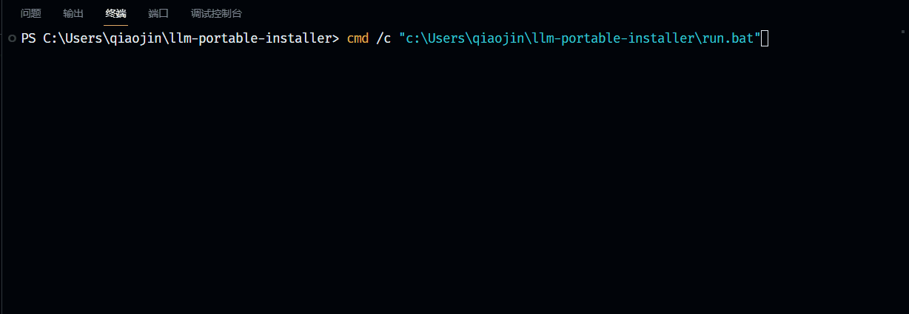
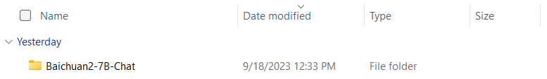
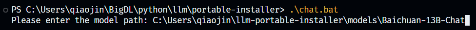
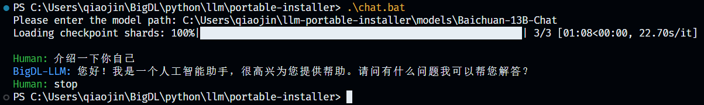

# BigDL-LLM One-Click Installer For Windows: User Guide

This one-click installer includes everything you need to run LLM (except models). Please refer to How to use section to get started.

## 13B model running on an Intel 11-Gen Core PC (real-time screen capture)

## Verified Models

- ChatGLM2-6b
- Baichuan-13B-Chat
- Baichuan2-7B-Chat

## How to use

1. Download models to your computer, e.g. Baichuan2-7B-Chat.
   
2. Run `chat.bat` in Terminal and input the path of the model (e.g. `path\to\model`, note that there's no slash at the end of the path).
   
3. Press Enter and wait until model finishes loading. Then enjoy chatting with the model!
4. If you want to stop chatting, just input `stop` and the model will stop running.
   
