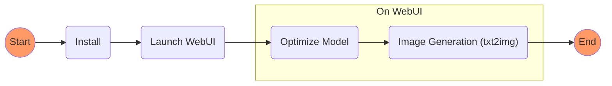

     

# Stable Diffusion Text-to-Image Generation on Your Intel Laptop


This guide will walk you through step-by-step on how to use the web UI to generation images w/ **_Stable Diffusion_** on your Intel laptop. The [Performance Section](#performance) shows some performance data.  

Here's an overview of the entire workflow. 


# Table of Contents
* [Install](#install)
* [Launch Web UI](#launch-web-ui)
* [Optimize Model](#optimize-model)
* [Image Generation](#image-generation)
* [Performance](#performance)


## Install

It is highly recommended to have an Intel laptop/desktop with a minimum of 16GB of RAM and at least 15GB of free disk space. 

### 1. Install Anaconda. 

Follow the steps in [Anaconda Installation Guide on Windows](https://docs.anaconda.com/anaconda/install/windows/) to download and install Anaconda.

### 2. Install Stable Diffusion
  
#### 2.1 Install Stable Diffusion WebUI on Laptop
  
  You need to install Stable Diffusion WebUI before using it for the first time. Follow below steps to install. 
  
  
  * 1) Obtain the source code by git cloning this repo, or download zip [here](https://github.com/intel-analytics/client-stable-diffusion/archive/refs/heads/main.zip). Extract the zip file to a local folder.   

  * 2) Copy the path of the source code directory in File Explorer. 


  * 3) From Windows Start menu, search for “Anaconda Prompt” and open it. 


  In “Anaconda Prompt” window,  type `cd`, space, and paste the source code path copied in step ii). Execute the command.  


  Continue to type and execute below commands to create environment and install dependent libraries. 

```bash
conda create -n sd python=3.8
conda activate sd
pip install -r requirements.txt
```
 

#### 2.2 (Optional) Download Stable Diffusion Model

You can download the stable diffusion model yourself, or you can skip this step and let the WebUI download the model for you. 

Take Stable Diffusion 2.1-base for example, the model is located at https://huggingface.co/stabilityai/stable-diffusion-2-1-base. You can use `git lfs` to obtain the entire repository, or download the files one by one using a browser following below steps.  

  <details><summary>Show Detailed Steps for Downloading Stable Diffusion Model using a Browser </summary>
  <br/>
  
  
  * 1. Create a local folder named `stable-diffusion-2-1-base`
  * 2. Create the subfolder structure like below
```bash
 stable-diffusion-2-1-base
    ├── feature_extractor
    ├── scheduler
    ├── text_encoder
    ├── tokenizer
    ├── unet
    └── vae
```
 * 3. Download each file from the links below and put into the corresponding subdirectory.  
    *  In feature_extractor dir: preprocessor_config.json ([download](https://huggingface.co/stabilityai/stable-diffusion-2-1-base/raw/main/feature_extractor/preprocessor_config.json))
    *  In root dir: model_index.json ([download]())
    *  In scheduler subdir: scheduler_config.json([download](https://huggingface.co/stabilityai/stable-diffusion-2-1-base/raw/main/scheduler/scheduler_config.json))
    *  In text_encoder subdir: config.json([download](https://huggingface.co/stabilityai/stable-diffusion-2-1-base/raw/main/text_encoder/config.json)), pytorch_model.bin([download](https://huggingface.co/stabilityai/stable-diffusion-2-1-base/resolve/main/text_encoder/pytorch_model.bin))
    *  In tokenizer subdir:merges.txt([download](https://huggingface.co/stabilityai/stable-diffusion-2-1-base/raw/main/tokenizer/merges.txt)), special_tokens_map.json([download](https://huggingface.co/stabilityai/stable-diffusion-2-1-base/raw/main/tokenizer/special_tokens_map.json)),  tokenizer_config.json([download](https://huggingface.co/stabilityai/stable-diffusion-2-1-base/raw/main/tokenizer/tokenizer_config.json)), vocab.json([download](https://huggingface.co/stabilityai/stable-diffusion-2-1-base/raw/main/tokenizer/vocab.json))
    *  In unet subdir:config.json([download](https://huggingface.co/stabilityai/stable-diffusion-2-1-base/raw/main/unet/config.json)), diffusion_pytorch_model.bin([download](https://huggingface.co/stabilityai/stable-diffusion-2-1-base/resolve/main/unet/diffusion_pytorch_model.bin))
    *  In vae subdir:  config.json([download](https://huggingface.co/stabilityai/stable-diffusion-2-1-base/raw/main/vae/config.json)),  diffusion_pytorch_model.bin([download](https://huggingface.co/stabilityai/stable-diffusion-2-1-base/resolve/main/vae/diffusion_pytorch_model.bin))
      
Finally the contents in the model directory will look like below. 
```bash
 stable-diffusion-2-1-base
    ├── feature_extractor
    │   └── preprocessor_config.json
    ├── model_index.json
    ├── scheduler
    │   └── scheduler_config.json
    ├── text_encoder
    │   ├── config.json
    │   └── pytorch_model.bin
    ├── tokenizer
    │   ├── merges.txt
    │   ├── special_tokens_map.json
    │   ├── tokenizer_config.json
    │   └── vocab.json
    ├── unet
    │   ├── config.json
    │   ├── diffusion_pytorch_model.bin
    └── vae
        ├── config.json
        └── diffusion_pytorch_model.bin

```

  </details> 

## Launch Web UI

### 1. Launch Web Service

In “Anaconda Prompt”, continue to execute below commands.  
```python
conda activate sd
python launch.py
```


### 2. Launch Web UI

Open a browser and navigate to `http://127.0.0.1:7860/`. You'll see two tabs on the top, `Optimize Model` and `txt2img`.


## Optimize Model

You can use `Optimize Model` tab to prepare optimized models for specific stable diffusion model and device. 

Choose `model` and `device` type, and then click `Optimize Model`. It will trigger the model optimization process. 

>**Note**
> All prepared models will become available options in the `Switch Option` box in the `txt2img` tab. Specifically, 
> - `CPU-FP32` will produce an optimized fp32 model for CPU, and a "CPU FP32" option (e.g. "v2.1-base CPU FP32") will appear in `Switch Option`. 
> - `CPU/iGPU FP16` will produce optimized fp16 models for both CPU and iGPU, and two "FP16" options (e.g. "v2.1-base CPU FP16", "v2.1-base CPU+iGPU FP16") will appear in `Switch Option`. 

>**Note**
>If you have downloaded the stable diffusion model, you can specify the `local model path` as your local model directory.  Otherwise you can leave it as empty, and WebUI will automatically download the model for you.


Wait for some time until the finishing message shows in the log box.


## Image Generation

You can use `txt2img` tab to generate images, preview the result and monitor the speed. 

To get started, enter a text prompt (e.g. "A digital illustration of a medieval town, 4k, detailed, trending in art station, fantasy") and leave other parameters as default. 

Select the model/device you want to use in `Switch Option`, and then click `Generate`.

>**Note**
> If you haven't prepared any model, the dropdown list in `Switch Option` will be empty. In this case, go to `Optimize Tab` and prepare a model. 

>**Note**
> `negative prompt`, `guidance scale`, `sampling steps`, `scheduler`, `height`, `width`, `seed` are parameters of Stable Diffusion pipeline. Changing these parameters may impact both generation quality and speed. 
>


After the generation completed successfully, you will see an output image preview on the top right. The `Generation time` box below shows the speed of the generation. 


