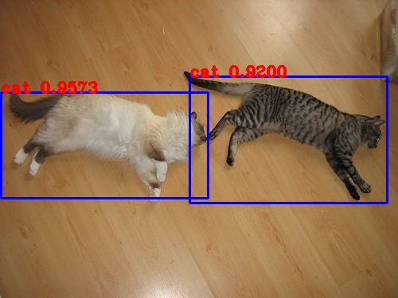

# Running Orca TF2 YoloV3 example


## Environment

We recommend conda to set up your environment. You can install a conda distribution from [here](https://docs.conda.io/projects/conda/en/latest/user-guide/install/)
if you haven't already.

```bash
conda create -n bigdl python==3.7
conda activate bigdl
pip install tensorflow pandas pyarrow pillow
```

Then download and install latest nightly-build BigDL Orca.

```bash
pip install --pre --upgrade bigdl-orca[ray]
```

## Training Data

Download VOC2009 dataset [here](http://host.robots.ox.ac.uk/pascal/VOC/voc2009/VOCtrainval_11-May-2009.tar).


## Pretrained Weights

Download pretrained weights [here](https://pjreddie.com/media/files/yolov3.weights).


## VOC data names

Download VOC data names [here](https://github.com/pjreddie/darknet/blob/master/data/voc.names).


## Running example

### Train

```bash
python yoloV3.py --data_dir ${data_dir} --weights ${weights} --class_num ${class_num} --names ${names}
```
Result:
```bash
  1/217 [..............................]
(pid=8091)  - ETA: 1:06:59 - loss: 9804.1631 - yolo_output_0_loss: 457.6100 - yolo_output_1_loss: 1600.1824 - yolo_output_2_loss: 7735.6562
(pid=8091) 2021-06-18 08:01:40.067494: I tensorflow/core/profiler/lib/profiler_session.cc:126] Profiler session initializing.
...
218/218 [==============================] - 205s 939ms/step - loss: 29.3999 - yolo_output_0_loss: 9.6335 - yolo_output_1_loss: 5.0190 - yolo_output_2_loss: 12.8991
```

### Predict

```bash
python predict.py --checkpoint ${checkpoint} --names ${names} --class_num ${class_num} --image ${image} --output ${output}
```
Result:
```bash
detections:
        cat, 0.9573073983192444, [0.00200248 0.3109339  0.5238986  0.66431004]
        cat, 0.9199740290641785, [0.47669527 0.25620055 0.9729855  0.68201375]
```
You can also find new generated images stored in output path, and the objects in the images are with a box around them [labeled "name"]:

 
