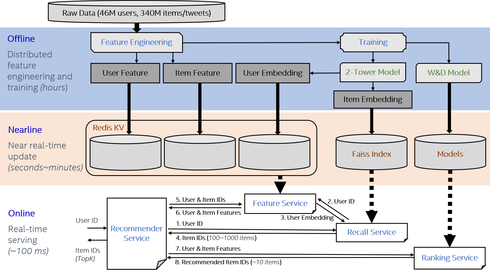

## Friesian Serving Recommendation Framework

### Architecture of the serving pipelines

The diagram below demonstrates the components of the friesian serving system, which typically consists of three stages:

- Offline: Preprocess the data to get user/item DNN features and user/item Embedding features. Then use the embedding features and embedding model to get embedding vectors.
- Nearline: Retrieve user/item profiles and keep them in the Key-Value store. Retrieve item embedding vectors and build the faiss index. Make updates to the profiles from time to time.
- Online: Trigger the recommendation process whenever a user comes. Recall service generate candidates from millions of items based on embeddings and the deep learning model ranks the candidates for the final recommendation results.



### Services and APIs
The friesian serving system consists of 4 types of services:
- Ranking Service: performs model inference and returns the results.
  - `rpc doPredict(Content) returns (Prediction) {}`
    - Input: The `encodeStr` is a Base64 string encoded from a bigdl [Activity](https://github.com/intel-analytics/BigDL/blob/branch-2.0/scala/dllib/src/main/scala/com/intel/analytics/bigdl/dllib/nn/abstractnn/Activity.scala) serialized byte array.
    ```bash
    message Content {
        string encodedStr = 1;
    }
    ```
    - Output: The `predictStr` is a Base64 string encoded from a bigdl [Activity](https://github.com/intel-analytics/BigDL/blob/branch-2.0/scala/dllib/src/main/scala/com/intel/analytics/bigdl/dllib/nn/abstractnn/Activity.scala) (the inference result) serialized byte array.
    ```bash
    message Prediction {
        string predictStr = 1;
    }
    ```
- Feature Service: searches user embeddings, user features or item features in Redis, and returns the features.
  - `rpc getUserFeatures(IDs) returns (Features) {}` and `rpc getItemFeatures(IDs) returns (Features) {}`
    - Input: The user/item id list for searching.
    ```bash
    message IDs {
        repeated int32 ID = 1;
    }
    ```
    - Output: `colNames` is a string list of the column names. `b64Feature` is a list of Base64 string, each string is encoded from java serialized array of objects. `ID` is a list of ids corresponding `b64Feature`.
    ```bash
    message Features {
        repeated string colNames = 1;
        repeated string b64Feature = 2;
        repeated int32 ID = 3;
    }
    ```
- Recall Service: searches item candidates in the built faiss index and returns candidates id list.
  - `rpc searchCandidates(Query) returns (Candidates) {}`
    - Input: `userID` is the id of the user to search similar item candidates. `k` is the number of candidates. 
    ```bash
    message Query {
        int32 userID = 1;
        int32 k = 2;
    }
    ```
    - Output: `candidate` is the list of ids of item candidates.
    ```bash
    message Candidates {
        repeated int32 candidate = 1;
    }
    ```
- Recommender Service: gets candidates from the recall service, calls the feature service to get the user and item candidate's features, then sorts the inference results from ranking service and returns the top recommendNum items.
  - `rpc getRecommendIDs(RecommendRequest) returns (RecommendIDProbs) {}`
    - Input: `ID` is a list of user ids to recommend. `recommendNum` is the number of items to recommend. `candidateNum` is the number of generated candidates to inference in ranking service.
    ```bash
    message RecommendRequest {
        int32 recommendNum = 1;
        int32 candidateNum = 2;
        repeated int32 ID = 3;
    }
    ```
    - Output: `IDProbList` is a list of results corresponding to user `ID` in input. Each `IDProbs` consists of `ID` and `prob`, `ID` is the list of item ids, and `prob` is the corresponding probability.
    ```bash
    message RecommendIDProbs {
        repeated IDProbs IDProbList = 1;
    }
    message IDProbs {
        repeated int32 ID = 1;
        repeated float prob = 2;
    }
    ```

### Quick Start
You can run Friesian Serving Recommendation Framework using the official Docker images.

You can follow the following steps to run the WnD demo.

1. Pull docker image from dockerhub
```bash
docker pull intelanalytics/friesian-grpc:0.0.2
```

2. Run & enter docker container
```bash
docker run -itd --name friesian --net=host intelanalytics/friesian-grpc:0.0.2
docker exec -it friesian bash
```

3. Add vec_feature_user_prediction.parquet, vec_feature_item_prediction.parquet, wnd model,
   wnd_item.parquet and wnd_user.parquet (You can check [the schema of the parquet files](#schema-of-the-parquet-files))

4. Start ranking service
```bash
export OMP_NUM_THREADS=1
java -cp bigdl-friesian-serving-spark_2.4.6-0.14.0-SNAPSHOT.jar com.intel.analytics.bigdl.friesian.serving.ranking.RankingServer -c config_ranking.yaml > logs/inf.log 2>&1 &
```

5. Start feature service for recommender service
```bash
./redis-5.0.5/src/redis-server &
java -Dspark.master=local[*] -cp bigdl-friesian-serving-spark_2.4.6-0.14.0-SNAPSHOT.jar com.intel.analytics.bigdl.friesian.serving.feature.FeatureServer -c config_feature.yaml > logs/feature.log 2>&1 &
```

6. Start feature service for recall service
```bash
java -Dspark.master=local[*] -cp bigdl-friesian-serving-spark_2.4.6-0.14.0-SNAPSHOT.jar com.intel.analytics.bigdl.friesian.serving.feature.FeatureServer -c config_feature_vec.yaml > logs/fea_recall.log 2>&1 &
```

7. Start recall service
```bash
java -Dspark.master=local[*] -Dspark.driver.maxResultSize=2G -cp bigdl-friesian-serving-spark_2.4.6-0.14.0-SNAPSHOT.jar com.intel.analytics.bigdl.friesian.serving.recall.RecallServer -c config_recall.yaml > logs/vec.log 2>&1 &
```

8. Start recommender service
```bash
java -cp bigdl-friesian-serving-spark_2.4.6-0.14.0-SNAPSHOT.jar com.intel.analytics.bigdl.friesian.serving.recommender.RecommenderServer -c config_recommender.yaml > logs/rec.log 2>&1 &
```

9. Check if the services are running
```bash
ps aux|grep friesian
```
You will see 5 processes start with 'java'

10. Run client to test
```bash
java -Dspark.master=local[*] -cp bigdl-friesian-serving-spark_2.4.6-0.14.0-SNAPSHOT.jar com.intel.analytics.bigdl.friesian.serving.recommender.RecommenderMultiThreadClient -target localhost:8980 -dataDir wnd_user.parquet -k 50 -clientNum 4 -testNum 2
```
11. Close services
```bash
ps aux|grep friesian (find the service pid)
kill xxx (pid of the service which should be closed)
```

### Schema of the parquet files

#### The schema of the user and item embedding files
The embedding parquet files should contain at least 2 columns, id column and prediction column.
The id column should be IntegerType and the column name should be specified in the config files.
The prediction column should be DenseVector type, and you can transfer your existing embedding vectors using pyspark:
```python
from pyspark.sql import SparkSession
from pyspark.sql.functions import udf, col
from pyspark.ml.linalg import VectorUDT, DenseVector

spark = SparkSession.builder \
        .master("local[*]") \
        .config("spark.driver.memory", "2g") \
        .getOrCreate()

df = spark.read.parquet("data_path")

def trans_densevector(data):
   return DenseVector(data)

vector_udf = udf(lambda x: trans_densevector(x), VectorUDT())
# suppose the embedding column (ArrayType(FloatType,true)) is the existing user/item embedding.
df = df.withColumn("prediction", vector_udf(col("embedding")))
df.write.parquet("output_file_path", mode="overwrite")
```

#### The schema of the recommendation model feature files
The feature parquet files should contain at least 2 columns, the id column and other feature columns.
The feature columns can be int, float, double, long and array of int, float, double and long.
Here is an example of the WideAndDeep model feature.
```bash
+-------------+--------+--------+----------+--------------------------------+---------------------------------+------------+-----------+---------+----------------------+-----------------------------+
|present_media|language|tweet_id|tweet_type|engaged_with_user_follower_count|engaged_with_user_following_count|len_hashtags|len_domains|len_links|present_media_language|engaged_with_user_is_verified|
+-------------+--------+--------+----------+--------------------------------+---------------------------------+------------+-----------+---------+----------------------+-----------------------------+
|            9|      43|     924|         2|                               6|                                3|         0.0|        0.1|      0.1|                    45|                            1|
|            0|       6| 4741724|         2|                               3|                                3|         0.0|        0.0|      0.0|                   527|                            0|
+-------------+--------+--------+----------+--------------------------------+---------------------------------+------------+-----------+---------+----------------------+-----------------------------+
```

### The data schema in Redis
The user features, item features and user embedding vectors are saved in Redis.
The data saved in Redis is a key-value set.

#### Key in Redis
The key in Redis consists of 3 parts: key prefix, data type, and data id. 
- Key prefix is `redisKeyPrefix` specified in the feature service config file. 
- Data type is one of `user` or `item`. 
- Data id is the value of `userIDColumn` or `itemIDColumn`.
Here is an example of key: `2tower_user:29`

#### Value in Redis
A row in the input parquet file will be converted to java array of object, then serialized into byte array, and encoded into Base64 string.

#### Data schema entry
Every key prefix and data type combination has its data schema entry to save the corresponding column names. The key of the schema entry is `keyPrefix + dataType`, such as `2tower_user`. The value of the schema entry is a string of column names separated by `,`, such as `enaging_user_follower_count,enaging_user_following_count,enaging_user_is_verified`.

### Config for different service
You can pass some important information to services using `-c config.yaml`
```bash
java -Dspark.master=local[*] -Dspark.driver.maxResultSize=2G -cp bigdl-friesian-serving-spark_2.4.6-0.14.0-SNAPSHOT.jar com.intel.analytics.bigdl.friesian.serving.recall.RecallServer -c config_recall.yaml
```

#### Ranking Service Config
Config with example:
```yaml
# Default: 8980, which port to create the server
servicePort: 8083

# Default: 0, open a port for prometheus monitoring tool, if set, user can check the
# performance using prometheus
monitorPort: 1234

# model path must be provided
modelPath: /home/yina/Documents/model/recys2021/wnd_813/recsys_wnd

# default: null, savedmodel input list if the model is tf savedmodel. If not provided, the inputs
# of the savedmodel will be arranged in alphabetical order
savedModelInputs: serving_default_input_1:0, serving_default_input_2:0, serving_default_input_3:0, serving_default_input_4:0, serving_default_input_5:0, serving_default_input_6:0, serving_default_input_7:0, serving_default_input_8:0, serving_default_input_9:0, serving_default_input_10:0, serving_default_input_11:0, serving_default_input_12:0, serving_default_input_13:0

# default: 1, number of models used in inference service
modelParallelism: 4
```

##### Feature Service Config
Config with example:
1. load data into redis. Search data from redis
```yaml
### Basic setting
# Default: 8980, which port to create the server
servicePort: 8082

# Default: null, open a port for prometheus monitoring tool, if set, user can check the
# performance using prometheus
monitorPort: 1235

# 'kv' or 'inference' default: kv
serviceType: kv

# default: false, if need to load initial data to redis, set true
loadInitialData: true

# default: "", prefix for redis key
redisKeyPrefix:

# default: 0, item slot type on redis cluster. 0 means slot number use the default value 16384, 1 means all keys save to same slot, 2 means use the last character of id as hash tag.
redisClusterItemSlotType: 2

# default: null, if loadInitialData=true, initialUserDataPath or initialItemDataPath must be
# provided. Only support parquet file
initialUserDataPath: /home/yina/Documents/data/recsys/preprocess_output/wnd_user.parquet
initialItemDataPath: /home/yina/Documents/data/recsys/preprocess_output/wnd_exp1/wnd_item.parquet

# default: null, if loadInitialData=true and initialUserDataPath != null, userIDColumn and
# userFeatureColumns must be provided
userIDColumn: enaging_user_id
userFeatureColumns: enaging_user_follower_count,enaging_user_following_count

# default: null, if loadInitialData=true and initialItemDataPath != null, userIDColumn and
# userFeatureColumns must be provided
itemIDColumn: tweet_id
itemFeatureColumns: present_media, language, tweet_id, hashtags, present_links, present_domains, tweet_type, engaged_with_user_follower_count,engaged_with_user_following_count, len_hashtags, len_domains, len_links, present_media_language, tweet_id_engaged_with_user_id

# default: null, user model path or item model path must be provided if serviceType
# contains 'inference'. If serviceType=kv, usermodelPath, itemModelPath and modelParallelism will
# be ignored
# userModelPath: 

# default: null, user model path or item model path must be provided if serviceType
# contains 'inference'. If serviceType=kv, usermodelPath, itemModelPath and modelParallelism will
# be ignored
# itemModelPath: 

# default: 1, number of models used for inference
# modelParallelism: 

### Redis Configuration
# default: localhost:6379
# redisUrl:

# default: 256, JedisPoolMaxTotal
# redisPoolMaxTotal:
```

2. load user features into redis. Get features from redis, use model at 'userModelPath' to do
   inference and get the user embedding
```yaml
### Basic setting
# Default: 8980, which port to create the server
servicePort: 8085

# Default: null, open a port for prometheus monitoring tool, if set, user can check the
# performance using prometheus
monitorPort: 1236

# 'kv' or 'inference' default: kv
serviceType: kv, inference

# default: false, if need to load initial data to redis, set true
loadInitialData: true

# default: ""
redisKeyPrefix: 2tower_

# default: 0, item slot type on redis cluster. 0 means slot number use the default value 16384, 1 means all keys save to same slot, 2 means use the last character of id as hash tag.
redisClusterItemSlotType: 2

# default: null, if loadInitialData=true, initialDataPath must be provided. Only support parquet
# file
initialUserDataPath: /home/yina/Documents/data/recsys/preprocess_output/guoqiong/vec_feature_user.parquet
# initialItemDataPath: 

# default: null, if loadInitialData=true and initialUserDataPath != null, userIDColumn and
# userFeatureColumns must be provided
#userIDColumn: user
userIDColumn: enaging_user_id
userFeatureColumns: user

# default: null, if loadInitialData=true and initialItemDataPath != null, userIDColumn and
# userFeatureColumns must be provided
# itemIDColumn: 
# itemFeatureColumns: 

# default: null, user model path or item model path must be provided if serviceType
# includes 'inference'. If serviceType=kv, usermodelPath, itemModelPath and modelParallelism will
# be ignored
userModelPath: /home/yina/Documents/model/recys2021/2tower/guoqiong/user-model

# default: null, user model path or item model path must be provided if serviceType
# contains 'inference'. If serviceType=kv, usermodelPath, itemModelPath and modelParallelism will
# be ignored
# itemModelPath: 

# default: 1, number of models used for inference
# modelParallelism: 

### Redis Configuration
# default: localhost:6379
# redisUrl:

# default: 256, JedisPoolMaxTotal
# redisPoolMaxTotal:
```

#### Recall Service Config
Config with example:

1. load initial item vector from vec_feature_item.parquet and item-model to build faiss index.
```yaml
# Default: 8980, which port to create the server
servicePort: 8084

# Default: null, open a port for prometheus monitoring tool, if set, user can check the
# performance using prometheus
monitorPort: 1238

# default: 128, the dimensionality of the embedding vectors
indexDim: 50

# default: false, if load saved index, set true
# loadSavedIndex: true

# default: false, if true, the built index will be saved to indexPath. Ignored when
# loadSavedIndex=true
saveBuiltIndex: true

# default: null, path to saved index path, must be provided if loadSavedIndex=true
indexPath: ./2tower_item_full.idx

# default: false
getFeatureFromFeatureService: true

# default: localhost:8980, feature service target
featureServiceURL: localhost:8085

itemIDColumn: tweet_id
itemFeatureColumns: item

# default: null, user model path must be provided if getFeatureFromFeatureService=false
# userModelPath: 

# default: null, item model path must be provided if loadSavedIndex=false and initialDataPath is
# not orca predict result
itemModelPath: /home/yina/Documents/model/recys2021/2tower/guoqiong/item-model

# default: null,  Only support parquet file
initialDataPath: /home/yina/Documents/data/recsys/preprocess_output/guoqiong/vec_feature_item.parquet

# default: 1, number of models used in inference service
modelParallelism: 1
```

2. load existing faiss index
```yaml
# Default: 8980, which port to create the server
servicePort: 8084

# Default: null, open a port for prometheus monitoring tool, if set, user can check the
# performance using prometheus
monitorPort: 1238

# default: 128, the dimensionality of the embedding vectors
# indexDim: 

# default: false, if load saved index, set true
loadSavedIndex: true

# default: null, path to saved index path, must be provided if loadSavedIndex=true
indexPath: ./2tower_item_full.idx

# default: false
getFeatureFromFeatureService: true

# default: localhost:8980, feature service target
featureServiceURL: localhost:8085

# itemIDColumn: 
# itemFeatureColumns: 

# default: null, user model path must be provided if getFeatureFromFeatureService=false
# userModelPath: 

# default: null, item model path must be provided if loadSavedIndex=false and initialDataPath is
# not orca predict result
# itemModelPath: 

# default: null,  Only support parquet file
# initialDataPath: 

# default: 1, number of models used in inference service
# modelParallelism: 
```
#### Recommender Service Config
Config with example:

```yaml
 Default: 8980, which port to create the server
 servicePort: 8980

 # Default: null, open a port for prometheus monitoring tool, if set, user can check the
 # performance using prometheus
 monitorPort: 1237

 # default: null, must be provided, item column name
 itemIDColumn: tweet_id
 
# default: null, must be provided, column names for inference, order related.
inferenceColumns: present_media_language, present_media, tweet_type, language, hashtags, present_links, present_domains, tweet_id_engaged_with_user_id, engaged_with_user_follower_count, engaged_with_user_following_count, enaging_user_follower_count, enaging_user_following_count, len_hashtags, len_domains, len_links

 # default: 0, if set, ranking service request will be divided
inferenceBatch: 0

# default: localhost:8980, recall service target
recallServiceURL: localhost:8084

# default: localhost:8980, feature service target
featureServiceURL: localhost:8082

# default: localhost:8980, inference service target
rankingServiceURL: localhost:8083
```

### Run Java Client

#### Generate proto java files
You should init a maven project and use proto files in [friesian gRPC project](https://github.com/analytics-zoo/friesian/tree/recsys-grpc/src/main/proto)
Make sure to add the following extensions and plugins in your pom.xml, and replace
*protocExecutable* with your own protoc executable.
```xml
    <build>
        <extensions>
            <extension>
                <groupId>kr.motd.maven</groupId>
                <artifactId>os-maven-plugin</artifactId>
                <version>1.6.2</version>
            </extension>
        </extensions>
        <plugins>
            <plugin>
                <groupId>org.apache.maven.plugins</groupId>
                <artifactId>maven-compiler-plugin</artifactId>
                <version>3.8.0</version>
                <configuration>
                    <source>8</source>
                    <target>8</target>
                </configuration>
            </plugin>
            <plugin>
                <groupId>org.xolstice.maven.plugins</groupId>
                <artifactId>protobuf-maven-plugin</artifactId>
                <version>0.6.1</version>
                <configuration>
                    <protocArtifact>com.google.protobuf:protoc:3.12.0:exe:${os.detected.classifier}</protocArtifact>
                    <pluginId>grpc-java</pluginId>
                    <pluginArtifact>io.grpc:protoc-gen-grpc-java:1.37.0:exe:${os.detected.classifier}</pluginArtifact>
                    <protocExecutable>/home/yina/Documents/protoc/bin/protoc</protocExecutable>
                </configuration>
                <executions>
                    <execution>
                        <goals>
                            <goal>compile</goal>
                            <goal>compile-custom</goal>
                        </goals>
                    </execution>
                </executions>
            </plugin>
        </plugins>
    </build>
```
Then you can generate the gRPC files with
```bash
mvn clean install
```
#### Call recommend service function using blocking stub
You can check the [Recommend service client example](https://github.com/analytics-zoo/friesian/blob/recsys-grpc/src/main/java/grpc/recommend/RecommendClient.java) on Github

```java
import com.intel.analytics.bigdl.friesian.serving.grpc.generated.recommender.RecommenderGrpc;
import com.intel.analytics.bigdl.friesian.serving.grpc.generated.recommender.RecommenderProto.*;

public class RecommendClient {
    public static void main(String[] args) {
        // Create a channel
        ManagedChannel channel = ManagedChannelBuilder.forTarget(targetURL).usePlaintext().build();
        // Init a recommend service blocking stub
        RecommenderGrpc.RecommenderBlockingStub blockingStub = RecommenderGrpc.newBlockingStub(channel);
        // Construct a request
        int[] userIds = new int[]{1};
        int candidateNum = 50;
        int recommendNum = 10;
        RecommendRequest.Builder request = RecommendRequest.newBuilder();
        for (int id : userIds) {
            request.addID(id);
        }
        request.setCandidateNum(candidateNum);
        request.setRecommendNum(recommendNum);
        RecommendIDProbs recommendIDProbs = null;
        try {
            recommendIDProbs = blockingStub.getRecommendIDs(request.build());
            logger.info(recommendIDProbs.getIDProbListList());
        } catch (StatusRuntimeException e) {
            logger.warn("RPC failed: " + e.getStatus().toString());
        }
    }
}
```

### Run Python Client
Install the python packages listed below (you may encounter [pyspark error](https://stackoverflow.com/questions/58700384/how-to-fix-typeerror-an-integer-is-required-got-type-bytes-error-when-tryin) if you have python>=3.8 installed, try to downgrade to python<=3.7 and try again).
```bash
pip install jupyter notebook==6.1.4 grpcio grpcio-tools pandas fastparquet pyarrow
```
After you activate your server successfully, you can

#### Generate proto python files
Generate the files with
```bash
python -m grpc_tools.protoc -I../../protos --python_out=<path_to_output_folder> --grpc_python_out=<path_to_output_folder> <path_to_friesian>/src/main/proto/*.proto
```

#### Call recommend service function using blocking stub
You can check the [Recommend service client example](https://github.com/analytics-zoo/friesian/blob/recsys-grpc/Serving/WideDeep/recommend_client.ipynb) on Github
```python
# create a channel
channel = grpc.insecure_channel('localhost:8980')
# create a recommend service stub
stub = recommender_pb2_grpc.RecommenderStub(channel)
request = recommender_pb2.RecommendRequest(recommendNum=10, candidateNum=50, ID=[36407])
results = stub.getRecommendIDs(request)
print(results.IDProbList)

```
### Scale-out for Big Data
#### Redis Cluster
For large data set, Redis standalone has no enough memory to store whole data set, data sharding and Redis cluster are supported to handle it. You only need to set up a Redis Cluster to get it work.

First, start N Redis instance on N machines.
```
redis-server --cluster-enabled yes --cluster-config-file nodes-0.conf --cluster-node-timeout 50000 --appendonly no --save "" --logfile 0.log --daemonize yes --protected-mode no --port 6379
```
on each machine, choose a different port and start another M instances(M>=1), as the slave nodes of above N instances.

Then, call initialization command on one machine, if you choose M=1 above, use `--cluster-replicas 1`
```
redis-cli --cluster create 172.168.3.115:6379 172.168.3.115:6380 172.168.3.116:6379 172.168.3.116:6380 172.168.3.117:6379 172.168.3.117:6380 --cluster-replicas 1
```
and the Redis cluster would be ready.

#### Scale Service with Envoy
Each of the services could be scaled out. It is recommended to use the same resource, e.g. single machine with same CPU and memory, to test which service is bottleneck. From empirical observations, vector search and inference usually be.

##### How to run envoy:
1. [download](https://www.envoyproxy.io/docs/envoy/latest/start/install) and deploy envoy(below use docker as example):
 * download: `docker pull envoyproxy/envoy-dev:21df5e8676a0f705709f0b3ed90fc2dbbd63cfc5`
2. run command: `docker run --rm -it  -p 9082:9082 -p 9090:9090 envoyproxy/envoy-dev:79ade4aebd02cf15bd934d6d58e90aa03ef6909e --config-yaml "$(cat path/to/service-specific-envoy.yaml)" --parent-shutdown-time-s 1000000`
3. validate: run `netstat -tnlp` to see if the envoy process is listening to the corresponding port in the envoy config file.
4. For details on envoy and sample procedure, read [envoy](envoy.md).
