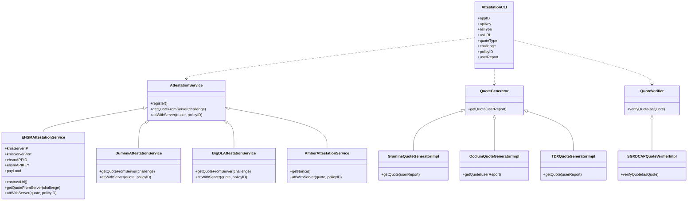

- [AttestationCLI - General Attestation Interface](#attestationcli---general-attestation-interface)
    - [How to use and configure attestation policy in Microsoft Azure Attestation (MAA) with AttestationCLI](#how-to-use-and-configure-attestation-policy-in-microsoft-azure-attestation-maa-with-attestationcli)
- [VerificationCLI - Attestation Service Verification Interface](#verificationcli---attestation-service-verification-interface)
- [TDX Quote Generation Interface](#tdx-quote-generation-interface)
- [TDX Quote Verification Interface](#tdx-quote-verification-interface)
- [BigDL Remote Attestation Service](#bigdl-remote-attestation-service)
    - [How to deploy a BigDL Remote Attestation Service](#how-to-deploy-a-bigdl-remote-attestation-service)
    - [How to attest with a BigDL Remote Attestation Service](#how-to-attest-with-a-bigdl-remote-attestation-service)


# AttestationCLI - General Attestation Interface

Support Gramine, Occlum and SGX SDK.

## Environment
You should have an available attestation service to attest with. You can use `EHSMAttestationService` and configure eHSM-KMS according to [this link](https://github.com/intel-analytics/BigDL/tree/main/ppml/services/ehsm/kubernetes), or you can just use `DummyAttestationService` for debug. 

### Bidirectional Attestation
To enable bidirectional attestation, you also need SGX SDK to fulfill quote verification. Here is the guide to install SGX SDK with related libs. 

```bash
wget https://download.01.org/intel-sgx/sgx-linux/2.16/as.ld.objdump.r4.tar.gz 
tar -zxf as.ld.objdump.r4.tar.gz
sudo cp external/toolset/ubuntu20.04/* /usr/local/bin

wget https://download.01.org/intel-sgx/sgx-dcap/1.13/linux/distro/ubuntu20.04-server/sgx_linux_x64_sdk_2.16.100.4.bin
#choose to install the sdk into the /opt/intel
chmod a+x ./sgx_linux_x64_sdk_2.16.100.4.bin && sudo ./sgx_linux_x64_sdk_2.16.100.4.bin

source /opt/intel/sgxsdk/environment

cd /opt/intel

wget https://download.01.org/intel-sgx/sgx-dcap/1.13/linux/distro/ubuntu20.04-server/sgx_debian_local_repo.tgz

tar xzf sgx_debian_local_repo.tgz

echo 'deb [trusted=yes arch=amd64] file:///opt/intel/sgx_debian_local_repo focal main' | tee /etc/apt/sources.list.d/intel-sgx.list

wget -qO - https://download.01.org/intel-sgx/sgx_repo/ubuntu/intel-sgx-deb.key | apt-key add -

sudo apt-get update

sudo apt-get install -y libsgx-enclave-common-dev  libsgx-ae-qe3 libsgx-ae-qve libsgx-urts libsgx-dcap-ql libsgx-dcap-default-qpl libsgx-dcap-quote-verify-dev libsgx-dcap-ql-dev libsgx-dcap-default-qpl-dev libsgx-quote-ex-dev libsgx-uae-service libsgx-ra-network libsgx-ra-uefi
```

And you need to configure PCCS in `/etc/sgx_default_qcnl.conf`.

```bash
# PCCS server address
PCCS_URL=https://your_pccs_url/sgx/certification/v3/

# To accept insecure HTTPS certificate, set this option to FALSE
USE_SECURE_CERT=FALSE
```

## Usage
You can attest your environment with AttestationCLI by command like:
```bash
java -cp [dependent-jars] com.intel.analytics.bigdl.ppml.attestation.AttestationCLI -i <appID> -k <apiKey> -u <asURL> -t <asType> -c <challenge> -p <userReport> 
```

## Parameters
`-i` **appID** , `-k` **apiKey** The appID and apipey pair generated by your attestation service. 

`-u` **asURL** URL of attestation service. Should match the format `<ip_address>:<port>`, default is `127.0.0.1:9000`

`-t` **asType** Type of attestation service. Currently support `DummyAttestationService`, `EHSMAttestationService`, `AzureAttestationService` and `BigDLRemoteAttestationService`, default is `EHSMAttestationService`.

`-c` **challenge** Challenge to get quote of attestation service which will be verified by local SGX SDK. Used only for bi-attestation. Should be a BASE64 string, default is "" and will skip bi-attestation.

`-p` **userReport** User report to generate quote and attested by attestation service. Default is `test`.

## How to use and configure attestation policy in Microsoft Azure Attestation (MAA) with AttestationCLI

1. Create your attestation provider [here](https://portal.azure.com/#create/microsoft.Free).

2. Configure policy in azure portal.

```
version= 1.1;
configurationrules{
	=> issueproperty(type="x-ms-sgx-tcbidentifier", value="azuredefault");
};
authorizationrules 
{
	[ type=="x-ms-sgx-mrenclave", value=="<your_sgx_mrenclave>"] => permit(); 
};
issuancerules{
	c:[type=="x-ms-sgx-is-debuggable"] => issue(type="is-debuggable", value=c.value);
	c:[type=="x-ms-sgx-mrsigner"] => issue(type="sgx-mrsigner", value=c.value);
	c:[type=="x-ms-sgx-mrenclave"] => issue(type="sgx-mrenclave", value=c.value);
	c:[type=="x-ms-sgx-product-id"] => issue(type="product-id", value=c.value);
	c:[type=="x-ms-sgx-svn"] => issue(type="svn", value=c.value);
	c:[type=="x-ms-attestation-type"] => issue(type="tee", value=c.value);
};
```
Here is an example sgx-mrenclave policy. You can configure your `mrenclave` and `mrsigner` in authorizationrules part. More information can refer [here](https://learn.microsoft.com/en-us/azure/attestation/author-sign-policy).

3. Use URL of the specified attestation provider during attestation.
```bash
java -Xmx1g -cp /ppml/spark-3.1.3/examples/jars/*:/ppml/spark-3.1.3/jars/*:/ppml/bigdl-2.5.0-SNAPSHOT/jars/* com.intel.analytics.bigdl.ppml.attestation.AttestationCLI -t AzureAttestationService -u <your_attestation_provider_url>
```

# VerificationCLI - Attestation Service Verification Interface

You can verify Attestation Service (eHSM for example) with VerificationCLI. It will first get quote from Attestation Service and then verify the quote with SGX SDK.

## Environment 
To verify SGX quote, you can follow [this guide](#bi-attestation) to install SGX SDK and related DCAP libraries. For TDX quote, you can refer [this part](#tdx-quote-verification-interface) to install dependent components.
## Usage
You can attest the attestation service with VerificationCLI by command like:
```bash
java -cp [dependent-jars] com.intel.analytics.bigdl.ppml.attestation.VerificationCLI -i <appID> -k <apiKey> -u <asURL> -t <asType> -c <challenge> -q <quotePath>
```
Or you can use [verify-attestation-service.sh](https://github.com/intel-analytics/BigDL/blob/main/ppml/base/verify-attestation-service.sh) to verify the attestation service quote.

## Parameters
`-i` **appID** , `-k` **apiKey** The appID and apiKey pair generated by your attestation service. 

`-u` **asURL** URL of attestation service. Should match the format `<ip_address>:<port>`, default is `127.0.0.1:9000`

`-t` **asType** Type of attestation service. Currently support `EHSMAttestationService`, `AzureAttestationService` and `BigDLRemoteAttestationService`.

`-O` **quoteType** Type of quote generation. Currently support `gramine`, `occlum` and `TDX`.

`-c` **challenge** Challenge to get quote of attestation service which will be verified by local SGX SDK. Should be a BASE64 string.

`-q` **quotePath** Only set to verify local quote. Will **disable** getting quote from local device.

# TDX Quote Generation Interface

You can generate TDX quote in TDVM with `TDXQuoteGenerate`.

## Requirements
* TDVM

Check whether the device `/dev/tdx-attest` exists.

### Known Issue:

TDX device may be updated to `/dev/tdx-guest` or `/dev/tdx_guest`. Need to make a soft link to `/dev/tdx-attest` in this condition.

```bash
ln -s /dev/tdx-guest /dev/tdx-attest
```

* Intel SGX SDK
* Intel SGX DCAP Development Packages
  
Install with commands:
```bash ubuntu 20.04
# install sgxsdk
cd /opt/intel && \
wget https://download.01.org/intel-sgx/sgx-dcap/1.16/linux/distro/ubuntu20.04-server/sgx_linux_x64_sdk_2.19.100.3.bin && \
chmod a+x ./sgx_linux_x64_sdk_2.19.100.3.bin && \
printf "no\n/opt/intel\n"|./sgx_linux_x64_sdk_2.19.100.3.bin && \
. /opt/intel/sgxsdk/environment && \
# install dcap
cd /opt/intel && \
wget https://download.01.org/intel-sgx/sgx-dcap/1.16/linux/distro/ubuntu20.04-server/sgx_debian_local_repo.tgz && \
tar xzf sgx_debian_local_repo.tgz && \
echo 'deb [trusted=yes arch=amd64] file:///opt/intel/sgx_debian_local_repo focal main' | tee /etc/apt/sources.list.d/intel-sgx.list && \
wget -qO - https://download.01.org/intel-sgx/sgx_repo/ubuntu/intel-sgx-deb.key | apt-key add - && \
apt-get update && \
apt-get install -y libsgx-enclave-common-dev  libsgx-ae-qe3 libsgx-ae-qve libsgx-urts libsgx-dcap-ql libsgx-dcap-default-qpl libsgx-dcap-quote-verify-dev libsgx-dcap-ql-dev libsgx-dcap-default-qpl-dev libsgx-quote-ex-dev libsgx-uae-service libsgx-ra-network libsgx-ra-uefi libtdx-attest libtdx-attest-dev
```

* TDX PCCS
  
You can deploy a PCCS service container with [this](https://github.com/intel-analytics/BigDL/tree/main/ppml/services/pccs/docker). Modify `uri` and `api_key` in `default.json`.
```
    "uri": "https://sbx.api.trustedservices.intel.com/sgx/certification/v4/",
    "ApiKey": "your_subscription_key",
```

## Usage
```bash
java -cp [dependent-jars] com.intel.analytics.bigdl.ppml.attestation.TdxQuoteGenerate -r <userReport>
```

## Parameters
`-r` **userReport** User report data which will be passed to quote.

# TDX Quote Verification Interface

You can verify TDX quote with `VerificationCLI`.

## Requirements
* Intel SGX SDK
* Intel SGX DCAP Development Packages
  
Install with commands:
```bash ubuntu 20.04
# install sgxsdk
cd /opt/intel && \
wget https://download.01.org/intel-sgx/sgx-dcap/1.16/linux/distro/ubuntu20.04-server/sgx_linux_x64_sdk_2.19.100.3.bin && \
chmod a+x ./sgx_linux_x64_sdk_2.19.100.3.bin && \
printf "no\n/opt/intel\n"|./sgx_linux_x64_sdk_2.19.100.3.bin && \
. /opt/intel/sgxsdk/environment && \
# install dcap
cd /opt/intel && \
wget https://download.01.org/intel-sgx/sgx-dcap/1.16/linux/distro/ubuntu20.04-server/sgx_debian_local_repo.tgz && \
tar xzf sgx_debian_local_repo.tgz && \
echo 'deb [trusted=yes arch=amd64] file:///opt/intel/sgx_debian_local_repo focal main' | tee /etc/apt/sources.list.d/intel-sgx.list && \
wget -qO - https://download.01.org/intel-sgx/sgx_repo/ubuntu/intel-sgx-deb.key | apt-key add - && \
apt-get update && \
apt-get install -y libsgx-enclave-common-dev libsgx-ae-qe3 libsgx-ae-qve libsgx-urts libsgx-dcap-ql libsgx-dcap-default-qpl libsgx-dcap-quote-verify-dev libsgx-dcap-ql-dev libsgx-dcap-default-qpl-dev libsgx-quote-ex-dev libsgx-uae-service libsgx-ra-network libsgx-ra-uefi
```

* TDX PCCS
  
You can deploy a PCCS service container with [this](https://github.com/intel-analytics/BigDL/tree/main/ppml/services/pccs/docker). Modify `uri` and `api_key` in `default.json`.
```
    "uri": "https://api.trustedservices.intel.com/sgx/certification/v4/",
    "ApiKey": "your_subscription_key",
```

## Usage
```bash
java -cp [dependent-jars] com.intel.analytics.bigdl.ppml.attestation.VerificationCLI -q <quotePath>
```

## Parameters
`-q` **quotePath** Path of quote to be verified.

# BigDL Remote Attestation Service

Attestation Service for SGX/TDX

## Requirements
Ubuntu 20.04
Intel SGX SDK
Intel DCAP packages
PCCS
BigDL

## Usage
```bash
java -cp [dependent-jars] -h <serviceHost> -p <servicePort> -s <httpsKeyStoreToken> --httpsKeyStorePath <httpsKeyStorePath> -k <secretKey> -b <basePath> -e <enrollFilePath> -o <policyFilePath>
```

## Parameters
`-h` **serviceHost** Host of BigDL Remote Attestation Service, default is `0.0.0.0`.
`-p` **servicePort** Port of BigDL Remote Attestation Service, default is 9875.
`-t` **httpsKeyStoreToken** Token of PKCS12 certificate for https.
`--httpsKeyStorePath` **httpsKeyStorePath** Path of PKCS12 certificate for https, default is `./keys/server.p12`.
`-k` **secretKey** Secret Key to encrypt and decrypt BigDLRemoteAttestation data file.
`-b` **basePath** Diretory for data files of BigDL Remote Attestation Service, default is `./data`.
`-e` **enrollFilePath** Path of base data file to save account information, default is `BigDLRemoteAttestationService.dat`.
`-b` **basePath** Diretory for data files of BigDL Remote Attestation Service, default is `BigDLRemoteAttestationServicePolicy.dat`.

## How to deploy a BigDL Remote Attestation Service
You can install all the required libs (Intel SGX SDK, DCAP, PCCS, BigDL, ... ) by your own, or you can refer [this](https://github.com/intel-analytics/BigDL/tree/main/ppml/services/bigdl-attestation-service/) to deploy the Attestation Service with docker or kubernetes.

### https service
For https, you need to generate a PKCS12 certificate.

```bash
# Generate all files in a temporary directory
mkdir keys && cd keys
# 1. Generete private key for server
openssl genrsa -des3 -out server.key 2048
# 2. Generate ca.crt
openssl req -new -x509 -key server.key -out ca.crt -days 3650
# 3. Generate Certificate Signing Request（CSR）
openssl req -new -key server.key -out server.csr
# 4. Generate certificate of server
openssl x509 -req -days 3650 -in server.csr -CA ca.crt -CAkey server.key -CAcreateserial -out server.crt
# 5. Merge server certificate
cat server.key server.crt > server.pem
# 6. Generate PKCS12 certificate
openssl pkcs12 -export -clcerts -in server.crt -inkey server.key -out server.p12 
```

Then you can start your server with command:
```bash
java -cp $BIGDL_HOME/jars/*:$SPARK_HOME/jars/*:$SPARK_HOME/examples/jars/*: com.intel.analytics.bigdl.ppml.service.BigDLRemoteAttestationService -u <serviceURL> -p <servicePort> --httpsKeyStorePath ./keys/server.p12 -t <httpsKeyStoreToken> -k <secretKey>
```

## How to attest with a BigDL Remote Attestation Service
You can do attestation via REST API of BigDL Remote Attestation Service. Currently supported REST API are listed:

### Quick Check

* REST API format:
```
GET <bigdl_remote_attestation_address>/
```

### Enroll 

Obtain a valid access key pair (APPID and APIKey).

* REST API format:
```
GET <bigdl_remote_attestation_address>/enroll
```

* Response Data:

| Name | Type | Reference Value | Description |
|:-----------|:-----------|:-----------|:-----------|
| appID | String | HfpPKHdF... | ID which represents a certain application  |
| apiKey | String | EnJnmF31... | The application's access key to the BigDL Remote Attestation Service |

* Example Response:
```json
{
    "appID": "e95dfcd1-d98a-4b33-80ab-5249315ab5d4",
    "apiKey": "CHUIYoW0HF8b6Ig6q7MiOHHn2KGGQ3HL"
}
```

### Register Policy

Register a attestation policy for SGX/TDX quote, which will check some certain attributes or contents from the quote.

**TDX Policy is not implemented yet.**

* REST API format:
```
POST <bigdl_remote_attestation_address>/registerPolicy
```
* Request Payload:

| Name | Type | Reference Value | Description |
|:-----------|:-----------|:-----------|:-----------|
| appID | String | HfpPKHdF... | ID which represents a certain application  |
| apiKey | String | EnJnmF31... | The application's access key to the BigDL Remote Attestation Service |
| policyType | String | SGXMREnclavePolicy | Type of policy the service will check, currently support `SGXMREnclavePolicy` |
| mrEnclave | String | e38104fe6938... | (**For SGX**) The hash over the enclave pages loaded into the SGX protected memory |
| mrSigner | String | d412a4f07ef8... | (**For SGX**) The hash of the public portion of the key used to sign the enclave |

* Example Request:
```json
{
    "appID": "e95dfcd1-d98a-4b33-80ab-5249315ab5d4",
    "apiKey": "CHUIYoW0HF8b6Ig6q7MiOHHn2KGGQ3HL",
    "policyType": "SGXMREnclavePolicy",
    "mrEnclave": "2b0376b7ce6e2ece6279b2b49157841c..."
}
```
* Response Data:

| Name | Type | Reference Value | Description |
|:-----------|:-----------|:-----------|:-----------|
| policyID | string | 49ac44ff-01f0... | Generated policyID |

* Example Response:
```json
{
    "policyID": "49ac44ff-01f0-4f59-8d7e-fcffb78f0f4c"
}
```

### Verify SGX/TDX Quote

Verify a SGX/TDX quote with BigDL Remote Attestation Service.

* REST API format:
```
POST <bigdl_remote_attestation_address>/verifyQuote
```
* Request Payload:

| Name | Type | Reference Value | Description |
|:-----------|:-----------|:-----------|:-----------|
| appID | String | HfpPKHdF... | ID which represents a certain application  |
| apiKey | String | EnJnmF31... | The application's access key to the BigDL Remote Attestation Service |
| quote | String | AwACAAAAAAAJAA0Ak5py... | A valid DCAP quote in BASE64 |
| policyID | string | LdPXuPs8fI5Q... | (**Optional**) The policy which the given quote should satisfy |

* Example Request:
```json
{
    "quote": "AwACAAAAAAAJAA0Ak5pyM...",
    "appID":"e95dfcd1-d98a-4b33-80ab-5249315ab5d4",
    "apiKey":"CHUIYoW0HF8b6Ig6q7MiOHHn2KGGQ3HL",
    "policyID":"49ac44ff-01f0-4f59-8d7e-fcffb78f0f4c"
}
```
* Response Data:

| Name | Type | Reference Value | Description |
|:-----------|:-----------|:-----------|:-----------|
| result | Int | 0/1/-1 | 0 for success, 1 for warning, -1 for error |

* Example Response:
```json
{
    "result": 0
}
```
