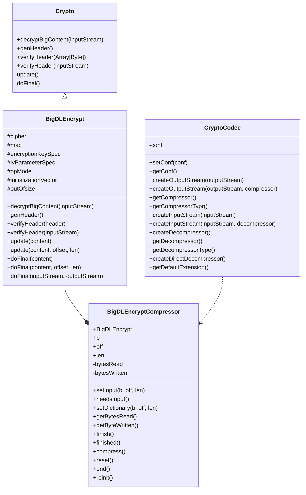

```mermaid
classDiagram

    Crypto <|.. BigDLEncrypt
    Crypto: +decryptBigContent(inputStream)
    Crypto: +genHeader()
    Crypto: +verifyHeader(Array[Byte])
    Crypto: +verifyHeader(inputStream)
    Crypto: update()
    Crypto: doFinal()

    BigDLEncrypt --* BigDLEncryptCompressor
    BigDLEncrypt: #cipher
    BigDLEncrypt: #mac
    BigDLEncrypt: #encryptionKeySpec
    BigDLEncrypt: #ivParameterSpec
    BigDLEncrypt: #opMode
    BigDLEncrypt: #initializationVector
    BigDLEncrypt: #outOfsize
    BigDLEncrypt: +decryptBigContent(inputStream)
    BigDLEncrypt: +genHeader()
    BigDLEncrypt: +verifyHeader(header)
    BigDLEncrypt: +verifyHeader(inputStream)
    BigDLEncrypt: +update(content)
    BigDLEncrypt: +update(content, offset, len)
    BigDLEncrypt: +doFinal(content)
    BigDLEncrypt: +doFinal(content, offset, len)
    BigDLEncrypt: +doFinal(inputStream, outputStream)


    CryptoCodec ..> BigDLEncryptCompressor
    CryptoCodec: -conf
    CryptoCodec: +setConf(conf)
    CryptoCodec: +getConf()
    CryptoCodec: +createOutputStream(outputStream)
    CryptoCodec: +createOutputStream(outputStream, compressor)
    CryptoCodec: +getCompressor()
    CryptoCodec: +getCompressorTypr()
    CryptoCodec: +createInputStream(inputStream)
    CryptoCodec: +createInputStream(inputStream, decompressor)
    CryptoCodec: +createDecompressor()
    CryptoCodec: +getDecompressor()
    CryptoCodec: +getDecompressorType()
    CryptoCodec: +createDirectDecompressor()
    CryptoCodec: +getDefaultExtension()

    BigDLEncryptCompressor: +BigDLEncrypt
    BigDLEncryptCompressor: +b
    BigDLEncryptCompressor: +off
    BigDLEncryptCompressor: +len
    BigDLEncryptCompressor: -bytesRead
    BigDLEncryptCompressor: -bytesWritten
    BigDLEncryptCompressor: +setInput(b, off, len)
    BigDLEncryptCompressor: +needsInput()
    BigDLEncryptCompressor: +setDictionary(b, off, len)
    BigDLEncryptCompressor: +getBytesRead()
    BigDLEncryptCompressor: +getByteWritten()
    BigDLEncryptCompressor: +finish()
    BigDLEncryptCompressor: +finished()
    BigDLEncryptCompressor: +compress()
    BigDLEncryptCompressor: +reset()
    BigDLEncryptCompressor: +end()
    BigDLEncryptCompressor: +reinit()


```
