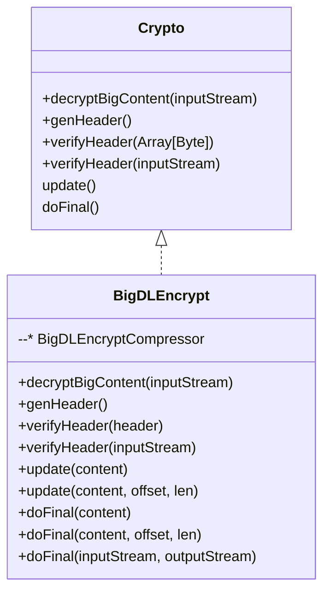

```mermaid
classDiagram

    Crypto <|.. BigDLEncrypt
    Crypto: +decryptBigContent(inputStream)
    Crypto: +genHeader()
    Crypto: +verifyHeader(Array[Byte])
    Crypto: +verifyHeader(inputStream)
    Crypto: update()
    Crypto: doFinal()

    BigDLEncrypt: --* BigDLEncryptCompressor
    BigDLEncrypt: +decryptBigContent(inputStream)
    BigDLEncrypt: +genHeader()
    BigDLEncrypt: +verifyHeader(header)
    BigDLEncrypt: +verifyHeader(inputStream)
    BigDLEncrypt: +update(content)
    BigDLEncrypt: +update(content, offset, len)
    BigDLEncrypt: +doFinal(content)
    BigDLEncrypt: +doFinal(content, offset, len)
    BigDLEncrypt: +doFinal(inputStream, outputStream)


```
