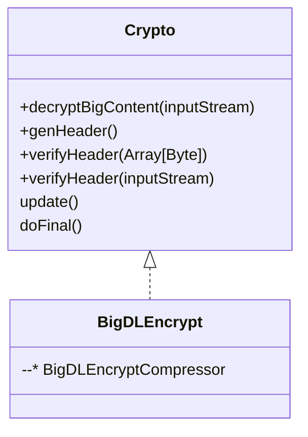

```mermaid
classDiagram

    Crypto <|.. BigDLEncrypt
    Crypto: +decryptBigContent(inputStream)
    Crypto: +genHeader()
    Crypto: +verifyHeader(Array[Byte])
    Crypto: +verifyHeader(inputStream)
    Crypto: update()
    Crypto: doFinal()

    BigDLEncrypt: --* BigDLEncryptCompressor


```
