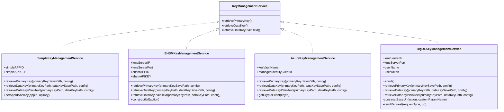

```mermaid
classDiagram
    KeyManagementService <|.. SimpleKeyManagementService
    KeyManagementService <|.. EHSMKeyManagementService
    KeyManagementService <|.. AzureKeyManagementService
    KeyManagementService <|.. BigDLKeyManagementService
    KeyManagementService: +retrievePrimaryKey()
    KeyManagementService: +retrieveDataKey()
    KeyManagementService: +retrieveDataKeyPlainText()

    EHSMKeyManagementService: +kmsServerIP
    EHSMKeyManagementService: +kmsServerPort
    EHSMKeyManagementService: +ehsmAPPID 
    EHSMKeyManagementService: +ehsmAPIKEY
    EHSMKeyManagementService: +retrievePrimaryKey(primaryKeySavePath, config)
    EHSMKeyManagementService: +retrieveDataKey(primaryKeyPath, dataKeySavePath, config)
    EHSMKeyManagementService: +retrieveDataKeyPlainText(primaryKeyPath, dataKeyPath, config)
    EHSMKeyManagementService: +constructUrl(action)
    
    AzureKeyManagementService: +keyVaultName
    AzureKeyManagementService: +managedIdentityClientId
    AzureKeyManagementService: +retrievePrimaryKey(primaryKeySavePath, config)
    AzureKeyManagementService: +retrieveDataKey(primaryKeyPath, dataKeySavePath, config)
    AzureKeyManagementService: +retrieveDataKeyPlainText(primaryKeyPath, dataKeyPath, config)
    AzureKeyManagementService: +getCryptoClient(keyId)
    
    SimpleKeyManagementService: +simpleAPPID
    SimpleKeyManagementService: +simpleAPIKEY
    SimpleKeyManagementService: +retrievePrimaryKey(primaryKeySavePath, config)
    SimpleKeyManagementService: +retrieveDataKey(primaryKeyPath, dataKeySavePath, config)
    SimpleKeyManagementService: +retrieveDataKeyPlainText(primaryKeyPath, dataKeyPath, config)
    SimpleKeyManagementService: +setAppIdAndKey(appId, apiKey)

    BigDLKeyManagementService: +kmsServerIP
    BigDLKeyManagementService: +kmsServerPort
    BigDLKeyManagementService: +userName
    BigDLKeyManagementService: +userToken
    BigDLKeyManagementService: +enroll()
    BigDLKeyManagementService: +retrievePrimaryKey(primaryKeySavePath, config)
    BigDLKeyManagementService: +retrieveDataKey(primaryKeyPath, dataKeySavePath, config)
    BigDLKeyManagementService: +retrieveDataKeyPlainText(primaryKeyPath, dataKeyPath, config)
    BigDLKeyManagementService: -constructBaseUrl(action, customParamName)
    BigDLKeyManagementService: -sendRequest(requestType, url)
    
```
