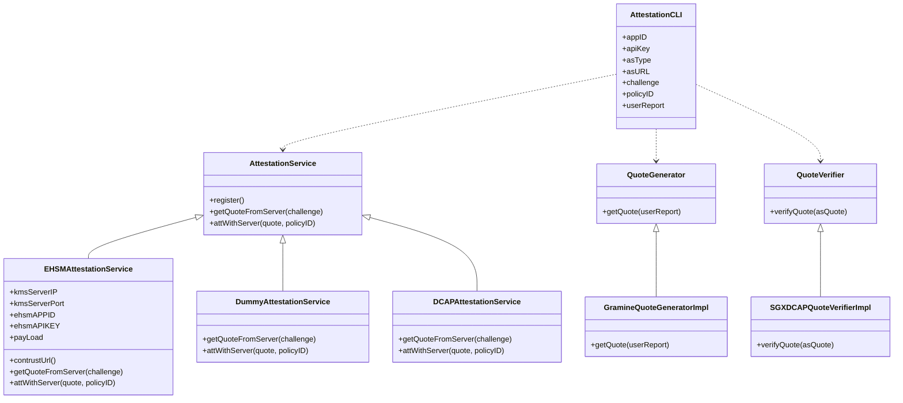

```mermaid
classDiagram
    AttestationCLI ..> AttestationService
    AttestationCLI ..> QuoteGenerator
    AttestationCLI ..> QuoteVerifier
    AttestationCLI: +appID
    AttestationCLI: +apiKey
    AttestationCLI: +asType
    AttestationCLI: +asURL
    AttestationCLI: +challenge
    AttestationCLI: +policyID
    AttestationCLI: +userReport

    AttestationService <|-- EHSMAttestationService 
    AttestationService <|-- DummyAttestationService
    AttestationService <|-- DCAPAttestationService
    AttestationService: +register()
    AttestationService: +getQuoteFromServer(challenge)
    AttestationService: +attWithServer(quote, policyID)
        EHSMAttestationService: +kmsServerIP
        EHSMAttestationService: +kmsServerPort
        EHSMAttestationService: +ehsmAPPID
        EHSMAttestationService: +ehsmAPIKEY
        EHSMAttestationService: +payLoad
        EHSMAttestationService: +contrustUrl()
        EHSMAttestationService: +getQuoteFromServer(challenge)
        EHSMAttestationService: +attWithServer(quote, policyID)

        DummyAttestationService: +getQuoteFromServer(challenge)
        DummyAttestationService: +attWithServer(quote, policyID)

        DCAPAttestationService: +getQuoteFromServer(challenge)
        DCAPAttestationService: +attWithServer(quote, policyID)
    QuoteGenerator <|-- GramineQuoteGeneratorImpl
    QuoteGenerator: +getQuote(userReport)
        GramineQuoteGeneratorImpl: +getQuote(userReport)
    QuoteVerifier <|-- SGXDCAPQuoteVerifierImpl
    QuoteVerifier: +verifyQuote(asQuote)
        SGXDCAPQuoteVerifierImpl: +verifyQuote(asQuote)
```